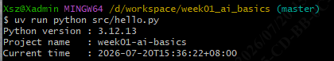

# Day 1 · 环境与工程基线

> 范围：完成 Roadmap 第 1 周 Day 1 的工程基础任务，输出可复现的本地开发环境。
> 适用：南宁软件组 AI Agent 应用开发 12 周 Roadmap 学员。
> 文档位置：`docs/day01_environment.md`。

---

## 1. 当日目标

| # | 任务 | 状态 |
| --- | --- | --- |
| 1 | 理解 AI / ML / DL / 生成式 AI / LLM / Agent / RAG / Tool / Workflow / MCP 的基本区别 | ✅ |
| 2 | 安装并统一使用 Python 3.12 + uv，理解 `pyproject.toml` / `uv.lock` / 虚拟环境 | ✅ |
| 3 | 建立 `week01_ai_basics` 工程，配置 Ruff、pytest、`.gitignore`、`.env.example` | ✅ |
| 4 | 创建 `src/`、`tests/`、`docs/` 目录，写 README 的项目目标与启动方式 | ✅ |
| 5 | 编写 `src/hello.py`，输出 Python 版本、项目名、当前时间 | ✅ |
| 6 | 按部门 Git Commit 模板完成 ≥ 2 次有效提交 | ✅ |

---

## 2. 运行环境

| 工具 | 版本 | 备注 |
| --- | --- | --- |
| 操作系统 | Windows 11（Git Bash + cmd） | 命令文档对两种 Shell 都有完整示例 |
| uv | 0.11.29（`uv --version`） | 默认未在 PATH，本文档所有 `uv` 命令均假设已就绪 |
| Python | 3.12.13（`uv run python --version`） | 通过 uv 安装到 `.venv/`，系统 Python 不参与 |
| ruff | 0.15.22（`uv run ruff --version`） | lint + format 一体 |
| pytest | 9.1.1（`uv run pytest --version`） | Day 3 接入模型后开始写用例 |
| 虚拟环境位置 | `D:\workspace\py_ai\week01_ai_basics\.venv\Scripts\python.exe` | 由 uv 自动管理 |

> **不要在系统级 `pip install` 任何东西**。所有依赖通过 `uv add` 写入 `pyproject.toml` 并由 `uv.lock` 锁定。

---

## 3. 一次性安装 uv

> uv 不在 PATH 时，先把它暴露到当前 Shell。

**Git Bash**：

```bash
export PATH="/c/Users/Xsz/.local/bin:$PATH"
uv --version   # 应输出 uv 0.11.29
```

**cmd**（仅当前窗口）：

```bat
set PATH=C:\Users\Xsz\.local\bin;%PATH%
uv --version
```

要永久生效：在 **系统 → 环境变量 → Path** 中追加 `C:\Users\Xsz\.local\bin`。

---

## 4. 项目初始化步骤

> 所有命令在 **Git Bash** 中执行，工作目录为 `D:\workspace\py_ai\week01_ai_basics\`。

### 4.1 拉取或创建项目目录

```bash
mkdir -p /d/workspace/py_ai/week01_ai_basics
cd /d/workspace/py_ai/week01_ai_basics
```

### 4.2 用 uv 初始化 Python 3.12 工程

```bash
uv init --python 3.12
```

这条命令会创建：

- `pyproject.toml`（项目元数据 + 依赖）
- `main.py`（最小入口，保留作 sanity check）
- `.python-version`（写入 `3.12`，**必须入库**）
- `.gitignore`（uv 自带一份，详见 §6）
- `README.md`（uv 自带占位，**已替换为本项目专用版本**）

### 4.3 安装运行时依赖

```bash
uv add httpx pydantic python-dotenv fastapi "uvicorn[standard]"
```

### 4.4 安装开发期依赖

```bash
uv add --dev ruff pytest
```

### 4.5 验证工具链

```bash
uv run python --version   # Python 3.12.13
uv run ruff --version     # ruff 0.15.22
uv run pytest --version   # pytest 9.1.1
```

### 4.6 补齐目录与文件

```bash
mkdir -p src tests docs
# 复制环境变量模板
cp .env.example .env        # Git Bash
# 或在 cmd 中： copy .env.example .env
```

> Day 1 不再写额外文件时，目录即为空。空目录默认不会被 Git 跟踪，Day 2 起按需加 `.gitkeep`。

---

## 5. 关键文件清单

```
week01_ai_basics/
├── pyproject.toml          # 项目元数据 + 依赖 + Ruff/pytest 配置
├── uv.lock                 # 依赖锁定（必须入库）
├── .env.example            # 模型 API 环境变量模板（真实 .env 不入库）
├── .gitignore              # Git 忽略规则（含 VS 临时目录）
├── .python-version         # 锁定 Python 3.12（入库）
├── README.md               # 项目目标、目录、技术栈、启动方式、提交规范
├── main.py                 # uv init 生成的最小入口（保留作 sanity check）
├── src/
│   └── hello.py            # Day 1 环境探活脚本
├── tests/                  # 预留（Day 3 起填充）
└── docs/
    └── day01_environment.md  # 本文档
```

---

## 6. 质量门验证

> 全部命令在 `D:\workspace\py_ai\week01_ai_basics` 下运行。

### 6.1 hello脚本

```bash
$ uv run python src/hello.py
Python version : 3.12.13
Project name   : week01-ai-basics
Current time   : 2026-07-20T15:33:41+08:00

```


实现要点：

- Python 版本取自 `sys.version_info`，不依赖字符串切片
- 项目名通过 `tomllib` 读 `pyproject.toml` 的 `[project].name`，**单一来源**
- 时间使用本地时区 + ISO 8601 格式，便于跨进程/跨机器比对

### 6.2 静态检查

```bash
$ uv run ruff check .
All checks passed!

$ uv run ruff format --check .
2 files already formatted
```

`pyproject.toml` 中 `[tool.ruff]` 启用的规则集：`E` / `W` / `F` / `I` / `B` / `UP` / `N` / `SIM` / `C4` / `RET` / `PTH`；`line-length = 100`；`target-version = "py312"`；`tests/**` 允许 `assert`，`src/**` 允许 `print`。


---

## 7. .gitignore 教训

### 7.1 第一版"行内注释"陷阱

最初把 Visual Studio 章节写成下面这样：

```gitignore
# Visual Studio (Windows / C++) - build & user-specific temp
.vs/                      # VS 用户级缓存（含 slnx.sqlite 等）
Debug/                    # C++/C# 默认调试输出
...
```

`git status` 中 `.vs/` 依然出现，`git check-ignore -v .vs/` 不返回任何匹配。**原因**：Git 的 `#` 注释必须从行首（去前导空白后）开始；行内 `#` 会被当作字面字符，整行模式变成包含 `#` 的无效 glob——`.vs/` 永远匹配不到这种模式。简化成 `.vs/\nDebug/\n` 立即生效。

### 7.2 正确写法

注释必须**独占整行**：

```gitignore
# Visual Studio (Windows / C++) - build & user-specific temp
# 注: Git 的 # 注释必须从行首开始，行内 # 会被当作字面字符
# VS 用户级缓存（含 slnx.sqlite 等）
.vs/
# C++/C# 默认调试输出
Debug/
# C++/C# 默认发布输出
Release/
# VS 平台目录
x64/
# VS 平台目录
x86/
# C++/C# / .NET 构建产物
bin/
# C++/C# 中间产物
obj/
# VS 用户偏好（.vcxproj.user / .csproj.user 等）
*.user
# 旧版 VS 解决方案用户选项
*.suo
# 旧版 VS 浏览数据库
*.sdf
# VS 预编译头
ipch/
```

验证命令：

```bash
git check-ignore -v .vs/ Debug/ Release/ x64/ x86/ bin/ obj/ ipch/ foo.vcxproj.user bar.suo baz.sdf
```

每条都应命中对应的行号。

---

## 8. 已知问题与备注

### 8.1 VS 2022 持有 `.vsidx` 句柄

VS 2022 打开 `week01_ai_basics`（含 slnx）后会在 `.vs/week01_ai_basics/FileContentIndex/` 下持续生成/写 `.vsidx` 索引文件，并由 `devenv.exe` / `ServiceHub` 子进程持有句柄。此时执行 `"git add ."` 会失败：

```text
error: open(".vs/week01_ai_basics/FileContentIndex/ec42a222-0c67-45a7-b508-30c59b1a38f6.vsidx"): Permission denied
error: unable to index file '.vs/week01_ai_basics/FileContentIndex/ec42a222-0c67-45a7-b508-30c59b1a38f6.vsidx'
fatal: adding files failed
```

修复路径：

1. 关闭 VS 2022 → 不使用 `"git add ."`，依次添加
2. `.vs/` 已加入 `.gitignore`，add 时不会再扫到

### 8.2 Day 1 暂留物

- `src/hello.py` 之外的 `src/` 为空；`tests/` 为空；`docs/` 仅本文档。Day 2 起按 Roadmap 填充。
- 用户用 VS 打开本目录后会在 `.vs/` 下产生临时文件，**已通过 `.gitignore` 忽略**，无需手动清理。
