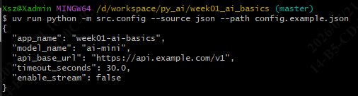
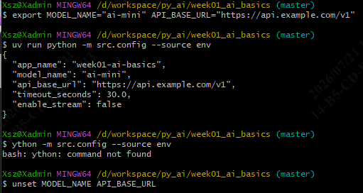
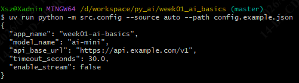
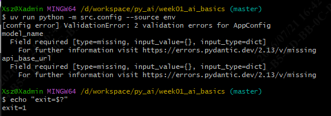
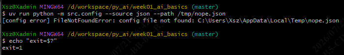
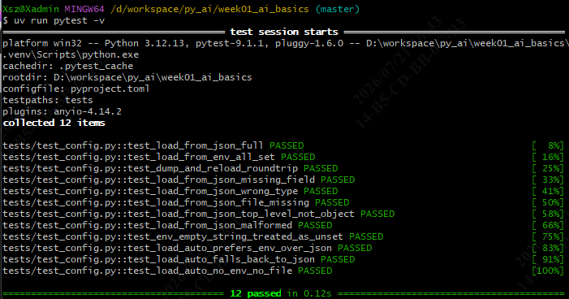
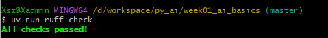

# Day 2 · Python 数据类与 JSON 配置

> 范围：完成 Roadmap 第 1 周 Day 2 的 Python 应用基础任务，落地 Pydantic v2 的 `AppConfig` 模块与 JSON / 环境变量加载。
> 适用：南宁软件组 AI Agent 应用开发 12 周 Roadmap 学员。
> 文档位置：`docs/day02_python_json.md`。

---

## 1. 当日目标

| # | 任务 | 状态 |
| --- | --- | --- |
| 1 | 掌握变量、str / int / bool、list / dict、条件、循环、函数、模块、类型标注、异常处理 | ✅ |
| 2 | 掌握 `pathlib`、文件读写、JSON 序列化 / 反序列化 | ✅ |
| 3 | 用 Pydantic `BaseModel` 定义 `AppConfig`，完成配置校验 | ✅（`src/config.py`） |
| 4 | 从 `config.json` 或环境变量读取；缺失时显式报错，不静默用错误值 | ✅（`load_config(source="auto")`） |
| 5 | 实现配置序列化、反序列化、字段校验 | ✅（`dump_config` + Pydantic 校验） |
| 6 | 编写 `tests/test_config.py`（正常 / 缺失字段 / 错误类型） | ✅ |
| 7 | 按部门模板手动 commit | 提交 |

---

## 2. 当日交付物

```
week01_ai_basics/
├── src/
│   ├── hello.py             # Day 1
│   └── config.py            # ★ Day 2：AppConfig + load_config + dump_config
├── config.example.json      # ★ Day 2：JSON 配置示例（真实 config.json 不入库）
└── docs/
    └── day02_python_json.md # ★ 本文档（工程落地）
```

---

## 3. AppConfig 设计

### 3.1 字段表

| 字段 | 类型 | 默认值 | 是否必填 | 环境变量 | 用途 |
| --- | --- | --- | --- | --- | --- |
| `app_name` | `str` | `"week01-ai-basics"` | 否 | `APP_NAME` | 应用名 |
| `model_name` | `str` | — | ✅ | `MODEL_NAME` | 模型标识 |
| `api_base_url` | `str` | — | ✅ | `API_BASE_URL` | OpenAI 兼容接口地址 |
| `timeout_seconds` | `float` | `30.0` | 否 | `TIMEOUT_SECONDS` | 请求超时 |
| `enable_stream` | `bool` | `False` | 否 | `ENABLE_STREAM` | 是否启用流式输出 |

> 字段名 → 环境变量名采用"直接大写"的默认映射。`.env.example` 中的同名变量已与本表对齐。

> 密钥（`API_KEY`）**不进** `AppConfig`：避免误序列化到 JSON/日志；需要时由调用方直接读 `os.environ["API_KEY"]`。

### 3.2 加载策略（`load_config`）

```python
from src.config import load_config, AppConfig

用法演示：
cfg: AppConfig = load_config()                # env 优先，缺则 config.json
cfg = load_config(source="json")              # 强制从 config.json
cfg = load_config(source="env")               # 强制从环境变量
```

source="auto"行为：

1. 扫所有字段对应的环境变量，**非空**则收集
2. 收集到 ≥ 1 个 → 把集合交给 `AppConfig(...)`，**缺哪个字段立刻 `ValidationError`**
3. 收集到 0 个 → 读 `config.json`，**缺字段同样 `ValidationError`**
4. 完全没有来源（无 env、无文件）→ `FileNotFoundError`

**绝不**静默用默认值填补缺失的必填字段。

### 3.3 序列化

```python
from src.config import dump_config
dump_config(cfg, "config.json")               # 写文件
text = cfg.model_dump_json(indent=2)          # 内存中拿字符串
data = cfg.model_dump(mode="json")            # 拿 dict
```

`model_dump(mode="json")` 会把 `Path` / `datetime` 等类型序列化成 JSON 兼容的标量（项目当前未用到，但留好接口）。

### 3.4 字段校验

Pydantic v2 自动处理：

- **类型**：传 `str "30"` 给 `float` 字段 → 转 `30.0`；传 `"true"` / `"false"` 给 `bool` → 转 `True/False`（同时接受 `1/0`、`yes/no` 等）
- **缺失**：必填字段未提供 → `ValidationError`，错误形如 `model_name: Field required`
- **多余字段**：默认**忽略**；需要严格模式可加 `model_config = ConfigDict(extra="forbid")`

### 3.5 错误示范对照

| 输入 | 期望 | 实际抛出 |
| --- | --- | --- |
| `load_config(source="env", env={})` | 明确报错 | `ValidationError: model_name: Field required` |
| `load_config(source="json", path="nope.json")` | 明确报错 | `FileNotFoundError: config file not found: nope.json` |
| `load_config(source="json", path="bad.json")`（含 `[1,2,3]`） | 明确报错 | `ValueError: top-level JSON in bad.json must be an object, got list` |
| `load_config(source="json", path="malformed.json")`（半截 JSON） | 明确报错 | `ValueError: invalid JSON in malformed.json: ...` |
| `env={"MODEL_NAME": "x", "API_BASE_URL": "y"}` | 通过 | `AppConfig(model_name="x", api_base_url="y", ...)` |

---

## 4. 实际运行与测试命令

> 工作目录：`D:\workspace\py_ai\week01_ai_basics`
> 所有命令使用 `uv run`，自动激活项目虚拟环境。
> Git Bash 中如未把 `uv` 加到 PATH，先 `export PATH="/c/Users/Xsz/.local/bin:$PATH"`（cmd：`set PATH=C:\Users\Xsz\.local\bin;%PATH%`）。

### 4.1 前置：暴露 `uv`（每次开新终端都要做）

```bash
# Git Bash
export PATH="/c/Users/Xsz/.local/bin:$PATH"
# cmd
set PATH=C:\Users\Xsz\.local\bin;%PATH%
```

> 验证：`uv --version` 输出版本号即 OK。
> 若命令报 `trampoline` / `canonicalize` 错，说明 `.venv` 路径失效——重跑 §5.5 的 `rm -rf .venv && uv sync`。

### 4.2 Day 1 冒烟：`src/hello.py`

```bash
cd /d/workspace/py_ai/week01_ai_basics
uv run python src/hello.py
```

期望输出：当前 Python 版本、`Project name: week01-ai-basics`、带时区的当前时间。

### 4.3 准备示例配置（不入库的 `config.json`）

真实 `config.json` **不入库**（已在 `.gitignore` 忽略，仅保留 `config.example.json`）。本地调试可直接复制模板：

**Git Bash**：

```bash
cd /d/workspace/py_ai/week01_ai_basics
cp config.example.json config.json
cat config.json
```

**cmd**：

```bat
cd /d D:\workspace\py_ai\week01_ai_basics
copy config.example.json config.json
type config.json
```

### 4.4 从 JSON 加载

```bash
$ uv run python -m src.config --source json --path config.json

{
  "app_name": "week01-ai-basics",
  "model_name": "ai-mini",
  "api_base_url": "https://api.example.com/v1",
  "timeout_seconds": 30.0,
  "enable_stream": false
}

```


### 4.5 从环境变量加载

**Git Bash**：

```bash
export MODEL_NAME="ai-mini"
export API_BASE_URL="https://api.example.com/v1"
uv run python -m src.config --source env
unset MODEL_NAME API_BASE_URL
```


**cmd**：

```bat
set MODEL_NAME=ai-mini
set API_BASE_URL=https://api.example.com/v1
uv run python -m src.config --source env
set MODEL_NAME=
set API_BASE_URL=
```

### 4.6 auto 模式（env 优先，回退 JSON）

不传 `--source` 时默认 `auto`：环境变量非空走 env，否则读 `config.json`。

```bash
# 无 env 变量时回退读 config.example.json
uv run python -m src.config --source auto --path config.example.json
```


### 4.7 触发"缺失字段"错误

```bash
$ uv run python -m src.config --source env
[config error] ValidationError: 2 validation errors for AppConfig
model_name
  Field required [type=missing, ...]
api_base_url
  Field required [type=missing, ...]
```

退出码 `1`，方便 CI 流水线判失败。


### 4.8 触发"文件不存在"错误

```bash
$ uv run python -m src.config --source json --path /tmp/nope.json
[config error] FileNotFoundError: config file not found: /tmp/nope.json
```


### 4.9 以 Python 模块形式调用

```bash
$ uv run python - <<'PY'
from dotenv import load_dotenv
from src.config import load_config

load_dotenv()  # ← 加这行，把 .env 读进 os.environ
cfg = load_config()
print(type(cfg).__name__, cfg.model_name, cfg.timeout_seconds)
PY
AppConfig qwen3:latest 120.0

```

### 4.10 单元测试：pytest（12 个用例）

```bash
uv run pytest -q        # 简洁模式：期望 "12 passed"
# 或
uv run pytest -v        # 详细模式：逐个用例名
```

覆盖：正常 JSON / 正常 env / 缺 `model_name` / 类型错误 / 文件不存在 / JSON 顶层非对象 / 序列化与回读 / `auto` 模式 env 优先与回退等。`.venv` 重建后 `uv run pytest` 已能直接跑。

### 4.11 质量门：Ruff 静态检查 + 格式化

```bash
uv run ruff check .          # 期望 "All checks passed!"
uv run ruff format --check . # 期望 "N files already formatted"
uv run ruff format .         # 仅当你想让 ruff 自动排版时执行
```


### 4.12 一键全流程（提交前自检）

```bash
cd /d/workspace/py_ai/week01_ai_basics
export PATH="/c/Users/Xsz/.local/bin:$PATH"

uv run python src/hello.py
uv run python -m src.config --source json --path config.example.json
uv run pytest -q
uv run ruff check .
uv run ruff format --check .
```


---

## 5. 已知问题与备注

### 5.1 `model_name` 的值

`config.example.json` 里写的是 `"ai-mini"`（仅作格式示例）。Day 3 接入团队模型网关时，把它替换成内部模型标识（形如 `"tencent-foundation-v1"` 之类）。

### 5.2 `config.json` 不入库

真实 `config.json` 已在 `.gitignore` 中显式忽略，仅保留 `config.example.json` 入库：

```gitignore
# Real app config (template tracked, real ignored)
config.json
!config.example.json
```

本地调试如需真实配置，按 §4.3 复制模板即可；该文件不会被提交。

### 5.3. python模块错误

运行uv run python - <<'PY'，`load_dotenv()` 读不到 `.env`。
source="auto" 时先试环境变量，没有再退回 config.json。脚本里：
  load_config() 用了默认参数 → source="auto"、config_path="config.json"
  第 83 行 _read_env() 是从 os.environ 取的，Python 不会自动把 .env 文件加载到 os.environ——必须显式调用 load_dotenv()
  heredoc 没调用 load_dotenv() → _read_env 返回 {}（空字典）→ 触发 _read_json(path) → config.json 不存在 → 抛 FileNotFoundError
使用显式 `load_dotenv(dotenv_path=_path=".env")` 传路径解决。

---

### 5.4 Pydantic v2 行为注意

- `bool` 字段从字符串解析时，**区分大小写**：`"True"` / `"False"`（首字母大写）**也会**被正确解析；但 `"TRUE"` 在 Python 3.11+ 的 `distutils.util.strtobool` 后续版本里行为有变化——Pydantic v2 自身接受 `"true"` / `"True"` / `"TRUE"`。以 Pydantic 自身为准。
- `float` 字段接受字符串 `"30"` → `30.0`；不接受 `"30s"` 之类的尾缀。
- 缺失必填字段时 Pydantic 抛 `ValidationError`，**不是** `KeyError` 或 `AttributeError`，调用方需要 `from pydantic import ValidationError` 精准捕获。

### 5.5 `pathlib` 在 Windows 上的两点注意

- `Path("config.json")` 解析为 `WindowsPath('config.json')`——可读性差，但**等价**于 `PosixPath`，大多数操作通用。
- `path.read_text(encoding="utf-8")` 显式声明编码是必须的，**不能省**，否则 Windows 默认 GBK 会在多语言字符串上报错。

### 5.6 `uv run pytest` 失败的真正原因

**错误归因**（之前误判）：以为是 uv 在 Windows 上的 trampoline 解析 bug，需要用 `uv run python -m pytest` 绕开。

**真正原因**：项目从 `D:\workspace\week01_ai_basics\` 迁到 `D:\workspace\py_ai\week01_ai_basics\` 后，旧的 `.venv/` 里硬编码了**项目原位置**的绝对路径。uv 找不到旧路径下的 .venv，抛 `uv trampoline failed to canonicalize script path`。

**修复**（一次性）：

**Git Bash**：

```bash
cd /d/workspace/py_ai/week01_ai_basics
rm -rf .venv
uv sync
```

**cmd**：

```bat
cd /d D:\workspace\py_ai\week01_ai_basics
rmdir /s /q .venv
uv sync
```

**修后验证**：

```bash
cat .venv/pyvenv.cfg
# home = C:\Users\Xsz\AppData\Roaming\uv\python\cpython-3.12-windows-x86_64-none
# （路径与项目位置解耦，迁移项目时无需再重建）

uv run pytest -v        # 直接跑 12 passed in 0.30s
uv run ruff check .     # 直接跑
```

**教训**：

- `.venv/` 是**项目本地**的虚拟环境，但 venv 的 launcher 在 Windows 上是 `.venv\Scripts\pytest.exe` 这种 .exe-wrapper，路径变化会失效
- `uv sync` 会重新创建 `.venv/` 并把 `pyvenv.cfg` 的 `home` 指向 uv 管理的 Python（路径与项目位置无关），所以**项目搬位置后必须 `rm -rf .venv && uv sync`**
- 与之相对，`uv.lock` 是**项目内的依赖锁定**（位置无关），跟着项目一起搬即可，**不需要删除**
- 同样的坑也适用于 `pip install -r requirements.txt` 创建的 venv；统一用 `uv` + 路径无关的 Python 解释器是根治办法

---

## 6. 参考

- 项目源码：`src/config.py`
- 配置示例：`config.example.json`
- 测试：`tests/test_config.py`
- 官方参考：Python 数据结构；Python 异常处理；Pydantic Models
