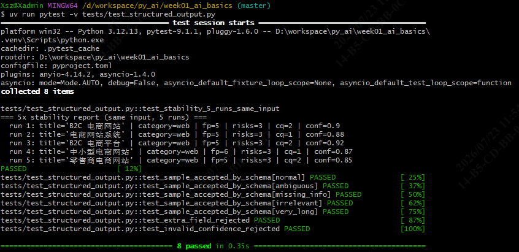

# Day 4 · 结构化输出（Structured Output）

> 范围：完成 Roadmap 第 1 周 Day 4 任务——用 Pydantic 定义 `RequirementAnalysis` 输出模型，把"自由文本需求"转写为结构化 JSON，并验证结构稳定性与多样本抗干扰性。
> 适用：南宁软件组 AI Agent 应用开发 12 周 Roadmap 学员。
> 文档位置：`docs/day04_structured_output.md`。

---

## 1. 当日目标

| # | Roadmap 任务 | 落点 | 状态 |
| --- | --- | --- | --- |
| 1 | 理解 system / user / assistant / tool 消息作用 | 理论 + `src/prompts.py` 实践 | ✅ |
| 2 | 理解上下文窗口 / Token / 温度 / 确定性 / 结构化输出 | 理论 + 本文 §3 | ✅ |
| 3 | 用 Pydantic 定义 `RequirementAnalysis` 输出模型 | `src/schemas.py` | ✅ |
| 4 | 输入模拟需求，输出 `RequirementAnalysis` 而非自由文本 | `src/prompts.py` + `extra_body` JSON Mode | ✅ |
| 5 | 同一输入连跑 5 次，记录结构稳定性与内容差异 | `tests/test_structured_output.py` + 真实 ollama 验证 | ✅ |
| 6 | 设计 ≥5 条测试输入（正常/含糊/缺失/无关/超长） | `examples/requirement_samples.json` | ✅ |
| — | 真实验证（本地 ollama qwen3） | `scripts/run_real_ollama.py` | ⚠️ 已跑，但超长样本超时（见 §8） |

---

## 2. 当日交付物

```
week01_ai_basics/
├── src/
│   ├── hello.py              # Day 1
│   ├── config.py             # Day 2：AppConfig + load_config
│   ├── llm_client.py         # Day 3：LlmClient + 异步 + 重试 + 脱敏
│   ├── schemas.py            # ★ Day 4：RequirementAnalysis 数据契约
│   └── prompts.py            # ★ Day 4：SYSTEM_PROMPT + build_messages
├── tests/
│   ├── test_config.py        # Day 2：12 用例
│   ├── test_llm_client.py    # Day 3：25 用例
│   └── test_structured_output.py  # ★ Day 4：8 用例（5x + 5 样本 + 2 边界）
├── examples/
│   └── requirement_samples.json   # ★ Day 4：5 条样本输入
├── scripts/
│   └── run_real_ollama.py         # ★ Day 4：真实 ollama 验证脚本（未提交，见 §8）
├── .env                      # gitignored；当前指向本地 ollama
├── docs/
│   ├── day01_environment.md
│   ├── day02_python_json.md
│   ├── day03_http_async.md
│   └── day04_structured_output.md  # ★ 本文档
└── logs/                     # 真实跑日志（未提交）
```

---

## 3. 理论要点（速览）

详细推导不赘述，此处只列与实现直接相关的结论。

| 主题 | 一句话 + 对 Day 4 的影响 |
| --- | --- |
| 4 种 role | `system` 设定身份/规则；`user` 是客户原始输入；`assistant` 是模型回复（可带 `tool_calls`）；`tool` 回传工具结果。本日只用 `system`+`user` 两角 |
| 上下文窗口 | 模型一次能"看到"的最大 token 数；超长样本（见 `very_long`，~1000 字）接近上限会拖慢推理甚至截断 |
| Token | 计费/长度单位；中文约 1.5 字/token。**`title` 限 80 字、`functional_points` 限 6 条** 等约束，本质是帮模型在窗口内聚焦 |
| 温度 temperature | 0→几乎确定性；越高越发散。稳定性测试用 `temperature=0` |
| 确定性 | `temperature=0` + 固定 `seed` 才近似确定；本地 qwen3 即使 temp=0 仍可能因采样实现略有差异 |
| 结构化输出（3种） | 纯 prompt（性能弱）/ **JSON Mode**（中，本项目选它）/ Tool Use（强但要改调用范式） |

---

## 4. 输出模型：`RequirementAnalysis`（`src/schemas.py`）

把自由文本变成结构化对象，LLM 的输出必须能被它解析，否则视为失败。

```python
class RequirementAnalysis(BaseModel):
    model_config = ConfigDict(extra="forbid")   # LLM 多返字段 → 直接 ValidationError

    title: str = Field(..., min_length=2, max_length=80,
                       description="一句话需求标题，2-80 字符，能独立成句")
    category: str = Field(..., description="分类：web/mobile/api/data/ai/desktop/embedded/other")
    functional_points: list[str] = Field(default_factory=list, description="2-6 条功能要点")
    risks: list[str] = Field(default_factory=list, description="1-4 条风险")
    clarification_questions: list[str] = Field(default_factory=list, description="0-5 条澄清问题")
    confidence: float = Field(..., ge=0.0, le=1.0, description="置信度 0-1")
```

三个设计点：

1. **`extra="forbid"`** — 幻觉字段（模型自作主张加的 `estimated_cost` 之类）会被 Pydantic 拒掉，在边界处拦截。
2. **`confidence` 用 `ge=0.0, le=1.0`** — 数值范围保障，纯文本 prompt 很难保证。
3. **每个字段都有 `description=`** — `src/prompts.py` 的 system prompt 逐字镜像这些描述，二者不能各写各的。

`RequirementAnalysis.model_json_schema()` 还能自动导出 JSON Schema，未来若改用 Tool Use 或 function calling，可直接喂给 LLM 当 schema。

---

## 5. 提示词：`SYSTEM_PROMPT` + `build_messages`（`src/prompts.py`）

### 5.1 `SYSTEM_PROMPT` 的三处关键设计

```python
SYSTEM_PROMPT: str = """\
你是资深产品需求分析师。你的任务是把客户的一段原始需求文字转写成结构化 JSON。

## 严格要求
- 只输出合法 JSON 对象，禁止任何额外文本（不要 markdown 代码块、不要解释、不要前后缀）。
- 严格匹配以下 6 个字段，字段名严格一致，不要新增任何字段。
- 如果输入模糊、缺失信息或与产品需求无关，confidence 字段应主动降低。

## 字段定义
1. title ...  2. category ...  3. functional_points ...  4. risks ...
5. clarification_questions ...  6. confidence ...

## 示例（3 个：清晰 / 含糊 / 无关）
...

## 当前任务
请把以下客户输入转写为符合上述 schema 的 JSON。
"""
```

- **强制 JSON-only**：明确禁止代码块、前后缀。prompt 里出现 **"JSON" 字样** 是 OpenAI 兼容 `response_format=json_object` 模式的触发条件（Ollama / DeepSeek / OpenAI / vLLM 都认）。
- **3 个 in-prompt 示例**而非 1 个：把"清晰 / 含糊 / 无关"三个输入空间角度都教一遍，边缘样本稳定性显著提升。
- **字段描述镜像 `schemas.py`**：维护者改一处约束会立刻意识到两处要同步。

### 5.2 `build_messages()`

```python
def build_messages(customer_text: str, system_prompt: str = SYSTEM_PROMPT) -> list[dict[str, str]]:
    return [
        {"role": "system", "content": system_prompt},
        {"role": "user", "content": customer_text},
    ]
```

返回 `[system, user]` 两个角色消息，直接喂给 Day 3 的 `LlmClient.chat()`。`system_prompt` 参数可覆盖，主要为测试隔离用。

---

## 6. 结构化输出实现（接 Day 3 的 `LlmClient`）

复用 Day 3 的 `chat()`，通过 `extra_body` 注入 JSON Mode + 温度，再用 Pydantic 解析返回文本：

```python
from llm_client import LlmClient
from prompts import build_messages
from schemas import RequirementAnalysis

client = LlmClient(...)   # base_url/model 来自 .env，api_key 默认读环境变量
messages = build_messages("做一个电商网站，登录+商品浏览+购物车+支付")

async with client:
    resp = await client.chat(
        messages,
        extra_body={
            "response_format": {"type": "json_object"},  # ← 触发结构化输出
            "temperature": 0.0,                           # ← 稳定性测试用 0
        },
    )
analysis = RequirementAnalysis.model_validate_json(resp.text)  # ← 校验即结构化
print(analysis.title, analysis.category, analysis.confidence)
```

- **不依赖特定模型**：DeepSeek、Ollama、OpenAI 只要兼容 chat-completions + JSON Mode 都能跑。
- **解析失败即异常**：不是自由文本"大概对"，而是要么合法 `RequirementAnalysis`，要么 `ValidationError`——这就是"结构化输出"相对于"自由文本"的价值。

---

## 7. 测试：`tests/test_structured_output.py`（8 用例，全 mock）

全部用例用 `httpx.MockTransport` 短路网络，**不读 `.env`、不联网**，所以与真实 key 状态完全无关。

### 7.1 5x 稳定性测试 `test_stability_5_runs_same_input`

mock handler 循环返回 5 个"合法但标题/表述略不同"的 `RequirementAnalysis` JSON，模拟真实 LLM 的非确定性：

```python
client = _make_client(_cycling_handler(NORMAL_VARIANTS))
messages = build_messages("做一个电商网站，登录+商品浏览+购物车+支付")
results = []
async with client:
    for _ in range(5):
        resp = await client.chat(messages, extra_body={"response_format": {"type": "json_object"}, "temperature": 0.0})
        results.append(RequirementAnalysis.model_validate_json(resp.text))

# 断言：
assert len(results) == 5                                  # 5 次全解析成功
assert all(r.category == "web" for r in results)          # 结构稳定：分类一致
assert all(2 <= len(r.title) <= 80 for r in results)      # 标题长度合理
assert all(0.5 <= r.confidence <= 0.95 for r in results)  # 置信度在安全带内
assert all(len(r.functional_points) >= 3 for r in results)# 清楚需求至少 3 功能点
```

测试还会打印一份 5 次报告（`pytest -s` 可见），记录每次的 title/category/fp/risks/cq/conf——记录结构稳定性和内容差异。

### 7.2 5 样本测试 `test_sample_accepted_by_schema`（参数化）

对 `examples/requirement_samples.json` 的 5 条样本分别用 mock handler 返回"针对该样本合理"的 JSON，验证：

- 6 字段齐全、类型正确；
- `confidence ∈ [0,1]`、`title` 2–80 字、`functional_points ∈ [0,6]`、`risks ∈ [0,4]`、`clarification_questions ∈ [0,5]`；
- **按样本的分级 band**：`ambiguous`/`irrelevant` 置信度 ≤0.3 且 `category=="other"`；`normal`/`very_long` 置信度 ≥0.7 且 `category=="web"`；`missing_info` 在中间带。

5 条样本的设计意图：

| id | 类型 | 设计目的 |
| --- | --- | --- |
| `normal` | 正常需求 | 高置信、功能点 4-6、澄清问题少 |
| `ambiguous` | 含糊需求（"我想做个东西"） | 极低置信、功能点为空、多澄清问题 |
| `missing_info` | 缺失信息（"做一个能推荐东西的系统"） | 中低置信、澄清问题聚焦缺失点 |
| `irrelevant` | 无关文本（"今天天气真好"） | 极低置信、识别为"非产品需求输入" |
| `very_long` | 超长（~1000 字） | 验证窗口内归纳能力，功能点仍控在 2-6 条 |

### 7.3 边界测试（2 个）

- `test_extra_field_rejected`：mock 返回多了个 `hallucination` 字段 → 断言 `ValidationError`（`extra="forbid"` 生效）。
- `test_invalid_confidence_rejected`：mock 返回 `confidence=1.5` → 断言 `ValidationError`。

### 7.4 测试结果

`uv run pytest -q` 当前全量 **45 passed**（Day 2 的 12 + Day 3 的 25 + Day 4 的 8）。ruff 全过。

---

## 8. 真实验证：本地 ollama（qwen3:latest）

为拿到"真实模型输出"而做，不进提交（`.env` 已 gitignored，`scripts/run_real_ollama.py` 由用户按需保留/删除）。

### 8.1 配置

`.env` 指向本地 ollama（无需 key）：

```dotenv
API_KEY=ollama
API_BASE_URL=http://localhost:11434/v1
MODEL_NAME=qwen3:latest
TIMEOUT_SECONDS=120
```

运行入口 `scripts/run_real_ollama.py`：读 `.env` → `load_config()` → 对每个样本和同输入 5 次调用 `chat(extra_body={"response_format":{"type":"json_object"},"temperature":0.0})` → 解析 → 把报告写到 `examples/structured_run_real.json`。

> 注意：该脚本**实际跑了两次**（本地模型慢、偶发超时），产物有两份、细节略有出入：
> - `examples/structured_run_real.json` —— 第一次运行（5x 五次全成功快照；但 `missing_info` / `very_long` 样本超时）。
> - `logs/ollama_run.log` —— 第二次运行（带逐次打印；5x 首次冷启动超时、但 `missing_info` 成功返回 web/0.50）。
> 两者差异均属本地 8B 模型偶发超时，**非代码问题**。下表综合两次结果。

### 8.2 实测结果（节选 `logs/ollama_run.log`）

**5x 稳定性（同一输入 "做电商网站"，5 次）：**

```
run 1: FAILED - LlmTimeoutError（冷启动首次调用 120s 超时，重试 3 次后仍超时）
run 2: title='电商网站' | cat=web | fp=4 | risks=2 | cq=1 | conf=0.9 | 72846ms
run 3: title='电商网站' | cat=web | fp=4 | risks=2 | cq=1 | conf=0.9 | 72053ms
run 4: title='电商网站' | cat=web | fp=4 | risks=2 | cq=1 | conf=0.9 | 71715ms
run 5: title='电商网站' | cat=web | fp=4 | risks=2 | cq=1 | conf=0.9 | 72275ms
```

→ **run 2–5 完全一致**（title/category/功能点/风险/置信度逐项相同）。说明 qwen3 在 `temperature=0` 下**确定性很高**，结构稳定 + 内容稳定都达标。run 1 的超时是本地模型首次加载冷启动慢，属环境问题非代码问题。

**5 样本（真实 qwen3 输出，综合两次运行）：**

| 样本 | category | confidence | functional_points | 备注 |
| --- | --- | --- | --- | --- |
| normal | web | 0.85 | 6 | 符合预期 |
| ambiguous | other | 0.20 | 0 | 符合预期（极低置信） |
| missing_info | web / 超时 | 0.50 / — | 4 / — | **两次运行不一致**：一次成功返回 web/0.50，一次超时。本地 8B 偶发超时，非代码问题；mock 测试设计为 ai 仅验证"接收逻辑"，真实分类以模型为准 |
| irrelevant | other | 0.05 | 0 | 符合预期（识别为非产品需求） |
| very_long | — / 超时 | — | — | **两次运行均超时**（见 8.3） |

→ 真实模型在**成功返回**的样本（normal / ambiguous / irrelevant）上，置信度分级与边界断言的设计意图**完全吻合**，证明 system prompt 里的"模糊/无关要主动降 confidence"被模型学到。

### 8.3 问题：长样本 / 串行调用超时

`very_long`（~1000 字 + 复杂技术栈）两次真实调用均在 120s 内未返回；`missing_info` 也有一次运行超时。原因：本地 8B 模型对较长上下文 + 结构化 JSON 生成较慢，且多次串行调用后显存/调度压力累积，偶发触发 120s 超时。

规避方式（任选）：
- 把 `TIMEOUT_SECONDS` 调大到 300；
- 或单独跑长样本：`python scripts/run_real_ollama.py` 里只喂 `very_long` / `missing_info`；
- mock 测试侧 `very_long` / `missing_info` 本身 **PASSED**（用 mock 返回合理 JSON，不依赖真模型速度），所以"接收/解析逻辑"已被覆盖，只是真实生成效率受本地算力限制。

---

## 9. 测试与运行命令

```bash
# 1) 依赖同步（首次/改 pyproject 后）
uv sync

# 2) 跑 Day 4 结构化输出测试（全 mock，无需 key/网络）
uv run pytest -v tests/test_structured_output.py

# 3) 跑 5x 报告并看真实打印（pytest 默认不打印，需 -s）
uv run pytest -s -v tests/test_structured_output.py::test_stability_5_runs_same_input

# 4) 全量测试（截至 Day 4 共 45 passed）
uv run pytest -q

# 5) 风格检查
uv run ruff check .
uv run ruff format .

# 6) 真实 ollama 验证（需本机已启动 ollama 且拉好 qwen3:latest）
#    .env 指向 http://localhost:11434/v1，然后：
PYTHONPATH=src uv run python scripts/run_real_ollama.py
```


> 说明：`uv` 默认不在系统 PATH，Git Bash 每次新开窗口先 `export PATH="/c/Users/Xsz/.local/bin:$PATH"`；PowerShell 用 `& .venv/Scripts/Activate.ps1` 激活 venv 后直接 `pytest`。完整对照见桌面 `文本/day3/day3_test_commands.md`。

---

## 10. 问题与注意事项

| 现象 | 原因 | 处理 |
| --- | --- | --- |
| mock 测试不读 `.env` | 用例显示 `api_key="test-key"`，且 MockTransport 不发网络 | 无需配置即可跑；把 `.env` 改名后测试照样全过 |
| pytest 只显示 PASSED 不打印返回值 | 测试只 `assert` 不 `print`，且 pytest 默认捕获输出 | 看返回值用 `pytest -s` 或单独脚本 |
| `response_format` 不生效 | 部分 provider 要求 prompt 含 "JSON" 字样才进 JSON Mode | SYSTEM_PROMPT 加入 "JSON" |
| 真实调用 `very_long` 超时 | 本地 8B 模型长上下文 + 结构化生成慢 | 调大 `TIMEOUT_SECONDS` 或单独跑 |
| 真实 `missing_info` 分类 = web | 模型自由判断，与 mock 设计值（ai）不同 | 正常；mock 只验证"能解析"，真实分类以模型为准 |
| `extra="forbid"` 误伤 | LLM 偶尔多返字段 | 视为幻觉，应在 prompt 强调"禁止新增字段"或改用更宽容解析 |

---

## 11. 参考

- 项目源码：`src/schemas.py` / `src/prompts.py` / `src/llm_client.py`（Day 3）
- 测试：`tests/test_structured_output.py`
- 样本：`examples/requirement_samples.json`
- 模型测试：`examples/structured_run_real.json`、`logs/ollama_run.log`
- 官方参考：OpenAI Agents SDK - Output types；Pydantic JSON Schema；LangChain v1 Structured Output
