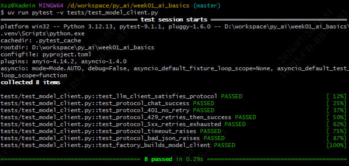
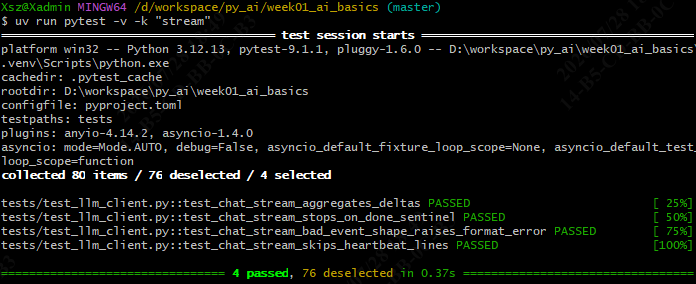
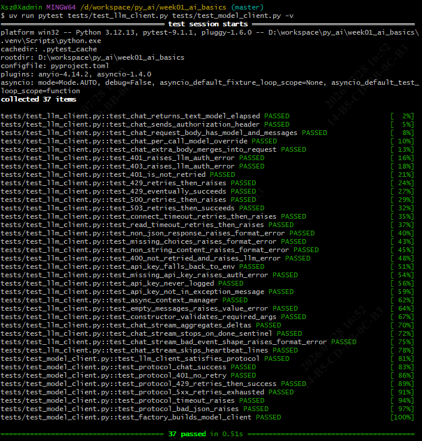
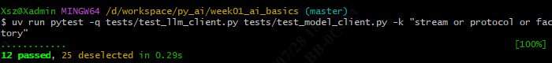
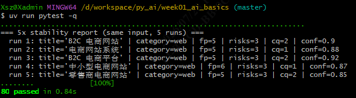
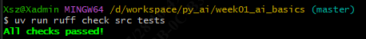

# Day 7 · 统一 ModelClient 接口 + 流式 + 工厂

> 范围：Roadmap 第 2 周 Day 7。在 Day 6 的 Pydantic Settings 配置层之上，定义统一的 `ModelClient` 协议、给 `LlmClient` 加 SSE 流式、并建工厂。
> 适用：南宁软件组 AI Agent 应用开发 12 周 Roadmap 学员。
> 文档位置：`docs/day07_concepts.md`。
> 本文档含：当日任务、核心概念与示例、关键点、以及 **Day 7 测试命令与步骤**。


---

## 1. 当日目标

| # | 任务 | 状态 |
| --- | --- | --- |
| 1 | 新增 `src/model_client.py`：`ModelClient(Protocol)`（`@runtime_checkable`），规定 `chat()` / `chat_stream()` / `aclose()` 契约 | ✅ |
| 2 | 升级 `src/llm_client.py`：新增 `chat_stream()`（SSE `delta` 解析、`[DONE]` 终止、心跳跳过、连接阶段重试） | ✅ |
| 3 | 新增 `src/model_factory.py`：`build_model_client(settings)` 按配置产出 `ModelClient` | ✅ |
| 4 | 新增 `tests/test_model_client.py`（8 例）：协议满足性 + 契约（成功 / 401 不重试 / 429 重试成功 / 5xx 重试耗尽 / 超时 / 坏 JSON）+ 工厂 | ✅ |
| 5 | `tests/test_llm_client.py` 加 4 个流式测试（聚合 delta / `[DONE]` 终止 / 坏 event 形状 / 跳心跳） | ✅ |
| 6 | `ruff check` / `ruff format` / 全套 `pytest` 验收通过 | ✅ |

> Week 02 阶段任务要求统一 `ModelClient` 接口（至少团队模型，可选 Ollama）。Day 7 完成"可切换模型"的底座。

---

## 2. 运行环境

| 工具 | 版本 / 说明 |
| --- | --- |
| 操作系统 | Windows 10/11（Git Bash + cmd） |
| uv | 默认不在 PATH，所有 `uv` 命令前先 `export PATH="/c/Users/Xsz/.local/bin:$PATH"` |
| Python | 3.12.13（uv 管理的 `.venv/`） |
| 新增源码 | `src/model_client.py`、`src/model_factory.py`、`src/llm_client.py`（加 `chat_stream`） |
| 测试框架 | pytest 9.1.1 + pytest-asyncio 1.4.0（`asyncio_mode = "auto"`，async 测试免写 `@pytest.mark.asyncio`） |
| 虚拟环境 | `D:\workspace\py_ai\week01_ai_basics\.venv\Scripts\python.exe` |

---

## 3. 核心概念

### 概念 1 · `typing.Protocol` + `@runtime_checkable`（结构子类型）

不靠继承，而是靠"长得像"来满足接口。`LlmClient` 不继承 `ModelClient`，只要方法/属性签名对得上，`isinstance(client, ModelClient)` 就为真。这样未来加 Ollama / 团队自研模型客户端，只要实现同一组方法即可被工厂和端点无缝替换。

```python
from typing import Protocol, runtime_checkable, AsyncIterator

@runtime_checkable
class ModelClient(Protocol):
    model: str
    base_url: str
    timeout_seconds: float

    async def chat(self, messages: list[dict]) -> "LlmResult": ...
    async def chat_stream(self, messages: list[dict]) -> AsyncIterator[str]: ...
    async def aclose(self) -> None: ...
```

```python
# 不继承也能通过 isinstance 检查
assert isinstance(LlmClient(...), ModelClient)   # True（结构子类型）
```

---

### 概念 2 · SSE 流式解析（`chat_stream`）

OpenAI 兼容接口在 `text/event-stream` 下，逐片返回 `data: {"choices":[{"delta":{"content":"你"}}]}\n\n`，末尾 `data: [DONE]\n\n` 作为终止哨兵。客户端逐片 `yield` 内容，遇到 `[DONE]` 立刻停。

```python
async def chat_stream(self, messages):
    async with self._client.stream("POST", url, json=payload) as resp:
        async for line in resp.aiter_lines():
            if not line:                       # 空行 / 心跳
                continue
            if line.startswith(":"):           # SSE 注释行（keepalive）
                continue
            if line.startswith("data: "):
                data = line[len("data: "):]
                if data.strip() == "[DONE]":   # 终止哨兵
                    return
                chunk = json.loads(data)
                delta = chunk["choices"][0]["delta"].get("content", "")
                if delta:
                    yield delta
```

> 设计取舍：重试**只在连接建立阶段**进行（连接失败才重试）；一旦开始 `yield` 出 chunk，就不再对后续片重试（避免已发给调用方的 token 重复）。这点和 `chat()` 的"整段重试"不同。

---

### 概念 3 · 工厂模式（`build_model_client`）

把"配置 → 具体客户端"的构造细节收口到一个函数。端点/路由代码只依赖 `ModelClient` 协议，切模型时只改 `.env`，业务代码无需改动（满足 Week 02 通过标准②）。

```python
def build_model_client(settings: AppConfig) -> ModelClient:
    return LlmClient(
        base_url=settings.api_base_url,
        model=settings.model_name,
        api_key=settings.api_key or None,
        timeout_seconds=settings.timeout_seconds,
        max_retries=settings.max_retries,
        retry_backoff=settings.retry_backoff,
    )
```

> 后续要支持 Ollama：只需在工厂里按 `settings.provider` 分支 `return OllamaClient(...)`，端点无需改动。

---

### 概念 4 · `httpx.MockTransport`（测试零触网）

所有测试用 `MockTransport` 注入假 handler，断言状态码/响应体/调用次数，**测试套件永远不会触网**。Day 7 的 8 例协议契约 + 4 例流式依靠这个方法测试。

```python
transport = httpx.MockTransport(lambda r: httpx.Response(200, json=payload))
client = httpx.AsyncClient(transport=transport)
llm = LlmClient(base_url="...", model="m", api_key="k", client=client)
```

---

## 4. 关键点

### 4.1 重试只发生在连接阶段（流式）

`chat_stream()` 的重试包裹在"建立连接 / 首次读取"之前；一旦成功进入 `async for line` 循环并 `yield` 了第一个 delta，后续任何错误都**不再重试**，直接向上抛。原因：调用方已经拿到部分 token，重试会造成重复输出。这与 `chat()`（拿到完整响应前可整段重试）的语义不同，测试里专门覆盖"流式连接失败 → 重试"与"流式中途无重试"两条路径。

### 4.2 `asyncio_mode = "auto"`

`pyproject.toml` 已设 `asyncio_mode = "auto"`，所以 Day 7 的 `async def test_*` 无需 `@pytest.mark.asyncio` 即可被 pytest-asyncio 自动识别。写新测试时**不要**再加该装饰器（加了反而和 `auto` 模式冗余）。

### 4.3 `test_llm_client.py` 新增 4 个用例

该文件含 **29 个**用例：25 个 Day 7 之前就有的（`chat` / 鉴权 / 限流 / 5xx / 超时 / 格式错误 / 密钥处理 / 上下文管理器 / 输入校验）+ 4 个 Day 7 新增流式。因此"跑这个文件"会得到 29 个。

---

## 5. Day 7 测试命令与步骤

> 所有命令从项目根 `D:\workspace\py_ai\week01_ai_basics` 执行。
> Git Bash 每条前先：`export PATH="/c/Users/Xsz/.local/bin:$PATH"`
> cmd 每条前先：`set PATH=C:\Users\Xsz\.local\bin;%PATH%`，且 `cd /d D:\workspace\py_ai\week01_ai_basics`。
> 若想用绝对路径直跑，可把每条 `uv` 换成 `C:\Users\Xsz\.local\bin\uv.exe`。

### 任务项 1 · 协议契约（`tests/test_model_client.py`，8 例）

```bash
uv run pytest -v tests/test_model_client.py
```

**结果**：

### 任务项 2 · 流式（`tests/test_llm_client.py` 内 4 例）

```bash
# 只跑 4 个流式（按关键字 stream 过滤，全仓库只有这 4 个名含 stream）
uv run pytest -v -k "stream"
```

**结果**：

### 任务项 3 · Day 7 两个文件合跑（含旧用例）

```bash
uv run pytest -q tests/test_llm_client.py tests/test_model_client.py
```

**结果**：

### 任务项 4 · 精确隔离「Day 7 新增 12 个」

```bash
# 必须限定在 Day 7 的两个文件内 + 关键字，否则会多命中 1 个
uv run pytest -q tests/test_llm_client.py tests/test_model_client.py -k "stream or protocol or factory"
```

**结果**：

> ⚠️ **为什么必须加文件限定**：全仓库里还有 `tests/test_api.py::test_create_app_default_factory_works`（Day 5 的 API 测试）名字含 `factory`，会被 `-k "factory"` 顺带命中。若**不加文件参数**跑 `uv run pytest -q -k "stream or protocol or factory"`，会得到 `13 passed, 67 deselected`——多出来那个不是 Day 7 新增。所以隔离 12 个务必带上两个 Day 7 文件路径。

### 任务项 5 · 全量回归（确认 Day 7 没破坏旧用例）

```bash
uv run pytest -q
```

**结果**：

### 任务项 6 · ruff 静态检查

```bash
uv run ruff check src tests
uv run ruff format --check src tests
```

**结果**：

### 一键 Day 7 复验脚本（Git Bash）

```bash
export PATH="/c/Users/Xsz/.local/bin:$PATH"
cd /d/workspace/py_ai/week01_ai_basics
echo "== Day7 两个文件 ==" && uv run pytest -q tests/test_llm_client.py tests/test_model_client.py
echo "== 隔离 12 新 =="     && uv run pytest -q tests/test_llm_client.py tests/test_model_client.py -k "stream or protocol or factory"
echo "== 全量 =="          && uv run pytest -q
echo "== ruff =="          && uv run ruff check src tests && uv run ruff format --check src tests
```

### Windows 终端输出被截断的规避（如遇到）

Git Bash 下用 `tee` 落盘，避免 stdout 缓冲吞掉末尾结果：

```bash
PYTHONUNBUFFERED=1 uv run pytest -q 2>&1 | tee day7_test.log
```

cmd 下：

```cmd
set PYTHONUNBUFFERED=1
uv run pytest -q > day7_test.log 2>&1
```

回看：`cat day7_test.log`（Git Bash）或 `type day7_test.log`（cmd）。

---

## 6. 复验结果（Day 7 完结时，已实跑确认）

| 检查项 | 命令 | 结果 |
| --- | --- | --- |
| Day 7 两个文件合跑 | `uv run pytest -q tests/test_llm_client.py tests/test_model_client.py` | **37 passed** |
| 隔离 12 个新增 | 两文件 + `-k "stream or protocol or factory"` | **12 passed, 25 deselected** |
| 全量 | `uv run pytest -q` | **80 passed** |
| `ruff check src tests` | — | All checks passed! |
| `ruff format --check` | — | 已格式化，无 diff |

> 注：若不加文件限定直接 `-k "stream or protocol or factory"`，会命中 `test_api.py::test_create_app_default_factory_works` → `13 passed, 67 deselected`（多 1 个，非 Day 7 新增）。已记入 §5 任务项 4 的提示。

---

## 7. 下一步

- **Day 8**：`RequestIdMiddleware` + `AccessLogMiddleware` + JSON 日志 + `contextvars` 注入 `request_id`；记录耗时 / 模型 / 状态 / 重试次数（**不记**密钥、**不记**完整敏感输入）。
- **Day 9**：`/chat/stream` + `/models` + `ConcurrencyLimiter`（`asyncio.Semaphore`）+ 边界测试（超时 / 限流 / 错误 JSON / 空响应 / 取消请求）。
- **Day 10**：`docs/week02_summary.md` + Swagger UI 截图 + 通过标准自检（空目录重建 + 切换模型只改配置）。
