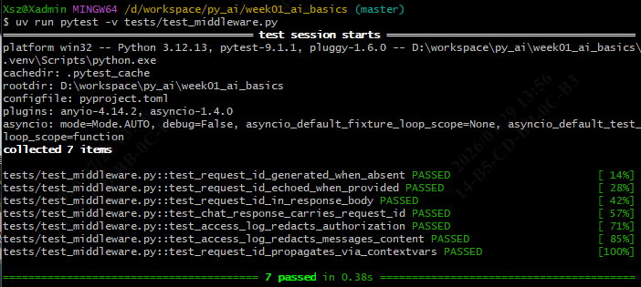
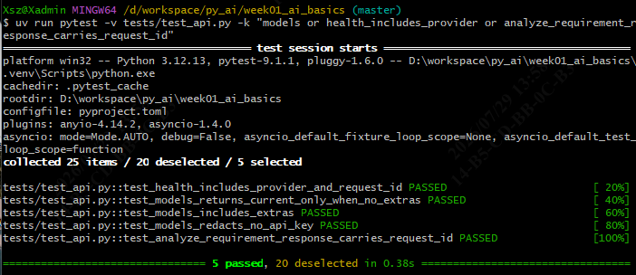
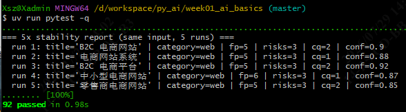
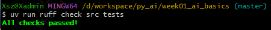
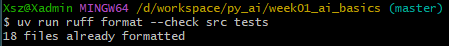

# Day 8 · Middleware + JSON 日志 + request_id + 模型元信息端点

> 范围：Roadmap 第 2 周 Day 8。在 Day 7 的 `ModelClient` 接口与流式之上，补「可观测 / 可审计 / 端点契约」底座：JSON 日志、request_id 注入、访问日志脱敏、模型元信息端点 `/models`。
> 适用：南宁软件组 AI Agent 应用开发 12 周 Roadmap 学员。
> 文档位置：`docs/day08_concepts.md`。
> 本文档含：当日任务、核心概念与示例、关键点、以及 **Day 8 测试命令与步骤**。

---

## 1. 当日目标

| # | 任务 | 状态 |
| --- | --- | --- |
| 1 | 新增 `src/logging_config.py`：JSON 日志 + `request_id` 注入基础设施（`ContextVar` + `RequestIdFilter` + `JSONFormatter` + 幂等 `configure_logging`） | ✅ |
| 2 | 新增 `src/middleware.py`：`RequestIdMiddleware` + `AccessLogMiddleware`（不读敏感字段） | ✅ |
| 3 | 扩展 `src/api_models.py`：新增 `ChatChunk` / `ModelInfo` / `ModelsResponse`，响应追加 `request_id`，`/health` 加 `provider` / `max_concurrency` | ✅ |
| 4 | 升级 `src/app.py`：接入日志 + 挂载中间件 + 新增 `GET /models` + 升级 `/health` / `/chat` / `/analyze-requirement` | ✅ |
| 5 | 新增 `tests/test_middleware.py`（7 例）：request_id 注入 + 访问日志脱敏 | ✅ |
| 6 | `tests/test_api.py` 扩展（+5 例）：`/models` × 3、`/health` 新字段、`/analyze-requirement` 的 `request_id` | ✅ |
| 7 | `ruff check` / `ruff format` / 全套 `pytest` 验收通过 | ✅ |

---

## 2. 运行环境

| 工具 | 版本 / 说明 |
| --- | --- |
| 操作系统 | Windows 10/11（Git Bash + cmd） |
| uv | 默认不在 PATH，所有 `uv` 命令前先 `export PATH="/c/Users/Xsz/.local/bin:$PATH"` |
| Python | 3.12.13（uv 管理的 `.venv/`） |
| 新增源码 | `src/logging_config.py`、`src/middleware.py`；改动 `src/api_models.py`、`src/app.py` |
| 新增测试 | `tests/test_middleware.py`；改动 `tests/test_api.py` |
| 测试框架 | pytest 9.1.1 + pytest-asyncio 1.4.0（`asyncio_mode = "auto"`，async 测试免写 `@pytest.mark.asyncio`） |
| 虚拟环境 | `D:\workspace\py_ai\week01_ai_basics\.venv\Scripts\python.exe` |

> **跑测试不需要 `.env`**：Day 8 全部用例用 `fake_llm` / `fake_config` 注入，不连真实 LLM、不读 `.env`。只有在 `uv run fastapi dev src/main.py` 真启服务时才需要 `.env`。

---

## 3. 核心概念

### 概念 1 · `BaseHTTPMiddleware` + `dispatch`（中间件骨架）

Starlette 提供 `BaseHTTPMiddleware`，子类实现 `async def dispatch(request, call_next)`：在路由 handler 前后做统一处理（注入、计时、改写响应）。Day 8 的两个中间件都基于它。

```python
class RequestIdMiddleware(BaseHTTPMiddleware):
    async def dispatch(self, request, call_next):
        rid = request.headers.get("x-request-id") or uuid.uuid4().hex
        request.state.request_id = rid
        response = await call_next(request)
        response.headers["x-request-id"] = rid
        return response
```

---

### 概念 2 · `contextvars.ContextVar` + `RequestIdFilter`（request_id 跨协程传递）

每个请求在独立协程里跑，`ContextVar` 让 `request_id` 只在该请求的协程上下文可见，互不串号；`RequestIdFilter` 在日志 `record` 上挂 `request_id`，`JSONFormatter` 自动序列化。

```python
request_id_var: ContextVar[str | None] = ContextVar("request_id", default=None)

token = request_id_var.set(rid)
try:
    ...
finally:
    request_id_var.reset(token)   # 请求结束必须 reset，避免污染下一个请求
```

---

### 概念 3 · `JSONFormatter`（单行 JSON + 自动展开 `extra`）

访问日志和异常日志统一输出一行 JSON，字段 `{ts(ISO8601 ms UTC+Z), level, logger, message, request_id, <extras>}`。`extra` 里的 `method/path/status_code/duration_ms` 自动展平到顶层，便于日志系统采集。

```python
logger.info("access", extra={
    "method": request.method, "path": request.url.path,
    "status_code": response.status_code, "duration_ms": dur,
})
```

---

### 概念 4 · 访问日志「绝不读敏感字段」

`AccessLogMiddleware` 只记 `method / path / status_code / duration_ms / request_id`。**不读** `Authorization` 头、**不读** `request.body()`（body 是一次性的，读了路由就拿不到）、**不记** query string（可能含密钥参数）。脱敏由约定保证，不靠正则事后擦除。

---

### 概念 5 · `BaseHTTPMiddleware` 与 SSE 不兼容

`BaseHTTPMiddleware` 会**缓存响应体**：它等路由返回完整 `Response` 后再处理。而 SSE（`StreamingResponse`）需要「边生成边发」，被缓存后实时性丢失（chunk 合并 / 延迟 / 可能丢帧）。Day 9 的 `/chat/stream` 会把 request_id 注入改成**纯 ASGI 中间件**（不缓冲 body），逻辑与 Day 8 一致。详见 `src/middleware.py` 模块 docstring。

---

## 4. 关键点

### 4.1 request_id 三处注入

`RequestIdMiddleware` 把 rid 同时写入：`request.state.request_id`（路由 handler 读）、`request_id_var`（日志 filter 读）、响应头 `X-Request-ID`（客户端关联）。客户端送 `X-Request-ID` 则原样透传（分布式追踪），否则 `uuid4().hex`。

### 4.2 访问日志绝不读敏感字段

见概念 4。`AccessLogMiddleware` 是外层中间件，记日志时 `request_id_var` 已被内层 `reset`，所以 rid 从 `request.state.request_id` 取（不随 ContextVar 消失）。

### 4.3 `configure_logging` 幂等

`logging_config.configure_logging` 跟踪自己挂的 handler / filter，重复调用只替换自己的，不影响 pytest 的 `caplog` 也不清空 uvicorn 的日志。测试里多次 `create_app()` 不会叠 handler。

### 4.4 挂载顺序

`create_app()` 里先 `add_middleware(RequestIdMiddleware)` 再 `add_middleware(AccessLogMiddleware)`。中间件「后加先执行」→ 请求路径 `AccessLog → RequestId → route → RequestId → AccessLog`。`AccessLog` 是最外层负责整体计时，`RequestId` 在内层、路由前注入。

### 4.5 ruff format 遗留修复

Day 8 收尾时 `src/api_models.py` 里 `error_body()` 的签名 / 返回字典超行未自动换行，导致之后 `ruff format --check` 报 1 文件需重排。已用 `uv run ruff format src/api_models.py` 修复（仅换行、非破坏），复验 `ruff format --check` 显示 `18 files already formatted`。若你本地 `git` 副本较旧，请先同步再跑测试。

---

## 5. Day 8 测试命令与步骤

> 所有命令从项目根 `D:\workspace\py_ai\week01_ai_basics` 执行。
> Git Bash 每条前先：`export PATH="/c/Users/Xsz/.local/bin:$PATH"`
> cmd 每条前先：`set PATH=C:\Users\Xsz\.local\bin;%PATH%`，且 `cd /d D:\workspace\py_ai\week01_ai_basics`。
> 若想用绝对路径直跑，可把每条 `uv` 换成 `C:\Users\Xsz\.local\bin\uv.exe`。
> **跑测试不需要 `.env`**（见 §2）。

### 任务项 1 · 中间件测试（`tests/test_middleware.py`，7 例）

```bash
uv run pytest -v tests/test_middleware.py
```

覆盖：request_id 缺失时生成 / 客户端透传 / 响应体回带 / `/chat` 响应带 rid / 访问日志不记 `Authorization` / 访问日志不记 body / `ContextVar` 链路透传。

**预期结果**：

### 任务项 2 · API 扩展测试（`tests/test_api.py` 新增 5 例）

```bash
# 仅命中 Day 8 在 test_api.py 新增的 5 例（/models × 3 + /health 新字段 + /analyze-requirement 的 request_id）
uv run pytest -v tests/test_api.py -k "models or health_includes_provider or analyze_requirement_response_carries_request_id"
```

> 注意：`test_chat_response_carries_request_id` 在 `tests/test_middleware.py` 里（不属于这 5 例），不要误以为在这里。

**预期结果**：

### 任务项 3 · 全量回归（确认 Day 8 没破坏 Day 1–7）

```bash
uv run pytest -q
```

**预期结果**：`92 passed`

### 任务项 4 · ruff 静态检查

```bash
uv run ruff check src tests
uv run ruff format --check src tests
```

**预期结果**：`ruff check` 输出`All checks passed!`；`ruff format --check` 显示 `18 files already formatted`

### 一键 Day 8 复验脚本（Git Bash）

```bash
export PATH="/c/Users/Xsz/.local/bin:$PATH"
cd /d/workspace/py_ai/week01_ai_basics
echo "== 中间件 7 例 ==" && uv run pytest -q tests/test_middleware.py
echo "== api 新增 5 例 ==" && uv run pytest -q tests/test_api.py -k "models or health_includes_provider or analyze_requirement_response_carries_request_id"
echo "== 全量 =="        && uv run pytest -q
echo "== ruff =="        && uv run ruff check src tests && uv run ruff format --check src tests
```

> 说明：上面「一键脚本」是**分别**跑 A（中间件）、B（API）、D（全量）、E（ruff），彼此独立、结果清晰。
### Windows 终端输出被截断的规避（如遇到）

Git Bash 下用 `tee` 落盘，避免 stdout 缓冲吞掉末尾结果：

```bash
PYTHONUNBUFFERED=1 uv run pytest -q 2>&1 | tee day8_test.log
```

cmd 下：

```cmd
set PYTHONUNBUFFERED=1
uv run pytest -q > day8_test.log 2>&1
```

回看：`cat day8_test.log`（Git Bash）或 `type day8_test.log`（cmd）。

---

## 6. 复验结果（Day 8 完结时，已实跑确认）

| 检查项 | 命令 | 结果 |
| --- | --- | --- |
| 中间件（7 例） | `uv run pytest -q tests/test_middleware.py` | **7 passed** |
| API 新增（5 例） | 两文件 + `-k "models or health_includes_provider or analyze_requirement_response_carries_request_id"` | **5 passed, 20 deselected** |
| 全量 | `uv run pytest -q` | **92 passed** |
| `ruff check src tests` | — | All checks passed! |
| `ruff format --check` | — | 18 files already formatted |

> 隔离 5 例的 `-k` 必须带 `tests/test_api.py` 文件路径，否则 `factory` 之类关键字可能误命中其他文件用例；本命令已限定文件，结果稳定为 5 passed。

---

## 7. 下一步

- **Day 9**：`/chat/stream` + 并发限制（`asyncio.Semaphore`）+ 边界测试（超时 / 限流 / 错误 JSON / 空响应 / 取消请求）。request_id 注入需从 `BaseHTTPMiddleware` 切换为**纯 ASGI 中间件**（概念 5），逻辑复用、行为一致，Day 8 的 7 个中间件测试继续有效。
- **Day 10**：`docs/week02_summary.md` + Swagger UI 截图 + 通过标准自检（空目录重建 + 切换模型只改配置）。
