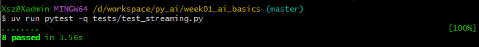
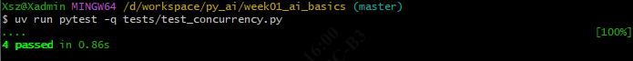
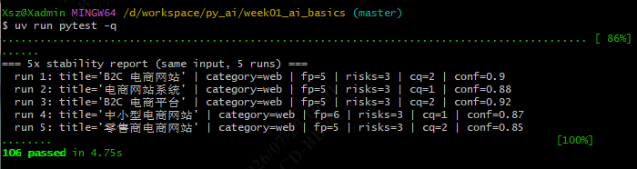
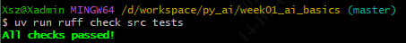
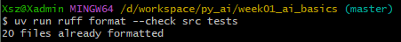
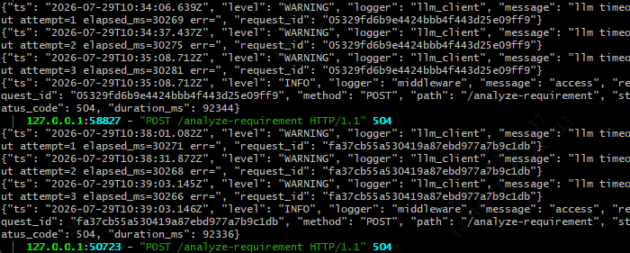
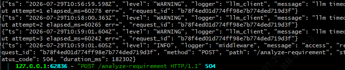
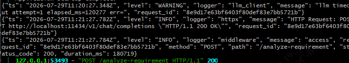

# Day 9 · 流式端点 `/chat/stream` + 并发限制 + 边界测试

> 范围：Roadmap 第 2 周 Day 9（周四）。在 Day 8 的 Middleware / JSON 日志 / `/models` 之上，补 Week 02 最后一个阶段端点 `/chat/stream`，并接入并发限制（`asyncio.Semaphore`）与「超时 / 限流 / 错误 JSON / 空响应 / 取消请求」边界测试，让 4 个 Week 02 端点（`/chat`、`/chat/stream`、`/models`、`/health`）全部就绪。
> 适用：南宁软件组 AI Agent 应用开发 12 周 Roadmap 学员。
> 文档位置：`docs/day09_concepts.md`。
> 本文档含：当日任务、核心概念与示例、关键点、以及 **Day 9 测试命令与步骤**。

---

## 1. 当日目标

| # | 任务 | 状态 |
| --- | --- | --- |
| 1 | `src/middleware.py` 新增纯 ASGI 版 `RequestIdASGIMiddleware` + `AccessLogASGIMiddleware`（解决 `BaseHTTPMiddleware` 与 SSE 不兼容）；保留旧 `BaseHTTPMiddleware` 版作 deprecated alias | ✅ |
| 2 | `src/llm_client.py` 接入 `asyncio.Semaphore`：`__init__` 多收 `max_concurrency` + `self._sem`；`chat` / `chat_stream` 在重试循环内每次重新 acquire | ✅ |
| 3 | `src/model_factory.py` 透传 `max_concurrency`；`src/app.py` 的 `_default_llm_factory` 改用 `build_model_client(cfg)` | ✅ |
| 4 | `src/app.py` 新增 `POST /chat/stream` 端点（`sse-starlette.EventSourceResponse`），模块级 `app = RequestIdASGIMiddleware(create_app())` | ✅ |
| 5 | 新增 `tests/test_streaming.py`（8 例）：SSE happy path / 5xx→error event / 取消传播 / 超时→error event / rid 透传 / 32 字符 hex / 路由注册契约 / 返回类型契约 | ✅ |
| 6 | 新增 `tests/test_concurrency.py`（4 例）：Semaphore 峰值限制 / 错误后锁释放 / `max_concurrency≤0` 拒绝 / 端到端 12 并发排队 | ✅ |
| 7 | `ruff check` / `ruff format` / 全套 `pytest` 验收通过 | ✅ |

---

## 2. 运行环境

| 工具 | 版本 / 说明 |
| --- | --- |
| 操作系统 | Windows 10/11（Git Bash + cmd） |
| uv | 默认不在 PATH，所有 `uv` 命令前先 `export PATH="/c/Users/Xsz/.local/bin:$PATH"` |
| Python | 3.12.13（uv 管理的 `.venv/`） |
| 新增 / 改动源码 | 改动 `src/middleware.py`、`src/llm_client.py`、`src/model_factory.py`、`src/app.py`；改动 `tests/test_api.py`、`tests/test_middleware.py` 的 client fixture |
| 新增测试 | `tests/test_streaming.py`、`tests/test_concurrency.py` |
| 测试框架 | pytest 9.1.1 + pytest-asyncio 1.4.0（`asyncio_mode = "auto"`，async 测试免写 `@pytest.mark.asyncio`） |
| 虚拟环境 | `D:\workspace\py_ai\week01_ai_basics\.venv\Scripts\python.exe` |

> **跑测试不需要 `.env`**：Day 9 全部用例用 `fake_llm` / `AppConfig` / `httpx.MockTransport` 注入，不连真实 LLM、不读 `.env`。只有在 `uv run fastapi dev src/main.py` 真启服务时才需要 `.env`。

---

## 3. 核心概念

### 概念 1 · SSE 流式响应与 `EventSourceResponse`

`/chat/stream` 用 `sse-starlette` 的 `EventSourceResponse`，把一个 async generator 包成 `text/event-stream`。每片 yield 一个 dict `{"event": "chunk", "data": <ChatChunk JSON>}`；结束前 yield 一个 `done=true` 的终止哨兵。

```python
from sse_starlette.sse import EventSourceResponse
from api_models import ChatChunk

async def _gen() -> AsyncIterator[dict[str, str]]:
    try:
        async for delta in llm.chat_stream(messages, model=req.model):
            yield {"event": "chunk",
                   "data": ChatChunk(delta=delta, done=False).model_dump_json()}
        yield {"event": "chunk",
               "data": ChatChunk(delta="", done=True).model_dump_json()}
    except LlmError as e:
        err = ErrorResponse(error=ErrorBody(code=..., message=str(e)))
        yield {"event": "error", "data": err.model_dump_json()}
        yield {"event": "chunk", "data": ChatChunk(delta="", done=True).model_dump_json()}

return EventSourceResponse(_gen())
```

---

### 概念 2 · `asyncio.Semaphore` 并发限制（放在重试循环内）

`max_concurrency` 控制「同时 in-flight 的请求数」。把 `async with self._sem:` 放在 `while True` 重试循环**内**——每次重试都重新 acquire，backoff 等待期间释放锁，体现「同时在上游的请求 ≤ N」语义（而非「同时发起的协程 ≤ N」）。

```python
self._sem = asyncio.Semaphore(max_concurrency)

async def chat(self, messages, *, model=None, extra_body=None) -> LlmResult:
    attempt = 0
    while True:
        async with self._sem:               # 每次重试重新拿锁
            try:
                response = await self._client.post(url, json=body, headers=headers)
            except httpx.TimeoutException as exc:
                if attempt < self._max_retries:
                    await self._sleep_backoff(attempt)
                    attempt += 1
                    continue
                raise LlmTimeoutError(...) from exc
            ...
```

---

### 概念 3 · 纯 ASGI 中间件（解决 `BaseHTTPMiddleware` 与 SSE 冲突）

`BaseHTTPMiddleware` 会**缓存响应体**：等路由返回完整 `Response` 后再处理。SSE 需要「边生成边发」，被缓存后实时性丢失。Day 9 把 request_id 注入改成**纯 ASGI** 写法（`__call__(scope, receive, send)`），不缓冲 body，行为一致。

```python
class RequestIdASGIMiddleware:
    def __init__(self, app): self.app = app

    async def __call__(self, scope, receive, send):
        if scope["type"] != "http":
            return await self.app(scope, receive, send)
        headers = dict(scope.get("headers", []))
        incoming = headers.get(b"x-request-id", b"").decode().strip()
        rid = incoming or uuid.uuid4().hex
        scope.setdefault("state", {})["request_id"] = rid
        token = request_id_var.set(rid)

        async def send_wrapper(message):
            if message["type"] == "http.response.start":
                message.setdefault("headers", []).append(
                    (b"x-request-id", rid.encode()))
            await send(message)

        try:
            await self.app(scope, receive, send_wrapper)
        finally:
            request_id_var.reset(token)
```

> 关键：`create_app()` **仍返回 FastAPI**（让测试 fixture 能调 `lifespan_context`），**模块级**才用 `RequestIdASGIMiddleware` 包裹整个 app；测试 fixture 自己在 lifespan 外再包一层。

---

### 概念 4 · 取消传播（`CancelledError` 不捕获）

客户端断开连接时，`sse-starlette` 会让 `_gen` 协程被取消（抛 `CancelledError`）。我们**不捕获**它，让其自然冒泡——`llm.chat_stream` 的协程随之取消，httpx 连接被关闭。测试用「建立连接后立刻 `aclose()`」模拟客户端断开，断言 200ms 内 `LlmClient.aclose()` 被调用。

---

### 概念 5 · `model_factory` 透传 `max_concurrency`（切换模型只改配置）

`build_model_client(cfg)` 现在把 `max_concurrency` 一并透传给 `LlmClient`。`src/app.py` 的 `_default_llm_factory` 改用 `build_model_client(cfg)`，于是超时 / 重试 / 并发上限全部由 `AppConfig`（即 `.env`）驱动——满足路线「切换模型只改配置，业务路由代码一行不动」的标准。

---

## 4. 关键点

### 4.1 `create_app()` 返回 FastAPI，模块级才包 ASGI

`create_app()` 内部：**仍然** `app.add_middleware(AccessLogMiddleware)`（AccessLog 是 BaseHTTPMiddleware，只读 `http.response.start` 状态码、不消费 body，与 SSE 无冲突），然后 `return app`。模块末尾 `app = RequestIdASGIMiddleware(create_app())`——请求路径变成 `RequestIdASGI → AccessLog → route`。这样测试 fixture 既能驱动 `lifespan_context`，又能让 request_id 在流式响应下正确注入。

### 4.2 Semaphore 包裹在 `while True` 重试循环内

见概念 2。这样「连接超时后 backoff 等待」期间锁被释放，其它请求可进入，符合「上游并发上限」情况。

### 4.3 SSE 错误传播：try / except LlmError / finally

`_gen` 里捕获 `LlmError` → 先发 `event: error` + `ErrorResponse` JSON（让客户端拿到结构化错误）；`finally` 块**永远**发 `event: chunk` + `done:true` 终止哨兵，让客户端能干净退出循环。客户端不应依赖「200 + 空 body」，而是读 error event。

### 4.4 取消传播不捕获 `CancelledError`

见概念 4。`test_chat_stream_cancellation_propagates` 用 `AsyncClient.stream(...) as resp` 后立即 `aclose()` 模拟断开，验证 `LlmClient.aclose()` 被调用——这是**预期行为**，不是失败用例。

### 4.5 测试 client fixture 适配

`tests/test_api.py` / `tests/test_middleware.py` / `tests/test_streaming.py` / `tests/test_concurrency.py` 全部改为：

```python
fastapi_app = create_app(llm_factory=lambda: fake, config_loader=lambda: cfg)
asgi_app = RequestIdASGIMiddleware(fastapi_app)
async with (
    fastapi_app.router.lifespan_context(fastapi_app),
    httpx.AsyncClient(transport=httpx.ASGITransport(app=asgi_app),
                      base_url="http://test") as ac,
):
    yield ac
```

### 4.6 `monkeypatch.setenv` 而非裸 `os.environ`（环境隔离）

`test_concurrent_chat_endpoint_respects_semaphore` 曾用 `os.environ["API_KEY"] = "test-key"` 直接写环境，导致后续 `test_config.py` 用例因 `API_KEY` 未被清理而失败（2 例）。改为 `monkeypatch.setenv("API_KEY", "test-key")`（fixture 退出自动清理），根除污染。**若自己加并发测试，务必沿用 `monkeypatch.setenv`，别用裸 `os.environ`。**

---

## 5. Day 9 测试命令与步骤

> 所有命令从项目根 `D:\workspace\py_ai\week01_ai_basics` 执行。
> Git Bash 每条前先：`export PATH="/c/Users/Xsz/.local/bin:$PATH"`
> cmd 每条前先：`set PATH=C:\Users\Xsz\.local\bin;%PATH%`，且 `cd /d D:\workspace\py_ai\week01_ai_basics`。
> 若想用绝对路径直跑，可把每条 `uv` 换成 `C:\Users\Xsz\.local\bin\uv.exe`。
> **跑测试不需要 `.env`**（见 §2）。

### 任务项 1 · 流式测试（`tests/test_streaming.py`，8 例）

```bash
uv run pytest -v tests/test_streaming.py
```

覆盖：happy path（累计 `delta == "你好"`，收尾 `done=True`）/ 5xx→error event（1 error + 1 done）/ 取消传播（aclose 后流自然终止）/ 超时→error event / rid 透传（响应头 `X-Request-ID`）/ 32 字符 hex / 路由注册契约 / 返回类型契约。

**预期结果**：`8 passed`

### 任务项 2 · 并发限制测试（`tests/test_concurrency.py`，4 例）

```bash
uv run pytest -v tests/test_concurrency.py
```

覆盖：10 并发、上限 3，断言峰值 ≤ 3 / 5xx 后下次仍能拿锁 / `max_concurrency≤0` 抛 `ValueError` / 端到端 12 并发、上限 4，至少 1 个端到端耗时 ≥ 100ms（排队生效）。

**预期结果**：`4 passed`

### 任务项 3 · 全量回归（确认 Day 9 没破坏 Day 1–8）

```bash
uv run pytest -q
```

**预期结果**：`106 passed`

### 任务项 4 · ruff 静态检查

```bash
uv run ruff check src tests
uv run ruff format --check src tests
```

**预期结果**：`ruff check` 输出 `All checks passed!`（；`ruff format --check` 显示 `20 files already formatted`

### 一键 Day 9 复验脚本（Git Bash）

```bash
export PATH="/c/Users/Xsz/.local/bin:$PATH"
cd /d/workspace/py_ai/week01_ai_basics
echo "== 流式 8 例 =="        && uv run pytest -q tests/test_streaming.py
echo "== 并发 4 例 =="        && uv run pytest -q tests/test_concurrency.py
echo "== 全量 =="             && uv run pytest -q
echo "== ruff =="             && uv run ruff check src tests && uv run ruff format --check src tests
```

> 说明：上面「一键脚本」是**分别**跑 A（流式）、B（并发）、D（全量）、E（ruff），彼此独立、结果清晰。

### Windows 终端输出被截断的规避（如遇到）

Git Bash 下用 `tee` 落盘，避免 stdout 缓冲吞掉末尾结果：

```bash
PYTHONUNBUFFERED=1 uv run pytest -q 2>&1 | tee day9_test.log
```

cmd 下：

```cmd
set PYTHONUNBUFFERED=1
uv run pytest -q > day9_test.log 2>&1
```

回看：`cat day9_test.log`（Git Bash）或 `type day9_test.log`（cmd）。

---

## 6. 复验结果（Day 9 完结时，已实跑确认）

| 检查项 | 命令 | 结果 |
| --- | --- | --- |
| 流式（8 例） | `uv run pytest -q tests/test_streaming.py` | **8 passed** |
| 并发（4 例） | `uv run pytest -q tests/test_concurrency.py` | **4 passed** |
| 全量 | `uv run pytest -q` | **106 passed in ~5.1s** |
| `ruff check src tests` | — | All checks passed! |
| `ruff format --check` | — | 20 files already formatted |

> 隔离新增可直接跑 `uv run pytest -q tests/test_streaming.py tests/test_concurrency.py` → `12 passed`（这是 A + B 两文件一起，属正常分组跑法）。不加文件限定的 `-k "factory"` 会误命中 Day 5 的 `test_create_app_default_factory_works`，隔离 Day 9 时直接指定两个文件路径即可。

---

## 7. 排障记录 · `/analyze-requirement` 超时（qwen3 + 长 SYSTEM_PROMPT + CPU 推理）

> 本节记录 Day 9 完结后、真实启服务跑 `qwen3` 时遇到的超时问题与根因。属运行期排障，不影响 Day 9 代码与测试结论。

### 7.1 现象

真实启动服务（`uv run fastapi dev src/main.py`）+ `.env` 指向本地 Ollama 的 `qwen3` 后，`POST /analyze-requirement` 持续返回：

```json
{
  "error": {
    "code": "llm_timeout",
    "message": "request timed out after 3 attempts",
    "status_code": 504,
    "request_id": "fa37cb55a530419a87ebd977a7b9c1db"
  }
}
```

`llm_client` 日志显示每次 attempt 都**精确卡在 `TIMEOUT_SECONDS`**：30s → 60s → 120s 三档随配置变化（`elapsed_ms=30272 / 60278 / 120277`）。这正是 httpx `ReadTimeout` 在超时阈值整点触发，而非 Ollama「慢慢回吐」。




### 7.2 根因（已用 curl 直连 Ollama 排除服务侧）

- 直接 `curl --max-time 300` 打 `http://localhost:11434/v1/chat/completions`，**用 `prompts.py` 里真实的 `SYSTEM_PROMPT`**（约 1000 中文字 / ~700 input token，含严格 JSON schema 约束 + 3 个示例）时，qwen3 实测需要 **60–180s**；而用「占位简版 prompt」时 < 30s。说明慢的是**模型在长 prompt 上的 thinking 推理**，不是服务代码。
- `ollama ps` 显示模型 `100% CPU / 0 GPU`（6.7 GB，纯 CPU 推理），thinking 模型的 reasoning tokens 开销被显著放大。
- 第一周 `/analyze-requirement` 的 prompt 短、无严格 `response_format` 硬约束，所以当时快；本周 Phase 2 结构化契约 + `SYSTEM_PROMPT` 复杂后，thinking 开销暴涨——属 prompt 复杂度上升，与代码无关。

### 7.3 把 `TIMEOUT_SECONDS` 调到 120s 后的真实行为

```
attempt=1 elapsed_ms=120277   ← 冷启动，第一次尝试卡满 120s 被砍
HTTP 1.1 200 OK               ← 重试（模型已 warm）~60s 成功
duration_ms=180719            ← 用户总等待 ≈ 120s(浪费) + 60s
```

即：**120s 刚好擦边，且每次都先白等一个 120s 超时再重试**，总延迟被翻倍。真冷启动下第二次也可能擦边。

### 7.4 解决（均不改业务代码，只改 `.env` / 拉模型）

| 方案 | 操作 | 效果 |
| --- | --- | --- |
| A 快速止血 | 在`.env` 中把 `TIMEOUT_SECONDS` 提到 `180` | 第一次尝试即可接住完整生成，省掉浪费的 120s 重试；用户可见延迟降到 ~150s 单次。冷启动仍可能擦边 |
| B 根治（推荐） | `ollama pull qwen2.5:7b-instruct`；`.env` 设 `MODEL_NAME=qwen2.5:7b-instruct`、`TIMEOUT_SECONDS=30` | 非 thinking 模型，同一 `SYSTEM_PROMPT` 单次 **10–30s**，无需重试。`prompts.py` / `schemas.py` / `app.py` / 测试全不动 |
| C 留 qwen3 | 精简 `src/prompts.py` 的 `SYSTEM_PROMPT`（删 3 个示例 ≈ 砍 35% 输入） | 推理时间缩到 60–90s，缓兵之计 |


```bash
# Git Bash（B 方案操作步骤）
cd /d/workspace/py_ai/week01_ai_basics
ollama pull qwen2.5:7b-instruct          # 拉非 thinking 模型
# 编辑 .env：MODEL_NAME=qwen2.5:7b-instruct  +  TIMEOUT_SECONDS=30
uv run fastapi dev src/main.py           # 重启服务
```

### 7.5 附带验证（顺带确认修复有效）

- 成功响应体 `request_id` 与响应头 `X-Request-ID` 一致（`8e9d17e63bf6403f80def83e7bb5721b`）—— Day 9 给 `ErrorBody` 加 `request_id` 字段的修复在**成功路径**也生效。
- 504 错误信封同样带 `request_id` 且与响应头一致 —— 错误路径也生效。

### 7.6 设计层面

当前重试是「每次等满整个 timeout」，对慢模型等于把延迟乘以尝试次数。若保留 qwen3，可考虑把 `MAX_RETRIES` 也做成 `.env` 可配（慢模型设 `MAX_RETRIES=0`），避免白白翻倍等待。

---

## 8. 下一步

- **Day 10**：`docs/week02_summary.md` + Fastapi 截图 + 通过标准自检（空目录重建 `uv sync` → `pytest -q` 通过；切换模型只改 `.env` 业务代码一行不动）+ Gate 1 检查。
