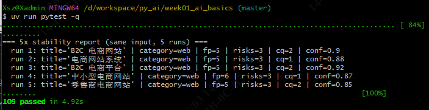

# Day 11 — Agent Loop 机制 & LangChain v1 接入

> 适用项目：南宁软件组 AI Agent 12 周 Roadmap · Week 3 · Day 1
> 适用仓库：`D:\workspace\py_ai\week01_ai_basics\`
> 落档日期：2026-08-03

---

## 1. 核心结论：模型调用 与 Agent Loop

| 维度 | 模型调用（Model Call） | Agent Loop |
|---|---|---|
| 触发 | 一次 `request → response` | 反复 `调模型 → 决定调工具 → 工具执行 → 再调模型 → 终止` |
| 终止条件 | 响应回来即结束 | 模型不再产生 `tool_calls` 时终止（或达 `recursion_limit`） |
| 工具 | 不涉及 | 工具由 LangChain v1 `create_agent` 注册并执行 |
| 内部实现 | 直接调 `model.invoke(messages)` | LangGraph 状态图（`CompiledStateGraph`） |

**一句话区别**：模型调用是「一问一答」，Agent 是「一问 → 多次循环直到有最终答案」。

---

## 2. Agent Loop 流程（文字版）

```
┌─────────────────────────────────────────────────────────────┐
│  1. 用户输入 → [{role: user, content: ...}]                  │
│  2. before_model 钩子（中间件）· 写入 trace / 校约束          │
│  3. 模型调用 model.invoke(messages)                          │
│  4. 模型返回 AIMessage                                       │
│        ├─ tool_calls == [] → 终止（final answer）            │
│        └─ tool_calls != [] → 进入工具执行分支                 │
│  5. wrap_tool_call 钩子（中间件）                            │
│        ├─ 正常：执行工具 → ToolMessage 回填消息 → 回到 step 3 │
│        └─ 异常：转 TOOL_ERROR 字符串回填 → 回到 step 3        │
│  6. recursion_limit 兜底：超过硬上限 → 抛 GraphRecursionError │
│  7. after_model 钩子（中间件）· 写 trace                     │
│  8. 返回 {messages: [...]}                                  │
└─────────────────────────────────────────────────────────────┘
```

---

## 3. 4 个终止条件场景

### 场景 A：模型直接给 final answer（预期终止）
- **输入**：用户问「你好」
- **模型行为**：返回 `AIMessage(content="你好！", tool_calls=[])`
- **结果**：loop 单步终止；消息列表 = `[HumanMessage, AIMessage]`
- **Day 11 验证**：`tests/test_agent_loop.py::test_minimal_loop_terminates_with_empty_tools`

### 场景 B：模型调一次工具，工具返回后模型再给 final answer
- **输入**：用户问「2+3=?」
- **模型行为**：返回 `AIMessage(tool_calls=[add(2,3)])` → 工具执行 → 返回 `AIMessage(content="2+3=5")`
- **结果**：loop 2 步终止；消息列表 = `[Human, AI(tool_call), ToolMessage, AI(final)]`
- **Day 12 验证**：用 `FakeMessagesListChatModel` 自定义子类（支持 `bind_tools`）完成

### 场景 C：工具抛异常被中间件兜底
- **输入**：用户问「读 `/etc/passwd`」
- **模型行为**：调 `read_text_file` → 工具抛 `PermissionError` → `SafeToolMiddleware.wrap_tool_call` 捕获 → 回填 `ToolMessage(content="TOOL_ERROR: ...", name="read_text_file")`
- **结果**：模型重新看到工具失败结果，自行决定下一步（重述错误 / 改用其他工具 / 给最终回答）
- **通过标准**：不向上抛、不崩溃；模型和工具循环不脱锚
- **Day 13 验证**：`SafeToolMiddleware` + mock 模拟工具抛异常

### 场景 D：超过 `recursion_limit` 硬上限
- **输入**：模型反复生成无效 `tool_calls`（例如陷入死循环）
- **行为**：LangGraph runtime 达 `recursion_limit`（建议 8–12）→ 抛 `GraphRecursionError`
- **结果**：循环强制终止；外层由 `SafeToolMiddleware` / catch 块兜底成"模型陷入循环"错误
- **Day 13 验证**：mock 模型连续 N 次返回含 `tool_calls` 的消息，验证 `recursion_limit` 内必终止

---

## 4. Day 11 任务

| 任务 | 路径 | 状态 |
|---|---|---|
| 包骨架 | `src/devagent/__init__.py` | ✅ |
| 工具子包骨架 | `src/devagent/tools/__init__.py` | ✅ |
| LangChain v1 依赖 | `pyproject.toml` 加 `langchain>=1.3.14`（实际装 1.3.14） | ✅ |
| 最小例子 | `tests/test_agent_loop.py`（3 条 pytest） | ✅ 3/3 绿 |
| 全量测试 | `uv run pytest -q` | ✅ 109 passed（原 106 + 本次 3） |

### 实际安装的 LangChain 组件
- `langchain==1.3.14`
- `langchain-core==1.5.3`
- `langgraph==1.2.10`（`create_agent` 底层 runtime）
- 附带 `langgraph-checkpoint` / `langgraph-prebuilt` / `langgraph-sdk` / `langsmith`

### 关键 API 提示（已验证）
- `from langchain.agents import create_agent` —— v1 入口
- `from langchain.tools import tool` —— v1 从 `langchain-core` 重导出
- `from langchain_core.language_models.fake_chat_models import FakeListChatModel` —— 接受**字符串**列表（不是 AIMessage）
- 工具调用场景需自定义支持 `bind_tools` 的 fake；Day 2 在 `tests/conftest.py` 提供 `FakeToolCapableChatModel`

---

## 5. 具体操作步骤（可复用）

> 运行环境：Git Bash（沙箱 / 容器内也可，只要 `uv` 已安装）。

```bash
# 1. 切换到项目根
cd /d/workspace/py_ai/week01_ai_basics
export PATH="/c/Users/Xsz/.local/bin:$PATH"   # uv 不在 PATH

# 2. 安装 LangChain v1（已执行,沉淀为 pyproject.toml/uv.lock）
uv add langchain

# 3. 验证导入
uv run python -c "from langchain.agents import create_agent; from langchain.tools import tool; print('ok')"

uv pip list | grep -i langchain

# 4. 跑 Day 11 测试
uv run pytest tests/test_agent_loop.py -v

# 5. 跑全量回归（确认旧测试未破）
uv run pytest -q
```

> **注意**：依赖通过 `uv add` 写入 `pyproject.toml` 的 `[project.dependencies]` 区段，`uv.lock` 同步更新。**不要** 直接编辑 `pyproject.toml` 加依赖再 `uv sync` —— 这种“手编+sync”会丢失 lockfile 解析信息。

### 测试截图




---

## 6. Day 12 目标

- **目标**：用 `@tool` 实现 `calculator` / `read_text_file` / `check_commit_message` 三个工具；
- **新增中间工具**：`FakeToolCapableChatModel`（支持 `bind_tools`，让 `FakeMessagesListChatModel` 走通工具调用路径）；
- **重点关注**：`read_text_file` 的路径穿越防护（`Path.resolve() + is_relative_to(TRAIN_DIR)`）；
