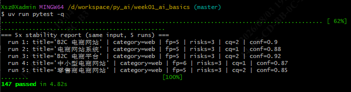
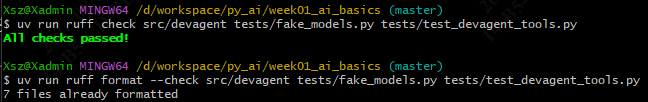

# Day 12 — DevAssistantAgent 工具定义（@tool + 三工具 + 输入校验 + 权限边界）

> 适用项目：南宁软件组 AI Agent 12 周 Roadmap · Week 3 · Day 2
> 适用仓库：`D:\workspace\py_ai\week01_ai_basics\`
> 落档日期：2026-08-04

---

## 1. 目标

用 LangChain v1 的 `@tool` 装饰器实现 **3 个工具**，每个都带输入校验；其中
`read_text_file` 必须能**防路径穿越攻击**；工具失败时返回结构化错误信封而非向上抛异常
（让模型/上层能用信封决策，配合 Day 13 的中间件实现「失败不崩溃、不无限循环」）。

---

## 2. 交付物清单

| 文件 | 说明 | 状态 |
|---|---|---|
| `src/config.py` | `AppConfig` 扩展 `train_dir` / `max_file_bytes`（沙箱根 + 读取上限） | ✅ |
| `src/devagent/tools/calculator.py` | 安全算术求值（AST 白名单，拒绝 `eval/exec`） | ✅ |
| `src/devagent/tools/read_text_file.py` | 路径穿越防护 + 只读 + 大小上限 | ✅ |
| `src/devagent/tools/check_commit_message.py` | 团队 Conventional Commits 模板校验 | ✅ |
| `src/devagent/tools/__init__.py` | 聚合导出三个工具（供 `create_agent(tools=[...])`） | ✅ |
| `tests/fake_models.py` | `FakeToolCapableChatModel`（支持 `bind_tools` 的 mock 模型） | ✅ |
| `tests/conftest.py` | 清空（fixture 暂不需要，保持简洁） | ✅ |
| `tests/test_devagent_tools.py` | 38 条工具单测 + 终止条件 B | ✅ |

**验证结果**：`uv run pytest -q` → **147 passed**（Day 11 的 109 + Day 12 的 38）；
`ruff check` / `ruff format --check` 都通过。

---

## 3. 三个工具设计

### 3.1 `calculator(expression)` — 安全算术求值

- **绝不用 `eval` / `exec`**（杜绝代码注入）。
- `ast.parse(..., mode="eval")` 解析 → **白名单节点**：只允许
  `Expression / BinOp / UnaryOp / Constant` 及运算符节点
  `Add / Sub / Mult / Div / Mod / USub / UAdd`。
- 任何不在白名单的节点一律拒绝：`Call`（函数调用）、`Attribute`（属性访问）、
  `Subscript`（下标）、`Name`（变量）、`Compare`、`BoolOp`、位运算、乘方 `**` 等。
- 只支持 `+ - * / %` 与一元 `- +`；括号由 AST 自身表达，无需显式支持。
- 长度上限 512 字符，防超大输入拖慢解析。

**错误信封（`kind` 分类，不抛异常）**：

| kind | 触发 |
|---|---|
| `empty` | 输入为空 / 非字符串 |
| `too_long` | 超过 512 字符 |
| `syntax` | AST 解析失败 |
| `unsafe_node` | 出现白名单外的节点（调用/属性/下标/变量） |
| `non_numeric` | 字面量不是数字（含 `True/False`，因为 bool 是 int 子类，显式拒绝） |
| `domain` | 数学域错误（除零、溢出、`inf`/`nan` 显式拦截） |

> 关键细节：`bool` 是 `int` 子类，若不加判断 `True + 1` 会被当成 `2`；这里显式拒绝。
> `inf`/`nan` 以 float 形式流出而非抛异常，会被下游误读，也显式拦截为 `domain`。

### 3.2 `read_text_file(path, max_bytes=50000)` — 路径穿越防护 + 只读

- **唯一**允许读取 `TRAIN_DIR` 及其子树；其它路径一律拒绝。
- **防护机制**：不依赖字符串前缀/正则，而是
  `Path.resolve()` + `Path.is_relative_to(TRAIN_DIR)` —— 抵御 `../`、符号链接、
  绝对路径、Windows 盘符切换等。
- **相对路径锚定**：`Path(raw)` 若非绝对，先 `root / p` 锚到 `TRAIN_DIR` 再 `resolve()`，
  所以 `read_text_file("a.txt")` 永远落在沙箱根下（否则相对 cwd 解析会导致全部被判越界）。
- **只读**：不创建、不写、不删、不执行。
- **大小上限**：读前先 `stat().st_size`，超过 `max_bytes` 拒绝（防拉爆模型上下文）。
- **编码兜底**：UTF-8 失败回退 `errors="replace"`，读二进制文件也不炸（但内容已损失，模型能据此判断非文本）。

**错误信封（`kind` 分类）**：

| kind | 触发 |
|---|---|
| `forbidden` | 路径在 `TRAIN_DIR` 之外（越界） |
| `not_found` | 文件不存在 |
| `is_dir` | 路径是目录而非文件 |
| `too_large` | 文件超过字节上限 |
| `io` | 读取失败（权限、其他 OS 错误） |
| `bad_path` | 路径非字符串 / 含 NUL 字符 / `max_bytes<=0` |

> `TRAIN_DIR` 与 `MAX_FILE_BYTES` 默认值定义在本模块顶部，支持 `configure(...)` 覆盖便于测试；
> 生产路径由 `src.config.AppConfig.train_dir` / `max_file_bytes` 注入。

### 3.3 `check_commit_message(message)` — 团队模板校验

- 实现最小可执行的 Conventional Commits 校验器，对齐**团队风格**
  `type: scope: subject`（`!` 紧跟 type 表 breaking）。
- **type 白名单（18 个）**：`func / feat / fix / docs / style / conf / perm / version /
  patch / other / refactor / perf / test / chore / build / ci / revert`。
- 约束：subject 非空、header 整行 ≤ 72；有 body 时各行 ≤ 100。
- **结构化输出**：`valid` / `errors`（列表，可直贴用户）/ `parsed`
  （`type / scope / subject / breaking / has_body`），即使校验失败也尽量解析。

**输出契约**：

```jsonc
// 合法
{ "ok": true, "valid": true,  "errors": [], "parsed": { "type": "feat", "scope": "app", "subject": "...", "breaking": false, "has_body": false } }
// 非法（不抛异常）
{ "ok": true, "valid": false, "errors": ["..."], "parsed": { ... } }
```

---

## 4. config 扩展

`src/config.py` 的 `AppConfig` 新增两个字段，作为工具沙箱配置的单一来源：

```python
# ----- Week 03 Agent 工具沙箱 -----
train_dir: str = "./training_data"   # read_text_file 唯一可读取根目录
max_file_bytes: int = 50_000          # 单文件读取上限
```

---

## 5. 测试基础设施（无需真实 LLM）

| 模块 / 文件 | 作用 |
|---|---|
| `tests/fake_models.py` → `FakeToolCapableChatModel` | 假模型，继承 `FakeMessagesListChatModel`，能按预设列表逐条返回 `AIMessage`（含 `tool_calls`）。实现了 `bind_tools`（返回 `self` 而不是 clone，保证计数器 `i` 共享）和 `_generate`（每次调用取一条，取完抛 `RuntimeError` 而非循环）。 |
| `isolated_train_dir` fixture（`tests/test_devagent_tools.py`） | 每个测试用例一个独立的临时沙箱目录。通过 `monkeypatch.setattr` 改模块全局变量 `TRAIN_DIR`。 |
| 全部 mock | 不依赖 Ollama / 真实模型 API，离线可跑。 |

---

## 6. 测试覆盖明细（38 = 16 + 10 + 11 + 1）

| 工具 / 场景 | 正常 | 边界 | 异常 / 拒绝 | 小计 |
|---|---|---|---|---|
| `TestCalculator` | 加/优先级/括号/负号/浮点除/取模 | 空/超长/非字符串 | 函数调用/属性/变量/字符串字面量/布尔/除零 | **16** |
| `TestReadTextFile` | 读文件/读子目录 | 大小上限/NUL/非字符串 | 路径穿越/绝对越界/不存在/是目录/`max_bytes<=0` | **10** |
| `TestCheckCommitMessage` | 合法/无 scope/带 body/breaking | header 长度/body 长度/空 subject | 未知 type/格式不符/非字符串 | **11** |
| `TestAgentLoopScenarioB` | 调工具 → 工具结果 → final answer | — | — | **1** |

---

## 7. 关键 Bug 与解法

| 问题 | 现象 | 解法 |
|---|---|---|
| 相对路径锚到 cwd | 传 "../../etc/passwd"，read_text_file 直接 Path("../../etc/passwd").resolve() 跑到系统目录去了，沙箱形同
  虚设，所有文件都被判越界 | 先 `root / p` 锚到 `TRAIN_DIR` 再 `resolve()` |
| `monkeypatch.setattr(函数, ...)` | 直接改 read_text_file.py 里的 TRAIN_DIR，会报`AttributeError: function has no attribute` | 用 `sys.modules[fn.__module__]` 拿模块再设置属性，不要直接改函数中的东西 |
| `FakeListChatModel` 不支持 `bind_tools` | 测试“模型调用工具”场景跑不通 | 改用 `FakeMessagesListChatModel`并重写 `_generate` |
| `FakeMessagesListChatModel._generate` 末尾多一段循环 | 让测试用的"假模型"每次调用应只取一条预设回答；但 `_generate` 末尾的循环第三次调用又重新拿到已用过的 `resp[0]`（tool_call 消息）→ 程序走入 `model_to_tools` 的「artificial tool messages」分支 → 因找不到数据报 `KeyError`，测试崩溃 | 重写 `_generate` 去掉循环，每次只处理一条；同时 `bind_tools` **必须 `return self`** 以共享计数 `i`，保证按顺序取正确消息 |
| `calculator` 白名单漏运算符类型 | 白名单（`_ALLOWED_OPS` / `_ALLOWED_NODES`）漏了部分基础运算符（加减乘除取余、正负号等）。用户用正常算式计算时，程序"认不出"这些运算符，把它们当 `unsafe_node` 拒绝 → 合法算式算不了 | 补全 `_ALLOWED_OPS` 与 `_ALLOWED_NODES`，把漏掉的运算符和节点类型都加回去 |
| `check_commit_message` 正则按标准 conventional | 工具原本按标准格式 `type(scope): subject`（括号包范围）写正则，但团队实际风格是 `type: scope: subject`（冒号分隔）。结果团队正常写的提交信息被误判"格式不合规" | 把正则改成匹配团队风格——用 `: scope:`（冒号 + 空格 + 范围 + 冒号）而非 `(scope)`（括号包范围） |

---

## 8. 终止条件验证进度

| 场景 | 含义 | 验证位置 | 状态 |
|---|---|---|---|
| A | 模型直接给 final answer | Day 11 `test_minimal_loop_terminates_with_empty_tools` | ✅ |
| B | 调一次工具 → 工具返回 → 再给 final answer | Day 12 `TestAgentLoopScenarioB` | ✅ |
| C | 工具抛异常被中间件兜底 | Day 13 `SafeToolMiddleware` + mock 异常 | 待完成 |
| D | 超 `recursion_limit` 硬上限 | Day 13 mock 连续无效 tool_calls | 待完成 |

---

## 9. 验证命令（Git Bash）

```bash
cd /d/workspace/py_ai/week01_ai_basics
export PATH="/c/Users/Xsz/.local/bin:$PATH"   # uv 不在默认 PATH

# 全部 38 条
uv run pytest tests/test_devagent_tools.py -v
# 按工具分块
uv run pytest tests/test_devagent_tools.py::TestCalculator -v
uv run pytest tests/test_devagent_tools.py::TestReadTextFile -v
uv run pytest tests/test_devagent_tools.py::TestCheckCommitMessage -v
uv run pytest tests/test_devagent_tools.py::TestAgentLoopScenarioB -v
# 单条（路径穿越安全用例）
uv run pytest "tests/test_devagent_tools.py::TestReadTextFile::test_path_traversal_blocked" -v
# 全量回归（确认之前的模块正常）
uv run pytest -q
# Ruff
uv run ruff check src/devagent tests/fake_models.py tests/test_devagent_tools.py
uv run ruff format --check src/devagent tests/fake_models.py tests/test_devagent_tools.py
```

### 测试截图
- tools测试


- 全部测试用例


- ruff检查


---

## 10. 后续

**下一步 Day 13**：`src/devagent/dev_assistant_agent.py`（`create_agent` 组装）+ `src/devagent/middleware.py`
（`TraceMiddleware` 记录 reason/params/result/answer；`SafeToolMiddleware` 异常转 `TOOL_ERROR` + 配合
`recursion_limit` 防无限循环），补齐终止条件 C / D 的验证。
