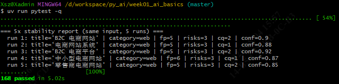

# Day 13 — DevAssistantAgent 中间件（Trace + Safe）与工厂组装

> 适用项目：南宁软件组 AI Agent 12 周 Roadmap · Week 3 · Day 3
> 适用仓库：`D:\workspace\py_ai\week01_ai_basics\`
> 落档日期：2026-08-04

---

## 1. 目标

在 Day 12 的 3 个工具基础上，用 LangChain v1 的 `AgentMiddleware` 实现**两个中间件**并提供一个**工厂函数**，把"工具 + 中间件 + 系统提示词 + 配置注入"打包成可直接调用的 `DevAssistantAgent`：

- `TraceMiddleware`：在 Agent Loop 的关键节点写结构化 trace（模型为何调工具、工具名/参数、工具结果、最终回答），便于事后排查与测试断言。
- `SafeToolMiddleware`：工具抛异常时不让整个 Agent 崩溃，而是返回 `TOOL_ERROR` 消息，让模型"看见失败"自行决定下一步。
- `build_devassistant_agent`：把 Day 12 三个工具与两个中间件组合，并注入 `AppConfig` 沙箱配置。

本任务同时补齐 **终止条件 C**（工具异常被中间件兜底）与 **终止条件 D**（超 `recursion_limit` 硬上限强制终止），使 Agent Loop 的四个终止场景全部实现。

---

## 2. 交付物清单

| 文件 | 说明 | 状态 |
|---|---|---|
| `src/devagent/middleware.py` | `TraceRecorder`（事件收集器）+ `TraceMiddleware`（三钩子记录）+ `SafeToolMiddleware`（异常兜底） | ✅ |
| `src/devagent/dev_assistant_agent.py` | `build_devassistant_agent` 工厂 + `DEFAULT_RECURSION_LIMIT = 8` + `SYSTEM_PROMPT` + `_inject_sandbox` | ✅ |
| `tests/test_devagent_agent.py` | 21 条中间件与 Agent 测试（含终止条件 C / D） | ✅ |

**验证结果**：`uv run pytest -q` → **168 passed**；
`ruff check` / `ruff format --check` 都通过。

---

## 3. 中间件与 Agent 工厂设计

### 3.1 `TraceRecorder` — Append-only 事件收集器

给 `TraceMiddleware` 与测试共享的轻量收集器，每条事件是一个 `dict`字典，至少含 `kind` 字段。

```python
class TraceRecorder:
    __slots__ = ("events",)

    def __init__(self) -> None:
        self.events: list[dict] = []

    def record(self, *, kind: str, **fields) -> None: ...
    def of_type(self, kind: str) -> list[dict]: ...
    def kinds(self) -> list[str]: ...       # 按顺序返回事件种类，便于断言调用流
    def __len__(self) -> int: ...
```

### 3.2 `TraceMiddleware` — 记录 Agent Loop 关键节点

继承 `AgentMiddleware`，在三个**异步**钩子里写 trace；只记录、不修改 state、不吞异常。

| 钩子 | 触发时机 | 记录字段 |
|---|---|---|
| `abefore_model` | 模型调用前 | `step`（自增步数）、`message_count` |
| `aafter_model` | 模型调用后 | `step`、`tool_calls`（name/args/id）、`has_final`（是否最终回答）、`content_preview` |
| `awrap_tool_call` | 包裹工具执行 | `step`、`name`、`args`、`ok`、`result_preview` 或 `error` |

> 注意：LangChain v1 运行时走 async（异步），必须实现 `a*` 版本（`abefore_model` / `aafter_model` / `awrap_tool_call`）；
> 同步版本的 `before_model` 等不会被调用。

### 3.3 `SafeToolMiddleware` — 工具失败兜底

只兜异常、不记录；把异常转成模型可读的 `ToolMessage`，让 Loop 可以继续而不是崩溃。

```python
class SafeToolMiddleware(AgentMiddleware):
    async def awrap_tool_call(self, request, handler):
        try:
            return await handler(request)
        except Exception as exc:
            tc = request.tool_call
            safe = f"TOOL_ERROR: {type(exc).__name__}: {exc}"
            return ToolMessage(content=safe, tool_call_id=tc.get("id"))
```

字符串格式 `"TOOL_ERROR: <异常类型>: <异常信息>"` 与 Day 12 工具自身的结构化信封 `{"ok": False, "kind": ...}` 不同：
这里用于**工具自身抛异常**；信封化失败是工具主动返回的结构化结果，不需要中间件介入。

### 3.4 `build_devassistant_agent` — 工厂组装

把工具、中间件、系统提示词组合成 `CompiledStateGraph`，并注入 `AppConfig` 沙箱配置。

```python
DEFAULT_RECURSION_LIMIT = 8

def build_devassistant_agent(
    model: BaseChatModel,
    *,
    config: AppConfig | None = None,
    recorder: TraceRecorder | None = None,
    with_safe_tool: bool = True,
):
    _inject_sandbox(config)
    middleware = []
    if recorder is not None:
        middleware.append(TraceMiddleware(recorder=recorder))
    if with_safe_tool:
        middleware.append(SafeToolMiddleware())
    return create_agent(
        model=model,
        tools=[calculator, read_text_file, check_commit_message],
        system_prompt=SYSTEM_PROMPT,
        middleware=middleware,
    )
```

`SYSTEM_PROMPT` 要点（节选）：

- 角色：你是 DevAssistantAgent，一个面向研发场景的本地助手
- 三个工具：calculator（安全算术）、read_text_file（沙箱读文件）、check_commit_message（校验提交信息）。
- 约束：算术/文件/提交校验类问题**必须调用对应工具**，不要凭记忆回答；工具返回的结构化错误也是信息，据此调整路径或重试，不要编造结果；无法访问训练目录之外的文件、无法联网、无法执行 shell。

> 注意：`recursion_limit` 不在 `create_agent` 里设，而是运行时通过
> `agent.ainvoke(input, config={"recursion_limit": N})` 传入（LangGraph 设计）。工厂返回的 agent 本身没有这个上限，
> 调用方必须显式传，这是有意的"显式优于隐式"。

---

## 4. AppConfig 注入

`_inject_sandbox` 把 `AppConfig.train_dir` / `max_file_bytes` 注入 `read_text_file` 模块级配置：

```python
def _inject_sandbox(config: AppConfig | None) -> None:
    if config is None:
        return
    rtf = sys.modules[read_text_file.__module__]
    rtf.configure(
        train_dir=Path(config.train_dir),
        max_file_bytes=config.max_file_bytes,
    )
```

> 注意：`read_text_file.configure(...)` 接受的是模块级全局（`TRAIN_DIR` / `MAX_FILE_BYTES`），这是单进程内运行时配置的简易做法；
> 真正的多进程 / 多线程隔离不在本路线要求内。

---

## 5. 主要理论内容

### 5.1 Agent Middleware 是什么

`AgentMiddleware`（代理中间件，挂载在 Agent 运行过程上的拦截器）：在 Agent Loop（代理循环，模型与工具反复交互直到产出最终回答）的关键节点切入，**不改动工具与模型本身**，就能统一加横切逻辑（记录、兜底、限流等）。

它与工具的区别：

- **工具（Tool）**：**被模型调用的能力**（如 calculator 算数、read_text_file 读文件），一次只解决一个具体任务；
- **中间件（Middleware）**：**包裹整个运行过程的管道逻辑**，对所有工具统一生效，与"某个具体能力"无关。

### 5.2 三个 Hook（钩子，运行中可插入自定义逻辑的位置）的触发时机

LangChain v1 运行时走 async（异步，不阻塞的并发执行），因此必须实现 `a*` 异步版钩子；同步版不会被调用。

| 钩子 | 触发时机 | 用途 |
|---|---|---|
| `abefore_model` | 模型生成**前** | 记录当前步数、消息条数；必要时改写输入 |
| `aafter_model` | 模型生成**后、工具调用前** | 读出模型意图：是要调工具，还是已给最终回答 |
| `awrap_tool_call` | **每个**工具执行前后 | 成功则记录结果；失败则兜底（见 5.4） |

### 5.3 Agent Loop 四个终止条件

Agent Loop 反复"模型 → 工具 → 模型"直到结束，共有四种**正常结束**路径：

| 场景 | 含义 | 结束方式 |
|---|---|---|
| A | 模型**直接**给出最终回答（无 tool_calls） | 正常结束 |
| B | 模型调工具 → 结果回填 → 模型再给最终回答 | 正常结束 |
| C | 工具执行**抛异常** → 被 `SafeToolMiddleware` 兜底为 `TOOL_ERROR` 消息 → 模型"看见失败"并决定下一步（重试 / 换工具 / 给最终回答） | 正常结束 |
| D | 模型**持续只调工具、永不给最终回答** → 超过 `recursion_limit`（递归上限，默认 8）→ LangGraph 抛 `GraphRecursionError`（图递归错误）强制终止 | 防止死循环的硬上限 |

Day 11 已验证 A、B；本任务（Day 13）补全 C、D部分。

### 5.4 责任分离：工具结构化错误 vs 中间件异常兜底

这是本任务最重要的设计哲学，也是最容易混淆的点：

- **工具主动返回** `{"ok": False, "kind": ..., "error": ...}`：工具自身报告"非法输入"（如表达式超长、文件越权）。这是**预期内的、业务层**失败。
- **中间件捕获未预期的运行时异常**（代码 bug、未捕获错误），转成 `TOOL_ERROR` 字符串。这是**防御性**兜底，目标是"别让任何意外崩溃整个 Agent"。

两者**不重叠**：工具负责"拒绝错误输入"，中间件负责"别让意外炸掉进程"。

进一步地，本任务把**记录**与**兜底**也分开：

- `TraceMiddleware`：**只记录、不吞异常** —— 工具失败时记下 `error` 后原样 `raise`（抛出）；
- `SafeToolMiddleware`：**只兜底、不记录** —— 捕获异常转成 `ToolMessage`（工具消息）。

责任分离让两个中间件各自单一职责，测试与维护都更简单。

> 备注：本任务沿用 Day 12 引入的 `FakeToolCapableChatModel`（假模型，能按序返回含工具调用的消息）进行**离线测试**，不依赖真实 LLM / Ollama，详见 `docs/day12_tools.md`。

---

## 6. 测试覆盖明细（21 = 4 + 4 + 3 + 2 + 6 + 2）

| 测试类 | 覆盖点 | 小计 |
|---|---|---|
| `TestTraceRecorder` | append 追加 / `of_type` 过滤 / `kinds` 顺序 / 空记录器 | **4** |
| `TestTraceMiddleware` | `abefore_model` 记步数+消息数 / `aafter_model` 记 tool_calls+has_final / `awrap_tool_call` 成功记 result / 失败记 error 并重新抛出 | **4** |
| `TestSafeToolMiddleware`（终止条件 C） | 异常转 `TOOL_ERROR` 消息且不崩溃 / 保留 `tool_call_id` 回填链路 / 正常结果不改写 | **3** |
| `TestAgentLoopScenarioD`（终止条件 D） | 无限 tool_calls 触发 `GraphRecursionError` / `DEFAULT_RECURSION_LIMIT == 8` | **2** |
| `TestBuildDevAssistantAgent` | 返回可调用 agent / 挂载三个工具 / system_prompt 含约束 / AppConfig 注入生效 / 完整闭环 + trace / 无 recorder 正常工作 | **6** |
| `TestRecorderIdentity` | 传入的 recorder 同一实例 / 默认新建独立实例（回归钉死共享性问题） | **2** |

---

## 7. 关键问题与解法

| 问题 | 现象 | 解法 |
|---|---|---|
| 同步与异步钩子 | LangChain v1 运行时走 async，只实现同步版 `before_model` / `after_model` / `wrap_tool_call`，钩子根本不被调用，测试拿不到任何 trace，且 `agent.invoke` 在挂了异步中间件时会失败 | 全部改成 `a*` 异步版本（`abefore_model` / `aafter_model` / `awrap_tool_call`）；调用方统一用 `agent.ainvoke(...)`，不用 `agent.invoke` |
| `TraceRecorder` 共享性 | 原写法 `self.recorder = recorder or TraceRecorder()`：由于 `TraceRecorder` 用 `__slots__ = ("events",)`，空实例的 `events == []` 在布尔语境下为 `False`，被误判为"未提供"而 new 了一个新实例，外部 recorder 永远收不到事件 | 改成 `recorder if recorder is not None else TraceRecorder()`；`TestRecorderIdentity` 写回归测试钉死"必须同一实例" |
| `CompiledStateGraph` 取工具列表 | 想断言"三个工具已挂载"，直接读 `agent.nodes["tools"].tools_by_name` 取不到（那是 PregelNode，没有该属性） | 正确路径：`agent.nodes["tools"].bound.tools_by_name.keys()`（`bound` 才是 `ToolNode`） |

---

## 8. 终止条件验证进度

| 场景 | 含义 | 验证位置 | 状态 |
|---|---|---|---|
| A | 模型直接给 final answer | Day 11 `test_minimal_loop_terminates_with_empty_tools` | ✅ |
| B | 调一次工具 → 工具返回 → 再给 final answer | Day 12 `TestAgentLoopScenarioB` | ✅ |
| C | 工具抛异常被中间件兜底（转 `TOOL_ERROR`，不崩溃） | Day 13 `TestSafeToolMiddleware` + mock 异常 | ✅ |
| D | 超 `recursion_limit` 硬上限（抛 `GraphRecursionError`，不死循环） | Day 13 `TestAgentLoopScenarioD` + 20 次无效 tool_calls | ✅ |

> 至此 Agent Loop 四个终止条件全部完成。

---

## 9. 验证命令（Git Bash）

```bash
cd /d/workspace/py_ai/week01_ai_basics
export PATH="/c/Users/Xsz/.local/bin:$PATH"   # uv 不在默认 PATH

# 仅 Day 13（21 条）
uv run pytest tests/test_devagent_agent.py -v
# 按类分块
uv run pytest tests/test_devagent_agent.py::TestTraceRecorder -v
uv run pytest tests/test_devagent_agent.py::TestTraceMiddleware -v
uv run pytest tests/test_devagent_agent.py::TestSafeToolMiddleware -v
uv run pytest tests/test_devagent_agent.py::TestAgentLoopScenarioD -v
uv run pytest tests/test_devagent_agent.py::TestBuildDevAssistantAgent -v
uv run pytest tests/test_devagent_agent.py::TestRecorderIdentity -v
# 单条（终止条件 C 的异常兜底）
uv run pytest "tests/test_devagent_agent.py::TestSafeToolMiddleware::test_tool_exception_becomes_tool_error_message" -v
# 全量回归
uv run pytest -q
# Ruff
uv run ruff check src/devagent tests/test_devagent_agent.py
uv run ruff format --check src/devagent tests/test_devagent_agent.py
```

### 测试截图
- test_devagent_agent测试案例


- 全部测试案例


- ruff检查

---

## 10. 后续任务

- **真实模型联调**：当前用 `FakeToolCapableChatModel` 验证 Loop 行为；下一步用 `init_chat_model(...)` 接 Ollama，验证三个工具在真实对话中按 system_prompt 约束被调用。
- **后续**：可在此基础上加入 Retriever / Memory，或把 `TraceRecorder` 接入可观测面板（如 LangSmith / 自研日志）。
