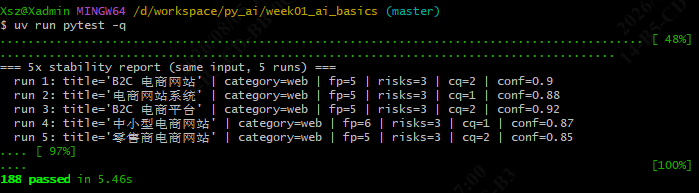
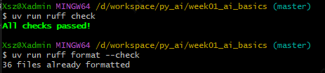

# Week 3 · Day 4 任务总结

> 适用项目：南宁软件组 AI Agent 12 周 Roadmap · Week 3 · Day 4
> 适用仓库：`D:\workspace\py_ai\week01_ai_basics\`
> 落档日期：2026-08-05

---

## 1. 主要任务

为 `DevAssistantAgent`（Week 3 单 Agent + Tool Calling）补齐 **Agent 层端到端测试**，验证「模型选工具 → 执行工具 → 汇总答案」的完整闭环，以及参数错误、工具失败时的异常兜底。共 **20 条用例**，落在 `tests/test_atool_calling.py`（原名 `test_agent_day14.py`，后改名）。

4 类场景分布：

| 类别 | 用例 | 数量 |
| --- | --- | --- |
| 正确选工具 | case_01 – case_06 | 6 |
| 无需工具 | case_07 – case_10 | 4 |
| 错误参数 | case_11 – case_15 | 5 |
| 工具失败 | case_16 – case_20 | 5 |

---

## 2. 交付物

- `tests/test_atool_calling.py`：20 条 pytest，4 个测试类（`TestCorrectToolSelection` / `TestNoToolNeeded` / `TestInvalidArguments` / `TestToolFailures`）。
- （可选）用例矩阵文档 `week03_testcases.md` 此前按"先不写"已删除；20 条清单见下表，代码里也一目了然。

### 用例清单

| 用例 | 验证点 |
| --- | --- |
| case_01 calculator_complex_expression | 复杂算术，模型正确选 `calculator` |
| case_02 read_text_file | 读训练文件，模型正确选 `read_text_file` |
| case_03 check_commit_message_valid | 合法 commit，模型正确选 `check_commit_message` |
| case_04 two_step_pipeline | 两步流水线，模型按顺序调多个工具 |
| case_05 calculator_power | 幂运算（连乘形式），模型正确选 `calculator` |
| case_06 check_commit_message_fix | 合规 commit 修复，返回 `valid: true` |
| case_07 greeting | 问候语，模型直接回答、不调工具 |
| case_08 concept_question | 概念问答，不调工具 |
| case_09 no_such_capability | 超出能力范围，不调工具 |
| case_10 tell_joke | 讲笑话，不调工具 |
| case_11 calculator_unsafe_node | 不安全 AST 节点，参数被拒（`unsafe_node`） |
| case_12 calculator_non_string | 传 `int` 而非 `str`，Pydantic 校验 `status="error"` |
| case_13 read_text_file_empty_path | 空路径，解析为根目录 → `is_dir` |
| case_14 read_text_file_forbidden_path | 越界路径 `../../etc/passwd` → `forbidden` |
| case_15 check_commit_message_empty | 空 commit → `valid: false` |
| case_16 read_text_file_not_found | 文件不存在，工具返回失败 |
| case_17 calculator_division_by_zero | 除零，工具返回失败 |
| case_18 check_commit_message_raises_exception | 工具抛 `ValueError` → `SafeToolMiddleware` 兜底 `TOOL_ERROR:` |
| case_19 tool_timeout_simulated | 工具抛 `TimeoutError` → 兜底 `TOOL_ERROR:` |
| case_20 tool_persistent_failure_stops_at_recursion_limit | 持续失败 + 持续调工具 → 超 `recursion_limit` 抛 `GraphRecursionError` |

---

## 3. 测试步骤与运行结果

**运行环境**：Git Bash（`uv` 已加入 PATH）。沙箱内需先 `export PATH="/c/Users/Xsz/.local/bin:$PATH"`；本机一般无需此步。

```bash
cd D:\workspace\py_ai\week01_ai_basics

# day4 单文件
uv run pytest tests/test_atool_calling.py -v

# 全量
uv run pytest -q
```

### 运行结果
- test_atool_calling测试


- 全量结果：`188 passed in 6.34s`（168 旧用例 + day4 新增 20）。


- ruff check/format
 
---

## 4. 遇到的问题与解法

### 4.1 calculator 不支持幂运算 `**`

`calculator` 的 AST 白名单只放行 `BinOp` 等节点，**不含 `ast.Pow`**。最初想用 `2**10` 测幂运算，模型调用会被拒。

**解法**：改用十个 `2` 相乘 `2*2*2*2*2*2*2*2*2*2`（case_05），断言 `"value": 1024`，等价验证幂运算效果。

### 4.2 `read_text_file("")` 走的是"目录"分支

空字符串相对路径经 `_safe_resolve` 解析为沙箱根目录本身，`is_file()` 为 `False` → 返回 `{"kind": "is_dir"}`，并非"文件不存在"。

**解法**：case_13 断言 `"ok": false` 且 `is_dir`，明确"空路径 = 根目录 = 目录"语义，避免误判成路径错误。

### 4.3 Pydantic 校验失败致使 ToolMessage 中 `status="error"`

`calculator(expression=123)`，传的是 `int` 型而非 `str`，于是 LangChain v1 在 `BaseTool.invoke` 阶段捕获 `ValidationError`，把 `ToolMessage.status` 置为 `"error"`，并在 content 写 `"Input should be a valid string"` + `"Please fix the error and try again."`（case_12）。

**注意**：这是工具自身的结构化错误，当工具输入不对时，把这个错误作为工具返回的结果还给大模型，重新传参数进行调整，从而形成循环。

### 4.4 工具抛异常时，SafeToolMiddleware 负责兜底（case_18–20）

`build_devassistant_agent` 里绑的是 `devagent.tools` 里的真实工具函数（比如 `check_commit_message`）。测试时没法让这些真实工具抛异常，而且 LangChain 对这类
**裸函数**也不会走异常兜底路径。

**解法**：case_18/19/20 不用 `build_devassistant_agent`，改用 `create_agent` 自己搭 Agent。在测试里用 `@tool` 临时造几个故意抛错的工具（`boom_check` 抛
`ValueError`，`boom_calc` 抛 `TimeoutError` / `RuntimeError`），再挂上 `SafeToolMiddleware`，验证中间件能把异常拦住，转成 `TOOL_ERROR:` 消息还给模型。
case_20 多一层验证：模型每次拿到 `TOOL_ERROR` 后还继续调工具，如此反复，直到超过 `recursion_limit=4`，LangGraph 强制抛出 `GraphRecursionError` 终止循环
（Agent Loop 终止条件 D）。

### 4.5 存量 ruff 规范问题

对全量代码跑 `uv run ruff check` 时报告 **6 个错误**（`uv run ruff format --check` 另有 1 个文件需重排）。

**根因**：
- `scripts/run_real_ollama.py`：脚本必须先执行 `sys.path.insert(0, str(_SRC_DIR))` 把 `src/` 加入搜索路径，之后才能用 `from config import ...`。因此顶部的 `from dotenv import load_dotenv` 等 5 处 import 必然出现在 `sys.path` 注入之后，属于**有意的 bootstrap 写法**，并非真正的顺序错误。
- `tests/conftest.py`：文件末尾缺少换行符（W292）。

**解法**：
- `pyproject.toml` 的 `[tool.ruff.lint.per-file-ignores]` 新增一行，对该启动脚本豁免 E402（与已有的 `tests/**`、`src/**` 段风格一致）：
  ```toml
  "scripts/run_real_ollama.py" = ["E402"]
  ```
- 用 `uv run ruff format tests/conftest.py` 自动补上文件末尾换行符。

---

## 5. 验证结论

- day4 单文件：**20 passed**（0.76s）。
- 全量：**188 passed**（6.34s）。
- ruff：全量 `uv run ruff check` 与 `uv run ruff format --check` 均通过（含 4.5 存量问题修复）。
- 改名安全：全仓库无任何文件 import/引用旧名 `test_agent_day14`；pytest 按 `test_*.py` 匹配文件，新名字也会被自动识别到，不影响测试运行。
