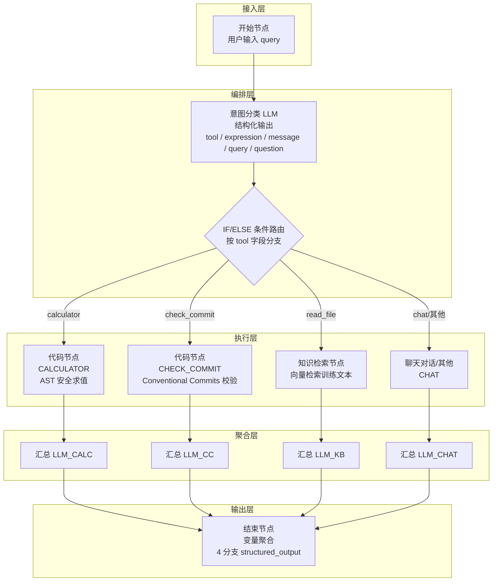

# Day 17 设计文档：用 Dify 复现 DevAssistantAgent（简化场景）

> 目标：把 Week 3 用 **代码（LangChain）** 写的 `DevAssistantAgent`（3 个工具）在 **Dify Workflow** 里用可视化工作流复现一遍，
> 导出 DSL，并记录 Dify 的能力边界。本次只做「简化场景」——单轮、单工具调用，不追求完全等价的多步推理。
>
> 实际环境：本地自托管 Dify（`http://localhost/v1`），工作流名称 `DevAssistantAgent_Dify`；操作命名以 Dify 官方 quick-start 与节点文档为准：
> `工作室` → `从空白创建` → `工作流`；起点称`开始（用户输入）节点`；调试称`运行测试` → `开始运行`；发布称`发布` → `发布更新`。

---

## 目录

1. 架构设计
2. 三个工具的真实逻辑
3. 工具 → Dify 节点映射
4. 工作流总体设计（对齐 Gate 2）
5. 标准操作流程（12 步）
6. 可直接粘贴的代码节点 Python
7. read_text_file 的 Dify 替代方案
8. 实测问题记录
9. 交付物（Day 17）
10. 附录：备选方案（Agent 应用模式）

---

## 1. 架构设计

本工作流采用 **「意图分类 + 条件路由 + 分支执行 + 结果聚合」** 的四层管线架构，将 Week 3 代码版的 Agent 多步推理循环，映射为 Dify 工作流画布上的**线性 DAG**。

### 1.1 架构分层



| 层 | 职责 | 节点 | 对应代码版概念 |
|----|------|------|----------------|
| **接入层** | 接收用户自然语言，不做任何加工 | 开始节点 | HTTP 请求入口 |
| **编排层** | 理解意图、路由分发 | 意图分类 LLM + IF/ELSE | Agent 的 tool selection 逻辑 |
| **执行层** | 确定性工具调用（算术 / 校验 / 检索） | 代码节点 ×2 + 知识检索节点 | `calculator()` / `check_commit_message()` / `read_text_file()` |
| **聚合层** | 把工具结果转成用户可读的自然语言 | 4 个分支专用的汇总 LLM | Agent 的 `_format_response()` |
| **输出层** | 统一出口，聚合所有分支的输出 | 结束节点（变量聚合模式） | HTTP 响应 body |

### 1.2 核心架构决策

| 决策 | 选择的方案 | 放弃的方案 | 理由 |
|------|-----------|-----------|------|
| 路由策略 | **IF/ELSE 条件路由**（LLM 先分类 → 固定路由） | Agent 自主选工具（LLM function calling 循环） | 简化场景下不需要多步推理；条件路由可预测、可调试，LLM 只负责一次分类 |
| 计算/校验工具 | **代码节点**（Python 确定性逻辑） | LLM 节点直接输出 | 算术和正则校验必须精确可复现，不能交给 LLM 模棱两可 |
| 分支汇总 | **每个分支独立 LLM 节点**（4 个） | 1 个共用 LLM 读取所有分支变量 | Dify IF/ELSE 分支变量作用域隔离——未执行分支的变量在下游 `Variable not found` |
| 文件读取 | **知识检索节点**（语义向量检索） | 代码节点内 `open()` | Dify 代码节点沙箱禁止文件系统访问；代码节点用于精确计算，知识库用于语义检索 |
| 输出聚合 | **变量聚合模式**（4 个 `structured_output` 合并） | 直接回复模式 | 4 个分支无法合并到 1 个 Answer 节点；变量聚合让 Day 18 FastAPI 统一包装，前端只需读一个 JSON |

### 1.3 数据流

```
用户 query
  │
  ├──► 意图分类 LLM ──► structured_output { tool, expression, message, query, question }
  │                          │
  │                    IF/ELSE 按 tool 分支
  │                    ┌───────┬────────┬────────┬───────┐
  │                    ▼       ▼        ▼        ▼       │
  │                 calc   check_c  read_f   chat/兜底    │
  │                    │       │        │        │       │
  │                    ▼       ▼        ▼        ▼       │
  │  结构化输出链路：                                           │
  │  ① 意图分类 structured_output                              │
  │  ② 代码节点/知识检索 原始输出                                │
  │  ③ 汇总 LLM structured_output（各分支独立）                  │
  │  ④ End 节点聚合 ──► { text_calc, text_cc, text_kb, text_chat }
  │                                                           │
  └───────────────────────────────────────────────────────────┘
```

**关键约束**：
- 结构化输出贯穿全链路——意图分类 LLM、代码节点、4 个汇总 LLM 都输出结构化 JSON，避免非结构化文本在节点间拼接出错。
- Boolean 类型在 Dify 变量选择器中不可见，因此 Calculator 用 `kind`(String) 替代 `ok`(Boolean)，CheckCommit 用 `valid`(String `"valid"`/`"invalid"`) 替代 Boolean。
- 自定义 Object 插值后变 `[object Object]`，因此 `parsed` 对象改为 `parsed_summary` 扁平字符串。

### 1.4 与代码版架构对比

| 维度 | 代码版（Week 3） | Dify 版（Week 4） |
|------|-----------------|-------------------|
| **架构模式** | Agent 循环：ReAct / Tool-calling loop，LLM 决定"下一步调哪个工具" | 线性 DAG：LLM 一次分类 → 固定路由 → 执行 → 汇总，无循环 |
| **工具注册** | LangChain `@tool` 装饰器 + Python 函数 | 画布拖拽节点：代码节点（Python 片段）、知识检索节点（平台内置） |
| **推理链路** | 多步：模型可多次调用工具，结果回灌上下文再推理 | 单步：一次路由到一个工具，工具结果直接进汇总 LLM |
| **编排控制** | 代码控制（AgentExecutor + 中间件） | 可视化画布（IF/ELSE 条件 + 连线） |
| **中间件** | `TraceMiddleware`（日志追踪）、`SafeToolMiddleware`（工具安全） | Dify 平台内置日志/监控面板；无自定义中间件能力 |
| **文件安全** | `is_relative_to(TRAIN_DIR)` 路径沙箱，Python 层可控 | 无法复现——代码节点无文件系统，改用知识检索降级 |
| **部署** | `uv run` 启动 FastAPI | 本地 Docker 自托管 Dify + 画布发布 |
| **可观测性** | 自定义 trace 日志 + pytest | Dify 内置运行追踪 + 变量缓存查看器 |

**差异本质**：代码版是一个**有状态 Agent**（可多轮、可多步、中间件可插拔）；Dify 版是一个**无状态管线**（单轮、单步、平台封装）。简化场景下两者功能等价，但 Agent 的多步推理能力和中间件可控性在 Dify 管线模式下被主动舍弃。

### 1.5 设计约束与取舍

| 约束来源 | 具体限制 | 本设计应对 |
|----------|----------|-----------|
| Dify 代码节点沙箱 | 禁止文件系统、网络、系统命令 | `read_text_file` 改为知识检索；`calculator` / `check_commit` 只依赖标准库，不受影响 |
| 变量选择器类型过滤 | Boolean、自定义 Object 不显示 | 全部改为 String 或 Array[String]，见第 5 节代码适配 |
| IF/ELSE 分支作用域隔离 | 未执行分支的变量不可见 | 拆成 4 个独立汇总 LLM，各引用本分支变量 |
| 知识检索非精确匹配 | 语义检索 ≠ 按路径精确读取文件 | 明确标注为局限性，写入 Day 18 对比报告 |
| 无 Agent 循环能力 | Dify Workflow 是 DAG，不支持循环回边 | 简化场景只做单步调用，多步推理不在本次范围 |

---

## 2. 三个工具的真实逻辑（来自 `src/devagent/tools/`）   <!-- 编号不变，标题不变 -->

| 工具 | 输入 | 输出信封 | 核心逻辑 |
|------|------|----------|----------|
| `calculator(expression)` | 算术表达式字符串（≤512 字符） | `{"ok":True,"value":...}` 或 `{"ok":False,"error":"...","kind":"..."}` | **不用 `eval`**：`ast` 解析 + 白名单节点（`+ - * / %` 与一元 `±`），拒绝函数调用/变量/下标；除零、`inf/nan` 拦截 |
| `read_text_file(path)` | 沙箱内相对路径 | `{"ok":True,"content":"...","bytes":N,"truncated":false}` 或错误信封 | 路径穿越防护（`is_relative_to(TRAIN_DIR)`）；只读、大小上限 50KB |
| `check_commit_message(message)` | 完整 commit message（可多行） | `{"ok":True,"valid":bool,"errors":[...],"parsed":{...}}` | Conventional Commits 校验：type 白名单、scope 必填、首行 ≤72、body 行 ≤100；**仅接受两种格式：`type(scope): subject` 或 `type: scope: subject`，不允许 `!` breaking 标记** |

三个工具的共同特征：**失败不抛异常，返回结构化错误信封**（`ok` 字段），让上层（模型/工作流）据此决策。

---

## 3. 工具 → Dify 节点映射

| 代码版工具 | Dify 复现方式 | 说明 |
|------------|---------------|------|
| `calculator` | **代码节点（Code，Python）** | 把 `calculator.py` 的 `main(expression)` 直接搬进 Dify 代码节点，逻辑 1:1 还原 |
| `check_commit_message` | **代码节点（Code，Python）** | 把 `check_commit_message.py` 的 `main(message)` 搬进代码节点，逻辑 1:1 还原 |
| `read_text_file` | **知识检索节点（Knowledge Retrieval）** | ⚠️ **Dify 代码节点运行在隔离沙箱，禁止文件系统访问**（官方文档明确：sandbox blocks file system access），无法复现路径沙箱。改用「上传训练文本到知识库 + 知识检索节点」替代，局限性见第 6 节 |

> 为什么前两个用**代码节点**而不是 LLM 节点？
> 因为这两个工具是**确定性计算**（算术 / 正则校验），必须精确、可复现，不能交给 LLM「估算」。代码节点 = Dify 里的确定性执行单元，正好对应代码版的纯函数工具。这正体现 Week 4 核心认知：**「核心能力仍需要代码/确定性逻辑，Dify 只负责编排」**。
> 官方文档也印证：代码节点预装 `ast/math/re` 等标准库，但禁止文件系统和网络访问——所以算术、正则这类纯计算可用代码节点精确复现，而「读本地文件」不行。

---

## 4. 工作流总体设计（对齐 Gate 2）

```
[开始(用户输入)] query(text)
   │
   ▼
[LLM] 意图分类（结构化输出 JSON: tool / expression / message / query / question）
   │
   ▼
[IF/ELSE] 条件分支：
   ├─ IF   tool 是 "calculator"  ─► [代码] CALCULATOR(expression)      ─► [LLM] 汇总回答_CALC   ─┐
   ├─ ELIF tool 是 "check_commit" ─► [代码] CHECK_COMMIT(message)      ─► [LLM] 汇总回答_CC    ─┤
   ├─ ELIF tool 是 "read_file"    ─► [知识检索] 知识检索(query)        ─► [LLM] 汇总回答_KB    ─┼─► [结束] output = 聚合 4 分支 structured_output
   └─ ELSE（其它）                ─────────────────────────────────────► [LLM] 汇总回答_CHAT   ─┘
```

> 为什么拆成 4 个「汇总回答」LLM？因为 Dify 的 IF/ELSE 分支变量作用域互相隔离：下游节点若同时引用多个分支的输出变量，未执行分支的变量会报 `Variable #xxx# not found`。每个分支末尾单独接一个汇总 LLM，只引用本分支变量，才能避开这个错误。

### 各节点输入输出（Gate 2 要求：能解释每个节点的输入输出）

| 节点 | 输入 | 输出 | 备注 |
|------|------|------|------|
| 开始（用户输入） | — | `query: string` | 用户自然语言请求，如「算一下 (12+8)*3」 |
| 意图分类 LLM | `query` | `tool`, `expression?`, `message?`, `query?`, `question?`（结构化 JSON） | 只输出 JSON，不输出解释；资料/文档类问题应判 `read_file` |
| IF/ELSE | `tool` | 路由到对应分支 | 单节点 IF/ELIF/ELSE 多分支 |
| Calculator 代码 | `expression: str` | `value: number`, `error: str`, `kind: str`, `summary: str` | 见第 5.1 节（输出均为可显示类型，无 Boolean） |
| CheckCommit 代码 | `message: str` | `valid: str`, `errors: list[str]`, `summary: str`, `parsed_summary: str` | 见第 5.2 节（valid/parsed 改 String，规避变量选择器过滤） |
| 知识检索 | `query: str` | `result: list<chunk>`（检索片段数组） | 见第 6 节配置 |
| 汇总回答_CALC | `query` + CALCULATOR 输出 | `answer/tool_used/status/result`（结构化 JSON） | 仅引用 calculator 分支变量 |
| 汇总回答_CC | `query` + CHECK_COMMIT 输出 | `answer/tool_used/status/errors/parsed_summary`（结构化 JSON） | 仅引用 check_commit 分支变量 |
| 汇总回答_KB | `query` + 知识检索 result | `answer/tool_used/sources`（结构化 JSON） | 仅引用 read_file 分支变量；result 放 Context |
| 汇总回答_CHAT | `query` + 意图分类 question | `answer/tool_used`（结构化 JSON） | 兜底闲聊分支 |
| 结束 | 4 个汇总 LLM 的 `structured_output` | `output`（聚合对象） | 变量聚合模式：`text_calc/text_cc/text_kb/text_chat` |

---

## 5. 标准操作流程（基于 Dify 官方 quick-start / 节点文档）

> 实际以本地自托管 Dify（`http://localhost/v1`）为准；若使用 Dify Cloud，只需把 base URL 换成 `https://api.dify.ai/v1`。每一步给出准确的菜单/按钮中文名。

### 步骤 1 — 创建应用
1. 进入 **工作室（Studio）**。
2. 点击 **从空白创建**。
3. 选择应用类型 **工作流（Workflow）**（本场景单轮、无会话记忆，不用 Chatflow）。
4. 名称填 `DevAssistantAgent_Dify`，图标可选，点击 **创建**。
5. 系统自动进入 **工作流画布**。

### 步骤 2 — 配置「开始（用户输入）」节点
1. 点击画布默认已有的 **开始（用户输入）** 节点，打开配置面板。
2. 点 **添加变量**：
   - 变量名 `query`，字段类型选 **段落（paragraph）/ 短文本**，标签名 `用户请求`，必填 **是**。
3. 其余变量不添加，关闭面板。

### 步骤 3 — 添加「意图分类」LLM 节点
1. 在 **开始** 节点后 **添加一个 LLM 节点**（连线自动接上）。
2. 重命名为 `意图分类`。
3. 模型选一个账号里可用的（如 GPT / 你配置的模型）。
4. **系统指令**粘贴：
   ```
   你是意图分类器。根据用户请求判断应调用哪个工具并抽取参数。只输出严格 JSON，不要任何解释或 Markdown 代码块。

   字段说明：
     tool: "calculator" | "check_commit" | "read_file" | "chat"
     expression: 算术表达式字符串（仅 calculator 时填）
     message: 完整 commit message（仅 check_commit 时填）
     query: 检索关键词/问题原文（仅 read_file 时填）
     question: 原始问题（仅 chat 时填）

   路由规则（严格按优先级）：
     1. 含算术表达式或"算/计算/求值"                    → calculator
     2. 含"提交信息/commit message/校验/检查提交"         → check_commit
     3. 用户想了解某份资料、文档、知识库、小说/项目计划等内容 → read_file
        （即使用户问的是常识，只要属于知识库覆盖主题也必须检索，严禁凭记忆直接回答）
     4. 仅闲聊、问候、开放式创作/意见且明确无需查资料     → chat

   规则：tool 必须小写无空格；calculator 时 expression 用标准算术（如 "(12+8)*3"）；
         read_file 时把用户原问题整体放入 query。
   示例输出：{"tool":"calculator","expression":"(12+8)*3","message":"","query":"","question":""}
   ```
5. 点 **添加消息** → 用户消息，用 `{` 或变量选择器插入 `开始/query`。
6. 开启 **结构化输出**：切到 **结构化** 开关 → 点 **配置** → **从 JSON 导入**，粘贴上述 JSON 结构，确认输出字段 `tool / expression / message / query / question` 都已声明。

### 步骤 4 — 添加 IF/ELSE 路由节点
1. 在 **意图分类** 后 **添加一个 IF/ELSE 节点**。
2. 配置分支（条件类型选 **是 / 等于** 这类精确匹配）：
   - **IF**：变量选 `意图分类/structured_output.tool`，运算符 **是**，值 `calculator` → 此分支接 Calculator 代码节点。
   - **+ ELIF**：变量 `意图分类/structured_output.tool`，**是**，`check_commit` → 接 CheckCommit 代码节点。
   - **+ ELIF**：变量 `意图分类/structured_output.tool`，**是**，`read_file` → 接知识检索节点。
   - **ELSE**：兜底（chat 场景），直接连到汇总 LLM。
3. 若你的版本不支持多 ELIF，用多个 IF/ELSE 串联，逻辑等价。

### 步骤 5 — calculator 分支：添加代码节点
1. 在 IF(calculator) 分支 **添加一个代码节点**。
2. 语言选 **Python**。
3. **输入变量**：点 **添加**，变量名 `expression`，类型 **文本（text）**，来源引用 `意图分类/structured_output.expression`（⚠️ 结构化输出字段须经 `structured_output` 对象访问，详见步骤 8 提示）。
4. 在代码框粘贴第 5.1 节的 Python（函数 `main(expression)`）。
5. **声明输出变量**（函数返回的 dict 字段，均为变量选择器可显示类型）：`value`(数字)、`error`(文本)、`kind`(文本)、`summary`(文本)。⚠️ 不声明旧代码里的 Boolean `ok` 字段——Dify 变量选择器不显示 Boolean 类型，详见步骤 8 末尾说明。
6. 连接该代码节点输出到 **汇总回答_CALC**。

### 步骤 6 — check_commit 分支：添加代码节点
1. 在 ELIF(check_commit) 分支 **添加一个代码节点**，语言 **Python**。
2. **输入变量**：`message`（文本），引用 `意图分类/structured_output.message`（同上，须经 `structured_output` 访问）。
3. 粘贴第 5.2 节的 Python（`main(message)`）。
4. **声明输出变量**：`valid`(文本，值 `"valid"`/`"invalid"`)、`errors`(数组[文本])、`summary`(文本)、`parsed_summary`(文本)。⚠️ 不声明旧代码的 Boolean `ok` / Boolean `valid` / Object `parsed`——Dify 变量选择器不显示 Boolean 与自定义 Object 类型，详见步骤 8 末尾说明。
5. 连接该代码节点输出到 **汇总回答_CC**。

### 步骤 7 — read_file 分支：知识检索节点（先建知识库）
**先建知识库**（仅首次需要）：
1. 左侧 **知识库** → **创建知识库**。
2. 上传训练文本（`.txt` / `.md`，可多文件）。⚠️ 说明：当前仓库**并未实际提供任何训练语料**（该目录不存在）。需要自备若干示例文档（如一段产品说明、技术笔记）上传；若只想验证工作流跑通，可先传任意一段示例 `.md`。
3. 索引模式选 **高质量（High Quality）**（需 Embedding 模型，Cloud 免费额度通常含）。
4. 等待嵌入完成，记下知识库名（如 `dev-training`）。

**再添加节点**：
1. 在 ELIF(read_file) 分支 **添加一个知识检索节点**。
2. **选择知识库**：添加刚建的 `dev-training`（可加多个，本例一个）。
3. **Query 文本**：选一个文本变量 → `开始/query`（或 `意图分类/structured_output.query`）。
4. （可选）**检索设置**：Top K 默认即可，Score 阈值可按需收紧。
5. 节点输出变量固定为 `result`（检索片段数组，含 `content/metadata/title`）。
6. 连接该节点输出到 **汇总回答_KB**。

### 步骤 8 — 4 个「汇总回答」LLM 节点

由于 Dify 分支变量作用域隔离，**不能**用 1 个汇总 LLM 同时引用 4 个分支的输出。需为每个分支建一个 LLM 节点，只引用本分支变量。

#### 8.1 汇总回答_CALC（calculator 分支）

1. 在 `CALCULATOR` 节点后添加 LLM 节点，重命名 `汇总回答_CALC`。
2. **系统指令**：
   ```
   你根据用户原始问题和计算工具返回的结构化结果，用简洁中文给出结论。
   只输出严格符合 schema 的 JSON，不要任何额外文字或 Markdown 代码块。
   ```
3. **添加消息** → 用户消息，插入 `用户输入/query`、`CALCULATOR/value`、`error`、`kind`、`summary`。
4. 开启**结构化输出**，schema 示例（字段名可自定义）：
   ```json
   {
     "answer": {"type": "string", "description": "给用户的自然语言结论"},
     "tool_used": {"type": "string", "description": "calculator"},
     "status": {"type": "string", "description": "ok/empty/too_long/syntax/unsafe_node/domain"},
     "result": {"type": "string", "description": "计算表达式和值，或错误说明"}
   }
   ```

#### 8.2 汇总回答_CC（check_commit 分支）

1. 在 `CHECK_COMMIT` 节点后添加 LLM 节点，重命名 `汇总回答_CC`。
2. **系统指令**：同上，要求输出严格 JSON。
3. **添加消息** → 用户消息，插入 `用户输入/query`、`CHECK_COMMIT/valid`、`errors`、`summary`、`parsed_summary`。
4. 结构化输出 schema：
   ```json
   {
     "answer": {"type": "string", "description": "给用户的自然语言结论"},
     "tool_used": {"type": "string", "description": "check_commit"},
     "status": {"type": "string", "description": "valid/invalid"},
     "errors": {"type": "array[string]", "description": "错误列表；通过时为空数组"},
     "parsed_summary": {"type": "string", "description": "parsed 信息扁平化字符串"}
   }
   ```

#### 8.3 汇总回答_KB（read_file / 知识检索分支）

1. 在 `知识检索` 节点后添加 LLM 节点，重命名 `汇总回答_KB`。
2. **上下文 Tab** → 点 **+ 添加上下文** → 选 **知识检索 / result**。
3. **系统指令**：
   ```
   请基于以下上下文回答：{{#上下文#}}
   用户问题：{{#用户输入.query#}}
   只输出严格符合 schema 的 JSON，不要任何额外文字。
   ```
4. **添加消息** → 用户消息，插入 `用户输入/query`。
5. 结构化输出 schema：
   ```json
   {
     "answer": {"type": "string", "description": "基于知识检索上下文的自然语言结论"},
     "tool_used": {"type": "string", "description": "knowledge_retrieval"},
     "sources": {"type": "array[string]", "description": "引用到的片段标题或路径列表；无引用时为空数组"}
   }
   ```

#### 8.4 汇总回答_CHAT（ELSE 兜底分支）

1. 在 IF/ELSE 的 ELSE 出口后添加 LLM 节点，重命名 `汇总回答_CHAT`。
2. **系统指令**：同上。
3. **添加消息** → 用户消息，插入 `用户输入/query`、`意图分类/structured_output.question`。
4. 结构化输出 schema：
   ```json
   {
     "answer": {"type": "string", "description": "对用户问题的自然语言回答"},
     "tool_used": {"type": "string", "description": "chat"}
   }
   ```

> **关键提示**：意图分类 LLM 开启「结构化输出」后，所有声明字段（tool/expression/message/query/question）会**聚合到一个 `structured_output` 对象**里，而不是作为独立顶级变量暴露。所以**步骤 4/5/6/8.4 中凡引用意图分类字段，都必须写成 `意图分类/structured_output.xxx`**，不要写成 `意图分类/tool`（或 `expression` / `message`）。变量选择器里**看不到独立的 `question`**，要点进 `structured_output` 展开后再选 `question`。节点名按你画布实际命名为准：本节示例用的是 `意图分类` / `CALCULATOR` / `CHECK_COMMIT` / `用户输入`（开始节点 Dify 默认常显示为「用户输入」）；如果你改名了，对应路径里的节点名也要跟着改。

> **① 知识检索输出不需要过「文档提取器」。** 文档提取器（Document Extractor）是 Dify 里真实存在但用途不同的节点，用于**从用户上传的文件（PDF/DOCX）里提取纯文本**，定位是 `文件上传 → Document Extractor → LLM`，**不**在 `Knowledge Retrieval → LLM` 链路上。知识检索节点自身已返回格式化好的 `result` 数组（每元素含 `content/title/url` 等字段），无需任何中间处理节点，直接放进 LLM 节点的 Context 字段即可。

> **② 变量选择器过滤规则（本设计已据此规避，对照下表）**

| 规则 | Dify 现象 | 本设计规避方式 |
|------|-----------|----------------|
| Boolean 不显示 | Boolean 变量不出现在 USER 消息变量选择器（即便已声明并运行过） | CALCULATOR 用 `kind`(String) 替代 `ok`(Boolean)；CHECK_COMMIT 用 `valid`(String `"valid"`/`"invalid"`) 替代 Boolean `valid` |
| 自定义 Object 不显示 | Object 变量插入后变 `[object Object]` | CHECK_COMMIT 把 `parsed`(Object) 改为 `parsed_summary`(String) 拼接所有字段 |
| 知识检索 result 需先运行 | 未跑过 read_file 分支则 `result` 不在选择器 | 先跑一次 read_file 用例注册变量；引用时放 LLM 的 Context 字段 |

> 补充：① **LLM 节点**标准输出固定为 `text / reasoning_content / structured_output` 三个外层变量，意图分类作为 LLM 节点也只有这三个（字段聚合在 `structured_output` Object 内）。② **知识检索**输出固定为 `result`（`Array[Object]`，含 `content/title/url/icon/metadata/files`）。
>
> **③ 实操要点**：后续若在 Code 节点新增 Boolean/Object 输出并要传给下游 LLM，请按上表改用 String / 拼字符串；或在 LLM 的 SYSTEM 提示词里写「如上游无 X 字段则视为 Y」做兜底。

### 步骤 9 — 结束节点（变量聚合模式）

1. 添加 **结束（End）节点**（若画布已有默认结束节点则复用），模式选 **变量聚合（Variable Aggregator）**。
2. 添加 4 个变量，分别引用 4 个汇总 LLM 的 `structured_output`：
   - `text_calc` = `汇总回答_CALC/structured_output`
   - `text_cc`   = `汇总回答_CC/structured_output`
   - `text_kb`   = `汇总回答_KB/structured_output`
   - `text_chat` = `汇总回答_CHAT/structured_output`
3. 运行时只有 1 个分支会实际产生值，其余 3 个为 `null`。
4. ⚠️ 如果你希望 END 节点直接以文本形式输出，也可以用 **直接回复（Answer）** 模式，但只能接 1 个 LLM 的输出；4 分支场景下变量聚合更便于 Day 18 的 FastAPI 统一包装。

### 步骤 10 — 运行测试（调试）
1. 点画布右上角 **运行测试**。
2. 在弹窗填入 `query`，点 **开始运行**。
3. 分别用以下用例验证：
   | query | 期望路由 | 期望结果 |
   |-------|----------|----------|
   | `算一下 29*(6.2+81-0.2)/2` | calculator | result=1261.5 |
   | `校验 func(app): Add login page` | check_commit | status="valid"（括号式） |
   | `校验 func: app: Add login page` | check_commit | status="valid"（冒号式） |
   | `校验 fix: typo` | check_commit | status="invalid"（无 scope，必填） |
   | `小说《围城》的主角名字叫什么？` | read_file | 走知识检索分支，基于 KB 内容回答 |
   | `你好` | chat | 兜底闲聊回复 |
4. 2026-08-12 实测记录（本地 Dify `http://localhost/v1`）：
   - **calculator**：命中，输出 `{"result": "计算表达式 ...", "answer": "1261.5", "status": "计算状态：成功", "tool_used": "calculator"}`。
   - **check_commit**：命中，但本地版 END 节点 `text_cc` 仅返回 `CHECK_COMMIT` 代码节点的原始 `parsed` 字段（`type/scope/subject/breaking/has_body`），缺少 `status/valid`。**修正方法**：把 END 节点里 `text_cc` 的引用源从 `CHECK_COMMIT/parsed` 改为 `汇总回答_CC/structured_output`。
   - **read_file**：最初被分到 chat 分支（LLM 凭常识回答）。**修正方法**：按步骤 3 的强化版系统指令，把资料/文档类问题强制路由到 `read_file`，禁止凭记忆作答。
4. 出错时看对应节点的 **最后运行** 日志；可用画布底部 **查看缓存变量** 改输入复测。

### 步骤 11 — 发布
1. 点右上角 **发布** → **发布更新**。
2. 之后改动需再次发布才会生效。

### 步骤 12 — 获取 API Key 与导出 DSL（为 Day 18 准备）
1. **API Key**：在应用内点 **访问 API**（或右上角设置 → API 访问）→ **创建密钥**，复制形如 `app-xxxx` 的**工作流级**密钥（作用域仅此应用）。
2. **导出 DSL**：在应用编辑界面，通过应用名旁的下拉菜单或右上角 **··· 更多操作** 找到 **导出 DSL**，选择 **YAML** 格式下载。
   - 本地部署默认下载路径示例：`C:/Users/Xsz/Downloads/文件/DevAssistantAgent_Dify .yml`
   - 手动复制到仓库：`dify_workflows/DevAssistantAgent_Dify.yml`（Day 17 交付物）。
   - 注：quick-start 教程未演示 DSL 导出，此步骤以 Dify 实际界面为准（部分版本入口在「设置 → 导出」）。

---

## 6. 可直接粘贴的代码节点 Python

### 6.1 Calculator 节点（`main(expression: str) -> dict`）

新建 **代码节点** → 语言 **Python** → 输入变量 `expression`（类型 文本）→ 粘贴：

> **输出变量声明**（在代码节点「输出变量 → 添加」按以下 4 条配置，**不要声明 Boolean/Object 字段**——Dify 变量选择器不显示这两种类型，见步骤 8 末尾说明）：
> - `value`（Number）
> - `error`（String）
> - `kind`（String）
> - `summary`（String）— 拼好的自然语言总结，LLM 直接消费

```python
import ast
import math
import operator

_MAX_LEN = 512
_ALLOWED_OPS = {
    ast.Add: operator.add, ast.Sub: operator.sub, ast.Mult: operator.mul,
    ast.Div: operator.truediv, ast.Mod: operator.mod,
    ast.USub: operator.neg, ast.UAdd: operator.pos,
}
_ALLOWED_NODES = (
    ast.Expression, ast.BinOp, ast.UnaryOp, ast.Constant,
    ast.Add, ast.Sub, ast.Mult, ast.Div, ast.Mod, ast.USub, ast.UAdd,
)

def _result(value, error, kind, summary):
    return {"value": value, "error": error, "kind": kind, "summary": summary}

def _eval_node(node):
    if isinstance(node, ast.Expression):
        return _eval_node(node.body)
    if isinstance(node, ast.BinOp):
        left = _eval_node(node.left); right = _eval_node(node.right)
        op = _ALLOWED_OPS.get(type(node.op))
        if op is None:
            raise ValueError(f"unsupported operator: {type(node.op).__name__}")
        return op(left, right)
    if isinstance(node, ast.UnaryOp):
        operand = _eval_node(node.operand)
        op = _ALLOWED_OPS.get(type(node.op))
        if op is None:
            raise ValueError(f"unsupported unary op: {type(node.op).__name__}")
        return op(operand)
    if isinstance(node, ast.Constant):
        if isinstance(node.value, bool):
            raise ValueError("booleans are not allowed")
        if not isinstance(node.value, (int, float)):
            raise ValueError(f"non-numeric literal: {type(node.value).__name__}")
        return node.value
    raise ValueError(f"disallowed node: {type(node).__name__}")

def main(expression: str) -> dict:
    if not isinstance(expression, str) or not expression.strip():
        return _result(None, "expression is empty", "empty",
                        "✗ 计算失败：expression is empty（kind=empty）")
    if len(expression) > _MAX_LEN:
        return _result(None, f"expression exceeds {_MAX_LEN} chars", "too_long",
                        f"✗ 计算失败：expression exceeds {_MAX_LEN} chars（kind=too_long）")
    try:
        tree = ast.parse(expression, mode="eval")
    except SyntaxError as exc:
        return _result(None, f"invalid syntax: {exc.msg}", "syntax",
                        f"✗ 计算失败：invalid syntax: {exc.msg}（kind=syntax）")
    for node in ast.walk(tree):
        if not isinstance(node, _ALLOWED_NODES):
            return _result(None, f"unsupported syntax: {type(node).__name__}", "unsafe_node",
                            f"✗ 计算失败：unsupported syntax: {type(node).__name__}（kind=unsafe_node）")
    try:
        value = _eval_node(tree)
    except ZeroDivisionError:
        return _result(None, "division by zero", "domain",
                        "✗ 计算失败：division by zero（kind=domain）")
    except OverflowError:
        return _result(None, "numeric overflow", "domain",
                        "✗ 计算失败：numeric overflow（kind=domain）")
    except ValueError as exc:
        return _result(None, str(exc), "unsafe_node",
                        f"✗ 计算失败：{exc}（kind=unsafe_node）")
    if isinstance(value, float) and not math.isfinite(value):
        return _result(None, "result is not finite (inf/nan)", "domain",
                        "✗ 计算失败：result is not finite (inf/nan)（kind=domain）")
    return _result(value, "", "ok", f"✓ 计算成功：{expression} = {value}")
```

> 与代码版差异：① 不再返回 Boolean `ok` 字段（变量选择器不显示 Boolean），改为统一 `kind` 字符串字段（`"ok"` / `"empty"` / `"too_long"` / `"syntax"` / `"unsafe_node"` / `"domain"`）表达成败；② 新增 `summary` 字段把结果拼成自然语言，避免 LLM 拿到零散字段后拼装。计算逻辑、AST 白名单、错误分类与代码版完全一致。
> 注意：Dify 代码节点输出限制——字符串 ≤ 400,000 字符、数字整数 ≤ 19 位、对象数组嵌套 ≤ 5 层，本工具远在限制内。

### 5.2 CheckCommit 节点（`main(message: str) -> dict`）

新建 **代码节点** → 输入变量 `message`（类型 文本）→ 粘贴：

> **输出变量声明**：
> - `valid`（**String**，值 `"valid"` 或 `"invalid"`，不要用 Boolean）
> - `errors`（Array[String]）
> - `summary`（String）— 拼好的自然语言结论
> - `parsed_summary`（String）— 把 parsed 对象扁平化为字符串

```python
import re

ALLOWED_TYPES = frozenset({
    "func","feat","fix","docs","style","conf","perm","version","patch",
    "other","refactor","perf","test","chore","build","ci","revert",
})
SUBJECT_MAX = 72
BODY_LINE_MAX = 100
_HEADER_RE = re.compile(
    r"^(?P<type>[A-Za-z]+)"
    r"(?:\((?P<pscope>[A-Za-z0-9_-]+)\)"
    r"|(?::\s*(?P<cscope>[A-Za-z0-9_-]+)))"
    r":\s(?P<subject>.+)$"
)

def _parse_header(line):
    m = _HEADER_RE.match(line)
    if not m:
        return {"type": None, "scope": None, "subject": None, "breaking": False}
    scope = m.group("pscope") or m.group("cscope")
    return {
        "type": m.group("type").lower(),
        "scope": scope,
        "subject": m.group("subject").strip(),
        "breaking": False,
    }

def main(message: str) -> dict:
    errors = []
    if not isinstance(message, str):
        return {
            "valid": "invalid",
            "errors": ["message must be a string"],
            "summary": "✗ 校验失败：message must be a string",
            "parsed_summary": "type=None, scope=None, subject=None, breaking=False, has_body=False",
        }
    if "\n" in message:
        header, _, rest = message.partition("\n")
    else:
        header, rest = message, ""
    header = header.rstrip("\r")
    rest = rest.replace("\r\n", "\n")
    parsed = _parse_header(header)
    has_body = bool(rest.strip())
    if parsed["type"] is None:
        errors.append("header does not match `<type>(<scope>): subject` or `<type>: <scope>: subject` (scope required)")
    else:
        if parsed["type"] not in ALLOWED_TYPES:
            errors.append(f"type '{parsed['type']}' not allowed")
    if parsed["subject"] is not None and not parsed["subject"].strip():
        errors.append("subject is empty")
    if len(header) > SUBJECT_MAX:
        errors.append(f"header line is {len(header)} chars, max {SUBJECT_MAX}")
    if has_body:
        for i, ln in enumerate(rest.splitlines(), start=2):
            if len(ln) > BODY_LINE_MAX:
                errors.append(f"body line {i} is {len(ln)} chars, max {BODY_LINE_MAX}")
    parsed_summary = (
        f"type={parsed['type']}, scope={parsed['scope']}, "
        f"subject={parsed['subject']}, breaking={parsed['breaking']}, has_body={has_body}"
    )
    if errors:
        summary = "✗ 校验失败：" + "；".join(errors)
    else:
        summary = f"✓ 校验通过：{header.strip()}"
    return {
        "valid": "valid" if not errors else "invalid",
        "errors": errors,
        "summary": summary,
        "parsed_summary": parsed_summary,
    }
```

> 与代码版差异：① `valid` 改为 String（`"valid"` / `"invalid"`），不用 Boolean；② `parsed`（Object）改为 `parsed_summary`（String），用 `, ` 拼接所有字段；③ 新增 `summary` 拼成自然语言。校验逻辑、错误分类、Conventional Commits 白名单与代码版完全一致。

---

## 6. read_text_file 的 Dify 替代方案（重要局限）

**问题**：代码版 `read_text_file` 依赖本地文件系统 + `TRAIN_DIR` 沙箱。Dify **代码节点运行在隔离沙箱，官方明确禁止文件系统访问、出站网络与系统命令**，因此路径穿越防护这套逻辑在 Dify 里**无法复现**（即便写 Python 去 `open()` 也会被沙箱拦截）。

**替代（推荐）**：用 Dify **知识库（Knowledge）** 承载训练文本——
1. 左侧 **知识库** → **创建知识库** → 上传训练文本（`.txt` / `.md`）。⚠️ `training_data/` 是代码里 `TRAIN_DIR` 的默认路径，但仓库中目前**没有这个目录、也没有现成语料**，请自备示例文档上传；这不影响工作流演示，只是知识库检索分支的内容由你提供的文档决定。
2. 在工作流里加 **知识检索节点**，选择该数据集，Query 文本选 `开始/query`；
3. 节点输出 `result`（相关片段数组），交给 **汇总回答_KB** LLM 引用（放 Context 字段）。

**局限（务必写进对比报告/局限文档）**：
- 失去「精确按路径读取某个文件」的能力，变成「语义检索相关片段」；
- 失去路径穿越防护的演示（这是 Dify 可视化编排替代不了代码安全的典型例子）；
- 文件大小、编码兜底等细节由 Dify 知识库接管，不再是你自己控制的代码。

> 这正是 Week 4 核心认知的落点：**Dify 可视化编排能快速搭出「能检索、能算、能校验」的应用外壳，但文件安全沙箱这类核心能力，仍需代码实现。**

---

## 7. 实测问题记录

| 问题 | 现象 | 根因 | 修正 |
|------|------|------|------|
| 知识检索分支没触发 | 问《围城》主角，追踪流程中显示的路径是进入的 chat 路径，答「根据常识作答」 | 意图分类器把常识性问题判为 chat | 步骤 3 系统指令强制：资料/文档/知识库类问题必须判 `read_file`，禁止凭记忆答 |
| check_commit 输出缺 verdict | 本地 `text_cc` 只有 `type/scope/subject/breaking/has_body` | END 变量聚合引用的是 `CHECK_COMMIT/parsed`，不是 `汇总回答_CC/structured_output` | 把 `text_cc` 引用源改为 `汇总回答_CC/structured_output`，即可拿到 `status/errors/answer` |
| 分支变量找不到 | 早期单汇总 LLM 报 `Variable #summary# not found` | Dify IF/ELSE 未执行分支的输出变量不可见 | 拆成 4 个汇总 LLM，每个只引用本分支变量 |

## 8. 交付物（Day 17）

- 本设计文档 `docs/day17_dify_repro_design.md`
- 本地 Dify 中已发布的工作流 `DevAssistantAgent_Dify`（`http://localhost/v1`）
- 导出的 DSL：`dify_workflows/DevAssistantAgent_Dify.yml`

## 9. 附录：备选方案（用 Agent 应用模式，更快但略偏离交付物）

若想更贴近「Agent 自主选工具」的语义，可改用 Dify 的 **Agent 应用** 模式：
- 创建 Agent 应用 → 添加 3 个 **代码工具**（calculator / check_commit_message 同上；read_text_file 仍只能用知识库工具替代）；
- 系统提示词直接用代码版的 `SYSTEM_PROMPT`（见 `dev_assistant_agent.py`）；
- 优点：Agent 自己决定调哪个工具，最像原版；缺点：**导出的不是 Workflow DSL**，与 Day 17「可视化工作流 + DSL 导出」交付物略有出入，且 Gate 2 对「节点输入输出」的解释力弱一些。

