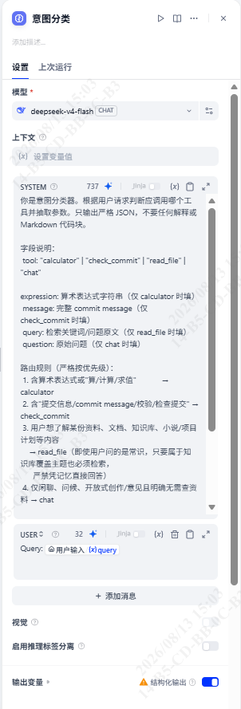
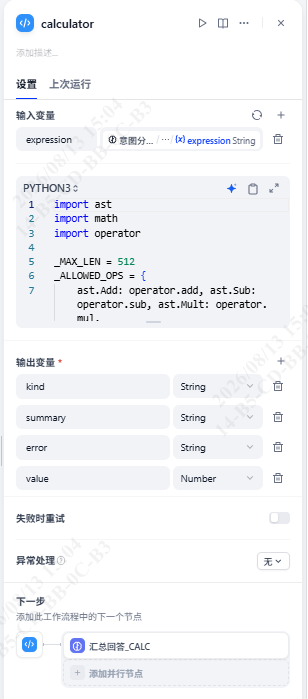
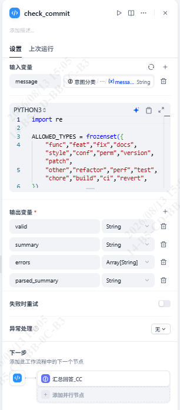
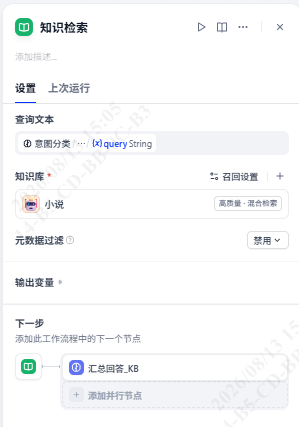
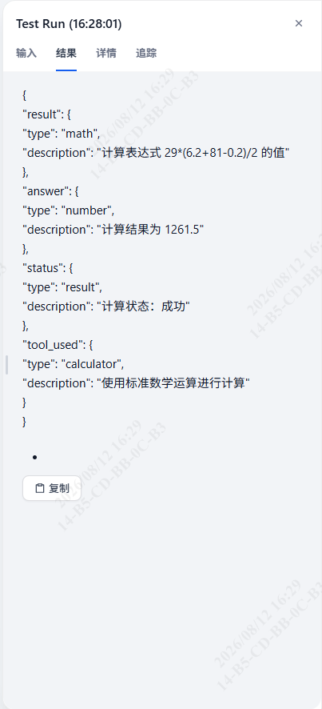
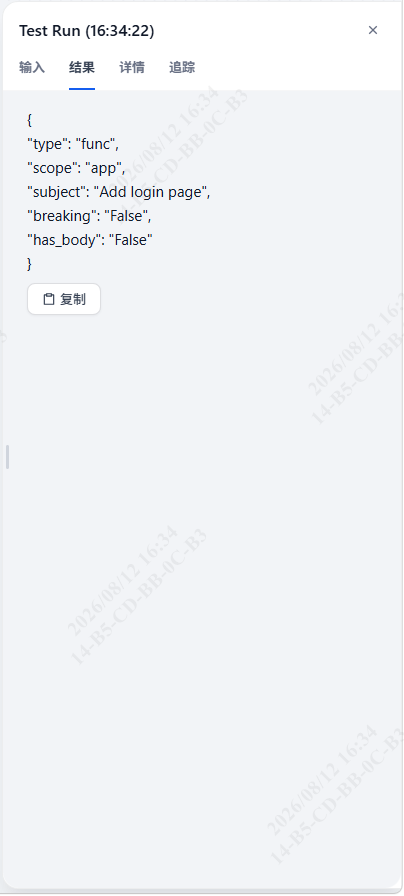
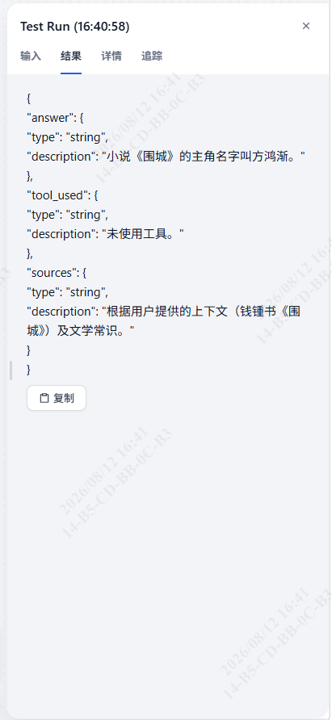
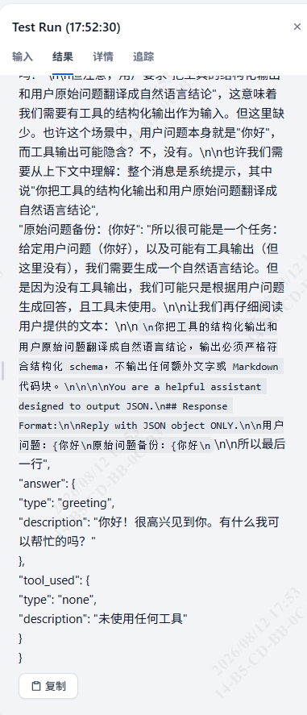

# Week 4 · Day 17 任务总结

> 适用项目：南宁软件组 AI Agent 12 周 Roadmap · Week 4（Dify Workflow）· Day 17
> 适用仓库：`D:\workspace\py_ai\week01_ai_basics\`
> 落档日期：2026-08-12
> 关联文档：`docs/day17_dify_repro_design.md`、`dify_workflows/DevAssistantAgent_Dify.yml`

---

## 1. 任务目标

在 **Dify Workflow** 中以可视化工作流复现 Week 3 用代码（LangChain）实现的 `DevAssistantAgent` 简化场景，覆盖 `calculator` / `check_commit_message` / `read_text_file` 三个工具；导出 DSL 并系统记录 Dify 的能力边界与问题。本日仅做「单轮、单工具调用」的简化场景，不追求与代码版完全等价的多步推理。

通过标准：

- 在本地自托管 Dify（`http://localhost/v1`）中搭建并发布工作流 `DevAssistantAgent_Dify`；
- 四个分支（calculator / check_commit / read_file / chat）均能按意图正确路由并产出结构化结果；
- 导出 DSL 归档至仓库，供 Day 18 通过 API 调用。

---

## 2. 当日完成的主要工作内容

1. **编写并定稿设计文档** `docs/day17_dify_repro_design.md`（9 节），依据本地 Dify 当日最终执行结果反向修订，确保文档与真实工作流一致。
2. **在本地 Dify 搭建并发布工作流** `DevAssistantAgent_Dify`，节点链路为：
   - `开始（用户输入）`：接收 `query`；
   - `意图分类` LLM：开启结构化输出，输出 `tool / expression / message / query / question`；
   - `IF/ELSE` 四分支路由（calculator / check_commit / read_file / chat 兜底）；
   - `CALCULATOR` 代码节点（Python）：1:1 移植 `calculator.py` 的 AST 安全算术逻辑；
   - `CHECK_COMMIT` 代码节点（Python）：1:1 移植 `check_commit_message.py`，并同步收紧规则；
   - `知识检索` 节点：替代 `read_text_file`（Dify 沙箱禁止文件系统访问）；
   - 4 个独立 `汇总回答_*` LLM 节点（CALC / CC / KB / CHAT）；
   - `结束` 节点：变量聚合模式，输出 `text_calc / text_cc / text_kb / text_chat`。

> 工作流总览与核心节点截图（原图见 `docs/poho/week4/`）：

- 意图分类 LLM 节点（开启结构化输出）：
- CALCULATOR 代码节点（1:1 移植 `calculator.py`）：
- CHECK_COMMIT 代码节点（1:1 移植 `check_commit_message.py`）：
- 知识检索节点（替代 `read_text_file`）：

3. **导出 DSL** 并归档至 `dify_workflows/DevAssistantAgent_Dify.yml`（33838 字节）。
4. **本地运行验证四分支**，针对发现的路由与输出缺陷进行修正（详见第 6 节）。
5. **同步收紧 Week 3 源码规则**：将 `src/devagent/tools/check_commit_message.py` 改为仅接受 `type(scope): subject` 与 `type: scope: subject` 两种格式、scope 必填、**去掉 `!` breaking 标记**，并同步更新 `tests/test_devagent_tools.py` 断言（`func(app)!:`、`feat!:`、`fix: typo` 等现判 INVALID）。

---

## 3. 关键进展

- **确认 Dify 代码节点可精确复现确定性逻辑**：`calculator` 与 `check_commit_message` 这两个纯函数工具通过代码节点 1:1 还原，计算/校验结果与代码版完全一致（如 `29*(6.2+81-0.2)/2 = 1261.5`）。印证本周核心认知——**「核心能力仍须代码/确定性逻辑实现，Dify 只负责编排与汇总」**。
- **攻克 Dify 分支变量作用域隔离**：早期用单个汇总 LLM 同时引用四分支变量会报 `Variable #xxx# not found`；改为每个分支末尾各挂一个汇总 LLM、仅引用本分支变量，END 节点再做变量聚合，问题根除。
- **摸清结构化输出与变量选择器的若干特性**：结构化输出字段须经 `structured_output` 对象访问（`意图分类/structured_output.xxx`）；Boolean 与自定义 Object 类型不在变量选择器显示，已用 String 类型规避（`kind` 替 `ok`、`valid` 用 `"valid"/"invalid"` 字符串、`parsed_summary` 替 `parsed` 对象）。
- **意图分类强化见效**：资料/文档/知识库类问题（如「《围城》的主角」）由误入 chat 改为强制路由 `read_file`，禁止 LLM 凭记忆作答。
- **DSL 已归档**，Day 18 的 FastAPI 包装可直接基于 `DevAssistantAgent_Dify` 工作流调用。

---

## 4. 交付物清单

| 交付物 | 说明 | 状态 |
| --- | --- | --- |
| `docs/day17_dify_repro_design.md` | Day 17 设计文档（含工具→节点映射、12 步 SOP、代码节点 Python、实测问题表） | ✅ |
| `dify_workflows/DevAssistantAgent_Dify.yml` | 导出的工作流 DSL（YAML，33838 字节） | ✅ |
| 本地已发布工作流 `DevAssistantAgent_Dify` | 运行于 `http://localhost/v1` | ✅ |
| `src/devagent/tools/check_commit_message.py` | 去 `!` breaking、仅两种格式、scope 必填 | ✅ |
| `tests/test_devagent_tools.py` | 同步更新 check_commit 断言 | ✅ |

> 设计文档内附 **工具→Dify 节点映射表** 与 **各节点输入输出表**，满足对「每个节点输入输出可解释」的要求；代码节点 Python 可直接复制粘贴。

---

## 5. 运行验证（本地 Dify 四分支实测）

| query | 期望路由 | 本地实测结果 |
| --- | --- | --- |
| `算一下 29*(6.2+81-0.2)/2` | calculator | 命中，`result=1261.5` |
| `校验 func(app): Add login page` | check_commit | 命中，括号式合法（`status=valid`） |
| `校验 func: app: Add login page` | check_commit | 命中，冒号式合法（`status=valid`） |
| `校验 fix: typo` | check_commit | 命中，无 scope → `status=invalid` |
| `小说《围城》的主角名字叫什么？` | read_file | 修正后走知识检索分支（初版误入 chat，见第 6 节） |
| `你好` | chat | 兜底闲聊回复 |

> 远程 Dify（Cloud）因额度耗尽未参与验证，本日全部以本地自托管实例为准。

> 四分支运行截图（本地 Dify，原图见 `docs/poho/week4/`）：

- calculator 分支：
- check_commit 分支：
- read_file 分支（知识检索）：
- chat 分支：

---

## 6. 遇到的问题及解决方案

### 6.1 知识检索分支未触发

**现象**：问「《围城》的主角名字叫什么？」，意图分类把常识性问题判为 `chat`，LLM 凭记忆作答，未走知识检索。

**根因**：意图分类系统指令未强制资料/文档类问题必须检索。

**解法**：强化步骤 3 的系统指令——资料、文档、知识库、小说/项目计划等内容一律判 `read_file`，**严禁凭记忆直接回答**；即使属常识，只要落在知识库主题内也必须检索。修正后该问题正确进入 `read_file` 分支。

### 6.2 check_commit 输出缺 verdict 字段

**现象**：本地 `text_cc` 仅返回 `CHECK_COMMIT` 代码节点的原始 `parsed`（`type/scope/subject/breaking/has_body`），缺少 `status/errors/answer`。

**根因**：END 节点 `text_cc` 的引用源写成了 `CHECK_COMMIT/parsed`，而非汇总 LLM 的结构化输出。

**解法**：将 `text_cc` 引用源改为 `汇总回答_CC/structured_output`，即可拿到 `status/errors/answer` 等结论字段。

### 6.3 分支变量找不到（`Variable #xxx# not found`）

**现象**：早期用单个汇总 LLM 同时引用四分支输出，报 `Variable #summary# not found`。

**根因**：Dify IF/ELSE 各分支输出变量作用域互相隔离，下游引用未执行分支的变量即报错。

**解法**：拆成 4 个独立汇总 LLM，每个仅引用本分支变量；END 节点用变量聚合模式收口 `text_calc/text_cc/text_kb/text_chat`（未执行分支为 `null`）。

### 6.4 变量选择器不显示 Boolean / Object 类型

**现象**：代码节点声明的 Boolean `ok`、Boolean `valid`、Object `parsed` 无法在下游 LLM 变量选择器中引用（Boolean 不显示，Object 插入后变 `[object Object]`）。

**解法**：calculator 用 `kind`（String，`"ok"/"empty"/...`）替代 Boolean `ok`；check_commit 用 `valid`（String `"valid"/"invalid"`）替代 Boolean `valid`、用 `parsed_summary`（String 拼接）替代 Object `parsed`。

### 6.5 结构化输出字段访问路径

**现象**：直接引用 `意图分类/tool` 取不到值。

**根因**：LLM 开启结构化输出后，字段聚合进 `structured_output` 对象，不再暴露为顶级变量。

**解法**：凡引用意图分类字段一律写成 `意图分类/structured_output.xxx`（如 `structured_output.expression`）。

### 6.6 read_text_file 无法在 Dify 复现

**现象**：代码版依赖本地文件系统与 `TRAIN_DIR` 沙箱，Dify 代码节点运行于隔离沙箱，官方明确禁止文件系统访问、出站网络与系统命令，`open()` 会被拦截。

**解法**：改用 **知识检索节点 + 知识库** 替代（上传训练文本后语义检索）。已在文档第 6 节记录局限：失去「按路径精确读文件」「路径穿越防护演示」两项能力——这是 Dify 可视化编排替代不了代码安全的典型例证。

### 6.7 check_commit 规则收紧（Week 3 源码联动）

**现象**：用户要求 commit 校验仅接受两种格式、scope 必填、不允许 `!` breaking 标记。

**解法**：修改 `src/devagent/tools/check_commit_message.py`，移除 breaking 标记支持；`_parse_header` 的 `breaking` 固定 `False`；同步更新 `tests/test_devagent_tools.py` 断言，保证源码与测试行为一致。

---

## 7. 遗留事项

- **远程 Dify 未维护**：Cloud 额度耗尽，本日仅本地验证；远程工作流与本地若存在差异需另验。
- **知识库实际语料缺失**：仓库 `training_data/` 目录不存在、无现成语料，read_file 分支的检索内容由使用者自备文档决定，仅验证工作流跑通。
- **FastAPI 包装 Dify API 的本地联调待执行**：代码逻辑已就绪（`POST /dify/run` 为通用透传接口），本地 FastAPI + 真实 Dify 的联合跑通见 `day19_dify_api_wrapper_design.md`（当前以工作流 DevAssistantAgent_Dify 四分支为例）。

---

## 8. 次日（Day 18）计划安排

Day 19 对应 Roadmap 第 4 周阶段任务第 3 条——**通过 Dify API 调用已发布工作流，并由 FastAPI 包装成统一接口**（通用接口，当前以工作流 DevAssistantAgent_Dify 为例）：

1. 新增异步客户端 `src/dify_client.py`（`DifyWorkflowClient.run(query)` 返回精简结果 dataclass）；
2. 在 `src/api_models.py` 新增 `DifyRunRequest` / `DifyRunResponse`，在 `src/app.py` 新增 `POST /dify/run` 端点；
3. 错误映射：连接失败→503、非 2xx→502、超时→504、未配密钥→503；
4. 编写单元测试用例（`tests/test_dify_client.py`、`tests/test_app_dify.py`）；
5. 编写 `docs/day18_task_summary.md` 任务总结文档；
6. 配置 `.env`（`DIFY_API_KEY` / `DIFY_BASE_URL=http://localhost/v1`）并本地联调四分支。

---

## 9. 概念及节点位置对照表

| 概念 | 简要说明 | 位置 |
| --- | --- | --- |
| 意图分类 | LLM 判工具并抽参，结构化输出 JSON | 工作流 `意图分类` LLM 节点（见设计文档步骤 3） |
| 分支路由 | IF/ELSE 按 `tool` 分发四分支 | 工作流 `IF/ELSE` 节点（步骤 4） |
| 确定性计算 | 代码节点 1:1 复现 `calculator` | `CALCULATOR` 代码节点（步骤 5 / 设计文档 5.1） |
| 提交校验 | 代码节点 1:1 复现 `check_commit_message` | `CHECK_COMMIT` 代码节点（步骤 6 / 设计文档 5.2） |
| 知识检索替代 | 替代 `read_text_file`，失路径沙箱 | `知识检索` 节点 + 知识库（步骤 7 / 设计文档 6） |
| 分支变量隔离 | 各分支输出互不可见，须拆独立汇总 LLM | 4 个 `汇总回答_*` LLM（步骤 8） |
| 变量聚合输出 | END 收口四分支 structured_output | `结束` 节点（步骤 9） |
| DSL 归档 | 工作流可移植/分享 | `dify_workflows/DevAssistantAgent_Dify.yml` |
