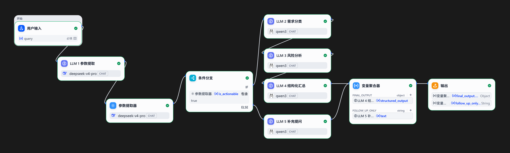
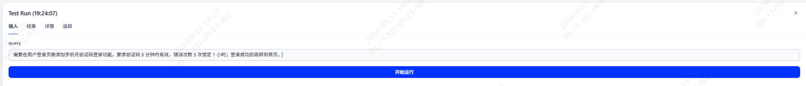
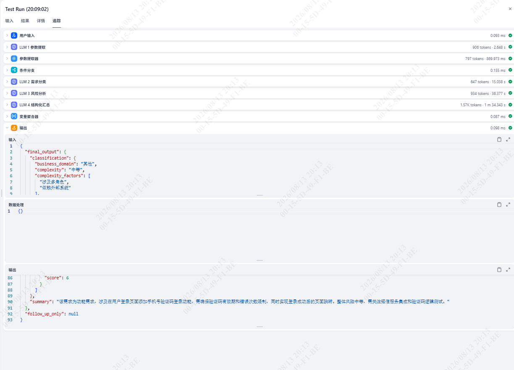
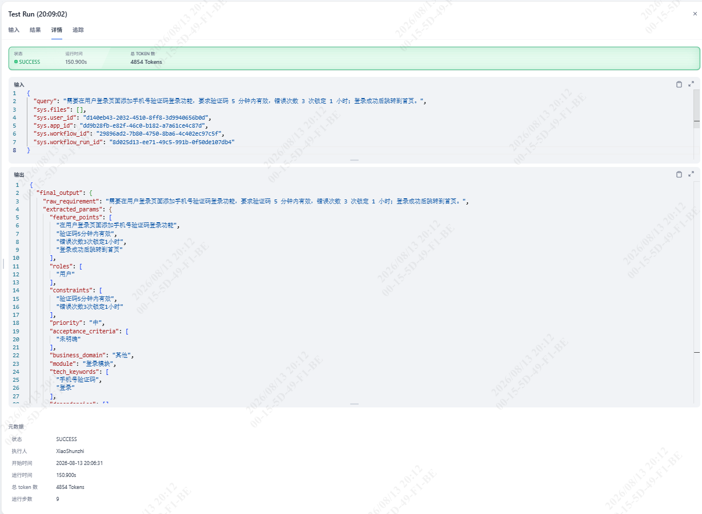
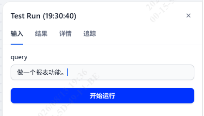
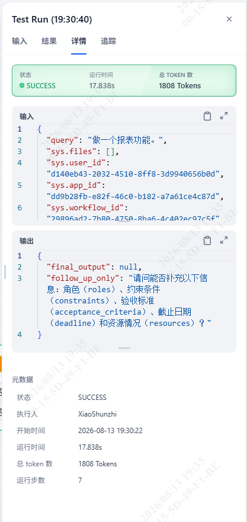
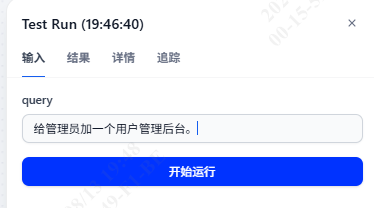
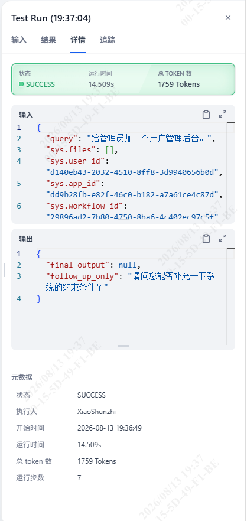

# Week 4 · Day 18 任务总结

> 适用项目：南宁软件组 AI Agent 12 周 Roadmap · Week 4（Dify Workflow）· Day 18
> 适用仓库：`D:\workspace\py_ai\week01_ai_basics\`
> 落档日期：2026-08-13
> 关联文档：`docs/day17_dify_repro_design.md`、`C:\Users\Xsz\Desktop\文本\6week\day18_requirement_pipeline_design.md`（v2.2 设计）、`dify_workflows/RequirementAnalysis_Dify.yml`（DSL 导出）

---

## 1. 任务目标

完成 Roadmap 第 4 周阶段任务第 ② 条——**在 Dify 中搭建「需求文本 → 参数提取 → 分类 → 风险分析 → 结构化输出」工作流**，并实际跑通用例闭环。

通过标准：

- 在本地 Dify 搭建并发布工作流 `RequirementAnalysis_Dify`；
- 完整需求走 TRUE 分支（参数提取 → 分类 → 风险 → 结构化汇总），输出 7 字段完整报告 Object；
- 信息缺失需求走 FALSE 分支（补充提问），输出追问文本；
- 导出 DSL 归档。

> 阶段任务 ③「通过 Dify API 调用已发布工作流并由 FastAPI 包装」由 **Day 19** 单独承接（见 `docs/day19_dify_api_wrapper_design.md`，通用接口，以 Day 17 为例），本日不写包装代码。

---

## 2. 当日完成的主要工作内容

1. **搭建需求分析工作流 v2.2**：节点拓扑为「用户输入 → LLM 1 参数提取 → 参数提取器（拍平 is_actionable）→ 条件分支（包含 `true`）→ 〔TRUE〕LLM 2 分类 → LLM 3 风险 → LLM 4 汇总 ／ 〔FALSE〕LLM 5 补充提问 → 变量聚合器（2 分组）→ 结束」。v1.x 因 Code 节点传参、嵌套字段类型问题全部作废，v2.2 采用无 Code 节点架构。
2. **模型按环节区分配置**：`LLM 1 参数提取`与「参数提取器」使用 `deepseek-v4-pro`（`is_actionable` 的可靠性决定分支走向）；`LLM 2 需求分类 / LLM 3 风险分析 / LLM 4 结构化汇总 / LLM 5 补充提问` 使用 `qwen3`。两者均配合正确业务 Schema 输出稳定，未统一单一模型。
3. **跑通 3 个用例**：用例 1（完整需求→TRUE，输出 7 字段报告）、用例 2（「做一个报表功能」→FALSE，追问缺失字段）、用例 3（「给管理员加用户管理后台」→FALSE，追问 constraints 等），三用例全部符合期望。
4. **导出 DSL** `dify_workflows/RequirementAnalysis_Dify.yml` 作为交付物。

整体工作流截图：



---

## 3. 关键进展

- **Day 18 Dify 部分正式闭环**：三种需求形态（完整 / 残缺 / 边界）均路由正确，TRUE 分支产出结构化报告、FALSE 分支产出追问。
- **确认结构化输出回归正常**：`LLM 2/3/4` 开启结构化输出并填入正确业务 Schema 后，`qwen3` 能稳定输出符合 Schema 的 Object；此前输出元 Schema 框架的根因是配置框里误填了元 Schema（`required: ["type","properties","required"]`），不是模型不支持。`deepseek-v4-pro` 用于 `LLM 1` 和参数提取器，保障 `is_actionable` 提取稳定。
- **确定 is_actionable 的稳妥传递链路**：LLM 1 关结构化输出（只输出 text JSON）→「参数提取器」把 `is_actionable` 拍平为顶层 String → 条件分支引用该顶层 String，用「包含」+ 值 `true` 匹配，完全避开嵌套 Object 字段的类型识别问题。
- **变量聚合器跨类型汇合**：TRUE 分支产物 `final_output`（Object）与 FALSE 分支产物 `follow_up_only`（String）类型不同，必须开启「聚合分组」拆成两个分组收齐，再由结束节点统一引用。

---

## 4. 交付物清单

| 交付物 | 说明 | 状态 |
| --- | --- | --- |
| 设计文档 v2.2 | `C:\Users\Xsz\Desktop\文本\6week\day18_requirement_pipeline_design.md` | ✅ |
| Dify Workflow DSL | `dify_workflows/RequirementAnalysis_Dify.yml` | ✅ |
| 工作流应用 | 本地 Dify 已发布 `RequirementAnalysis_Dify` | ✅ |
| 三用例验证 | 用例 1/2/3 全部跑通 | ✅ |
| 本任务总结 | `docs/day18_task_summary.md` | ✅ |

---

## 5. 运行验证（3 用例 + 截图）

### 用例 1：信息完整的需求（应走 TRUE 分支）

输入：

```text
需要在用户登录页面添加手机号验证码登录功能，要求验证码 5 分钟内有效，错误次数 3 次锁定 1 小时；登录成功后跳转到首页。
```

期望：`final_output` 有值、`follow_up_only` 为 null；`extracted_params.is_actionable` = "true"；`classification.type` = "功能需求"；`risk_analysis.risks` 至少 2 条。

实际结果符合期望，结构化报告 7 字段齐全：







### 用例 2：信息缺失的需求（应走 FALSE 分支）

输入：

```text
做一个报表功能。
```

期望：`final_output` 为 null、`follow_up_only` 有追问文本；`missing_fields` 至少含 feature_points / roles / constraints。

实际走 FALSE 分支，LLM 5 输出补充提问：





### 用例 3：边界需求（角色明确但约束缺失，应走 FALSE 分支）

输入：

```text
给管理员加一个用户管理后台。
```

期望：`is_actionable` = "false"；`missing_fields` 含 constraints 等。

实际同样走 FALSE 分支并追问缺失约束：





---

## 6. 遇到的问题及解决方案

### 6.1 条件分支对 String 变量无「等于」运算符

**现象**：Dify 条件分支对 String 变量不显示「等于」，下拉只有「包含 / 不包含 / 开始是 / 结束是 / 是 / 不是 / 为空 / 不为空」。若选「是」+ 布尔 `true`，又报 `Invalid actual value type: string or boolean`。

**解法**：改用「包含」+ 值 `true`（字符串），对 `"true"` 做子串匹配。

### 6.2 条件分支直接引用 structured_output 嵌套字段报类型错

**现象**：v2.1 直接让条件分支引用 `LLM 1.structured_output.is_actionable`，平台内部把该字段识别为 boolean，报 `Invalid actual value type: string or boolean`。

**解法**：在 LLM 1 与条件分支之间插入「参数提取器」，把 `is_actionable` 从 `LLM 1.text`（JSON 字符串）中提取为**顶层 String 变量**，条件分支只引用该顶层 String，类型稳定。

### 6.3 think 标签污染 text 输出

**现象**：qwen3 / deepseek 开启 reasoning 后会在 text 前输出 `<think>…</think>`，污染 JSON 字符串，导致参数提取器解析失败。

**解法**：在模型设置关闭 thinking / reasoning 开关；System Prompt 加约束「只输出 JSON，不要输出其他内容」；参数提取器指令兜底「不要输出任何 JSON 以外的内容」。

### 6.4 参数提取器「函数调用」模式解析失败

**现象**：参数提取器用「函数调用」模式时，deepseek-v4-flash 只回裸字符串，`__is_success: 0`、`is_actionable` 为空，整流程断在条件分支。

**解法**：推理模式改「基于提示词」，并明确指令输出 `{"is_actionable": "..."}` 结构（不要 Markdown 包裹）。

### 6.5 结构化输出返回的是「元 Schema 框架」而非数据（关键根因）

**现象**：LLM 4 的「结构化输出」开关开启后，输出的是 `{"type":"object","properties":{...},"required":[...]}` 这种**元 Schema 定义**本身，而不是业务数据。

**根因**：「结构化输出」配置框里被填成了**元 Schema**（顶层 `required: ["type","properties","required"]`），即把 Schema 的元描述当成了实例。这不是模型问题，是配置填错。

**解法**：把「结构化输出」框改为**正确业务 Schema**（如 LLM 4：`required: ["raw_requirement","extracted_params","classification","risk_analysis","summary","recommendations","follow_up_questions"]`），模型即输出完整业务 Object。

> 注意：`deepseek-v4-pro` **支持** Dify 结构化输出，此前误判「必须关开关」是因为 Schema 配置错。只要填对业务 Schema，结构化输出正常工作。最好直接复制粘贴，不要用平台自带的“从json导入”功能。

### 6.6 is_actionable 判断自相矛盾

**现象**：LLM 1 已提取出 roles / constraints，却把 `is_actionable` 判为 `false`，导致完整需求错误走 FALSE 分支。

**解法**：在 System Prompt 强化判定规则——功能点、角色、约束三者齐全才为 `true`，否则 `false`，按 a→b→c→d 逐步计数判断，避免模型凭印象下结论。

### 6.7 代码侧：dify_client 单测 `test_missing_api_key` 失败（FastAPI 包装共用客户端）

**现象**：`uv run pytest tests/test_dify_client.py` 中 `test_missing_api_key` 失败（`DID NOT RAISE ValueError`），另两项 PASSED。该测试显式传 `api_key=""` 期望初始化即抛 `ValueError`（匹配 `DIFY_API_KEY`）。

**根因**：`DifyWorkflowClient.__init__` 里 `self.api_key = (api_key or os.getenv("DIFY_API_KEY", "")).strip()`——`api_key=""` 时 `"" or X` 回退到环境变量，而本机 `DIFY_API_KEY` 已有值，故未触发校验。

**解法**：改为 `api_key if api_key is not None else os.getenv("DIFY_API_KEY", "")`——仅当 `api_key is None`（未传）才读环境变量；显式 `""` 视为未配置直接 `raise ValueError`。`app.py` 用 `DifyWorkflowClient()`（无参）仍依赖 env，行为不变。

**校验**：`tests/test_dify_client.py` 3 passed；`ruff check` + `ruff format --check` 全过。

> 注：`dify_client.py` / `api_models.py` / `app.py` 属 Day 19 的 FastAPI 通用包装，此处记录单测问题系按需求集中归档。

---

## 7. 遗留事项

- 下游 FastAPI 包装、对比报告见 §8 计划。
- **Day 17 `DevAssistantAgent_Dify` 本机联调**：Day 17 工作流画布内四分支（calculator / check_commit / read_file / chat）已闭环、DSL 已导出；原计划在 Day 17 收尾时做的「FastAPI 包装 + 本机联调四分支」，将在 day19 完成——通用接口 `POST /dify/run` ，待本机把 `.env` 的 `DIFY_API_KEY` 指向 Day 17 工作流后联调。

---

## 8. 次日（Day 19 / Day 20）计划安排

1. **Day 19**：FastAPI 通用包装 `POST /dify/run`，本机配 `DIFY_API_KEY` 指向目标工作流后联调。
2. **Day 20**：Dify 版 vs Week 3 代码版 `DevAssistantAgent` 横向对比（调试、版本管理、扩展、部署），完成 Week 4 总结。

---

## 9. 核心概念与节点说明

| 概念 / 节点 | 说明 |
| --- | --- |
| 需求分析工作流 `RequirementAnalysis_Dify` | 整个 Dify Workflow 应用，承载「需求文本 → 参数提取 → 分类 → 风险分析 → 结构化输出」全链路；对外暴露一个 `query` 入参、一个 `outputs` 出参。 |
| 用户输入（开始节点） | Dify 工作流入口，中文界面名为「用户输入」，接收外部传入的 `query`；下游节点通过 `{{#用户输入.query#}}` 引用（节点名严禁手敲，须从变量选择器点选）。 |
| LLM 1 参数提取 | 关闭结构化输出，仅输出 `text`（JSON 字符串）。用 `deepseek-v4-pro`，从需求文本抽取功能点 / 角色 / 约束 / 优先级 / 业务域等字段，并给出 `is_actionable`；判定规则：功能点、角色、约束三者齐全才为 `true`。 |
| 参数提取器 | 接收 LLM 1 的 `text`，用「基于提示词」模式把 `is_actionable` 拍平为**顶层 String** 变量，供条件分支引用；规避直接引用 `structured_output` 嵌套字段的类型识别问题。 |
| 条件分支（IF/ELSE） | 引用参数提取器的 `is_actionable`（顶层 String），用「包含」+ 值 `true` 匹配：`true` 走 TRUE 分支，否则走 FALSE 分支。String 变量无「等于」运算符。 |
| LLM 2 需求分类 | TRUE 分支首节点，用 `qwen3`，开启结构化输出并填入分类业务 Schema，输出需求类型等。 |
| LLM 3 风险分析 | TRUE 分支，用 `qwen3`，开启结构化输出，输出风险项等。 |
| LLM 4 结构化汇总 | TRUE 分支末端，用 `qwen3`，开启结构化输出，聚合上游产出 `final_output`（7 字段 Object：raw_requirement / extracted_params / classification / risk_analysis / summary / recommendations / follow_up_questions）。 |
| LLM 5 补充提问 | FALSE 分支，用 `qwen3`，关闭结构化输出，纯文本输出追问内容 `follow_up_only`（列出缺失字段）。 |
| 变量聚合器 | 开启「聚合分组」，建两个分组：① `final_output`（Object，来自 LLM 4）；② `follow_up_only`（String，来自 LLM 5）。跨类型汇合必须分组，否则 FALSE 分支变量引用报 NoneType。 |
| 结束节点 | 仅作转发出口，统一引用变量聚合器的两个分组键，输出最终 `outputs`；不做跨分支聚合。 |
| 模型选择 | `LLM 1` 与参数提取器用 `deepseek-v4-pro`（保障 `is_actionable` 稳定）；`LLM 2/3/4/5` 用 `qwen3`（配正确业务 Schema 输出稳定）。未统一单一模型。 |
