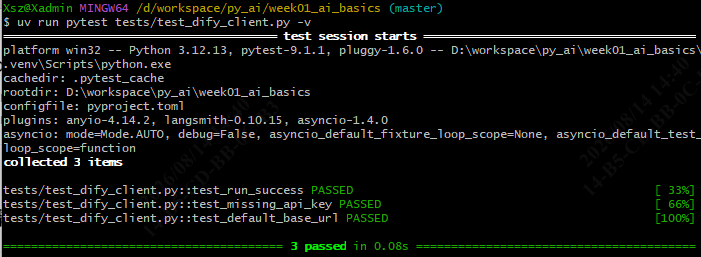
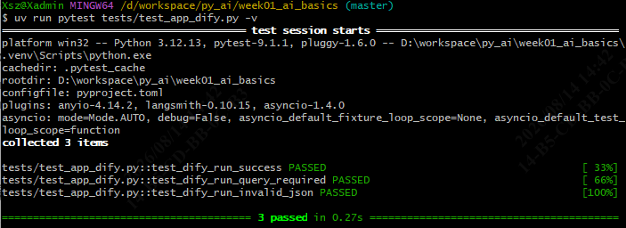
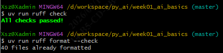
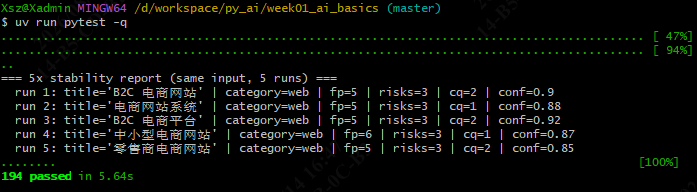
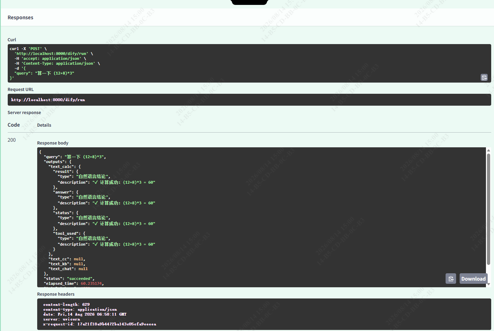
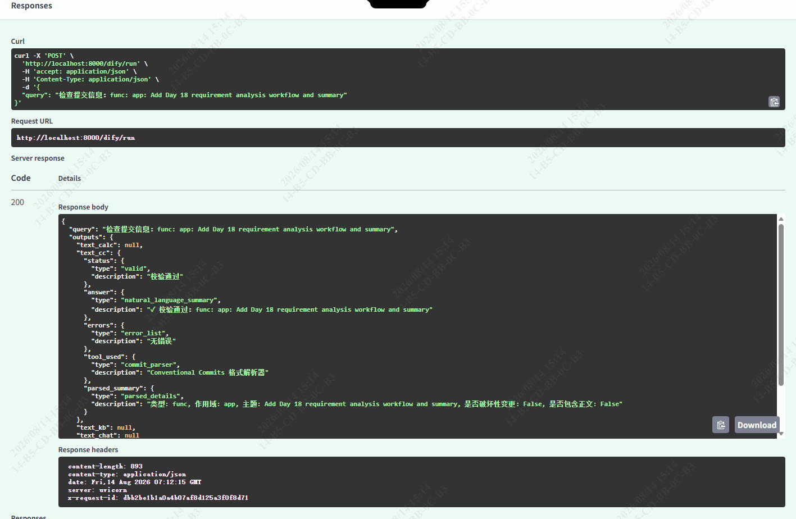

# Week 4 · Day 19 任务总结

> 适用项目：南宁软件组 AI Agent 12 周 Roadmap · Week 4（Dify Workflow + FastAPI 包装）· Day 19
> 适用仓库：`D:\workspace\py_ai\week01_ai_basics\`
> 落档日期：2026-08-14
> 关联文档：`docs/day17_dify_repro_design.md` §10、更新后的 `dify_workflows/DevAssistantAgent_Dify.yml`

---

## 1. 任务目标

完成 Roadmap 第 4 周阶段任务第 ③ 条——**用 FastAPI 包装 Dify Workflow API，实现一个通用透传端点 `POST /dify/run`**，并在本机对 Day 17 已发布工作流 `DevAssistantAgent_Dify` 做四分支联调验证。

通过标准：

- 提供一个不绑定具体工作流的通用接口：`POST /dify/run` 接收 `{ "query": "..." }`，透传 Dify 的 `outputs`；
- 靠 `.env` 的 `DIFY_API_KEY` + `DIFY_BASE_URL` 决定调用哪个工作流；
- 单元测试覆盖客户端初始化校验、FastAPI 路由成功/参数校验/异常分支；
- 本机联调 Day 17 四分支（calculator / check_commit / read_file / chat），确认 Schema 干净、字段类型正确。

---

## 2. 当日完成的主要工作内容

1. **FastAPI 通用包装 `POST /dify/run`**：在 `src/app.py` 新增路由，依赖注入 `DifyWorkflowClient`；请求/响应模型 `DifyRunRequest` / `DifyRunResponse` 用 `outputs: dict[str, Any]` 透传，不写死任何工作流字段。
2. **代码清理（去 Day 18 硬编码）**：`src/dify_client.py`、`src/api_models.py`、`src/app.py` 的 docstring/注释/错误提示全部改回通用描述，不再特指 Day 18 需求分析工作流或 `final_output` / `follow_up_only`。
3. **客户端初始化校验修复**：`DifyWorkflowClient.__init__` 改为 `api_key if api_key is not None else os.getenv(...)`，修复显式传空串不抛 `ValueError` 的问题。
4. **接口超时调大**：`src/app.py` 里接口调用处 `DifyWorkflowClient(timeout=300)`（5 分钟），解决 Dify 阻塞模式本地模型 60s 内未返回导致的 504。
5. **Day 17 工作流本机四分支联调**：通过 `POST /dify/run` 跑通 calculator、check_commit、kb（read_file 替代）、chat 四个分支，并配合修正 Day 17 已发布版中 4 个「汇总回答」LLM 节点的元 Schema 问题。
6. **更新 DSL 归档**：把本机修正后的 `DevAssistantAgent_Dify.yml` 重新导出并覆盖 `dify_workflows/DevAssistantAgent_Dify.yml`。

---

## 3. 关键进展

- **通用接口设计闭环**：`POST /dify/run` 不绑定具体工作流，换 `DIFY_API_KEY` 即可切换 Day 17 / Day 18 / 其他工作流，与 Day 19 设计文档 §3.3 一致。
- **Day 17 四分支全部验证通过**：
  - calculator：返回 `{status, answer, result, tool_used}` 全 string；
  - check_commit：返回 `{status, answer, tool_used, errors, parsed_summary}` 全 string/array[string]；
  - kb：返回 `{answer, tool_used, sources}`，经 Top K / Score / 检索模式 / Prompt 调优后可召回多片段；
  - chat：返回 `{answer, tool_used}`，对标准闲聊输入输出自然语言回复。
- **元 Schema 问题定位并修正**：Day 17 已发布工作流的 4 个汇总 LLM 节点把业务字段填成 `{type, description}` 嵌套对象，导致 API 返回元 Schema 本身或字段重复填同一段结论。已在 `docs/day17_dify_repro_design.md` §10 给出逐节点修正步骤，并随本次 DSL 更新归档。
- **代码侧 6 项测试 + 全量 pytest 通过**：`tests/test_dify_client.py` 3 passed、`tests/test_app_dify.py` 3 passed、`uv run pytest -q` 全仓库 194 passed，`ruff check` / `ruff format --check` 全过。

---

## 4. 交付物清单

| 交付物 | 说明 | 状态 |
| --- | --- | --- |
| FastAPI 路由与模型 | `src/app.py`、`src/api_models.py`、`src/dify_client.py` | ✅ |
| 单元测试 | `tests/test_dify_client.py`、`tests/test_app_dify.py`（共 6 项） | ✅ |
| Day 17 修正后 DSL | `dify_workflows/DevAssistantAgent_Dify.yml`（已从桌面覆盖更新） | ✅ |
| 本任务总结 | `docs/day19_task_summary.md` | ✅ |

---

## 5. 运行验证（单元测试 + API 联调截图）

### 5.1 单元测试与代码检查

**`tests/test_dify_client.py`：3 passed**

**`tests/test_app_dify.py`：3 passed**

**`ruff check` + `ruff format --check`：全过**

**全仓库回归：`uv run pytest -q` 194 passed**

### 5.2 API 联调四分支

以下均为本机 `POST /dify/run` 实际响应（`DIFY_API_KEY` 指向 `DevAssistantAgent_Dify`）。

#### calculator 分支

输入：`算一下 (12+8)*3`

> 该截图取样于 Day 17 工作流修正前，可见 `text_calc` 各字段被嵌套成 `{type, description}` 对象、四个字段重复填同一段结论，是 §6.3 元 Schema 问题的直接证据。修正后该分支返回干净 4 字段 string，见 §6.3 闭环说明。

> 更新工作流后：

#### check_commit 分支

输入：`检查提交信息：func: app: Add Day 18 requirement analysis workflow and summary`

> 同样取样于修正前，可见 `text_cc` 字段出现 `{type, description}` 嵌套对象。修正后返回 `status: "valid"`、`errors: []`、`parsed_summary` 扁平字符串。

> 更新工作流后：

#### chat 分支

输入：`你好，能简单介绍一下你自己吗？`

响应 `text_chat = {answer: 通义千问自我介绍, tool_used: "chat"}`，字段干净、无元 Schema 嵌套。

#### kb 分支

输入：`《围城》这本书的作者是谁？讲的是什么？`

响应 `text_kb = {answer: 钱锺书+讽刺知识分子困境的概括, tool_used: "knowledge_retrieval", sources: [...]}`，字段干净、引用片段正确。

---

## 6. 遇到的问题及解决方案

### 6.1 `tests/test_dify_client.py::test_missing_api_key` 失败

**现象**：显式传 `api_key=""` 时期望抛 `ValueError`，但测试报 `DID NOT RAISE ValueError`。

**根因**：`DifyWorkflowClient.__init__` 里用 `api_key or os.getenv(...)`——空串会回退到环境变量，而本机已配 `DIFY_API_KEY`，导致校验未触发。

**解法**：改为 `api_key if api_key is not None else os.getenv("DIFY_API_KEY", "")`。仅未传参（`None`）时才读环境变量；显式空串直接视为未配置抛错。`app.py` 里无参调用 `DifyWorkflowClient()` 行为不变。

**校验**：`tests/test_dify_client.py` 3 passed。

### 6.2 本机联调出现 504 Dify 请求超时

**现象**：`POST /dify/run` 调用 Day 17 工作流 calculator 分支时返回 504，`elapsed_time` 约 60s。

**根因**：Dify 本地模型（ollama + qwen3）在阻塞模式下跑 Workflow 需要 60s 左右，原 `DifyWorkflowClient` 默认 `timeout=60.0` 正好压线超时；不是接口代码 bug，是本地模型太慢。

**解法**：`src/app.py` 接口调用处改为 `DifyWorkflowClient(timeout=300)`（5 分钟），保留客户端默认 60s 不变以便单测/脚本复用。

**校验**：calculator 分支后续 60.2s 成功返回；`tests/test_app_dify.py` 3 passed。

### 6.3 Day 17 已发布工作流四个「汇总回答」节点存在元 Schema 问题

**现象**：API 返回的 `text_calc` / `text_cc` 等业务字段不是 string/array[string]，而是嵌套对象 `{type: "...", description: "..."}`；calculator 甚至把同一段结论重复填进 4 个字段。

**根因**：4 个汇总 LLM 节点的「结构化输出」Schema 框里被填成了元 Schema（每个业务字段写成 `{type, description}` 对象），模型按错 Schema 吐回框架而非数据。

**解法**：
- 在 Dify 画布逐个修正 4 个汇总节点，把 Schema 改成干净业务 Schema（`string` / `array[string]` 叶子字段）；
- 同步修正 §10.5 的 System Prompt（有片段就直接返回片段，不判「未检索到」）；
- 修正知识检索节点参数：Top K 10–15、Score 阈值 0.3、检索模式向量+全文；
- 重新发布工作流并导出 DSL 覆盖 `dify_workflows/DevAssistantAgent_Dify.yml`。

**校验**：
- calculator：`{status:"ok", answer:"60", result:"(12+8)*3 = 60", tool_used:"calculator"}`；
- check_commit：`{status:"valid", ..., errors:[], parsed_summary:"type=func, scope=app,..."}`；
- kb：`{answer, tool_used:"knowledge_retrieval", sources:[...]}`；
- chat：`{answer, tool_used:"chat"}`。

### 6.4 kb 分支曾返回「知识库未检索到相关内容」

**现象**：问「方鸿渐是谁？」时，知识检索确实召回了含「方鸿渐」的真实片段（score=0.5948），但汇总 LLM 输出 `answer: "知识库未检索到相关内容"`、`sources: []`。

**根因**：§10.5 原 System Prompt 写「若知识检索无相关结果 → 写未检索到」，LLM 把「单一片段信息不完整」误判为「无相关结果」，从而丢弃 source。

**解法**：简化 System Prompt 为两分支逻辑——result 数组为空才写「未检索到」；只要有片段，哪怕只有一句，也直接基于片段作答并保留 sources。

**校验**：「查找苏小姐」返回 `text_kb = {answer:"苏小姐说：...", tool_used:"knowledge_retrieval", sources:["苏小姐的对话"]}`，不再判未检索到。

---

## 7. Day 20 计划

完成 Roadmap 第 4 周阶段任务第 ④ 条——**Dify 版 `DevAssistantAgent_Dify` 与 Week 3 代码版 `DevAssistantAgent` 横向对比报告**，覆盖：

- 调试与可观测性（Dify 画布追踪 vs 自定义 trace 中间件）；
- 版本管理（DSL 导出 vs Git 代码 diff）；
- 扩展性（新增工具：画布加节点 vs 代码加 `@tool` + 路由）；
- 部署与运行环境差异（Docker Dify vs `uv run` FastAPI）；
- 精确计算、文件读取、中间件可控性等能力边界。

产出：`docs/day20_dify_vs_code_report.md`。

---

## 8. 核心概念与接口说明

| 概念 / 组件 | 说明 |
| --- | --- |
| `POST /dify/run` | FastAPI 通用透传端点，接收 `{ "query": "..." }`，返回 `{ "query", "outputs", "status", "elapsed_time" }`。字段由所调用工作流决定，接口层不硬编码。 |
| `DifyWorkflowClient` | 封装 Dify Workflow API 的同步阻塞客户端，支持 `api_key` / `base_url` / `timeout` 配置；显式传空串抛 `ValueError`，无参调用读环境变量。 |
| `DifyRunRequest` / `DifyRunResponse` | Pydantic v2 模型，`outputs` 用 `dict[str, Any]` 透传，不限制具体工作流的输出字段名。 |
| 通用接口切换工作流 | 修改 `.env` 的 `DIFY_API_KEY` 为对应工作流的 app key 即可；`DIFY_BASE_URL` 默认 `http://localhost/v1`，Cloud 版改为 `https://api.dify.ai/v1`。 |
| `DevAssistantAgent_Dify.yml` | Day 17 工作流 DSL 导出文件，已包含上述修正，归档于 `dify_workflows/`。 |
