# 第一周 AI 与 Python 应用基础 — 学习周报（Week 01 Summary）

> 范围：完成 Roadmap 第 1 周（AI 与 Python 应用基础）全部 5 天任务，含第 5 天 FastAPI 最小服务的实现、测试、Ruff 规范与本次书面总结。
> 适用：南宁软件组 AI Agent 应用开发 12 周 Roadmap 学员。
> 文档位置：`docs/week01_summary.md`。
> 工程目录：`D:\workspace\py_ai\week01_ai_basics`。

---

## 任务概述

技术路线：**Python 3.12 + uv + Ruff + pytest + FastAPI + Pydantic v2**；第 3 周了解 LangChain v1 / LangGraph。第 1 周**明确不使用** LangChain、LangGraph、Dify 或复杂 RAG 框架，先把模型 API、数据结构、错误处理、可测试服务基础打牢。

本周（第 1 周）目标：**从 C++ 工程思维切换到 Python AI 应用工程，完成模型调用、结构化输出和 FastAPI 最小服务**。5 天分别覆盖：工程环境 → Python 语法/JSON/配置 → HTTP/异步/模型调用 → Prompt/结构化输出 → FastAPI 服务与总结。

---

## 一、本周整体项目内容

`week01_ai_basics` 是一个**小型但具备生产形态**的「LLM 驱动的需求分析 HTTP 服务」示例工程。它把本周 5 天应用的功能串成一条完整链路：

- **Day 1 基础工程**：用 `uv` 建立可复现环境（pyproject / uv.lock / Ruff / pytest / .gitignore / .env.example），写 `src/hello.py` 验证版本与时间。
- **Day 2 配置模块**：用 Pydantic 定义 `AppConfig`，从环境变量 / `config.json` 读取模型配置，缺字段或类型错时给出明确错误。
- **Day 3 模型客户端**：实现 `LlmClient`，用 `httpx.AsyncClient` 异步调用 OpenAI 兼容的 `/chat/completions`，对 401/429/5xx/超时/格式错误做类型化异常处理，并提供 mock 测试。
- **Day 4 结构化输出**：定义 `RequirementAnalysis`（Pydantic），用 JSON Mode 把「客户自由文本」收敛成固定 6 字段结构，并对 5 类样本做稳定性测试。
- **Day 5 FastAPI 服务**：把上述能力暴露成 HTTP 接口（`/health`、`/chat`、`/analyze-requirement`），统一错误信封，配 pytest + Ruff。

最终交付物是一个**能真实跑起来**的 FastAPI 应用：启动后浏览器访问 `/docs` 即可调试，三个接口分别返回服务状态、模型文本、结构化需求分析结果。

---

## 二、第五天完成的任务

| # | Roadmap 要求 | 实现方案 | 代码位置 |
| --- | --- | --- | --- |
| 1 | `GET /health` 返回状态、版本、模型配置摘要 | 读 `AppConfig` + 环境变量判断 `key_configured`；**API Key 永不出现在响应里** | `src/app.py:301 health()` |
| 2 | `POST /chat` 返回模型文本响应 | 校验 `messages`（`role` 限 `system/user/assistant`、非空、temperature∈[0,2]、max_tokens∈[1,8192]），转发到 `LlmClient.chat()` | `src/app.py:324 chat()` |
| 3 | `POST /analyze-requirement` 返回 `RequirementAnalysis` | 强制 JSON Mode（`extra_body={"response_format":{"type":"json_object"}}`），用 `RequirementAnalysis.model_validate_json` 严格校验 | `src/app.py:352 analyze_requirement()` |
| 4 | 非法输入 / 超时 / 错误返回明确状态码与结构 | 11 个异常处理器把 `LlmError` 子类与 FastAPI 校验错误映射成统一 `ErrorResponse`（含 `code`） | `src/app.py:168 _register_exception_handlers()` |
| 5 | pytest 测试 API + Ruff 检查/格式化 | `tests/test_api.py`（20 用例，ASGI 内存测试）；`ruff check/format` 全绿 | `tests/test_api.py` |
| 6 | 从空文件重写配置/模型调用/接口的能力 | 三关注点分离 + `create_app(llm_factory=, config_loader=)` 依赖注入，测试已证明可替换任一组件 | `src/app.py:106 create_app()` |

**通过标准核对**：`uv sync` 可恢复环境 ✅；README 命令可直接复制 ✅；所有 API 有输入/输出 Schema ✅；真实密钥未入 Git（`.env` 在 `.gitignore`）✅；Ruff 通过 + pytest 全过 ✅；可从空文件重写三组件 ✅。

---

## 三、整个项目的架构

本项目跑起来后，是一个**分层、可注入、错误统一**的 LLM HTTP 服务。

```
week01_ai_basics/
├── README.md                # 本文件
├── pyproject.toml           # 项目元数据 + 依赖 + Ruff/pytest 配置
├── uv.lock                  # 依赖锁定（必须入库）
├── config.example.json      # 配置模板（真实 config.json 不入库）
├── .env.example             # 环境变量模板（真实 .env 不入库）
├── .gitignore               # Git 忽略规则
├── .python-version          # 锁定 Python 3.12（入库）
├── main.py                  # uv init 生成的最小入口（保留作 demo）
├── src/                     # 业务代码
│   ├── hello.py             # Day 1 hello
│   ├── config.py            # Day 2 typed 配置加载
│   ├── llm_client.py        # Day 3 async chat-completions 客户端
│   ├── schemas.py           # Day 4 LLM 输出契约
│   ├── prompts.py           # Day 4 系统提示 + 消息构造
│   ├── api_models.py        # Day 5 HTTP wire 契约（请求/响应/错误）
│   ├── app.py               # Day 5 FastAPI 应用工厂 + 端点 + 异常处理
│   └── main.py              # Day 5 FastAPI 服务入口（fastapi dev/run 目标）
├── tests/                   # pytest 测试
│   ├── test_config.py       # Day 2
│   ├── test_llm_client.py   # Day 3
│   ├── test_structured_output.py  # Day 4
│   └── test_api.py          # Day 5
├── examples/                # 真实 / 样本数据
│   ├── requirement_samples.json    # 需求分析样本
│   └── structured_run_real.json    # 真实模型运行输出样本
├── scripts/                 # 一次性脚本（真实跑）
│   ├── run_real_ollama.py   # 真实调用 ollama 验证脚本
│   └── serve.py             # 绕过 Windows AppLocker 的本地 ASGI launcher
├── logs/                    # 脚本运行日志（不入库）
│   └── ollama_run.log
└── docs/                    # 学习笔记、阶段交付物
    ├── day01_environment.md # Day 1 环境记录
    ├── day02_python_json.md # Day 2 Python/JSON/配置笔记
    ├── day03_http_async.md  # Day 3 HTTP/异步笔记
    ├── day04_structured_output.md # Day 4 结构化输出笔记
    ├── week01_summary.md    # 第 1 周五天总结
    └── poho/                # 运行 / 测试截图（不入库）
```

**关键运行时特征**
- **解耦**：`create_app()` 不直接 `import` 具体配置读取或模型实现，而是通过 `llm_factory` / `config_loader` 注入（默认才用真实实现）。因此「换模型只改配置、重写任一组件不影响接口」成立。
- **统一错误信封**：无论校验失败、模型超时还是未知路径，客户端拿到的都是 `{"error":{"code":...,"message":...,"detail":...,"status_code":...}}` 结构，状态码与 `code` 一一对应。
- **配置与密钥隔离**：`.env` 中的 `API_KEY` 只在进程内使用，绝不回显到 `/health` 或日志；日志中也不输出密钥。
- **生命周期管理**：`lifespan` 在应用启动时创建 `LlmClient`、关闭时释放底层 `httpx` 连接。

---

## 四、本周学到的 10 个关键概念及对应代码位置

> 下面给出每个概念在本项目中的具体位置（文件:行号），方便回看代码时对照。

| # | 关键概念 | 简要理解 | 在项目中的代码位置 |
| --- | --- | --- | --- |
| 1 | **Python 库函数调用与 C 语言的区别** | `import` 即可用标准库/第三方库，动态类型、自动内存管理、无需编译；C 需 `#include`、声明类型、手动 `malloc/free`、先编译后链接。写 `src/hello.py` 直接 `import tomllib` 读配置并打印，就是"库函数即拿即用"。 | `src/hello.py:11-14`、`src/config.py:35 import json`、`:101 json.loads()`、`:165 json.dumps()`；`tests/test_config.py` 用 pytest fixture（C 无测试框架概念） |
| 2 | **JSON 序列化** | 序列化 = 内存对象变 JSON 文本（存储/传输）；反序列化 = JSON 文本还原成对象。项目里 `json.loads/dumps` 处理配置，`model_validate_json` 把模型返回的 JSON 文本还原成 `RequirementAnalysis`。 | `src/config.py:101 json.loads(text)`、`:165 json.dumps(...)`、`src/schemas.py:24 RequirementAnalysis`、`:228/239 json.dumps(exc.errors())`、`src/app.py:375 model_validate_json(result.text)` |
| 3 | **Pydantic 请求/响应与校验输入** | 用类声明字段和类型约束，FastAPI 收到请求时自动校验；不合法（空 `messages`、未知 `role`）立刻 422；`extra="forbid"` 还拒绝多余字段，挡住"模型乱塞字段"的幻觉。 | `src/api_models.py:60 ChatRequest`、`:112 AnalyzeRequirementRequest`、`:89 ChatResponse`、`:130 AnalyzeRequirementResponse`、`:162 HealthResponse`、`:205 ErrorResponse`；`src/schemas.py:24` |
| 4 | **sync 与 async/await 的区别** | 同步顺序执行，遇到网络 I/O 会卡住线程；`async/await` 在等待时把控制权交还事件循环，可并发处理其他请求。模型调用是典型 I/O 等待，`httpx.AsyncClient`+`await` 让单进程也能高并发。 | `src/llm_client.py:193 httpx.AsyncClient`、`:218 async def chat`、`src/llm_client.py:268 await self._client.post(...)`、`:334 asyncio.sleep`；`tests/test_api.py` 的 `async def ... await ac.get(...)` |
| 5 | **HTTP 请求/响应** | 客户端发"方法+URL+头+内容"，服务器回"状态码+头+内容"，并按状态码分流成功与各类失败。项目两层都用：我们向模型发 POST，FastAPI 也向调用方回带状态码的 JSON。 | `src/llm_client.py:250 url = .../chat/completions`、`src/llm_client.py:268 await self._client.post(url, json=body, headers=headers)`、按 `resp.status_code` 分流；`src/app.py` 各端点返回 `JSONResponse` |
| 6 | **API 的调用** | API 是"按约定收发数据的接口"。本项目既**调用**外部模型 API（`LlmClient.chat` 调 OpenAI 兼容接口），又把自身能力**封装**成对外 API（`/health`、`/chat`、`/analyze-requirement`）供别人调。 | 调外部：`src/llm_client.py:218 LlmClient.chat()`；对外暴露：`src/app.py:106 create_app()` + `:301 health()` / `:324 chat()` / `:352 analyze_requirement()` |
| 7 | **系统 prompt** | 对话第一条 `system` 消息，给模型"定角色、定规矩"（如"你是资深需求分析师，只输出合法 JSON"）；不和用户内容混在一起，`build_messages` 负责把它拼到最前。 | `src/prompts.py:22 SYSTEM_PROMPT`、`src/prompts.py:58 build_messages()` |
| 8 | **JSON Schema** | 描述"JSON 该长什么样"的规范（字段名、类型、是否必填）。Pydantic 模型能自动生成它；`/analyze-requirement` 用 `response_format=json_object` 让模型输出符合该 schema 的文本，再用 `model_validate_json` 严格校验。 | `src/schemas.py:24 RequirementAnalysis`、`:369 response_format=json_object`、`src/app.py:375 model_validate_json()` |
| 9 | **RequirementAnalysis 输出模型** | 把客户一句模糊需求，收敛成机器可识别的固定结构（标题/类别/功能点/风险/澄清问题/置信度）。它是 `/analyze-requirement` 的输出规则。 | `src/schemas.py:24 class RequirementAnalysis`（6 字段、`extra="forbid"`、带 `description`）；被 `src/app.py:352 analyze_requirement` 用作契约 |
| 10 | **FastAPI 最小服务** | 用极少量代码起 HTTP 服务 = 应用工厂（`create_app`）+ 路由（如 `/health`）+ 启动入口（`uvicorn.run`）。本项目三件套刚好覆盖"配置读取 + 模型调用 + 一个接口"的最小闭环。 | `src/main.py:42 uvicorn.run(...)`、`src/app.py:106 create_app()`、`src/app.py:301 health()` |

---

## 五、模型调用流程图

> 流程主线：**请求输入 → 配置 → 模型 API → 结构化结果 → HTTP 响应**

### 图片
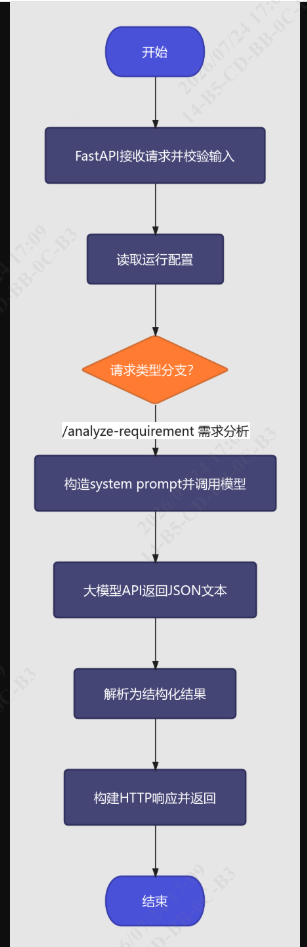


**逐步代码映射**
1. **请求输入**：客户端发 HTTP JSON → FastAPI 用 `ChatRequest` / `AnalyzeRequirementRequest`（`src/api_models.py`）做输入校验；不合法直接 422。
2. **配置**：`load_config()`（`src/config.py:111`）从 `.env` 和 `config.json` 读取，产出 `AppConfig`（`src/config.py:47`），决定请求发往哪个 `base_url`、用哪个模型、超时多少秒。
3. **模型 API**：`LlmClient.chat()`（`src/llm_client.py:218`）用 `httpx` 异步 POST 到 `{base_url}/chat/completions`，请求头带 API Key，请求体带 `messages`（由 `build_messages()` 在 `src/prompts.py:58` 构造）。
4. **结构化结果**：
   - `/chat` 直接返回模型文本（`LlmResult.text`）；
   - `/analyze-requirement` 在请求时加 `extra_body={"response_format":{"type":"json_object"}}`，拿到 JSON 后用 `RequirementAnalysis.model_validate_json`（`src/schemas.py:24`）严格解析，字段不符即 502 `llm_bad_response`。
5. **HTTP 响应**：成功包装成 `ChatResponse` / `AnalyzeRequirementResponse`（`src/api_models.py`）；任何异常被 `_register_exception_handlers`（`src/app.py:168`）捕获，统一成 `ErrorResponse`（`src/api_models.py:205`）。

---

## 六、主要 Commit 列表

> Git 提交记录整理

| 阶段 | Commit | 提交说明 |
| :--- | :--- | :--- |
| Day 1 | `2270d60` | build: app: Add initial python ai project structure |
| Day 1 | `80b1ee9` | docs: app: Add the initial version of the project README |
| Day 2 | `ae4b848` | func: app: Add the required pytest test cases |
| Day 2 | `610603a` | func: app: Add JSON configuration management module |
| Day 3 | `f0a5d28` | docs: app: Add the Day 3 task document day03_http_async.md |
| Day 3 | `694773a` | func: app: Add the LLM communication client llm_client and mock test files |
| Day 4 | `56f1471` | func: app: Add local model test cases |
| Day 4 | `67e17c5` | func: app: Add the RequirementAnalysis output model and test cases |
| Day 4 | `f69b3c2` | func: app: Add the system prompt and the structured definitions |
| Day 5 | `1aba38c` | func: app: Add a local ASGI launcher to bypass Windows AppLocker |
| Day 5 | `9fec2b0` | func: app: Add a minimal FastAPI service |

---

## 七、测试结果、异常场景、未解决问题

### 7.1 测试结果
- `uv run ruff check .` → **All checks passed!**
- `uv run ruff format --check .` → **15 files already formatted**
- `uv run pytest -q` → **65 passed**（Day 1–5 累计：Day2 12 + Day3 25 + Day4 8 + Day5 20）
- 真实启动 `uv run fastapi dev src/main.py`（端口 8000）：
  - `GET /health` → 200，返回 `status/version/model{name,base_url,timeout,key_configured}`
  - `POST /chat`（ollama 在跑）→ 200，返回真实模型文本 + `elapsed_ms` + `usage`
  - `POST /analyze-requirement`（ollama 在跑）→ 200，返回 `RequirementAnalysis` 结构（如 `category=mobile`）
- 运行截图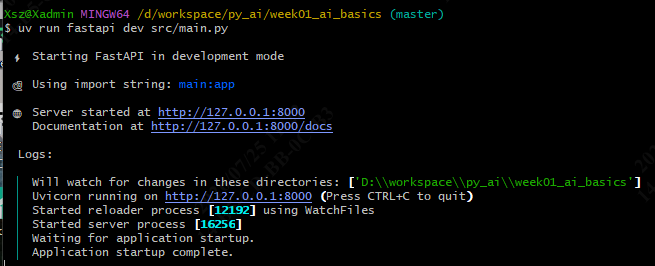。

### 7.2 异常场景

**第 5 天错误问题明细**
| 截图 | 问题 | 根因 | 解决 |
| --- | --- | --- | --- |
| `d5pytest_warn.png` | pytest 运行出现 4 条 `StarletteDeprecationWarning`（`'HTTP_422_UNPROCESSABLE_ENTITY' is deprecated`） | `src/app.py` 的 422 处理器使用了 Starlette 弃用常量 | 改为字面量 `422`；`pytest -W error::DeprecationWarning` 复测 65 passed 零警告 |
| `d5ruff_warn.png` | `ruff format --check .` 报 3 个文件需重新格式化 | 书写时格式漂移（仅空格/换行，逻辑零改动） | `ruff format .` 自动格式化（scripts/run_real_ollama.py、src/schemas.py、tests/test_api.py） |
| `ch_error.png` | `/chat` 请求报错：内联中文 → `400 {"detail":"There was an error parsing the body"}`；空 body → `422` | Git Bash 内联中文按 **GBK/CP936** 编码，FastAPI 强制 UTF-8 解码失败；空体触发校验 | 改用 `cat > f.json <<'EOF' ... EOF` + `curl -d @f.json`（UTF-8 发送） |
| `ana_ch.png` | `/analyze-requirement` 请求报错（请求体不合法或示例参数取值不合理导致 `422` / 解析失败） | 请求体非合法 JSON Mode 请求，或 Swagger 示例 JSON 含不合理字段（如 `max_tokens`/`temperature`） | 改用 `cat > f.json <<'EOF' ... EOF` + `curl -d @f.json`（UTF-8 发送） |
| `无增强fastapi.png` | `uv run fastapi dev` 报错需安装 `fastapi[standard]`（FastAPI CLI 缺失） | 仅装了 `fastapi` 未装 `fastapi[standard]`（CLI/标准套件缺失） | 安装 `fastapi[standard]`；或用 `uvicorn src.main:app` 直接启动绕过 CLI |
| `wdiff.png` | 下载fastapi[standard]后无法启动 | 链路被windows applocker 阻止 | 关闭”智能应用控制“，添加serve.py |


**截图索引**

| 类别 | 截图 |
| --- | --- |
| 第 5 天 FastAPI Web 端 | 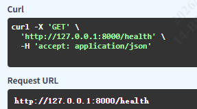 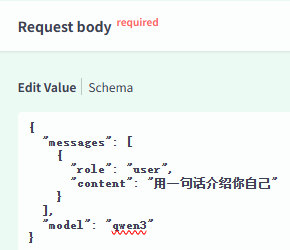 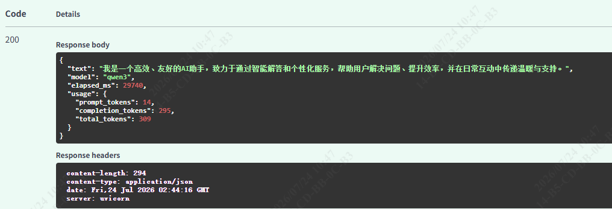 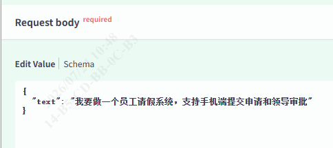 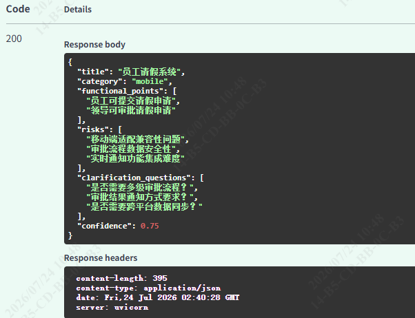 |
| 第 5 天 测试（ruff / pytest） | 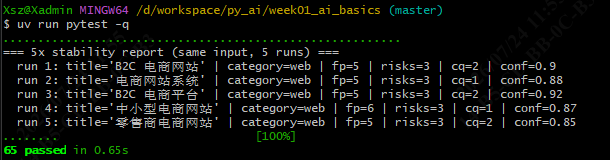 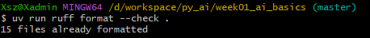 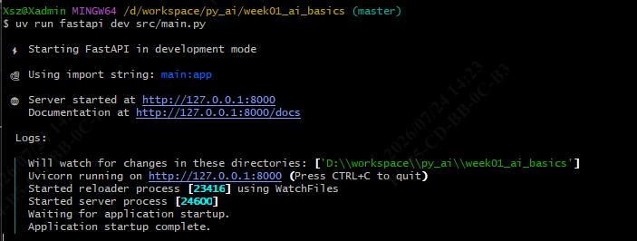 |
| 第 5 天 错误问题 | 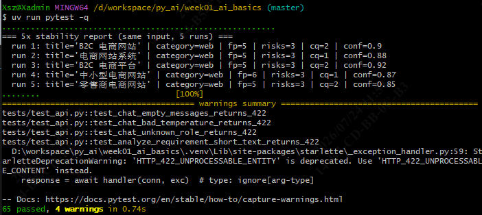 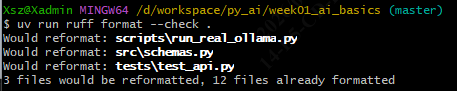 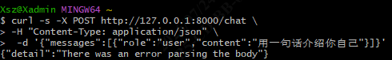 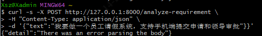 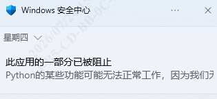 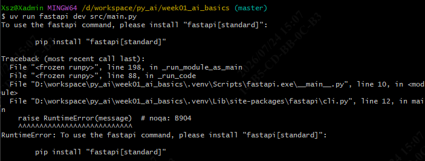 |

---

## 八、下周准备

按计划书第 2 周「**模型应用工程：稳定调用、流式输出与 API 服务**」：

- **目标**：把第 1 周 Demo 改造成**稳定、可配置、可测试**的模型服务。
- **必学知识**：模型参数 / Token 使用 / 流式输出 / 超时 / 退避重试 / 并发限制 / 错误分类；FastAPI Request-Response Model、依赖注入、Middleware、测试；Pydantic Settings、环境变量、日志字段、`request_id`、敏感信息脱敏。
- **阶段任务**：完成 `llm_gateway_demo`（`/chat`、`/chat/stream`、`/models`、`/health`）；实现统一 `ModelClient` 接口（至少支持团队模型接口，可选 Ollama）；记录每次调用耗时/模型/状态/重试次数（**不记录密钥和完整敏感输入**）；为超时、限流、错误 JSON、空响应、取消请求编写测试。
- **交付物**：完整项目仓库、API 文档截图、不少于 15 个测试、`docs/week02_summary.md`。
- **通过标准**：能够从空目录重建服务；**切换模型只修改配置，不修改业务接口**。

---

## 九、AI 辅助生成与人工验证

- **AI 辅助生成内容**：本项目的初始代码骨架、`tests/` 测试用例、`docs/` 各天文档及命令清单，主要由 AI辅助生成；注释中文化、错误信使本地化等也由 AI 完成。
- **人工验证与修改**：
  - 用户本人在本机运行 `ruff check/format`、`pytest`，启动 `uv run fastapi dev` 用 curl 测试 `/health`、`/chat`、`/analyze-requirement`；
  - 定位并修复了多个问题：
    - python模块调用，运行uv run python - <<'PY'，`load_dotenv()` 读不到 `.env` 文件，导致配置加载失败。使用显式 `load_dotenv(dotenv_path=_path=".env")` 传路径解决。
    - 更改根目录文件后，需要执行`uv sync`同步，才能生效。
    - Bash中测试API，中文请求体 GBK 编码导致 400,改用JSON文本。
    - Windows 智能控制拦截 `_multiprocessing.pyd`，导致 422 异用警告，关闭智能控制。
    - 修改error信封，添加HTTP状态码。
- **结论**：AI 生成的关键代码均经过 Ruff / pytest / 实际运行验证。

---

## 十、运行截图索引

运行事件截图统一存放在目录：**`docs/poho`**（覆盖 Day 1–Day 5 实测）。关键截图分组：

| 主题 | 截图文件 |
| --- | --- |
| 第 1 周 启动 / 环境 |  |
| 第 2 天 配置 / pytest / ruff |   |
| 第 3 天 模型客户端 | 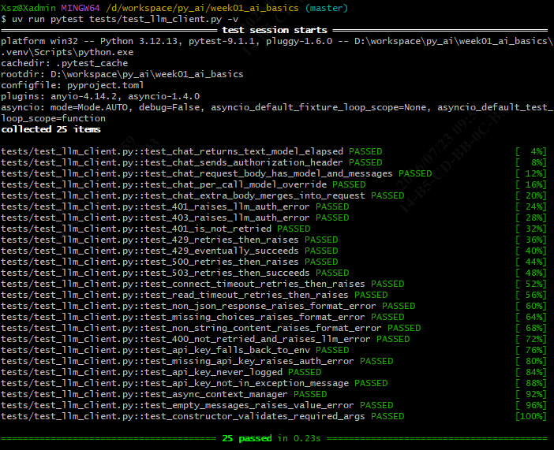      |
| 第 4 天 结构化输出 |  |
| 第 5 天 fastapi web端 |      |
| 第 5 天 测试 |    |
| 第 5 天 错误问题 |      |


