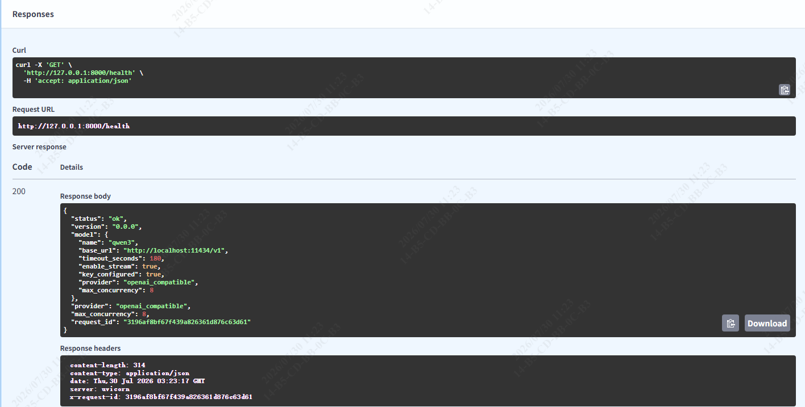
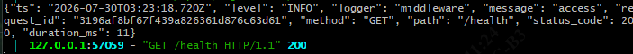
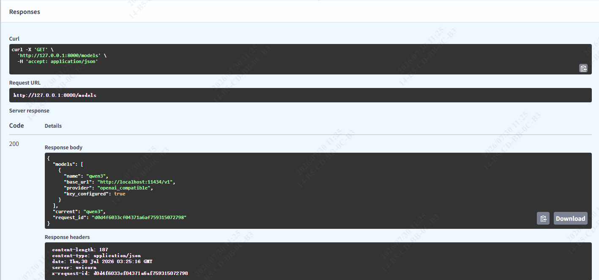
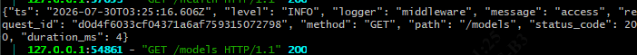
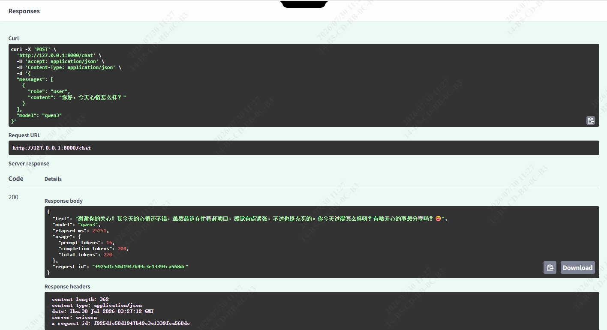
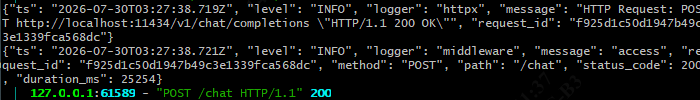
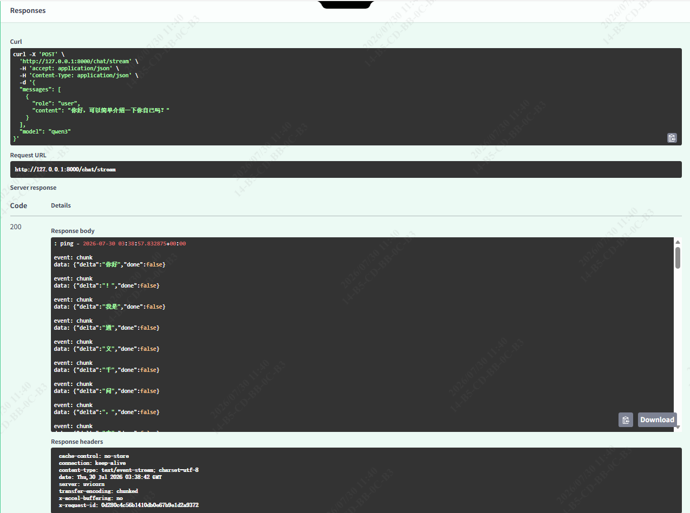
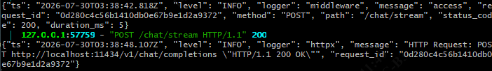
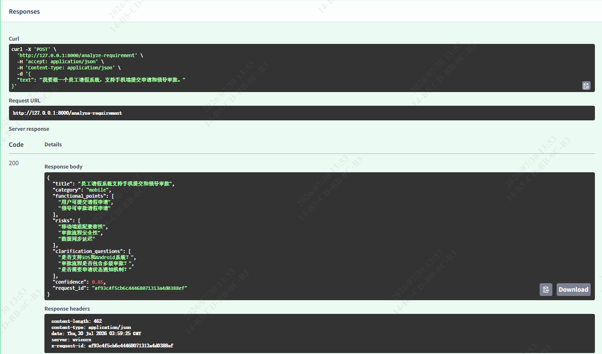
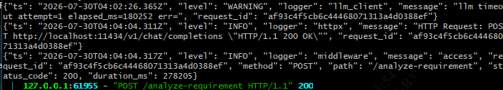

# Week 02 Summary — API 服务（FastAPI 模型网关）

> 周期：Day 6 – Day 10（2026-07-23 → 2026-07-30）
> 仓库：`week01_ai_basics`（pyproject name = `llm-gateway-demo`）
> 路线依据：Roadmap p.8「2 API」

---

## 1. 本周目标与完成情况

| Roadmap 周目标（p.8） | 对应实现 | 状态 |
|---|---|---|
| `llm_gateway_demo/chat / chat/stream / models / health` 四个端点 | `POST /chat`、`POST /chat/stream`、`GET /models`、`GET /health`（外加 Week 01 的 `/analyze-requirement`） | ✅ |
| `ModelClient` 接口 + Ollama 适配器 | `src/model_client.py`（`Protocol`）+ `src/llm_client.py`（Ollama 实现）+ `src/model_factory.py` | ✅ |
| 请求/响应 Model（FastAPI Request/Response Model） | `src/api_models.py`（`ChatChunk / ModelInfo / ModelsResponse / ErrorBody`） | ✅ |
| 中间件（Middleware） | `src/middleware.py`（`RequestIdASGIMiddleware` + `AccessLogASGIMiddleware`，纯 ASGI） | ✅ |
| Pydantic Settings | `src/config.py`（`BaseSettings` + `settings_customise_sources` 禁用 env 自动加载，含 8 个 Week 02 字段） | ✅ |
| `request_id` 贯穿请求链路 | `logging_config.request_id_var`（ContextVar）+ `RequestIdFilter` + 响应头 `X-Request-ID` | ✅ |
| JSON 日志 | `src/logging_config.py`（`configure_logging`，JSON formatter） | ✅ |
| ≥ 15 测试 | 本周测试用例**41**，总通过 **106 passed** | ✅ |
| `docs/week02_summary.md` | 本文档 | ✅ |

**结论**：Week 02 主要目标达成；两条通过标准干净 clone 可复现、切模型只改 `.env`。

---

## 2. 系统结构与关键数据流

```
                          ┌─────────────────────────────────────────┐
   客户端 ──POST请求────▶ │  FastAPI app (create_app)               │
   /chat                  │   middleware 层:                         │
   /chat/stream           │     AccessLogASGIMiddleware (最外层计时) │
   /models                │     RequestIdASGIMiddleware (注入 rid)   │
   /health                └───────────────┬─────────────────────────┘
                                          │ 依赖注入 settings
                                          ▼
                          ┌─────────────────────────────────────────┐
                          │  ModelClient (Protocol 抽象)             │
                          │    └── OllamaClient (llm_client.py)     │
                          │         ├─ chat()        同步式 JSON     │
                          │         └─ chat_stream()  SSE 增量解析   │
                          │              asyncio.Semaphore 限并发    │
                          └───────────────┬─────────────────────────┘
                                          │ httpx (JSON,流式)
                                          ▼
                                Ollama 后端 (localhost:11434/v1)
```

**关键数据流（在 `/chat/stream` 中）**
1. `RequestIdASGIMiddleware` 在请求入口生成 `rid` 并写入 `request_id_var`；
2. `create_app()` 经 `build_model_client(settings)` 构造客户端注入路由；
3. 路由调用 `client.chat_stream()` → httpx 流式读取 Ollama，逐 chunk 解析；
4. 每个 chunk 经 `sse-starlette.EventSourceResponse` 增量推回客户端；
5. 出向 httpx 日志与入向访问日志经同一 `request_id_var` 串起，便于溯源；
6. 异常统一经 `_map_llm_error(exc)` 映射为 `(HTTP 状态, 错误码)` 写入 `ErrorBody(request_id=rid)`。

---

## 3. 主要代码模块及职责

| 模块 | 新增功能（Week 2 / Day 6–9） |
|---|---|
| `src/config.py` | `AppConfig`升级为用 `pydantic-settings` 从 `.env` 集中读取配置；新增 api_key、模型服务地址、模型名、超时时间、最大并发数等 8 个配置项；`settings_customise_sources`显式关闭环境变量自动加载，避免误读系统变量造成污染。**作用：以后切模型、改地址只改 `.env`，不用动代码。** |
| `src/api_models.py` | 新增"流式响应块 `ChatChunk`"（用于打字机式一点一点返回）、"模型信息 `ModelInfo` / `ModelsResponse`"（让 `/models` 接口能返回可用模型），并给错误返回 `ErrorBody` 加上 `request_id` 字段。**作用：支撑流式对话接口、并方便按请求 ID 排查问题。** |
| `src/model_client.py` | 全新模块，定义模型客户端的统一接口（`chat` 一次性返回、`chat_stream` 流式返回），把"怎么调模型"抽象成一个协议。**作用：业务接口不再依赖具体模型后端，以后换 Ollama / 其他模型接口代码不动。** |
| `src/llm_client.py` | 新增流式对话方法 `chat_stream`（模型边生成边回传，前端能实时看到文字出现）；并加上并发控制（用信号量限制同时处理的请求数）。**作用：支撑 `/chat/stream` 流式接口、并防止一次性涌入太多请求把模型压垮。** |
| `src/model_factory.py` | 全新模块，一个"工厂"函数 `build_model_client`，根据配置自动造出对应的模型客户端。**作用：业务代码不用自己 `new` 客户端，换个模型只改配置，工厂自动造对的对象。** |
| `src/middleware.py` | 全新模块，给每个请求分配唯一 ID（request_id）并记录结构化访问日志（记录耗时、状态码，且不记录密码等敏感内容）；后来改成纯 ASGI 写法以兼容流式接口。**作用：方便按请求串联整条调用链、监控接口健康度。** |
| `src/logging_config.py` | 新增模块，把所有日志统一成 JSON 格式，并通过"上下文变量"把 request_id 自动贴到每一行日志上（连第三方库 httpx 发请求的那条日志也带上）。**作用：日志更好被机器解析、能按 request_id 把一次请求的所有日志串起来看。** |
| `src/app.py` | 新增 `/models` 接口（告诉前端当前能用哪个模型）和 `/chat/stream` 流式对话接口；把所有报错统一翻译成标准 HTTP 错误（一处定义、全局生效）；错误返回里也带上 `request_id`。**作用：接口更完整、报错更规范、便于排查。** |
| `src/main.py` | 调整入口，在模块加载时就生成 app 实例（`app = create_app()`）。**作用：让 `fastapi dev` 命令能直接找到并启动服务，避免"找不到 app"的问题。** |
| `tests/*` | 新增了一批用例————模型客户端接口契约测试、流式对话测试、并发测试、中间件测试、API 测试等，总用例从 65 增到 106。**作用：保证新加的功能不出回归、改了不坏。** |

> 注：`config.py` / `api_models.py` / `llm_client.py` / `app.py` / `main.py` 在 Week 1 已创建，本表只列其在 Week 2（Day 6–9）**新增/扩展**的部分；`model_client.py` / `model_factory.py` / `middleware.py` / `logging_config.py` 为 Week 2 **新增模块**。

---

## 4. 主要 Git Commit

```
(Day 6)
  d059320 | build: app: Add pydantic-settings and sse-starlette
  222468f | func: app: Upgrade the AppConfig configuration layer to Pydantic Settings
  c9febe9 | style: app: ruff format src/app.py
  0279116 | docs: app: Add the Day 6 task document              
(Day 7)
  9772231 | func: app: Add the ModelClient protocol
  b78be6c | func: app: Implement chat_stream in LlmClient and fix raise indentation
  a481995 | func: app: Add build_model_client factory for ModelClient instantiation
  8c8bf2a | func: app: Add ModelClient protocol contract and chat_stream tests
(Day 8)
  2a87e5c | func: app: Add request_id middleware, JSON logging and /models endpoint      
  f95d4c1 | docs: app: Add the Day 8 task document
(Day 9)
  000b85f | func: app: Add /chat/stream SSE endpoint, concurrency limit and pure-ASGI middleware 
  9488d00 | docs:  app: Add the Day 9 task document
```

---

## 5. 测试范围与结果

- **命令**：`uv run pytest -q`
- **结果**：`106 passed in 5.00s`
- **覆盖维度**：
  - 配置层：`test_config.py`（env / .env / 默认值 / 字段校验）
  - 协议契约：`test_model_client.py`（8 例，验证 `LlmClient` 满足 `ModelClient` Protocol）
  - 客户端：`test_llm_client.py`（含 `chat` 重试、`chat_stream` 流式解析）
  - 流式：`test_streaming.py`（8 例，SSE chunk 顺序与错误终止）
  - 并发：`test_concurrency.py`（4 例，Semaphore 限流）
  - 中间件：`test_middleware.py`（7 例，rid 注入/传播、访问日志字段）
  - API：`test_api.py`（含 13 个 exception handler、`request_id` 透传）
  - 结构化输出：`test_structured_output.py`（Week 01 遗留，`/analyze-requirement`）

### 5.1 Git Bash（推荐环境）中测试命令操作流程

```bash
# 1、进入项目根目录
cd /d/workspace/py_ai/week01_ai_basics

# 2、把 uv 加入 PATH（Git Bash 默认不在 PATH，每次新开终端需执行一次）
export PATH="/c/Users/Xsz/.local/bin:$PATH"

# 3、同步依赖（首次或改了 pyproject/uv.lock 后执行；生成 .venv）
uv sync

# 4、运行全量测试（预期 106 passed）
uv run pytest -q

# 5、只跑某类（按需，可选）
uv run pytest tests/test_llm_client.py -v      # 新增chat重试、chat_stream流式解析
uv run pytest tests/test_streaming.py -v       # SSE 流式 8 例
uv run pytest tests/test_concurrency.py -v     # 并发控制 4 例
uv run pytest tests/test_api.py -v             # API + 13 个 exception handler
uv run pytest tests/test_middleware.py -v      # request_id / 访问日志 7 例
uv run pytest tests/test_model_client.py -v    # ModelClient 协议契约 8 例

# 6、代码风格检查 + 自动格式化（提交前建议跑）
uv run ruff check src tests
uv run ruff format src tests
```

### 5.2 启动服务

```bash
# 环境：Git Bash（先 export PATH 同 §1 ②）
cd /d/workspace/py_ai/week01_ai_basics
uv run fastapi dev src/main.py

# 效果
 ⚡️ Starting FastAPI in development mode

 🐍 Using import string: main:app

 🌐 Server started at http://127.0.0.1:8000
    Documentation at http://127.0.0.1:8000/docs

  Logs:

 ▕  Will watch for changes in these directories: ['D:\\workspace\\py_ai\\week01_ai_basics']
 ▕  Uvicorn running on http://127.0.0.1:8000 (Press CTRL+C to quit)
 ▕  Started reloader process [25504] using WatchFiles
 ▕  Started server process [14368]
 ▕  Waiting for application startup.
 ▕  Application startup complete.
```
- 启动后可以访问：
  - Swagger UI：`http://127.0.0.1:8000/docs`
  - ReDoc：`http://127.0.0.1:8000/redoc`
  - OpenAPI JSON：`http://127.0.0.1:8000/openapi.json`
也可以使用 git bash 或 powershell 在命令终端发送curl请求

### 5.3 在 Git Bsah 中端口测试
```bash

# 1) /health 健康检查（GET）
curl -s http://127.0.0.1:8000/health

# 2) /models 列出可用模型（GET，不需要 body）
curl -s http://127.0.0.1:8000/models

# 3) /chat 普通对话（内联即可）
curl -s -X POST http://127.0.0.1:8000/chat \
  -H "Content-Type: application/json" \
  -d '{"messages":[{"role":"user","content":"Explain in one sentence what an API is"}]}'

# 4) /chat/stream 流式对话（NEW！必须加 -N 才能实时看到逐字输出）
curl -N -X POST http://127.0.0.1:8000/chat/stream \
  -H "Content-Type: application/json" \
  -d '{"messages":[{"role":"user","content":"Tell a cheesy joke"}]}'
#   返回的是 SSE 格式：data: {"delta":"...","done":false}  一行一片段，最后 data: {"done":true}
```

### 5.4 API文档截图

| 截图（Swagger UI） | 服务端访问日志 | 说明 |
|---|---|---|
|  |  | `GET /health`：HTTP 200，响应体含服务状态 `ok`、版本 `0.0.0`、当前模型配置（`qwen3` / `http://localhost:11434/v1` / 超时 120s / 流式开 / key 已配置 / 最大并发数8）及 `request_id`；响应头会带回 `x-request-id`，可验证 rid 链路贯通。 |
|  |  | `GET /models`：返回可用模型列表（当前 `qwen3`）与默认模型信息，含 `request_id`。 |
|  |  | `POST /chat`：中文普通对话，返回完整回复文本、模型名、token 用量（`prompt_tokens` / `completion_tokens` / `total_tokens`）、耗时 `elapsed_ms` 及 `request_id`。 |
|  |  | `POST /chat/stream`：SSE 流式逐 chunk 增量返回（`delta` 字段），末尾 `done:true`；访问日志记录流式完成。 |
|  |  | `POST /analyze-requirement`：结构化需求分析，返回 JSON（标题 / 分类 / 功能点 / 风险 / 澄清问题）。 |

---

## 6. 问题与定位过程

| # | 现象 | 根因 | 定位 / 修复 |
|---|---|---|---|
| 1 | `chat()` 遇 400 走成死循环 | `while True` 重试块里 `raise LlmError` 被错误缩进进循环 | 大块 Edit 后用 `git diff` 复查缩进，把 `raise` 移出循环。教训：改大块代码后必跑 `git diff` 核缩进。 |
| 2 | `uv run fastapi dev src/main.py` 报 `Could not find FastAPI app in module` | Day 9 用 `app = RequestIdASGIMiddleware(create_app())` 包裹，使 `app` 不再是 FastAPI 实例 | 改为在 `create_app()` 内 `app.add_middleware(RequestIdASGIMiddleware)`，`app` 仍是 FastAPI 实例（SSE 行为不变）。 |
| 3 | 测试中 3 个断言失败（rid/响应头不一致） | fixture 又 `RequestIdASGIMiddleware(fastapi_app)` 二次包裹 → 双重包裹 | 测试 fixture 直接用 `create_app()` 返回的完整应用，不再二次包裹。教训：测试不要再包裹已包裹的应用。 |
| 4 | 2 个 `test_config` 失败且跨 test 污染 | 某测试用 `os.environ["X"]="..."` 直接改环境，后续 `monkeypatch.delenv` 清不掉 | 一律改用 `monkeypatch.setenv`，不再直接碰 `os.environ`。 |
| 5 | SSE 流式响应 chunk 被合并/丢帧 | `BaseHTTPMiddleware` 缓存响应体，与流式不兼容 | Day 9 将 `RequestIdMiddleware` 替换为纯 ASGI 的 `RequestIdASGIMiddleware`；`AccessLogMiddleware` 留最外层（只取状态码，不碰 body）。 |
| 6 | Git Bash 里 `curl -d '{"messages":[{"role":"user","content":"你好"}]}'` 打本地 `/chat` 报 `{"detail":"There was an error parsing the body"}`（HTTP 400） | Windows 控制台输入代码页默认 936(GBK)：用中文产生 GBK 字节，curl 原样发出；FastAPI(Starlette) 只认 UTF-8，在 body 解析阶段即失败（access log `duration_ms:0` 印证未到模型层）。`LC_ALL=C.UTF-8` 只改"程序解读侧"，改不了键盘输入产生的字节，故仅设 locale 仍不行。服务端代码无 bug。 | 两条可靠解法：用 VS Code 存 UTF-8 文件 `req.json`，`-d @req.json` 发（完全绕开终端编码）；"content" 中直接用英文发送请求体即可识别 |

---

## 7. 使用 AI 辅助的内容及人工验证

- **AI 辅助产出**：本周的架构设计、测试骨架以及各天主要的文档笔记，由 AI 助手辅助完成，部分代码设计的注释也有 AI 辅助完成。
- **人工验证（用户侧）**：
  - 使用代码审查工具帮助完成编码设计过程中的错误；
  - 本机启动服务，用 Ollama 本地大模型后端跑通 `/chat`、`/chat/stream`，确认 HTTP 200 反馈与真实流式输出；
  - 用 `scripts/run_real_ollama.py` 跑通结构化输出，核对 `examples/structured_run_real.json`；
  - 测试服务程序并观察输出的服务日志，确认日志中 `request_id` 能串起 httpx 出向日志与访问日志；

---

## 8. 当前未解决问题

1. **目录结构重构未执行**：经 Roadmap 分析，确定应采用「单仓库 + 按关注点分包（`src/llm_gateway_demo/` 包，含 `api/ clients/`，后续 Week 加 `agents/ rag/ ...`）」而非「每周建文件夹 / 逐周拷贝」。该迁移尚未动手，需要一次性加 `__init__.py` + 改写 import + 改入口路径。
2. **uvicorn.access 冗余日志**：`middleware` 已记结构化访问日志，uvicorn 那路为纯文本冗余，可关（启动加 `--no-access-log` 或把 `uvicorn.access` 级别设 `WARNING`）。

---

## 9. 下周计划（Week 03 — Agent / Tool Calling）

- **路线目标（p.9）**：Agent Loop、LangChain v1 `create_agent`、`@tool` 装饰器；`DevAssistantAgent`（calculator / read_text_file / check_commit_message）；≥20 测试；`docs/week03_summary.md`。
- **与本周的衔接**：Week 03 的 Agent 将**复用本周的 `ModelClient` 抽象与 FastAPI 骨架**（在 `src/llm_gateway_demo/agents/` 下新增模块，沿用无环依赖：agents → clients → config），不平行开新 demo。
- **本周遗留前置**：先完成目录的规划，使包结构稳定，再开 Week 03 代码。
- **Gate 2 前瞻（Week 4）**：`API + Agent` 合并验收，本周打下的 `/chat` 等端点将作为 Agent 的对外接口。

---

## 10：本周学到的关键概念

| 概念 | 说明 | 代码位置 |
|---|---|---|
| Pydantic Settings | 能够帮助从环境变量里读取配置，并自动做类型检查和参数管理。用 `BaseSettings` 集中配置，避免硬编码；`settings_customise_sources` 禁用 env 自动加载 | `src/config.py`（`AppConfig`） |
| Request/Response Model | 给API规定传输模板，让输入输出按规定格式传递并校验数据。用 Pydantic 模型约束 HTTP 入参/出参，FastAPI 自动生成 OpenAPI | `src/api_models.py`（`ChatChunk`/`ModelInfo`/`ModelsResponse`/`ErrorBody`） |
| Middleware（ASGI） | 对请求进行检查和登记，并添加request_id标识。请求级横切逻辑（rid 注入、访问日志）；纯 ASGI 不缓存 body，兼容流式接口 SSE | `src/middleware.py`（`RequestIdASGIMiddleware`/`AccessLogASGIMiddleware`） |
| request_id 链路追踪 | 给每次请求分配身份编号。`ContextVar`增强变量隐私安全性的容器 + 日志 filter，把 rid 盖到所有日志（含第三方 httpx），便于跨服务溯源 | `src/logging_config.py`（`request_id_var`/`RequestIdFilter`）、`src/middleware.py` |
| Protocol / 适配器 | 用于约定实现类的接口规范。用 `Protocol` 定义模型客户端抽象，Ollama 只是其中一个实现，换后端不用改业务代码 | `src/model_client.py`（`ModelClient`）、`src/llm_client.py`（`LlmClient`） |
| 工厂模式 | 把对象的创建过程封装在一个函数里，管理更便捷。配置 → 客户端实例的构造集中在一处 | `src/model_factory.py`（`build_model_client`） |
| SSE 流式响应 | 服务器把响应内容分成很多小块，持续发送给客户端，客户端能够实时接收并显示。`sse-starlette.EventSourceResponse` + async generator，逐 chunk 推送 | `src/app.py`（`POST /chat/stream`）、`src/llm_client.py`（`chat_stream`） |
| 并发控制 | `asyncio.Semaphore` 限制同时打后端的请求数 | `src/llm_client.py`（`self._sem`） |
| JSON 结构化日志 | 统一 JSON formatter，便于采集/检索 | `src/logging_config.py`（`configure_logging`） |
| 异常单一映射 | LlmError 子类 → `(HTTP 状态, 错误码)` 唯一映射表，流式/非流式共用 | `src/app.py`（`_map_llm_error`） |
| 应用工厂 | `create_app()` 集中装配路由/中间件/handler，入口只调一次 | `src/app.py`、`src/main.py` |
