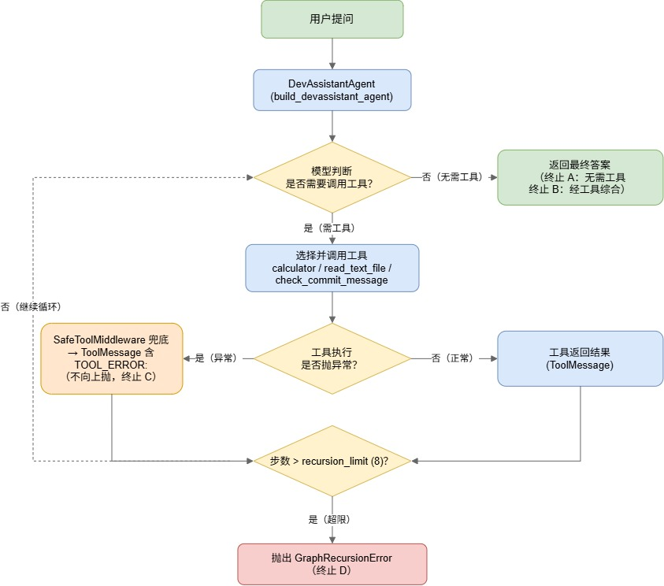
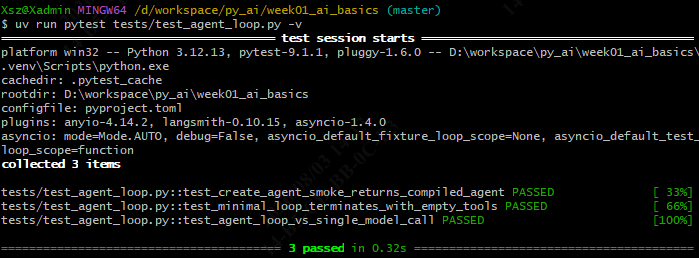
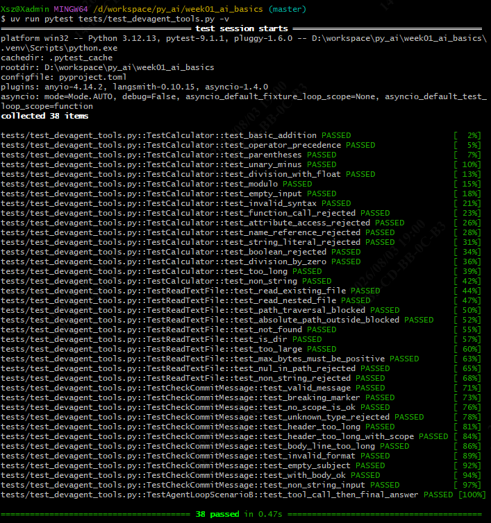
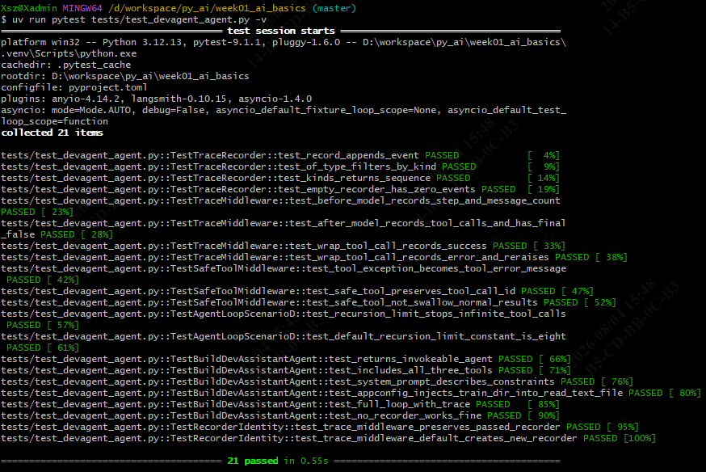
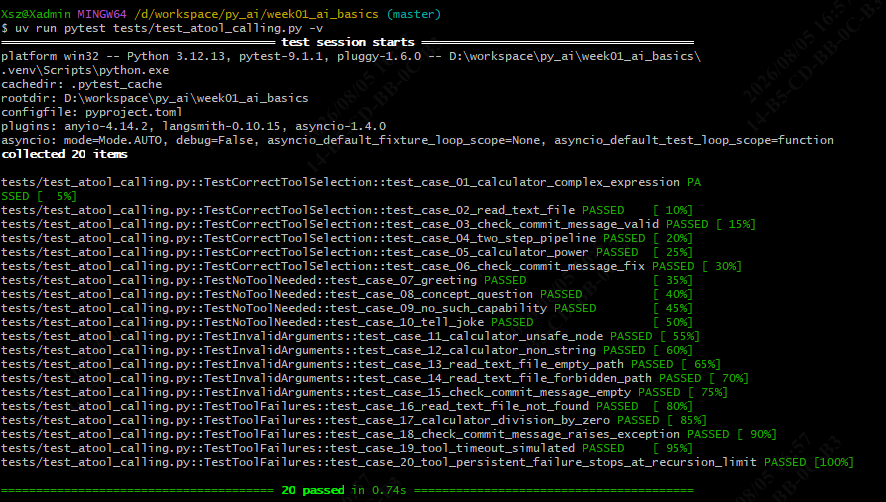
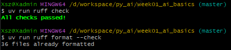
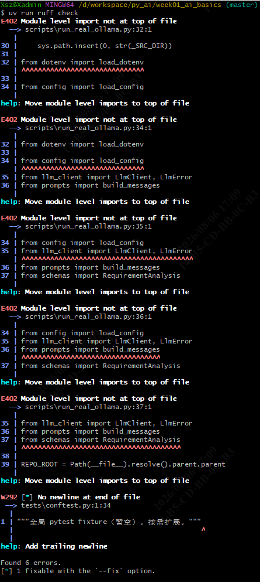

# Week 3 · 单 Agent 与 Tool Calling 周总结

> 仓库：南宁软件组 AI Agent 12 周 Roadmap · Week 3
> 路径：`D:\workspace\py_ai\week01_ai_basics\`
> 落档：2026-08-06

---

## 1. 目标

理解 **Agent Loop（智能体循环）**，并用 LangChain v1 的 `create_agent` 完成**可控的工具调用（Tool Calling）**。
交付一个 `DevAssistantAgent`，至少提供 `calculator` / `read_text_file` / `check_commit_message` 三个工具；限制文件读取范围（防路径穿越）；记录模型「为什么调工具 / 参数 / 结果 / 最终回答」；制作 20 条覆盖 4 类的用例。

**通过标准**：能讲清一次完整的 Agent Loop；工具失败时不会无限循环或直接崩溃。

---

## 2. 结构（含工具调用流程图）

### 2.1 工具调用流程图

> 源文件：`week03_agent_flow.drawio`，用 draw.io / diagrams.net 打开可编辑。

<details>
<summary>展开查看 draw.io 源码</summary>

```drawio
<mxfile host="app.diagrams.net" agent="workbuddy">
  <diagram id="week03-agent-flow" name="DevAssistantAgent 工具调用流程">
    <mxGraphModel dx="2474" dy="979" grid="1" gridSize="10" guides="1" tooltips="1" connect="1" arrows="1" fold="1" page="1" pageScale="1" pageWidth="820" pageHeight="840" math="0" shadow="0">
      <root>
        <mxCell id="0" />
        <mxCell id="1" parent="0" />
        <mxCell id="start" parent="1" style="rounded=1;whiteSpace=wrap;html=1;fontSize=14;fillColor=#d5e8d4;strokeColor=#82b366;" value="用户提问" vertex="1">
          <mxGeometry height="48" width="180" x="291" y="40" as="geometry" />
        </mxCell>
        <mxCell id="agent" parent="1" style="rounded=1;whiteSpace=wrap;html=1;fontSize=13;fillColor=#dae8fc;strokeColor=#6c8ebf;" value="DevAssistantAgent&lt;br/&gt;(build_devassistant_agent)" vertex="1">
          <mxGeometry height="52" width="200" x="281" y="128" as="geometry" />
        </mxCell>
        <mxCell id="decideTool" parent="1" style="rhombus;whiteSpace=wrap;html=1;fontSize=13;fillColor=#fff2cc;strokeColor=#d6b656;" value="模型判断&lt;br/&gt;是否需要调用工具？" vertex="1">
          <mxGeometry height="90" width="200" x="281" y="220" as="geometry" />
        </mxCell>
        <mxCell id="finalAnswer" parent="1" style="rounded=1;whiteSpace=wrap;html=1;fontSize=13;fillColor=#d5e8d4;strokeColor=#82b366;" value="返回最终答案&lt;br/&gt;（终止 A：无需工具&lt;br/&gt;终止 B：经工具综合）" vertex="1">
          <mxGeometry height="70" width="210" x="591" y="230" as="geometry" />
        </mxCell>
        <mxCell id="callTool" parent="1" style="rounded=1;whiteSpace=wrap;html=1;fontSize=13;fillColor=#dae8fc;strokeColor=#6c8ebf;" value="选择并调用工具&lt;br/&gt;calculator / read_text_file / check_commit_message" vertex="1">
          <mxGeometry height="60" width="220" x="271" y="350" as="geometry" />
        </mxCell>
        <mxCell id="decideExc" parent="1" style="rhombus;whiteSpace=wrap;html=1;fontSize=13;fillColor=#fff2cc;strokeColor=#d6b656;" value="工具执行&lt;br/&gt;是否抛异常？" vertex="1">
          <mxGeometry height="90" width="200" x="281" y="450" as="geometry" />
        </mxCell>
        <mxCell id="toolResult" parent="1" style="rounded=1;whiteSpace=wrap;html=1;fontSize=13;fillColor=#dae8fc;strokeColor=#6c8ebf;" value="工具返回结果&lt;br/&gt;(ToolMessage)" vertex="1">
          <mxGeometry height="70" width="210" x="591" y="460" as="geometry" />
        </mxCell>
        <mxCell id="middleware" parent="1" style="rounded=1;whiteSpace=wrap;html=1;fontSize=13;fillColor=#ffe6cc;strokeColor=#d79b00;" value="SafeToolMiddleware 兜底&lt;br/&gt;→ ToolMessage 含 TOOL_ERROR:&lt;br/&gt;（不向上抛，终止 C）" vertex="1">
          <mxGeometry height="90" width="180" x="11" y="450" as="geometry" />
        </mxCell>
        <mxCell id="decideRec" parent="1" style="rhombus;whiteSpace=wrap;html=1;fontSize=13;fillColor=#fff2cc;strokeColor=#d6b656;" value="步数 &gt; recursion_limit (8)？" vertex="1">
          <mxGeometry height="90" width="200" x="281" y="580" as="geometry" />
        </mxCell>
        <mxCell id="graphRec" parent="1" style="rounded=1;whiteSpace=wrap;html=1;fontSize=13;fillColor=#f8cecc;strokeColor=#b85450;" value="抛出 GraphRecursionError&lt;br/&gt;（终止 D）" vertex="1">
          <mxGeometry height="52" width="240" x="261" y="730" as="geometry" />
        </mxCell>
        <mxCell id="e0" edge="1" parent="1" source="start" style="edgeStyle=orthogonalEdgeStyle;rounded=0;html=1;endArrow=block;strokeColor=#666666;" target="agent">
          <mxGeometry relative="1" as="geometry" />
        </mxCell>
        <mxCell id="e1" edge="1" parent="1" source="agent" style="edgeStyle=orthogonalEdgeStyle;rounded=0;html=1;endArrow=block;strokeColor=#666666;" target="decideTool">
          <mxGeometry relative="1" as="geometry" />
        </mxCell>
        <mxCell id="e2" edge="1" parent="1" source="decideTool" style="edgeStyle=orthogonalEdgeStyle;rounded=0;html=1;endArrow=block;fontSize=12;strokeColor=#666666;exitX=1;exitY=0.5;" target="finalAnswer" value="否（无需工具）">
          <mxGeometry relative="1" as="geometry" />
        </mxCell>
        <mxCell id="e3" edge="1" parent="1" source="decideTool" style="edgeStyle=orthogonalEdgeStyle;rounded=0;html=1;endArrow=block;fontSize=12;strokeColor=#666666;exitX=0.5;exitY=1;" target="callTool" value="是（需工具）">
          <mxGeometry relative="1" as="geometry" />
        </mxCell>
        <mxCell id="e4" edge="1" parent="1" source="callTool" style="edgeStyle=orthogonalEdgeStyle;rounded=0;html=1;endArrow=block;strokeColor=#666666;" target="decideExc">
          <mxGeometry relative="1" as="geometry" />
        </mxCell>
        <mxCell id="e5" edge="1" parent="1" source="decideExc" style="edgeStyle=orthogonalEdgeStyle;rounded=0;html=1;endArrow=block;fontSize=12;strokeColor=#666666;exitX=1;exitY=0.5;" target="toolResult" value="否（正常）">
          <mxGeometry relative="1" as="geometry" />
        </mxCell>
        <mxCell id="e6" edge="1" parent="1" source="decideExc" style="edgeStyle=orthogonalEdgeStyle;rounded=0;html=1;endArrow=block;fontSize=12;strokeColor=#666666;exitX=0;exitY=0.5;" target="middleware" value="是（异常）">
          <mxGeometry relative="1" as="geometry" />
        </mxCell>
        <mxCell id="e7" edge="1" parent="1" source="toolResult" style="edgeStyle=orthogonalEdgeStyle;rounded=0;html=1;endArrow=block;strokeColor=#666666;exitX=0.5;exitY=1;entryX=1;entryY=0.5;" target="decideRec">
          <mxGeometry relative="1" as="geometry">
            <Array as="points">
              <mxPoint x="696" y="625" />
            </Array>
          </mxGeometry>
        </mxCell>
        <mxCell id="e8" edge="1" parent="1" source="middleware" style="edgeStyle=orthogonalEdgeStyle;rounded=0;html=1;endArrow=block;strokeColor=#666666;exitX=0.5;exitY=1;entryX=0;entryY=0.5;" target="decideRec">
          <mxGeometry relative="1" as="geometry">
            <Array as="points">
              <mxPoint x="101" y="625" />
            </Array>
          </mxGeometry>
        </mxCell>
        <mxCell id="e9" edge="1" parent="1" source="decideRec" style="edgeStyle=orthogonalEdgeStyle;rounded=0;html=1;endArrow=block;fontSize=12;strokeColor=#666666;exitX=0.5;exitY=1;" target="graphRec" value="是（超限）">
          <mxGeometry relative="1" as="geometry" />
        </mxCell>
        <mxCell id="e10" edge="1" parent="1" source="decideRec" style="edgeStyle=orthogonalEdgeStyle;rounded=0;html=1;endArrow=block;fontSize=12;strokeColor=#666666;dashed=1;exitX=0;exitY=0.5;entryX=0;entryY=0.5;entryDx=0;entryDy=0;" target="decideTool" value="否（继续循环）">
          <mxGeometry relative="1" as="geometry">
            <Array as="points">
              <mxPoint x="1" y="625" />
              <mxPoint x="1" y="265" />
            </Array>
          </mxGeometry>
        </mxCell>
      </root>
    </mxGraphModel>
  </diagram>
</mxfile>
```
</details>

截图如下：



**读法**：
- 正常闭环 = 终止条件 **B**：模型调工具 → 工具返回结果 → 模型再决定（继续或 结束）。
- 工具**异常**时由 `SafeToolMiddleware` 接住，转成 `TOOL_ERROR:` 开头的 `ToolMessage` 交还模型（**不向上冒泡**），模型据此重试或改路径 = 终止条件 **C** 的兜底。
- `recursion_limit=8` 限制循环最大步数，超过即抛 `GraphRecursionError` = 终止条件 **D**，防止无限循环。

### 2.2 主要结构

```
src/devagent/
  __init__.py
  dev_assistant_agent.py   # 工厂 build_devassistant_agent
  middleware.py            # TraceRecorder / TraceMiddleware / SafeToolMiddleware
  tools/
    __init__.py
    calculator.py
    read_text_file.py
    check_commit_message.py

tests/
  test_agent_loop.py       # 3  (Day 1 / day11)
  test_devagent_tools.py   # 38 (Day 2 / day12)
  test_devagent_agent.py   # 21 (Day 3 / day13)
  test_atool_calling.py    # 20 (Day 4 / day14)
```

---

## 3. 模块（本周新增功能）

| 模块 | 新增功能 |
| --- | --- |
| `dev_assistant_agent.build_devassistant_agent(model, *, config, recorder, with_safe_tool)` | 组装 agent + `SYSTEM_PROMPT` + 中间件；把 `AppConfig` 注入 `read_text_file`；暴露 `DEFAULT_RECURSION_LIMIT=8`、`SYSTEM_PROMPT` |
| `middleware.TraceRecorder` | `append-only` 事件列表，按 kind 区分 `before_model` / `after_model` / `tool_call`，供追踪与测试断言 |
| `middleware.TraceMiddleware` | 在 Agent Loop 三个钩子里写 trace（不修改 state、不吞异常） |
| `middleware.SafeToolMiddleware` | `awrap_tool_call` 用 `try/except` 接住工具异常 → `TOOL_ERROR:` 开头的 `ToolMessage`（不冒泡） |
| `tools.calculator` | AST 白名单安全算术（`+ - * / %`） |
| `tools.read_text_file` | 只读沙箱，限定 `train_dir`，防路径穿越 |
| `tools.check_commit_message` | 校验 commit 消息是否符合团队规范 |
| `tools.__init__` | 直接导出三个函数，便于喂给 `create_agent` |

**`TraceMiddleware` 钩子说明（钩子 = 框架在固定时机自动调用的方法，v1 异步故以 `a` 开头）**：

- **`abefore_model`（模型调用前）**：每轮模型"思考"前触发。记 `step` 步数 +1、当前 `message_count`，用于诊断消息是否异常膨胀。
- **`aafter_model`（模型调用后）**：模型产出一条回复后触发。从最新 AIMessage 抽取 `tool_calls`（工具名 + 参数 + id）、是否 `has_final`、回答预览，记进 trace。
- **`awrap_tool_call`（包裹工具执行）**：工具被调用前后触发。成功记 `result_preview`；失败记 `error` 后 **raise**（不吞，兜底交给 `SafeToolMiddleware`）。

三个钩子一前一后一包，正好覆盖一次 Agent Loop 的关键节点；它们只往 `TraceRecorder.events` 追加 dict（按 `kind` 区分 `before_model`/`after_model`/`tool_call`），用于事后排查与测试断言。

---

## 4. commit

| Hash | 时间 | 类型 | 说明 |
| --- | --- | --- | --- |
| `3c8a92a` | 2026-08-03 | func | Add Agent Loop functionality and integrate with LangChain v1 |
| `1b4d8ce` | 2026-08-03 | func | Add DevAssistantAgent tools with sandboxing, validation and tests |
| `fbebd82` | 2026-08-04 | func | Add DevAssistantAgent factory and agent tests |
| `c782574` | 2026-08-04 | func | Add DevAssistantAgent middleware |
| `70680f3` | 2026-08-05 | func | Add test cases covering correct tool selection, no tool needed, incorrect parameters, and tool failure |
| `13ded28` | 2026-08-06 | fix | Fix ruff issues in the file |

---

## 5. 测试与结果

Week 3 新增测试用例：

| 文件 | 用例数 | 覆盖 |
| --- | --- | --- |
| `test_agent_loop.py` | 3 | Agent Loop 四个终止条件 |
| `test_devagent_tools.py` | 38 | 三个工具（含边界 / 越权 / 结构化错误） |
| `test_devagent_agent.py` | 21 | 中间件 / 追踪 / 工厂 |
| `test_atool_calling.py` | 20 | 4 类：正确选工具 6 / 无需工具 4 / 错误参数 5 / 工具失败 5 |

**全部测试**：`188 passed`；`ruff check` 与 `ruff format --check` 通过， `scripts/run_real_ollama.py` 的 E402 per-file-ignore 与 `tests/conftest.py` 末尾换行已修复。

### 结果截图
- agent 循环体
  
  

- 三个工具
  
  

- 中间件、追踪标识及工厂
  
  

- 20条测试用例
  
  

- 项目整体 ruff 检测
  
  

---

## 6. 遇到并修正的问题

- **幂运算问题**：工具 `calculator` 不支持 `**`（比如 `2**10`），因为安全白名单没放行（配置）这种运算。改用十个 `2` 连乘（`2*2*2*…`），结果一样是 1024。
- **空路径实际上走得通**：给 `read_text_file` 传空字符串 `""`，它被解析成当前目录（是个文件夹），返回"这是目录"而不是"文件不存在"。测试断言要匹配 `is_dir`，不能当"路径错误"处理。
- **传错参数类型**：`calculator` 要字符串，但测试传了数字 `123`。框架发现类型不对，自动返回一条带 `status="error"` 的消息告诉模型"你传错了"——这是框架自己处理的，跟后面中间件兜底的 `TOOL_ERROR:` 是两码事：前者是"参数不对"，后者是"执行时崩了"。同时保证 agent 循环。
- **让工具故意失败不那么容易**：想测"工具崩了怎么兜底"，但项目自带的工具是真实函数，没法在测试里让它故意抛错。换了个做法：在测试里自己写几个"一调就崩"的假工具（`boom_check` 抛 `ValueError`、`boom_calc` 抛 `TimeoutError` / `RuntimeError`），用 `create_agent` 直接搭一个带 `SafeToolMiddleware` 的 Agent，验证中间件能把崩溃转成 `TOOL_ERROR:` 消息，整个程序不会挂掉。
- **全量检查发现 6 个旧代码规范问题**：跑 `ruff check` 时，启动脚本 `run_real_ollama.py` 有 5 行 import 被报"不在文件最顶上"（因为它必须先加搜索路径才能 import 项目里的模块，是最开始没有改好的内容）；`tests/conftest.py` 文件末尾少一个换行。修法：在 `pyproject.toml` 里给启动脚本豁免这条规则，用 `ruff format` 自动补上换行。修完后 ruff 全绿。

### ruff 错误截图
  
  

---

## 7. AI 辅助及人工验证

- **AI 辅助产出**：本周的 DevAssistantAgent 代码架构以及 Agent 层测试用例，由 AI 辅助完成。各天文档笔记、工具调用流程图（Mermaid + draw.io）、Agent Loop 四个终止条件的梳理、测试假模型 FakeToolCapableChatModel 的设计思路、两类错误（工具自身失败 与 中间件兜底）的区分，由 AI 协助理清。
- **人工验证**：
  - 本机跑 ruff check / ruff format / 全量 pytest，每个 Day 交付后确认通过（全量从 168 增到 188 passed）；
  - 发现并修正 ruff 6 个旧代码规范问题（启动脚本 import 顺序错误 + conftest 缺末尾换行）；
  - 逐条审核 20 条用例的 4 类覆盖（正确选工具 / 无需工具 / 错误参数 / 工具失败）是否符合预期；
  - 用 draw.io 画出 Agent Loop 流程图，逐个检查四个终止条件与中间件兜底路径是否准确。

---

## 8. 暂未解决

- **Agent 未接真实模型**：`DevAssistantAgent` 目前仅用 `FakeToolCapableChatModel`（假模型，按预设返回）跑 pytest，从未用 `.env` 中已配的真实 API 跑过。`src/app.py` 仍连接旧的 `LlmClient`，与 Agent 是完全割裂的两套代码。
- **没有交互入口**：Agent 既没有终端 REPL、也没有 Web 聊天界面，目前只能通过测试框架间接使用。
  （本周聚焦 Agent 逻辑与测试覆盖，目前暂无真实模型接入和交互界面实现准备）

---

## 9. 下周计划

- **Week 4：Dify Workflow 快速原型与 Code-first 对照**
- 概念：Dify 中 Workflow / Chatflow / Agent / Knowledge / Tool / Plugin 的边界；输入变量、LLM 节点、参数提取、IF/ELSE、Code、Tool、Output 节点的用法。
- 任务：
  1. 跑通 Dify 30 分钟 Quickstart，形成可运行截图；
  2. 在 Dify 中复现 Week 3 DevAssistantAgent 的简化场景；
  3. 搭建"需求文本 → 参数提取 → 分类 → 风险分析 → 结构化输出"Workflow；
  4. 通过 Dify API 调用工作流，用 FastAPI 包装成统一接口；
  5. 产出 Dify vs 代码版（`src/devagent/`）在调试、版本管理、扩展、部署上的对比报告。

---

## 10. 概念及代码位置表

| 概念 | 简要说明 | 代码位置 |
| --- | --- | --- |
| Agent Loop | 模型与工具反复交互直到产出最终答案的循环过程 | `src/devagent/dev_assistant_agent.py`（`create_agent` 编译为 `CompiledStateGraph`） |
| 代理工厂 | 组装模型+工具+中间件+系统提示词，返回可运行的 Agent | `src/devagent/dev_assistant_agent.py:build_devassistant_agent` |
| 系统提示词 | 定义 Agent 角色（研发助手）和能力边界 | `src/devagent/dev_assistant_agent.py:SYSTEM_PROMPT` |
| 递归上限 | 限制 Agent Loop 最大步数，防止无限循环 | `DEFAULT_RECURSION_LIMIT = 8`（`dev_assistant_agent.py`） |
| 工具：计算器 | 安全算术，AST 白名单仅放行 `+ - * / %` | `src/devagent/tools/calculator.py` |
| 工具：读文件 | 只读沙箱，限定训练目录，防路径穿越 | `src/devagent/tools/read_text_file.py`（沙箱 + 防穿越） |
| 工具：校验提交 | 检查 commit 消息是否符合规范格式 | `src/devagent/tools/check_commit_message.py` |
| 追踪记录器 | append-only 事件列表，按 kind 区分 before_model / after_model / tool_call | `src/devagent/middleware.py:TraceRecorder` |
| 追踪中间件 | 在钩子中记录 Agent Loop 关键节点，不修改状态、不吞异常 | `src/devagent/middleware.py:TraceMiddleware` |
| 安全中间件（兜底） | 工具抛异常时转为 `TOOL_ERROR:` 消息，不让程序崩溃 | `src/devagent/middleware.py:SafeToolMiddleware` |
