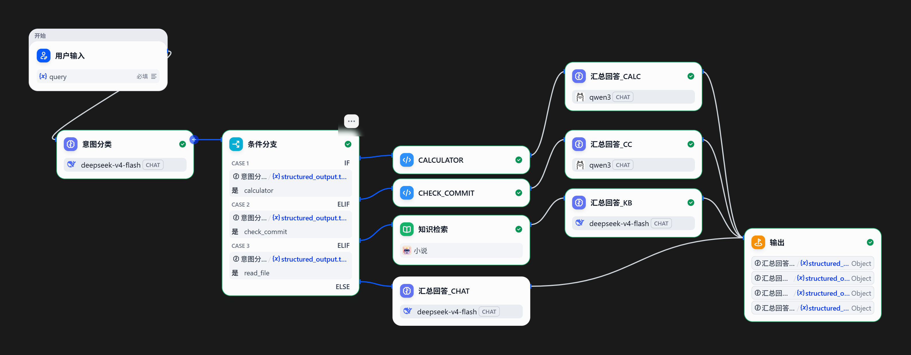
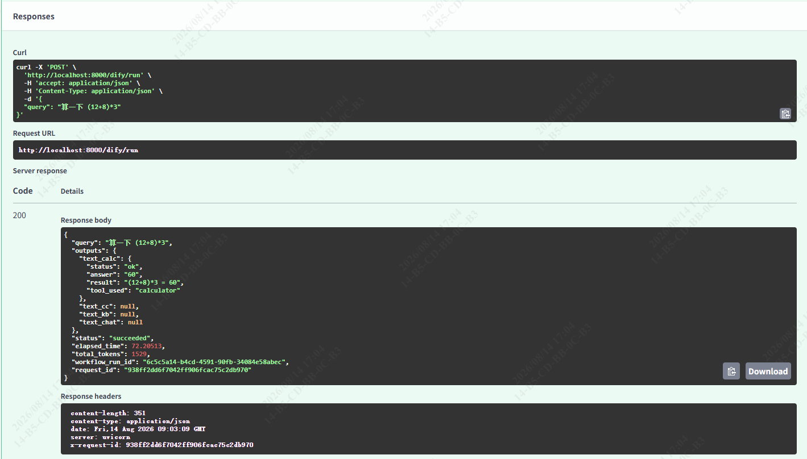
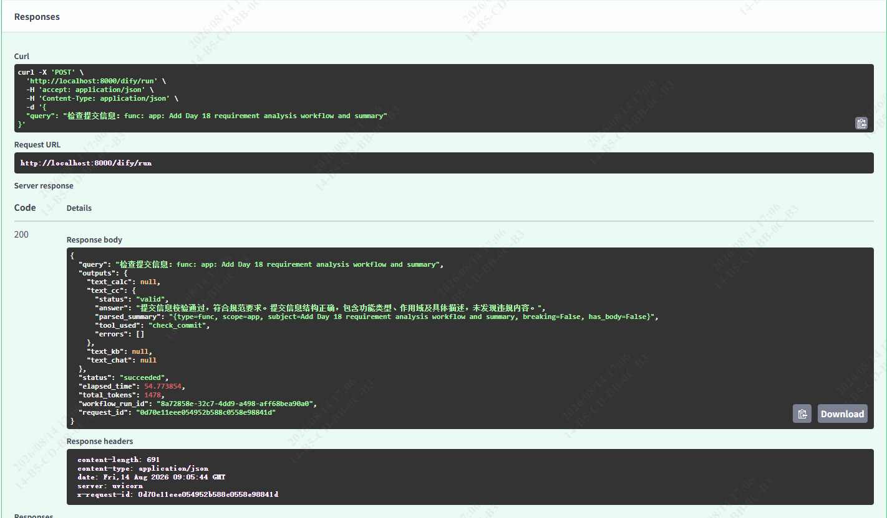
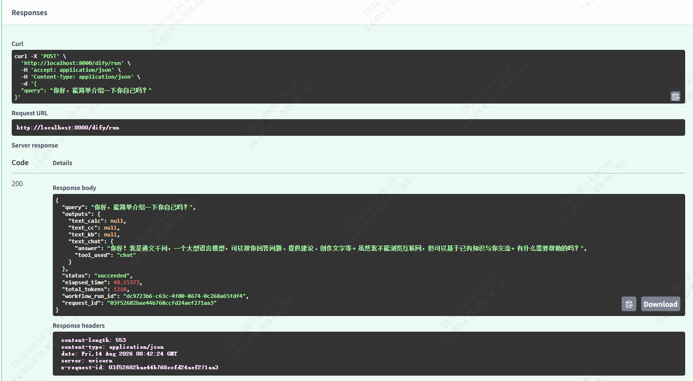
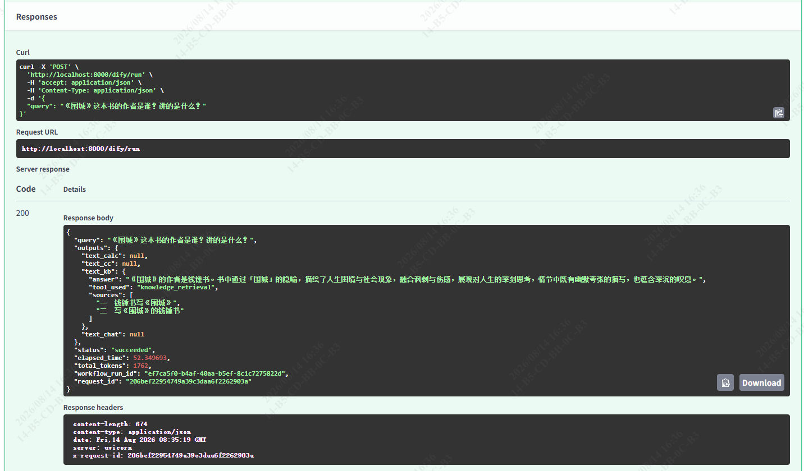

# Week 4 · Dify Workflow：快速原型与 Code-first 对照 周总结

> 仓库：南宁软件组 AI Agent 12 周 Roadmap · Week 4
> 路径：`D:\workspace\py_ai\week01_ai_basics\`
> 落档：2026-08-14

---

## 1. 目标

用可视化工作流理解节点、变量、分支和知识检索，并与代码版 Agent 对照。

Roadmap 阶段任务（第 4 周）：
1. 在 Dify 中复现第 3 周 `DevAssistantAgent` 的一个简化场景（Day 17）；
2. 搭建"需求文本 → 参数提取 → 分类 → 风险分析 → 结构化输出"Workflow（Day 18）；
3. 通过 Dify API 调用已发布工作流，并由 FastAPI 包装成统一接口（Day 19）；
4. 写出 Dify 版与代码版在调试、版本管理、扩展和部署上的对比（Day 20，本报告 `docs/day20_dify_vs_code_report.md`）。


---

## 2. 结构

```
src/
  app.py              # 新增 POST /dify/run 通用透传路由（约 631 行）
  api_models.py       # 新增 DifyRunRequest / DifyRunResponse（outputs 透传）
  dify_client.py      # 新增 DifyWorkflowClient 异步客户端
  devagent/           # Week 3 代码版 Agent（本周未改，作为对照基线）
scripts/
  call_dify_workflow.py   # Dify 工作流调用 / 校验脚本
dify_workflows/
  DevAssistantAgent_Dify.yml   # Day 17 四分支工作流 DSL（已含 §10 修正）
  RequirementAnalysis_Dify.yml # Day 18 需求分析工作流 DSL
tests/
  test_dify_client.py   # 3 passed（Day 19）
  test_app_dify.py      # 3 passed（Day 19）
docs/
  day16_dify_concepts.md / day17_* / day18_task_summary.md / day19_task_summary.md
  day20_dify_vs_code_report.md
  week04_summary.md（本文件）
```

---

## 3. 模块（本周新增功能）

| 模块 | 新增功能 |
| --- | --- |
| `dify_client.DifyWorkflowClient` | 封装 Dify Workflow `blocking` 调用的异步 httpx 客户端；支持 `api_key` / `base_url` / `timeout`；未配置 key 抛 `ValueError`；返回 `DifyRunResult`（含 `outputs` / `elapsed_time` / `total_tokens`） |
| `api_models.DifyRunRequest` / `DifyRunResponse` | Pydantic v2 请求/响应模型；`outputs: dict[str, Any]` 透传，**不写死任何工作流字段** |
| `app.POST /dify/run` | FastAPI 通用透传端点：接收 `{query}` → 调用 `DifyWorkflowClient` → 返回 `{query, outputs, status, elapsed_time}`；靠 `.env` 的 `DIFY_API_KEY` 决定调哪个工作流；调用处 `timeout=300` |
| `scripts/call_dify_workflow.py` | 本机直连 Dify API 的调用 / 校验脚本（联调用） |
| `dify_workflows/DevAssistantAgent_Dify.yml` | Day 17 四分支工作流 DSL（calculator / check_commit / knowledge_retrieval / chat），已修正 4 个汇总节点元 Schema 并重新导出 |
| `dify_workflows/RequirementAnalysis_Dify.yml` | Day 18 需求分析工作流 DSL |
| Day 17/18/19 任务文档、Day 20 对比报告与总结文档 |  |

---

## 4. commit

| Hash | 时间 | 类型 | 说明 |
| --- | --- | --- | --- |
| `fe687a7` | 2026-08-11 | func | Add Dify configuration and Dify API validation script |
| `743c0f2` | 2026-08-11 | docs | Add daily task documentation |
| `8fadee0` | 2026-08-12 | fix | Fix incorrect content format definition in tools and adjust test cases accordingly |
| `66f971e` | 2026-08-12 | docs | Add design document for reproducing DevAssistantAgent with Dify |
| `91a81cc` | 2026-08-13 | docs | Add day 17 task summery document |
| `6b709d8` | 2026-08-14 | func | Update task note documentation and archive workflow DSL |
| `438ad4a` | 2026-08-14 | docs | Add Day 18 requirement analysis workflow and summary |
| `b465ca7` | 2026-08-14 | func | Add generic Dify workflow proxy endpoint POST /dify/run |
| `013570d` | 2026-08-14 | fix | Fix the issue where the timeout value is too small |
| `1ae17c4` | 2026-08-14 | docs | Update the prompt configuration content in the design document |
| `6c8c1a2` | 2026-08-14 | docs | Update document content and update the DSL |
| `45cd39e` | 2026-08-14 | docs | Add Day 19 task note documentation |

---

## 5. 测试与结果

| 文件 | 用例数 | 覆盖 |
| --- | --- | --- |
| `tests/test_dify_client.py` | 3 | 客户端初始化校验（缺 key 抛错）、`run()` 成功、参数/异常分支 |
| `tests/test_app_dify.py` | 3 | `POST /dify/run` 路由成功 / 参数校验 / 异常分支 |

**全量回归**：`uv run pytest -q` → **194 passed**（Week 3 为 188 passed，本周新增 6 项 Dify 相关）。
**代码检查**：`ruff check` 与 `ruff format --check` 全过。

### 本机 API 联调（真实本地模型）



通过 `POST /dify/run`（`DIFY_API_KEY` 指向 `DevAssistantAgent_Dify`）跑通四分支：

- **calculator**：`(12+8)*3` → `{status:"ok", answer:"60", result:"(12+8)*3 = 60", tool_used:"calculator"}`
- **check_commit**：`func: app: Add Day 18...` → `{status:"valid", errors:[], parsed_summary:"type=func, scope=app, ..."}`
- **knowledge_retrieval**：「《围城》作者是谁？」→ 召回真实片段并带 `sources`；「查找苏小姐」→ 基于片段返回（经 Top K / Score 阈值 / 检索模式 / Prompt 调优后）
- **chat**：「你好，能简单介绍一下你自己吗？」→ `{answer, tool_used:"chat"}`

各分支 API 调用结果截图：









---

## 6. 失败案例与修正

- **`test_missing_api_key` 不抛错**：原 `api_key or os.getenv(...)` 遇空串回退到环境变量，校验失效。改为 `api_key if api_key is not None else os.getenv(...)`（显式空串即视为未配置）。
- **本机 504 超时**：Dify 本地模型阻塞模式约 60s 才返回，原 `timeout=60.0` 压线超时。接口调用处改为 `DifyWorkflowClient(timeout=300)`（5 分钟），客户端默认 60s 不变。
- **Day 17 四汇总节点元 Schema 问题**：已发布工作流的 4 个「汇总回答」节点把业务字段填成 `{type, description}` 嵌套对象，导致 API 返回元 Schema 本身或字段重复填同一段结论。逐个改为干净业务 Schema（`string` / `array[string]`），并在 `docs/day17_dify_repro_design.md` §10 给出逐节点修正步骤 + 重新导出 DSL。
- **知识检索分支返回「知识库未检索到相关内容」**：知识检索其实召回了含「方鸿渐」的真实片段，但原 System Prompt 把"单句不够答身份"误判为"无相关结果"并丢弃 source。简化 Prompt 为两分支（result 空才判未检索到；有片段即基于片段作答并保留 sources）。
- **知识检索答案单薄**：只召回 1 个 chunk。调知识检索参数 Top K 10–15、Score 阈值 0.3、检索模式向量+全文后，多片段进 context，答案更完整。
- **`check_commit` 工具范围误读**：该工具只校验 commit 消息文本格式，不读取 git 仓库；纠正后文档与联调结论一致。

---

## 7. AI 辅助及人工验证

- **AI 辅助产出**：FastAPI `POST /dify/run` 通用接口设计、Dify 客户端封装、`test_missing_api_key` 修复思路、知识检索分支 Prompt 与检索参数调优方案，均由 AI 协助分析。
- **人工验证**：
  - 本机实跑四分支联调，逐条核对返回字段类型（全为干净 `string` / `array[string]`，无元 Schema 嵌套）；
  - Devassistantagent_Dify 工作流 结构化输出 Schema 问题定位与逐节点修正步骤；
  - 在 Dify 画布手动修正 4 个汇总节点 + 重发工作流 + 重新导出 DSL，确认 API 生效；
  - 调知识检索参数后重测输入的问题，确认多片段召回；
  - 跑 `ruff check` / `ruff format --check` / 全量 `pytest`，确认 194 passed；
  - 逐 commit 审核本周 12 条提交的主题与范围是否符合 `type: scope: subject` 约定。

---

## 8. 暂未解决

- **代码版 Agent 仍未接真实模型、无 HTTP 入口**：`src/devagent/` 仅用假模型跑 pytest，与 `src/app.py` 旧 `LlmClient` 仍割裂（Week 3 已记，本周未动）。下一步可参照 Day 19 的 `POST /dify/run` 模式，给代码版也包一层 FastAPI。
- **代码版无 RAG 能力**：知识检索仅 Dify 版具备，代码版需 Week 5–6 接入 Qdrant。
- **Dify 版 DSL 版本可读性弱**：`*.yml` 含自动生成 ID / 坐标，diff 噪声大；依赖"改完即导出 + 提交"纪律，需持续遵守。
- **可观测性未接 Langfuse**：Dify 运行历史在 UI 内，结构化长期 trace 待 Week 10 接入。

---

## 9. 下周计划

- **Week 5：RAG 基础——文档、切分、Embedding 与 Qdrant**
  - 概念：文档解析、Chunk、Overlap、Metadata、Embedding、向量距离、TopK；检索与生成职责分离；召回错误 / 上下文污染 / 幻觉来源。
  - 任务：
    1. 用公开训练资料建小型知识库（≥30 个文档片段）；
    2. 先用 Python 列表实现最小相似度检索，再迁移到 Qdrant；
    3. 检索接口必须返回 `chunk_id` / `source` / `score` / `text`，不先调 LLM；
    4. 准备 20 个检索问题，人工标注期望来源，统计 Recall@K。
  - 交付物：`ingestion.py` / `retriever.py` / Qdrant 配置 / 20 条检索集 / 检索评测报告。

---

## 10. 概念及代码位置表

| 概念 | 简要说明 | 代码位置 |
| --- | --- | --- |
| `POST /dify/run` | FastAPI 通用透传端点，接收 `{query}`，返回 `{query, outputs, status, elapsed_time}`；靠 `DIFY_API_KEY` 切换工作流 | `src/app.py:631` |
| `DifyWorkflowClient` | 封装 Dify Workflow API 的异步 httpx 客户端；`api_key`/`base_url`/`timeout`；缺 key 抛 `ValueError` | `src/dify_client.py` |
| `DifyRunRequest` / `DifyRunResponse` | Pydantic v2 模型，`outputs: dict[str, Any]` 透传，不限制具体工作流输出字段 | `src/api_models.py` |
| 通用接口切工作流 | 改 `.env` 的 `DIFY_API_KEY` 为对应工作流 app key；`DIFY_BASE_URL` 本地默认 `http://localhost/v1`，Cloud 用 `https://api.dify.ai/v1` | `.env` |
| `DevAssistantAgent_Dify.yml` | Day 17 四分支工作流 DSL，已含 §10 元 Schema 修正 | `dify_workflows/` |
| `RequirementAnalysis_Dify.yml` | Day 18 需求分析工作流 DSL | `dify_workflows/` |
| 元 Schema 修正 | 4 个汇总 LLM 节点结构化输出 Schema 改为干净业务 Schema 的步骤 | `docs/day17_dify_repro_design.md` §10 |
| 代码版 Agent（对照） | LangChain v1 `create_agent`，3 工具 + 中间件 + 递归上限 8 | `src/devagent/` |
