# Week 06 Summary — week01_ai_basics

> 周期：2026-08-20 ~ 2026-08-27 ｜ 路线：南宁软件组 AI Agent 应用开发 12 周 Roadmap · 第 6 周（RAG 应用闭环）  
> 仓库：`D:\workspace\py_ai\week01_ai_basics`  
> 运行环境：Python 3.12 + uv + Ruff + pytest + FastAPI + Pydantic v2；真实链路 qwen3 + mxbai-embed-large @ Ollama + Docker Qdrant

---

## 执行摘要

- **主要进展**：本周完成 **W06 RAG 应用闭环**——在 W05 检索底座之上补齐「多格式知识库导入 → 检索增强生成（带引用/可拒答）→ RAG HTTP API → 30 条问答回归集 → chunk_size×TopK 参数网格评估」全链路，并验证真实链路（有答案带引用 confidence≈0.95，无答案全部拒答）。
- **关键变更**：新增 `JwipcKnowledgeRAG`（PDF/MD/TXT 多格式导入）、`RagGenerator`（双保险拒答 + 引用校验）、`src/rag_api.py`（`POST /rag/query`）；新增依赖 `pypdf`；测试全量 **292 passed、ruff 全绿**。
- **待关注事项**：检索层无拒答阈值，依赖生成层 `min_score`；检索增强（Metadata Filter / 混合检索 BM25+RRF / 轻量精排）已融合进 `src/rag/`（filters/bm25/rerank/hybrid 模块 + QdrantRetriever 增强 + JwipcKnowledgeRAG 可选编排），真实链路混合 Recall@1 0.722→0.833。
- **遇到的问题及解决方式**：无答案样本在检索层误召回 2/2 → 在生成层用「Top1 分数 < min_score 不调 LLM + LLM 判无答案」双保险拒答；跨文件细粒度问题（如「第 5 周通过标准」）Embedding 区分度不足 → 列入参数对比未命中归因，候选用混合检索/重排提升 Recall@1。

---

## 1. 本周目标与完成情况

| 目标（Week06 Roadmap） | 状态 | 交付物 |
| -------- | -------- | -------- |
| 多格式知识库导入（含 PDF） | ✅ 完成 | `JwipcKnowledgeRAG` + `pdf_reader.py` + `scripts/rag_week6_ingest.py` |
| 检索增强生成（带引用、可拒答） | ✅ 完成 | `RagGenerator`（`generator.py`）+ `scripts/rag_week6_qa.py` |
| chunk_size × TopK 参数对比 | ✅ 完成 | `scripts/rag_week6_param_compare.py` + `./poho/param_compare.md` |
| 30 条问答集（含无答案）回归 | ✅ 完成 | `examples/qa_set.json`（20 found + 10 unfound） |
| RAG HTTP API | ✅ 完成 | `src/rag_api.py`（`POST /rag/query`）+ `tests/test_rag_api.py` |
| 周总结（week06_summary） | ✅ 替代 | 本文件 |

---

## 2. 系统结构与关键数据流

```
文档源 (MD/TXT/PDF)
   │  JwipcKnowledgeRAG.add_directory()
   ▼
切分 (chunk_size/overlap)  →  Embedding(mxbai, dim=1024)  →  Qdrant(collection=jwipc_knowledge)
   │                                                                       ▲
   │  JwipcKnowledgeRAG.retrieve()  →  QdrantRetriever.search(top_k, source_filter)
   ▼
RagGenerator.answer(question)
   ├─ 召回 Top-K 片段
   ├─ 拒答保险①：Top1 余弦相似度 < min_score(0.3) → 不调 LLM，返回「资料中未找到」
   ├─ 组装提示词（含片段 + 引用格式约束）→ ChatFn(LLM) → 解析 {answer, has_answer, citations}
   ├─ 拒答保险②：has_answer=false → llm_no_answer 拒答
   ├─ 引用校验：citations[].chunk_id 必须落在召回集合；全非法则降级拒答
   └─ 返回 RagAnswer(answer, has_answer, citations, confidence, rejected_reason)
   │
   ▼
src/rag_api.py  POST /rag/query  (QueryReq extra=forbid → RagAnswer)
```

- 检索层只负责召回，拒答与生成在 `RagGenerator` 完成（职责分离）。
- LLM 与 RAG 均通过工厂注入（`rag_factory` / `chat_factory`）解耦，离线测试注入假实现即可跑通。

---

## 3. 主要代码模块及职责

| 模块 | 职责 |
| -------- | -------- |
| `src/rag/knowledge_rag.py` | `JwipcKnowledgeRAG`：按扩展名分派解析器（MD/TXT 走 `ingestion`，PDF 走 `pdf_reader`），统一产出 `Chunk` 写入 Qdrant；检索阶段复用 `QdrantRetriever` 仅召回。 |
| `src/rag/pdf_reader.py` | `parse_pdf()`：用 `pypdf` 逐页提取文本，按窗口切分为 `Chunk`，补充 `file_type="pdf"` 与 `page` 元数据；解析失败抛明确错误而非静默空结果。 |
| `src/rag/generator.py` | `RagGenerator`：召回→组装提示词→LLM 生成→引用校验→双保险拒答；`ChatFn` 注入解耦；`Citation`/`RagAnswer` Schema `extra="forbid"`；`NO_ANSWER_TEXT="资料中未找到"`。 |
| `src/rag_api.py` | `create_rag_app()` + `POST /rag/query`：HTTP 层编排，复用 `RagGenerator`/`RagAnswer` 契约；`QueryReq(question, top_k, min_score)` `extra="forbid"`。 |
| `scripts/rag_week6_ingest.py` | 知识库导入 CLI（重建集合 + 写入片段）。 |
| `scripts/rag_week6_qa.py` | 问答 CLI，调用 `RagGenerator.answer()` 做单条/批量问答。 |
| `scripts/rag_week6_param_compare.py` | 2 维参数网格（chunk_size × TopK）脚本：独立集合删除重建 + 复用 `rag.evaluate` + 逐条检索计时。 |
| `examples/qa_set.json` | 30 条问答集（20 expect_found + 10 无答案），字段 `question/expect_found/expect_source/note`。 |
| `tests/test_knowledge_rag.py` `test_rag_generator.py` `test_rag_qa_set.py` `test_rag_api.py` | 新增四个测试模块，覆盖导入、生成、拒答、API 与 30 条问答回归。 |

---

## 4. 主要 Git Commit

| Commit | 日期 | 说明 |
| -------- | -------- | -------- |
| `5579293` | 08-28 | func: app: Add weekly task summary document                                          |
| `22cbb9a` | 08-28 | docs: app: Update parameter comparison report                                       |
| `3b3851e` | 08-28 | func: app: Add RAG enhancement script and update parameter comparison script        |
| `56f312b` | 08-28 | func: app: Add unit tests for rag enhancement modules                               |
| `3e76d8b` | 08-28 | func: app: Add metadata filter, hybrid search and rerank into src/rag               |
| `7556992` | 08-27 | func: app: Add relevant functional test cases                                     |
| `5ab2d52` | 08-27 | func: app: Add Q\&A test set and RAG API service                                  |
| `b56598b` | 08-27 | fix: app: Re-completed ruff formatting                                            |
| `59472a8` | 08-26 | docs: app: Add parameter comparison report for chunk_size and TopK evaluation     |
| `348d91f` | 08-26 | func: app: Add rag_week6_param_compare.py for parameter grid evaluation           |
| `4da11de` | 08-25 | func: app: Add RagGenerator for retrieval-augmented generation and test cases     |
| `2c88173` | 08-25 | func: app: Add scripts for JwipcKnowledgeRAG Q\&A entry and ingestion process     |
| `9535d2c` | 08-25 | func: app: Enhance PDF parsing and add unit tests for document ingestion          |
| `417ffbf` | 08-25 | func: app: Add multi-format document ingestion and vector retrieval orchestration |

---

## 5. 测试范围与结果

- **全量测试**：Week06 周四闭环 **292 passed**；`ruff check` **All checks passed!**（08-27 commit `b56598b` 再次确认格式化通过）。
- **新增测试模块**：`test_knowledge_rag.py`（导入/解析）、`test_rag_generator.py`（生成 + 拒答 + 引用校验，含英文库+中文查询阈值验证）、`test_rag_qa_set.py`（30 条问答集回归）、`test_rag_api.py`（`POST /rag/query` 线协议 + 拒答契约，ASGITransport 冒烟）。
- **真实链路自检**（用户本机 Ollama + Docker Qdrant）：有答案 3 条带引用可溯源（confidence≈0.95），无答案 3 条全部 `llm_no_answer` 拒答；API 真实冒烟正常。
- **参数对比测试**：`rag_week6_param_compare.py` 跑 3×3 网格（chunk_size 300/600/900 × TopK 3/5/8），独立集合删旧重建 + 逐条计时。

### 参数对比结论（`docs/param_compare.md`）

| chunk_size | TopK  | Recall@1  | Recall@3  | Recall@5  | 无答案误召回 | 平均延迟(ms) | 导入(s) | 片段数 |
| ---------- | ----- | --------- | --------- | --------- | ------ | -------- | ----- | --- |
| 300        | 3/5/8 | 0.611     | 0.833     | 0.889     | 2/2    | ~63-66   | 14.8  | 43  |
| **600**    | **5** | **0.722** | **0.889** | **0.944** | 2/2    | **60.7** | 12.6  | 25  |
| 900        | 3/5/8 | 0.500     | 0.889     | 0.944     | 2/2    | ~63-69   | 10.3  | 22  |

**最优组合：`chunk_size=600 + TopK=5`**（Recall@5=0.944，平均延迟 60.7ms，片段数 25、导入 12.6s）。

> 口径说明：上表为 08-27 补充的 3×3 网格（300/600/900 × TopK 3/5/8）；`docs/param_compare.md` 正式报告为 2×2 网格（400/800 × TopK 3/5，最优 800+TopK5，Recall@5=0.944）。两者均为真实链路结果，3×3 为补充采样。

### 检索增强（融合进 `src/rag/`）

| 检索变体 | Recall@1 | Recall@3 | Recall@5 | 平均延迟(ms) |
| -------- | -------- | -------- | -------- | ------------ |
| 向量基线 | 0.722    | 0.889    | 0.944    | 65.3         |
| Metadata Filter（Oracle） | 1.000 | 1.000 | 1.000 | 64.8 |
| 混合检索（BM25+RRF） | **0.833** | **0.944** | **1.000** | 65.7 |
| 轻量精排（Embedding 复排） | 0.722 | 0.889 | 0.944 | ~11195 |

- 混合检索以 BM25 补专有名词/编号类精确匹配，Recall@1 提升 0.722→0.833；
- Metadata Filter 列为 Oracle Filter（用期望来源过滤），验证功能正确与召回上限，不代表生产行为；
- 轻量精排与基线共用同一 Embedding 模型故 Recall 持平，延迟因逐条重打分显著上升；真·Cross-Encoder 占位待接入。

> 实现位置：`src/rag/filters.py`（Metadata Filter）、`bm25.py`（字符 bigram 稀疏检索）、`rerank.py`（Embedding 轻量复排 + CrossEncoder 占位）、`hybrid.py`（混合检索 RRF 融合 + 精排适配）；`QdrantRetriever` 写库 payload 完整化并支持 `metadata` 过滤，`JwipcKnowledgeRAG` 构造可选注入 `retriever` / `reranker`（默认不启用，行为与纯向量一致）。

---

## 6. 失败案例与定位过程

| 现象 | 定位 | 解决 |
| -------- | -------- | -------- |
| 无答案样本（如「君不见黄河之水天上来」「2024 巴黎奥运开幕日期」）检索层仍返回结果（误召回 2/2） | 检索层无拒答机制，仅按相似度返回 Top-K | 在 `RagGenerator` 加双保险：① Top1 分数 < `min_score(0.3)` 直接拒答不调 LLM；② LLM 判 `has_answer=false` 拒答。检索层保持纯召回。 |
| 「第 5 周的通过标准是什么？」跨文件细粒度问题未命中（roadmap_week5.md 最高分低于第 5 名） | Embedding 对跨文档细粒度事实区分度不足，相关片段被压到第 5 名之后 | 列入参数对比未命中归因；候选方案：混合检索（BM25 补精确匹配）、Rerank（Cross-Encoder 精排）提升 Recall@1。 |
| 测试中文 FakeEmbedding 单字哈希导致相关查询余弦 < 0.3 | 逻辑用例与阈值耦合 | 逻辑用例显式 `min_score=0.0` 与阈值解耦；阈值行为用「英文库 + 中文查询」+ dim=1024 单独验证。 |
| RAG API 启动失败 | ollama 服务无法启动，连接模型失败 | 重新配置将 ollama 模型存储地址配置正确 |
| 检索增强：轻量精排真实链路延迟约 11s/20 条 | 每条 query 对粗召回候选（20 条）逐条重新 Embedding | 报告如实记录；真·Cross-Encoder 待接入（`CrossEncoderReranker` 占位） |

---

## 7. 使用 AI 辅助的内容及人工验证

- **AI 辅助**：代码骨架、模块功能、单元测试与问答集结构、参数对比脚本与报告文档由 ai 辅助完成。
- **人工验证**（本机真实链路：Ollama qwen3 + mxbai-embed-large @ Docker Qdrant）：
  - 拉起服务跑通 RAG 全链路——有答案带引用可溯源（confidence≈0.95）、无答案全部 `llm_no_answer` 拒答；RAG API（`POST /rag/query`）真实冒烟正常。
  - 参数对比脚本在真实环境复跑：确认 chunk_size 是 Recall 主因（600 最优 Recall@1=0.722），混合检索把 Recall@1 从 0.722 提升到 0.833，轻量精排与基线持平但延迟约 11s/20 条。
  - `ruff` 与 `pytest`（全量 292 passed、ruff 全绿）在真实环境测试确认。
  - **环境配置问题（已解决）**：本机 Ollama 模型仓库在非默认 D 盘（`D:\Xsz\ollama`）。若 Ollama 设置里的 Model location 未指向该根目录、或误填子路径（如 `manifests\registry.ollama.ai\library`），会导致 `ollama list` 为空、API 报 `model not found`；修正为指向 `D:\Xsz\ollama` 根目录后正常。另 `localhost` 优先解析 IPv6 致 11434 端口串服务，统一用 `OLLAMA_HOST=0.0.0.0` 双栈绑定规避。

---

## 8. 当前未解决问题

1. **检索层无拒答阈值**：无答案依赖生成层 `min_score`，检索层仍可能返回低分片段；可考虑检索层打分过滤或 Metadata Filter 缩小候选。
2. **轻量精排延迟高**：`EmbeddingReranker` 对粗召回候选逐条重打分，真实链路约 11s/20 条；真·Cross-Encoder（需 sentence-transformers + HF 模型）仍未接入，`rag.rerank.CrossEncoderReranker` 为占位。

---

## 9. 本周知识概念

- **Metadata Filter（元数据过滤）**：在向量检索之上叠加结构化过滤（来源、文件类型等），通过 Qdrant Payload 的 `MatchValue` / `MatchAny` 实现，多条件 AND。适用：需按来源/类型限定检索范围、缩小候选、降低噪声。
- **混合检索（Hybrid Search）**：向量语义召回 + 关键词（BM25）召回双路融合。向量擅长语义泛化但易漏专有名词，BM25 补足精确词面匹配；融合用 RRF（Reciprocal Rank Fusion，k=60）按排名 reciprocal 加权、不依赖分数尺度。真实链路 Recall@1 由 0.722 升至 0.833。
- **Rerank（重排序）**：对粗召回 Top-N 候选重新打分取 Top-K。轻量方案复用 Embedding 余弦复排（零额外依赖）；生产级用 CrossEncoder 交叉编码（精度更高、需额外模型，本轮留占位 `CrossEncoderReranker`）。适用：粗召回噪声大、需提升 Top-K 精度。
- **Recall@K 评测口径**：Recall@1/3/5 取决于召回排序，与请求 `TopK` 无关（评测固定取前 5 名排序统计），`TopK` 仅影响返回候选条数与延迟。
- **拒答机制分层**：检索层只负责召回、不做拒答；拒答在生成层——Top1 分数 `< min_score` 不调 LLM + LLM 判定 `has_answer=false`，双重保险。
- **LlamaIndex 组件对照（概念对齐，未引入该库）**：Reader↔`pdf_reader`/ingestion、Index↔`embeddings`/`qdrant_store`、Retriever↔`retriever`/`hybrid`、Query Engine↔`generator`，本轮以直接编写的模块实现替代，暂未使用额外框架依赖。

---

## 10. 下周计划（Roadmap 第 7 周：MCP——把内部能力做成标准工具）

- **下周目标**：理解 Host / Client / Server，开发安全、可描述、可复用的 MCP Tool。
- **必学知识**：MCP Tools / Resources / Prompts、JSON-RPC、Capability 与生命周期；stdio 与 Streamable HTTP；结构化工具输出、输入校验与错误返回；最小权限、只读优先、危险操作人工确认、路径与命令白名单。
- **阶段任务**：
  - 开发 `jwipc-dev-mcp-server`，提供 `list_files`、`read_file`、`git_log`、`check_commit_message` 四个工具。
  - 先完成 stdio Server / Client，再做本地 Streamable HTTP 版本（**不实现旧 HTTP+SSE**）。
  - 所有文件工具限制在训练根目录；所有参数使用 Pydantic 校验。
  - 写 **15 条工具测试 + 10 条安全测试**。
- **交付物**：MCP Server、MCP Client、工具说明、安全测试报告、`docs/week07_summary.md`。
- **通过标准**：可被兼容客户端发现和调用；旧 HTTP+SSE 不作为实现。
- **官方参考**：MCP 入门 / MCP 2025-11-25 Spec / MCP Python SDK。

---

## 11. 操作与测试步骤

> **运行环境**：以下命令均在 **Git Bash**（项目根目录 `D:\workspace\py_ai\week01_ai_basics`）执行。真实链路需先拉起 Ollama（qwen3 + mxbai-embed-large）与 Docker Qdrant；离线冒烟用环境变量切换。

### 11.1 环境准备

```bash
# 真实链路
export EMBEDDING_API_BASE_URL="http://localhost:11434/v1"
export EMBEDDING_MODEL_NAME="mxbai-embed-large"
export QDRANT_MODE="docker"
# 离线冒烟（FakeEmbedding + 内存 Qdrant）
export QDRANT_MODE="local" && export QDRANT_PATH=":memory:"
```

```bash
uv run python -c "from rag.embeddings import get_embedding; print(get_embedding())"
```

预期：真实链路打印 `EmbeddingClient(...)`；离线打印 `FakeEmbedding(dim=64)`。

### 11.2 知识库导入（多格式 MD/TXT/PDF）

```bash
uv run python scripts/rag_week6_ingest.py --data-dir data/raw
```

预期：按扩展名分派解析器，写入 Qdrant 集合 `jwipc_knowledge`，打印片段数与导入耗时。

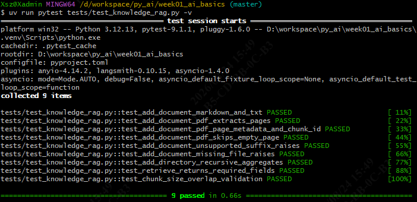
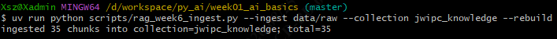
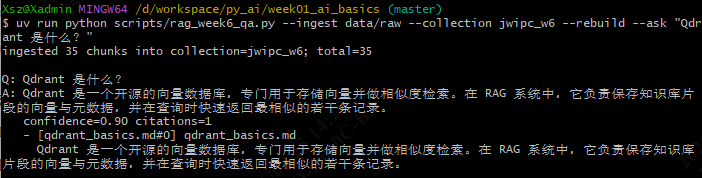
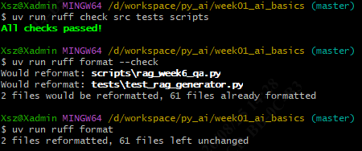

### 11.3 检索增强生成问答（带引用 / 可拒答）

```bash
uv run python scripts/rag_week6_qa.py --question "第5周的通过标准是什么？"
```

预期：有答案返回带引用片段（confidence≈0.95）；无答案问题返回「资料中未找到」并 `llm_no_answer` 拒答。

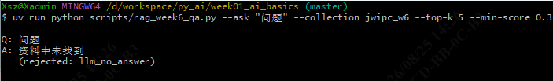
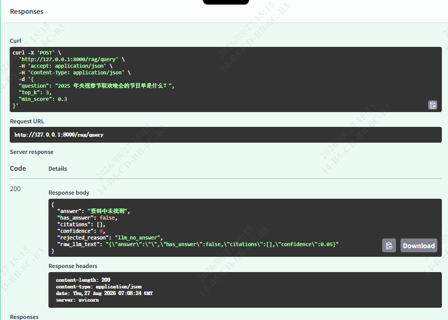

### 11.4 参数对比（chunk_size × TopK）

```bash
# 离线冒烟
uv run python scripts/rag_week6_param_compare.py --offline
# 真实链路 3×3 网格
uv run python scripts/rag_week6_param_compare.py --chunk-sizes 300,600,900 --top-ks 3,5,8
```

预期：生成 `docs/param_compare.md`，输出对比表与最优组合（chunk_size=600 + TopK=5，Recall@5=0.944）。

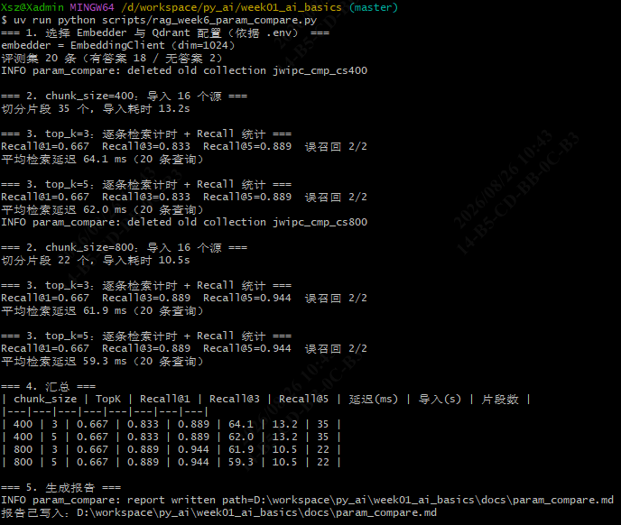
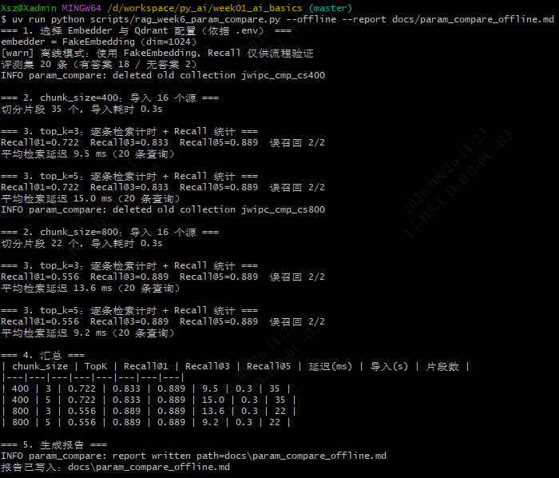

### 11.5 检索增强组件用法（Metadata Filter / 混合检索 / Rerank）

```bash
uv run python scripts/rag_week6_usage.py
```

预期：终端打印四种检索配置（基线 / Metadata Filter / 混合检索 / Rerank）的召回结果与一段生成链路冒烟，退出码 0。

### 11.6 RAG API 冒烟

```bash
uv run pytest tests/test_rag_api.py -q
```

预期：通过 `POST /rag/query` 线协议与拒答契约测试（ASGITransport 冒烟）。

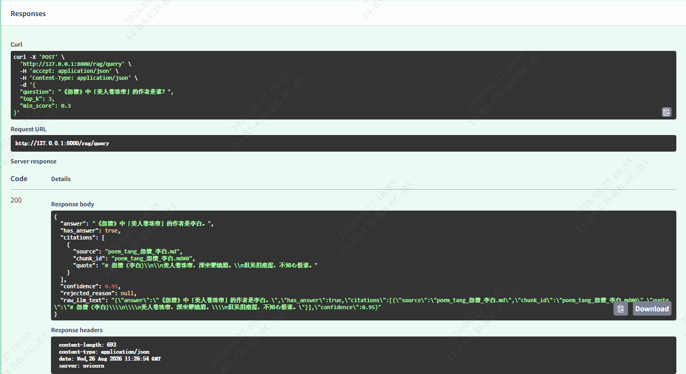
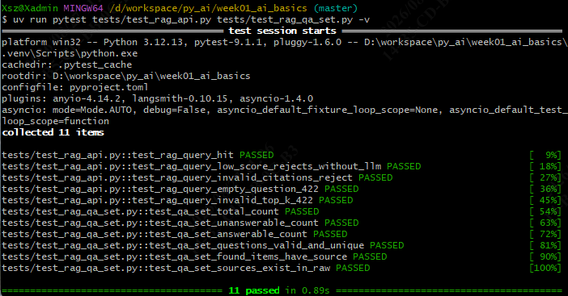

### 11.7 全量回归与格式检查

```bash
uv run pytest -q
uv run ruff check .
```

预期：全量 **292 passed**；`ruff` 全绿（All checks passed!）。

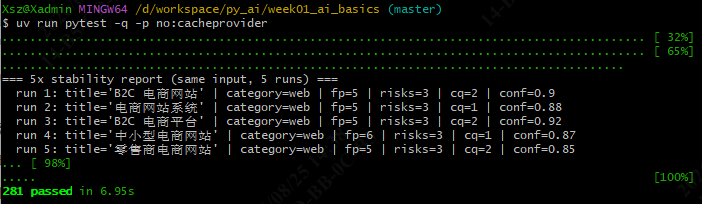
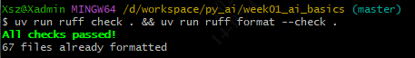

