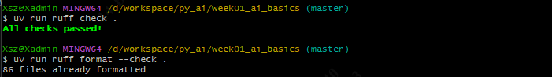
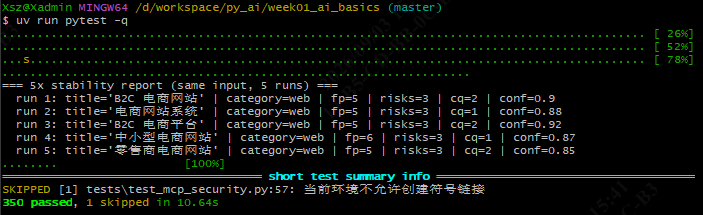
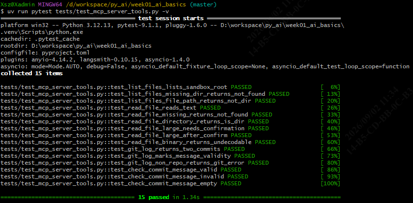
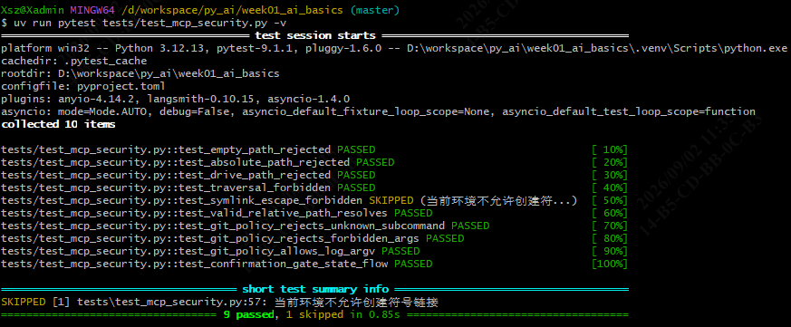
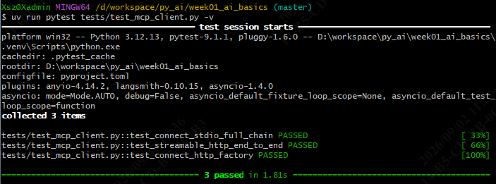
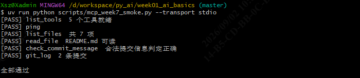
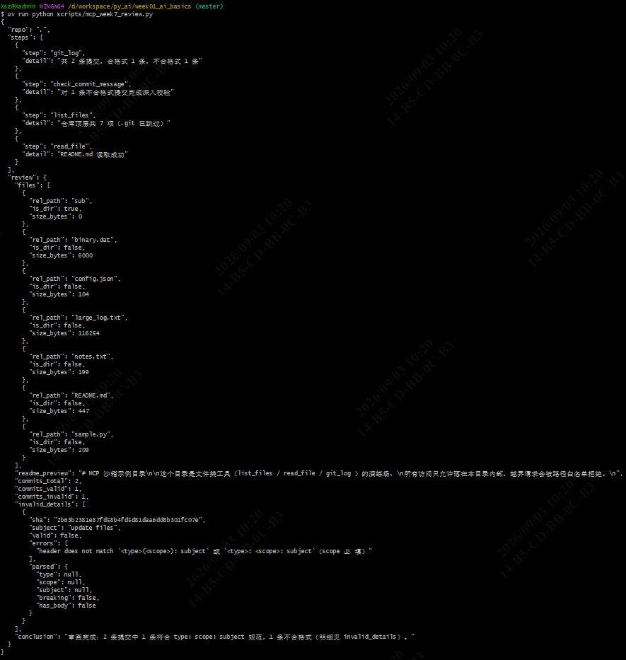
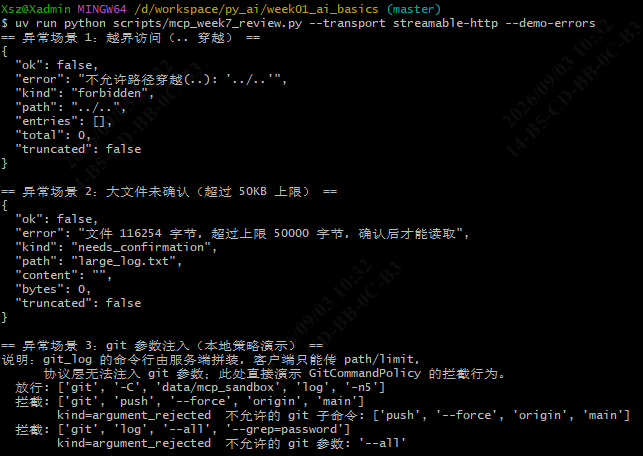
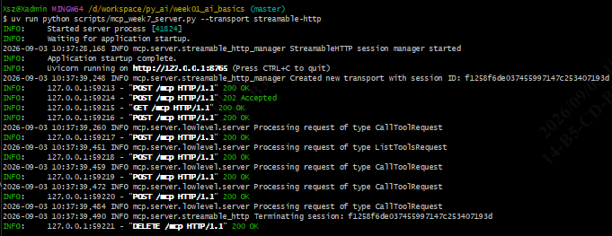
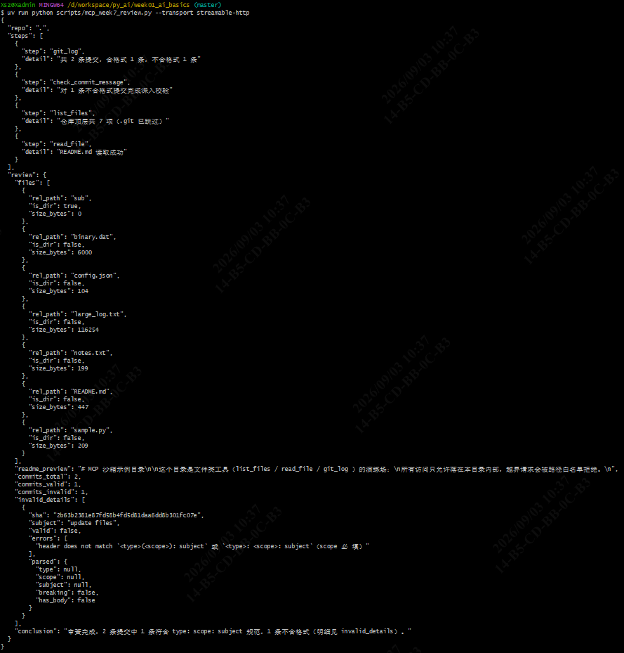

# Week 07 Summary — week01_ai_basics

> 周期：2026-08-31 ~ 2026-09-02 ｜ 路线：南宁软件组 AI Agent 应用开发 12 周 Roadmap · 第 7 周（MCP：把内部能力做成标准工具）  
> 仓库：`D:\workspace\py_ai\week01_ai_basics`  
> 运行环境：Python 3.12 + uv + Ruff + pytest；MCP Python SDK 锁 `mcp==1.29.1`（v1 规范 `2025-11-25`）

---

## 执行摘要

- **主要进展**：本周完成 **W07 MCP 全链路**——从最小 `ping` Server 起步，到 4 个沙箱工具（`list_files` / `read_file` / `git_log` / `check_commit_message`）+ 三道安全闸（路径白名单 / git 命令白名单 / 确认门）+ 双传输客户端（stdio 与 Streamable HTTP）+ 业务串联「审查一次提交改动」流水线，全部落地。
- **关键变更**：新增 `src/jwipc_dev_mcp_server/` 包（6 个模块）、3 个脚本（server / smoke / review）、28 条 MCP 测试（15 工具 + 10 安全 + 3 双传输）；测试全量 **350 passed + 1 skipped**、ruff 全绿。
- **待关注事项**：确认门目前只在进程内存，且没有协议级「确认」入口（客户端无法远程确认）；Windows 普通用户无权限建符号链接，对应用例 skip。
- **遇到的问题及解决方式**：MCP SDK v1.29 的多处 API 与旧教程不一致（`call_tool` 返回 tuple、`streamable_http_client` 新名新签名、ASGI 测试需手动进 lifespan 等），逐一实测定位后修正；`git -C` 全局选项位于子命令之前导致命令白名单误判，改为「先跳全局选项再定位子命令」。

---

## 1. 本周目标与完成情况

| 目标（Week07 Roadmap） | 状态 | 交付物 |
| --- | --- | --- |
| 理解 Host / Client / Server，跑通最小 Server | ✅ 完成 | `server.py` 最小 `FastMCP` + `ping`；概念笔记 §1–§10 |
| 开发 4 个安全 MCP Tool（Pydantic 校验 + 沙箱限制） | ✅ 完成 | `tools.py` + `schemas.py` + `security.py` + `config.py` |
| stdio Server / Client 先行，再做本地 Streamable HTTP | ✅ 完成 | `client.py`（`connect_stdio` / `connect_http`）双传输全链路实测 |
| 15 条工具测试 + 10 条安全测试 | ✅ 完成 | `test_mcp_server_tools.py`(15) + `test_mcp_security.py`(10) + `test_mcp_client.py`(3) |
| 工具说明 | ✅ 完成 | `docs/week07_tools.md` |
| 安全测试报告 | ✅ 完成 | `docs/week07_security_report.md` |
| 业务化串联 + 边界测试（周四） | ✅ 完成 | `scripts/mcp_week7_review.py`「审查一次提交改动」+ 3 异常场景实测 |

## 2. 系统结构与关键数据流

```
MCP 客户端（scripts/*.py / 测试）
   │  connect_stdio（子进程 + 管道）  或  connect_http（http://127.0.0.1:8765/mcp）
   ▼
jwipc-dev-mcp-server（FastMCP，SDK 承担 JSON-RPC 2.0 解析 / initialize 握手 / 分发）
   │  call_tool → 工具函数（tools.py，闭包共享同一 sandbox / gate / git_policy）
   ▼
三道安全闸（security.py）
   SandboxRoot.resolve(path)     # 路径白名单：规范化 + is_relative_to 复核
   GitCommandPolicy.validate(argv) # 命令白名单：只读子命令 + 参数 allowlist
   ConfirmationGate.require(key)  # 确认门：超限文件读取需二次确认
   ▼
出参模型（schemas.py，全 extra="forbid"，公共信封 ok/error/kind 平铺）
   → SDK 序列化为 structuredContent 返回客户端
```

- 协议层（JSON-RPC、能力协商、会话管理）全部委托 SDK，自己只写「工具函数 + 安全闸 + 数据模型」。
- 「审查一次提交改动」流水线是**客户端编排**：`git_log → check_commit_message（对不合格式提交深入校验）→ list_files → read_file(README)`，最后汇总结构化审查结论（JSON）。

## 3. 主要代码模块及职责

| 模块 | 职责 |
| --- | --- |
| `src/jwipc_dev_mcp_server/server.py` | `build_server()` 装配 FastMCP 实例（host/port 在构造函数上）+ `ping` 工具；`main()` 命令行入口（`--transport stdio / streamable-http`、`--host`、`--port`）。日志走 stderr，stdout 留给协议。 |
| `src/jwipc_dev_mcp_server/config.py` | `McpServerConfig`：沙箱根目录、50KB 读取上限、列表/日志条数上限；支持 `JWIPC_MCP_*` 环境变量，非法取值回落默认。 |
| `src/jwipc_dev_mcp_server/security.py` | `SandboxRoot`（路径白名单：拒绝对路径/盘符/`..`/空字节/符号链接逃逸）、`GitCommandPolicy`（git 只读子命令 + 参数白名单，先跳全局选项再定位子命令）、`ConfirmationGate`（进程内确认状态，confirm/revoke）。 |
| `src/jwipc_dev_mcp_server/schemas.py` | 出参模型：公共信封 `ToolResult`（ok/error/kind 平铺）+ 6 个结果模型，全 `extra="forbid"`；`tool_failure()` 统一构造失败结果。SDK 依据模型自动生成 outputSchema。 |
| `src/jwipc_dev_mcp_server/tools.py` | `register_tools()`：注册 4 工具（闭包共享同一 sandbox/gate/policy），每个工具贴 `ToolAnnotations` 只读声明；git argv 服务端固定拼装（`%x1f/%x1e` 转义）+ `stdin=DEVNULL` + 15s 超时。 |
| `src/jwipc_dev_mcp_server/client.py` | 双传输客户端封装：`connect_stdio()`（拉子进程 + 握手）、`connect_http()`（Streamable HTTP + 握手，支持注入 httpx 客户端供测试走 ASGI）。v1 的 `initialize()` 显式调用。 |
| `scripts/mcp_week7_server.py` | 服务启动入口（让 Inspector / 客户端一条命令拉起）。 |
| `scripts/mcp_week7_smoke.py` | 冒烟脚本：`list_tools` + `ping` + 抽测 4 工具，输出 PASS/FAIL 摘要。 |
| `scripts/mcp_week7_review.py` | 业务流水线「审查一次提交改动」：4 工具串联输出结构化审查结果（JSON）；`--demo-errors` 演示 3 异常场景。 |
| `data/mcp_sandbox/` | 沙箱夹具：常规文件 + 超限大文件 + 二进制文件 + 含 2 条提交的 git 仓库（坏格式 / 好格式各一）。 |

## 4. 主要 Git Commit

| Commit | 日期 | 说明 |
| --- | --- | --- |
| `5127e3d` | 09-01 | fix: app: Re-run ruff formatting |
| `0855dc5` | 09-01 | func: app: Add minimal MCP server with ping tool |
| `4c46e4e` | 09-01 | func: app: Add sandbox tools and path whitelist to MCP server |
| `1eeccac` | 09-02 | func: app: Add typed tool envelope, security policies and shared fixtures to existing MCP modules |
| `92947f2` | 09-02 | func: app: Add dual-transport client, smoke script and MCP tests |
| `2f68391` | 09-03 | func: app: Harden symlink test skip |
| `707dd73` | 09-03 | func: app: Add commit review pipeline script，security test report and tool documentation |
| `1cc7da5` | 09-04 | docs: app: Add Week 6 and Week 7 content, and document the RAG and MCP module run commands |
|  | 09-04 | docs: app: Add seventh week task summary |

## 5. 测试范围与结果

- **全量测试**：**350 passed, 1 skipped**；`ruff check` / `ruff format --check` 全绿。唯一的 skip 是符号链接逃逸用例（Windows 普通用户无权限创建 symlink，拦截逻辑已由其余用例覆盖）。
- **新增测试**：
  - `tests/test_mcp_server_tools.py`（15 条）：4 工具常规 + 边界（越界 / 不存在 / 目录 / 超限 / 二进制 / 确认后放行 / 截断 / 非仓库 git_error）。
  - `tests/test_mcp_security.py`（10 条）：SandboxRoot 各类越界、GitCommandPolicy 注入拦截、ConfirmationGate 状态。
  - `tests/test_mcp_client.py`（3 条）：stdio 真实子进程全链路、Streamable HTTP ASGI 端到端、`connect_http` 工厂注入。
- **双传输实测**：stdio 与 Streamable HTTP（真实 uvicorn，端口 8765）各跑通冒烟 6 项 + 审查流水线 + 3 异常场景；HTTP 服务端日志可见完整会话生命周期（POST /mcp → SSE → DELETE 关会话）。

### 5.1 异常场景实测返回（双链路一致）

| 场景 | 触发 | 返回 kind | 关键错误信息 |
| --- | --- | --- | --- |
| 越界访问 | `list_files {"path": "../.."}` | `forbidden` | 不允许路径穿越(..) |
| 大文件未确认 | `read_file {"path": "large_log.txt"}`（116254 字节） | `needs_confirmation` | 文件 116254 字节，超过上限 50000 字节 |
| git 参数注入 | `git push --force` / `git log --all`（策略级） | `argument_rejected` | 不允许的 git 子命令 / 不允许的 git 参数：'--all' |

## 6. 失败案例与定位过程

| 现象 | 定位 | 解决 |
| --- | --- | --- |
| 测试里调 `FastMCP.call_tool` 拿不到结构化结果 | v1.29 的 `call_tool` 返回 `(content 列表, structured)` 元组，不是 `CallToolResult` 对象 | 测试统一写 `_call()` 解包 helper，取元组第二位的 `structuredContent` |
| `streamablehttp_client` 无 `http_client` 注入参数 | v1.29 换了新名 `streamable_http_client`，注入参数从 `httpx_client_factory`（回调会被传 headers 等额外 kwargs）改为直接传 `http_client` 实例 | 全部换新 API；注意新客户端 yield **3 元组**（read, write, get_session_id），解包要加第三位 |
| ASGI 测试报 session manager 未初始化 | `streamable_http_app()` 的 task group 在 Starlette lifespan 里创建，而 `httpx.ASGITransport` 不触发 lifespan；且 manager 只能 `run()` 一次，跨测试复用实例直接炸 | 测试里手动进入 `http_app.router.lifespan_context(http_app)`；每个测试新建独立服务实例 |
| HTTP 客户端连 `http://127.0.0.1/mcp` 返回 421 | FastMCP 对 `127.0.0.1` 自动启用 DNS 重绑定保护，allowed_hosts 是带端口模式 `127.0.0.1:*` | URL 必须写成 `http://127.0.0.1:8765/mcp`（带端口） |
| `GitCommandPolicy` 把合法的 `git -C <dir> log` 拒了 | `-C` 是全局选项，位于子命令**之前**，初版校验假定 `argv[1]` 就是子命令 | validate 重写为三段式：先跳全局选项区（`-C` 自动跳过其后的路径值）→ 定位子命令 → 再逐项校验子命令后的参数 |
| `--all` 之类危险选项被白名单放行 | `--` 在允许前缀列表里，`--all` 按 `--` 前缀误匹配 | 拆成「精确匹配（`-C`、`--`）+ 前缀匹配（`-n`、`--date`…）」两类，`--` 只允许精确匹配 |
| symlink 用例在受限环境既不抛异常也不生效：`symlink_to()` 静默"成功"但链接实际未创建，skip 分支没触发，后续断言 DID NOT RAISE | 仅捕获创建异常不够——有些受限环境创建符号链接不抛错但什么都不建 | 测试在创建后增加 `is_symlink()` 复查，未真正创建即 skip；权限正常的环境仍走完整断言 |
| `--basetemp` 指到项目内时 `test_git_log_non_repo` 失败（`sub` 的 git log 竟成功） | git 的仓库搜索会向上穿越祖先目录：临时沙箱若位于项目仓库内部，`sub` 向上能找到项目根的 `.git`，"非仓库"前提被破坏 | 跑 pytest 时 basetemp 必须放系统 Temp（祖先链无仓库），不能放项目内；git_log 的向上搜索边界列入未解决问题 |

## 7. 使用 AI 辅助的内容及人工验证

- **AI 辅助**：包结构与模块代码、三道安全闸实现、双传输客户端封装、冒烟/流水线脚本、28 条测试、三份文档由 AI 辅助完成。
- **人工验证**（本机 Git Bash + uv 真实运行）：
  - ruff与pytest测试：`uv run ruff check .`、`uv run ruff format --check .`、`uv run pytest -q`（全量 350 passed, 1 skipped）全绿确认。
  - stdio 测试：`mcp_week7_smoke.py --transport stdio` 6 项 PASS（list_tools / ping / 4 工具）。
  - Streamable HTTP 测试：两个终端真实起服务 + 连接，冒烟 6 项 PASS，服务端日志确认完整会话生命周期。
  - 工作流程测试：`mcp_week7_review.py` stdio 与 HTTP 双模式各实测一轮，审查结论正确识别「1 条合格式 + 1 条不合格式（update files）」并给出违规明细；`--demo-errors` 三场景返回与设计一致。

## 8. 当前未解决问题

1. **确认门没有协议级入口**：确认状态存单进程内存，且「确认」操作未通过 MCP 工具暴露——客户端拿到 `needs_confirmation` 后无法远程确认，目前只能测试注入 gate 或等进程重启。生产化需要持久化存储 + 明确的确认协议（或带外人工流程）。
2. **Windows 符号链接用例 skip**：受限环境创建 symlink 静默不生效（或无权限抛错），`test_symlink_escape_forbidden` 跳过；拦截逻辑本身已由 `is_relative_to` 复核覆盖。
3. **git_log 的仓库搜索会向上穿越**：`git -C <目录> log` 在目录本身非仓库时会向上找祖先 `.git`，可能越出语义上的"目标仓库"（受环境祖先链影响，见失败案例表）。后续可加 `GIT_CEILING_DIRECTORIES` 限制在沙箱根内搜索。
4. **大文件确认后全量读入内存**：`read_file` 确认后一次性 `read_bytes()`，无分页/截断返回；超大文件仍有内存压力。
5. **git 能力只用了 log**：`GitCommandPolicy` 白名单放行了 `rev-list`/`status`/`show`/`diff`/`ls-files`，但当前只实现了 `git_log` 一个工具，其余子命令属预留。

## 9. 本周知识概念

| 概念 | 一句话理解 | 代码位置 |
| --- | --- | --- |
| Host / Client / Server | Host 承载客户端（如 Claude Desktop / 自研脚本）；Client 与 Server 一对一连接；Server 暴露工具 | `client.py` / `server.py` |
| JSON-RPC 2.0 | MCP 的线协议：请求/响应/通知三类消息 | - |
| initialize 握手 | 协议版本与能力协商，v1 必须显式 `await session.initialize()` | `client.py` |
| stdio 传输 | Server 是子进程，stdin/stdout 跑 JSON-RPC，日志只能走 stderr | `connect_stdio()` |
| Streamable HTTP | HTTP POST + 可选 SSE 流，替代旧 HTTP+SSE；会话可 DELETE 关闭 | `connect_http()` |
| ToolAnnotations | 工具行为自我声明（readOnlyHint 等），给客户端/模型参考，不是安全锁 | `tools.py` |
| structuredContent / outputSchema | 出参 Pydantic 模型 → SDK 自动生成 schema，客户端拿结构化结果 | `schemas.py` |
| 统一错误信封 | ok/error/kind 平铺，失败统一 `tool_failure()` 构造，不抛协议异常 | `schemas.py` |
| 路径白名单（SandboxRoot） | 规范化 + `is_relative_to` 复核，锁死爆炸半径 | `security.py` |
| 命令白名单（GitCommandPolicy） | 只读子命令 + 参数 allowlist；服务端固定拼装 argv 是第一道防线 | `security.py` |
| 确认门（ConfirmationGate） | 危险操作先返回 needs_confirmation，确认后放行 | `security.py` |
| DNS 重绑定保护 | SDK 对 localhost 自动开启，Host 必须带端口 | `server.py` |

## 10. 下周计划（Roadmap 第 8 周：LangGraph：状态化工作流与人工确认）

- **本周目标**：把复杂任务从一个 Prompt 拆成可观察、可重试、可恢复的状态图。
- **必学知识**：State、Node、Edge、Conditional Edge、START/END；Checkpoint、持久化、重试、Fallback、Human-in-the-loop；什么时候用普通函数、单 Agent 或 LangGraph Workflow。
- **阶段任务**：
  - 开发 RequirementAnalysisWorkflow：分类 → 功能点 → RAG 检索 → 风险 → 测试点 → 报告。
  - 需求存在关键歧义时暂停，输出 clarification_questions，等人工补充后继续。
  - 每个节点保存结构化状态；节点失败可定位并重试。
  - 输出 Mermaid 架构图和状态字段说明。
- **交付物**：LangGraph 工作流、状态 Schema、Checkpoint 示例、20 条流程测试、架构图。
- **通过标准**：不能把全部逻辑写在单个 Node 或单个 Prompt；执行路径可从 Trace 看清。
- **官方参考**：LangGraph Overview；LangGraph v1 Release；LangChain / LangGraph 产品定位。

## 11. 操作与测试步骤

> **运行环境**：以下命令均在 **Git Bash**（项目根 `D:\workspace\py_ai\week01_ai_basics`）执行，先 `export PATH="/c/Users/Xsz/.local/bin:$PATH"`。

### 11.1 质量门禁（3 条，应全绿）

```bash
uv run ruff check .           # 预期：All checks passed!
uv run ruff format --check .  # 预期：所有文件 already formatted
uv run pytest -q              # 预期：350 passed, 1 skipped
```




### 11.2 只跑本周 MCP 测试

```bash
uv run pytest -q tests/test_mcp_server_tools.py tests/test_mcp_security.py tests/test_mcp_client.py
# 预期：27 passed, 1 skipped
```





### 11.3 stdio 冒烟（自动拉起子进程）

```bash
uv run python scripts/mcp_week7_smoke.py --transport stdio
# 预期：6 项 PASS（list_tools / ping / list_files / read_file / check_commit_message / git_log）
```



### 11.4 业务流水线「审查一次提交改动」（stdio，默认）

```bash
uv run python scripts/mcp_week7_review.py
# 预期：输出结构化审查结果（JSON）——
#   git_log: 2 条提交，合格式 1 条，不合格式 1 条
#   check_commit_message: 对 1 条不合格式提交完成深入校验（update files → errors 明细）
#   list_files: 仓库顶层 7 项；read_file: README.md 读取成功
#   review.conclusion: 审查完成结论
```



### 11.5 3 异常场景演示

```bash
uv run python scripts/mcp_week7_review.py --demo-errors
# 预期：
#   场景1 list_files "../.."      → ok=false, kind=forbidden
#   场景2 read_file large_log.txt → ok=false, kind=needs_confirmation
#   场景3 git push --force / git log --all → argument_rejected 拦截
```



### 11.6 Streamable HTTP 端到端（需两个终端）

```bash
# 终端 1：启动服务
uv run python scripts/mcp_week7_server.py --transport streamable-http --port 8765
# 预期：INFO: Uvicorn running on http://127.0.0.1:8765

# 终端 2：冒烟 + 审查流水线 + 异常演示
uv run python scripts/mcp_week7_smoke.py --transport streamable-http --url http://127.0.0.1:8765/mcp
uv run python scripts/mcp_week7_review.py --transport streamable-http
uv run python scripts/mcp_week7_review.py --transport streamable-http --demo-errors

# 关停：终端 1 按 Ctrl+C
```

> 注意：URL 必须带端口（FastMCP 对 `127.0.0.1` 的 DNS 重绑定保护按 `127.0.0.1:*` 匹配）。换端口时启动端 `--port` 与客户端 `--url` 要同步。



