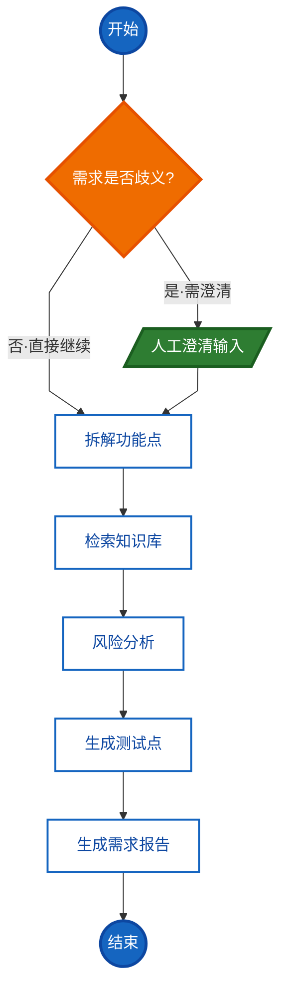

# Week 08 架构说明：RequirementAnalysisWorkflow

> 本文描述第 8 周交付的状态化工作流。代码位于 `src/graph/`，状态字段说明见  
> `docs/week08_state_fields.md`，周总结见 `docs/week08_summary.md`。


---

## 1. 工作流定位

把一个「需求分析」任务从单个 Prompt 拆成 6 个各司其职的节点，用一张状态图串起来，  
从而满足三条工程要求：

| 要求  | 实现手段 |
| --- | --- |
| 可观察 | 每个节点把名字追加进 `state["trace"]`，执行路径直接从状态读出 |
| 可重试 | LLM 节点内部重试 `max_retries` 次；瞬时故障恢复后不产生错误记录 |
| 可恢复 | Checkpoint 按 `thread_id` 保存；人工确认用 `interrupt` 挂起、`Command(resume=...)` 续跑 |

设计硬约束：逻辑不堆在单个 Node 或单个 Prompt 里。分类、功能点、检索、风险、  
测试点、报告各由一个节点负责，歧义澄清由独立的 `clarify` 节点承担。

---

## 2. 状态图

下图遵循标准流程图图形规范绘制：`椭圆`=开始/结束、`菱形`=判断分支、`平行四边形`=输入/输出（人工澄清）、`矩形`=操作/处理。它在 `build_requirement_workflow()` 的结构之上，把 `classify` 显式画成菱形判断框、把 `clarify` 画成平行四边形输入，与代码逻辑一致：



图形与含义对照：

| 图形 | 节点 | 含义 |
| --- | --- | --- |
| 椭圆 | `START` / `END` | 流程入口与出口 |
| 菱形 | `classify` | 判断/分支节点：判定需求是否歧义，决定是否需要人工澄清 |
| 平行四边形 | `clarify` | 人工确认节点，`interrupt()` 挂起等待人工输入（数据输入） |
| 矩形 | `functional_points` / `rag_retrieve` / `risk` / `test_points` / `report` | 自动业务处理节点 |

实线为固定边；菱形 `classify` 引出两条条件边，分别标注 `是 / 否`。  
注：LangGraph 原生 `draw_mermaid()` 会把所有节点画成统一圆角矩形（不区分形状），此图在导出结构之上按流程图规范重绘形状并叠加快高对比度样式。如需查看代码原始导出：

```bash
# Git Bash
cd /d/workspace/py_ai/week01_ai_basics
export PATH="/c/Users/Xsz/.local/bin:$PATH"
uv run python - <<'PY'
import sys
sys.path.insert(0, "src")
from graph.workflow import build_requirement_workflow
print(build_requirement_workflow().get_graph().draw_mermaid())
PY
```

---

## 3. 节点职责

| 节点 | 写入字段 | 职责 | 失败行为 |
| --- | --- | --- | --- |
| `classify` | `category` / `confidence` / `clarification_questions` / `needs_clarify` | 判断需求分类与置信度，产出澄清问题 | 降级为 `other` + `confidence=0.0`，且 `needs_clarify=False`（系统故障不误触发人工确认） |
| `clarify` | `human_answers` / `clarify_rounds` | `interrupt()` 挂起并展示澄清问题，恢复后把人工答复写入状态 | 不涉及外部调用 |
| `functional_points` | `functional_points` | 拆解 2-6 条动词开头的功能点，拼接人工补充内容进提示词 | 降级为空列表 |
| `rag_retrieve` | `rag_context` / `rag_degraded` | 调知识库检索，结果落成 `chunk_id/source/text/score`，按 `rag_min_score` 过滤 | 检索器缺失或抛错时置 `rag_degraded=True` 并继续 |
| `risk` | `risks` | 结合功能点与检索资料给 1-4 条风险  | 降级为一条「依据有限」风险  |
| `test_points` | `test_points` | 产出覆盖正常 / 异常 / 边界 / 回归四类的测试点 | 降级为空列表 |
| `report` | `report` | 纯格式化汇总，引用追溯来自 `rag_context` 的 `source#chunk_id` | 不调模型，不受影响 |

每个节点只回写自己负责的字段（局部 patch），列表型字段（`trace` / `human_answers` /  
`errors`）先读旧值再追加，避免被后续节点整体覆盖。

---

## 4. 边与条件边

| 起点 | 终点 | 类型 | 条件 |
| --- | --- | --- | --- |
| `START` | `classify` | 固定 | 无条件 |
| `classify` | `clarify` | 条件 | `needs_clarify` 为真 |
| `classify` | `functional_points` | 条件 | `needs_clarify` 为假 |
| `clarify`  | `functional_points` | 固定 | 人工补充后继续            |
| `functional_points` → `rag_retrieve` → `risk` → `test_points` → `report` | — | 固定 | 单向主链，无跨节点直连 |
| `report` | `END` | 固定 | 无条件 |

判定函数 `route_after_classify` 只看状态里的 `needs_clarify`，不重新调模型：

```python
def route_after_classify(state: WorkflowState) -> str:
    return "clarify" if state.get("needs_clarify") else "functional_points"
```

---

## 5. Checkpoint 示例

默认注入 `InMemorySaver`。同一 `thread_id` 的中断状态可跨调用恢复，不同  
`thread_id` 互不干扰。

```bash
# Git Bash
cd /d/workspace/py_ai/week01_ai_basics
export PATH="/c/Users/Xsz/.local/bin:$PATH"
uv run python scripts/graph_week8_resilience.py
```

最小可复制示例：

```python
import asyncio
from langgraph.types import Command
from graph.workflow import build_requirement_workflow

async def main():
    wf = build_requirement_workflow()
    cfg = {"configurable": {"thread_id": "demo-checkpoint"}}

    # 1) 歧义输入触发 interrupt，图挂起在 clarify
    async for _event in wf.astream(
        {"requirement_text": "我想做个东西"}, cfg, stream_mode="updates"
    ):
        pass
    state = wf.get_state(cfg)
    print("挂起节点 =", state.next)                      # ('clarify',)
    print("澄清问题 =", state.values["clarification_questions"])

    # 2) 人工补充后从挂起点续跑，classify 不会重跑
    resumed = await wf.ainvoke(Command(resume="面向零售商的智能推荐系统"), cfg)
    print("trace =", resumed["trace"])
    # ['classify', 'clarify', 'functional_points', 'rag_retrieve', 'risk',
    #  'test_points', 'report']

asyncio.run(main())
```

跨进程持久化需要额外安装 `langgraph-checkpoint-sqlite`，装好后把 checkpointer  
换成 `SqliteSaver.from_conn_string("checkpoints.db")` 即可，图代码无需改动：

```bash
# Git Bash
uv add langgraph-checkpoint-sqlite
```

当前环境未安装该包，因此仓库内的示例统一使用 `InMemorySaver`。若需跨进程恢复，  
可用 `app.get_state(cfg)` 取值后自行落 JSON 快照作为过渡方案。

---

## 6. 一次完整执行的 trace 输出样例

正常需求（Fake ChatFn，未接知识库）：

```
trace        = ['classify', 'functional_points', 'rag_retrieve', 'risk', 'test_points', 'report']
category/conf= web 0.9
rag_degraded = True
errors       = []
```

歧义需求（中断后人工补充续跑）：

```
挂起 next  = ('clarify',)
澄清问题   = ['这个系统面向哪些用户？', '核心要解决什么问题？', '主要在什么场景使用？']
人工补充   = ['面向零售商的智能推荐系统']
trace      = ['classify', 'clarify', 'functional_points', 'rag_retrieve', 'risk', 'test_points', 'report']
```

节点全部失败（重试耗尽后降级）：

```
errors = [
  {'node': 'classify',          'type': 'RuntimeError', 'message': 'LLM 服务不可用', 'attempts': 3},
  {'node': 'functional_points', 'type': 'RuntimeError', 'message': 'LLM 服务不可用', 'attempts': 3},
  {'node': 'risk',              'type': 'RuntimeError', 'message': 'LLM 服务不可用', 'attempts': 3},
  {'node': 'test_points',       'type': 'RuntimeError', 'message': 'LLM 服务不可用', 'attempts': 3},
]
trace  = ['classify', 'functional_points', 'rag_retrieve', 'risk', 'test_points', 'report']
```

`errors` 里能直接看出「哪个节点、什么错误、第几次尝试」，满足失败可定位。

---

## 7. 运行入口

| 命令（Git Bash） | 作用 |
| -------------------------------------------------------------------- | ------------------------------------- |
| `uv run python scripts/graph_week8_quickstart.py`                    | 最小状态图：条件边 + interrupt + Checkpoint 续跑 |
| `uv run python scripts/graph_week8_workflow.py`                      | 两条主路径演示（正常 / 歧义澄清）                    |
| `uv run python scripts/graph_week8_resilience.py`                    | 韧性演示：重试 / 降级 / Checkpoint             |
| `uv run python scripts/graph_week8_demo.py`                          | 业务串联：1 正常 + 3 异常四场景                   |
| `uv run python scripts/graph_week8_demo.py --scenario normal --real` | 接真实 Ollama + Qdrant                   |
| `uv run pytest tests/graph -q`                                       | 24 条图相关测试                             |
