# Week 08 Summary

> 周期：2026-09-07 ~ 2026-09-11 ｜ 路线：南宁软件组 AI Agent 应用开发 12 周 Roadmap · 第 8 周（LangGraph：状态化工作流与人工确认）
> 仓库：`D:\workspace\py_ai\week01_ai_basics`
> 运行环境：Python 3.12 + uv + Ruff + pytest；`langgraph 1.2.10`（已显式声明，原为 `langchain` 传递依赖）

---

## 执行摘要

- **主要进展**：本周完成 **W08 LangGraph 状态化工作流**——从最小状态图起步，到 `RequirementAnalysisWorkflow` 的 6 业务节点 + 1 澄清中断节点、条件边歧义分支、Checkpoint 续跑、节点内重试与降级，以及 1 正常 + 3 异常四场景业务串联，全部落地。
- **关键变更**：新增 `src/graph/` 包（6 个模块）、4 个脚本（quickstart / workflow / resilience / demo）、24 条图相关测试；测试全量 **374 passed + 1 skipped**、ruff 全绿。
- **待关注事项**：真实链路（`--real`）已于 09-09 端到端跑通（qwen3 真实产出 6 条功能点 / 4 条风险 / 20 条测试点，`rag_degraded=False`），但 qwen3 CPU 推理下完整流程常超过 5 分钟；RAG 会把产品手册内容带进风险项（与电商需求无关）；跨进程 Checkpoint 需额外装 `langgraph-checkpoint-sqlite`。
- **遇到的问题及解决方式**：langgraph 内置 `RetryPolicy` 对 `RuntimeError` 不重试且耗尽后直接抛异常使整图崩溃，改为节点内显式「重试 + 降级」；`functools.partial` 绑定无 `deps` 参数的 `report` 节点触发签名报错；演示脚本在 interrupt 时读到部分状态导致 `KeyError`；pytest 把导入的 `test_points` 节点函数当成测试用例收集，改为别名导入；`--real normal` 因真实模型判歧义而在 `clarify` 挂起导致输出全空，改为感知中断并支持 `--resume` 续跑；报告只打印前 3 行导致「看不到内容」，改为完整打印。

---

## 1. 本周目标与完成情况

| 目标（Week08 Roadmap） | 状态 | 交付物 |
| --- | --- | --- |
| 理解 State / Node / Edge / Conditional Edge / START / END | 已完成 | 概念笔记 `week08_langgraph_concepts.md`、`scripts/graph_week8_quickstart.py` |
| `RequirementAnalysisWorkflow`：分类 → 功能点 → RAG 检索 → 风险 → 测试点 → 报告 | 已完成 | `src/graph/nodes.py`、`src/graph/workflow.py` |
| 关键歧义时暂停，输出澄清问题，人工补充后继续 | 已完成 | `clarify` 节点（`interrupt` + `Command(resume=...)`） |
| 每节点保存结构化状态，失败可定位可重试 | 已完成 | `src/graph/state.py` + `errors` 字段 + 节点内重试 |
| Mermaid 架构图 + 状态字段说明 | 已完成 | `docs/week08_architecture.md` + `docs/week08_state_fields.md` |
| Checkpoint 示例 | 已完成 | `scripts/graph_week8_resilience.py` 第 3 段 + 架构文档第 5 节 |
| 20 条流程测试 | 已完成 | `tests/graph/test_requirement_workflow.py`(16) + `test_graph_resilience.py`(5)，另加冒烟 3 条 |
| 业务化串联 + 边界测试 | 已完成 | `scripts/graph_week8_demo.py` 四场景 |
| 整理代码 / 测试 / README / 书面总结 | 已完成 | 本文 + `README.md` W08 章节 + 架构图按标准流程图图形重绘 |

通过标准核对（路线图原文：「不能把全部逻辑写在单个 Node 或单个 Prompt；执行路径可从 Trace 看清」），两条均满足：

| 标准 | 结论 | 依据 |
| --- | --- | --- |
| 逻辑不在单个 Node / Prompt | 满足 | 7 节点一职责（`workflow.py:65-71`）；prompt 分散在 `classify` / `functional_points` / `risk` / `test_points` 四个节点且 JSON 契约各不相同；`rag_retrieve` 与 `report` 无 prompt（纯检索 / 纯格式化）；路由独立为 `route_after_classify`。无任何节点同时产出两类业务结果。 |
| 执行路径可从 Trace 看清 | 满足 | `state.py:48` 的 `trace` 字段，7 个节点（含各降级分支）均 `"trace": _trace(state) + ["节点名"]` 回写。实测三路径可区分：正常 6 节点 / 走澄清 7 节点 / 挂起时 `['classify']` 且 `get_state(cfg).next == ('clarify',)`；失败靠 `errors` 的 `{node, type, message, attempts}` 定位。 |

## 2. 系统结构与关键数据流

```
调用方（scripts/*.py / 测试）
   │  {"requirement_text": ...} + {"configurable": {"thread_id": ...}}
   ▼
build_requirement_workflow()  编译图（checkpointer 默认 InMemorySaver）
   │
   ├─ START → classify ──条件边── needs_clarify?
   │                        ├─ 是 → clarify（interrupt 挂起，等 Command(resume=...)）
   │                        └─ 否 → functional_points
   ▼
functional_points → rag_retrieve → risk → test_points → report → END
   │
   └─ 每个节点：局部 patch 回写 + trace 追加自身节点名
      LLM 节点统一走 _call_chat_with_retry（重试 max_retries 次，耗尽写 errors 并降级）
```

- 依赖（chat_fn / rag / config / checkpointer）全部由外部注入：测试注入 Fake，真实链路注入 `LlmClient` 适配器与 `JwipcKnowledgeRAG`。
- 中断不是异常：`interrupt()` 在事件流里表现为一条 `__interrupt__` 事件，`get_state(cfg).next` 指出挂起节点，`Command(resume=...)` 从挂起点续跑，`classify` 不重跑。

## 3. 主要代码模块及职责

| 模块 | 职责 |
| --- | --- |
| `src/graph/state.py` | `WorkflowState(TypedDict, total=False)`：15 个字段，含 `needs_clarify` 派生标记与 `trace`；逐项说明见 `docs/week08_state_fields.md` |
| `src/graph/config.py` | `WorkflowConfig`：歧义阈值、最大澄清轮次、重试次数、rag top_k / min_score；支持 `JWIPC_GRAPH_*` 环境变量，非法取值回落默认 |
| `src/graph/fakes.py` | `make_fake_chat()`：按 system 消息的 `task` 键路由返回确定性 JSON；含领域名词判定，避免把「考勤系统」这类短需求误判为歧义 |
| `src/graph/nodes.py` | 6 业务节点 + `clarify` 中断节点；`Deps` 注入依赖；`_call_chat_with_retry` 统一重试与降级；`route_after_classify` 条件路由 |
| `src/graph/workflow.py` | `build_requirement_workflow()` 组装 7 节点 + 固定边主链 + 条件边；`report` 为纯格式化节点，不用 `partial` 绑定 `deps` |
| `src/graph/quickstart.py` | 最小示例图：3 节点 + 条件边 + `interrupt` + Checkpoint 续跑 |
| `scripts/graph_week8_quickstart.py` | 最小图命令行入口，支持 `--question` / `--resume` / `--thread-id` |
| `scripts/graph_week8_workflow.py` | 两条主路径演示；按参数决定跑正常路径还是歧义路径，避免输出与输入对不上 |
| `scripts/graph_week8_resilience.py` | 韧性演示：RetryPolicy 重试 / Fallback 降级 / Checkpoint 续跑三段 |
| `scripts/graph_week8_demo.py` | 业务串联：4 场景（正常 / 歧义暂停 / 依赖降级 / 节点失败）+ `--real` 真实链路开关 + `--mermaid` 图导出；`normal` 场景检测 `clarify` 中断，带 `--resume` 时自动续跑；`_print_result` 打印完整报告 |

## 4. 主要 Git Commit

| Commit | 日期 | 说明 |
| --- | --- | --- |
| `4d9b806` | 09-07 | func: app: Add minimal LangGraph graph with conditional edge and interrupt |
| `7d6a70c` | 09-08 | func: app: Add RequirementAnalysisWorkflow state schema and nodes |
| `cb7c5a3` | 09-08 | func: app: Add workflow run test script |
| `28fe961` | 09-08 | func: app: Update workflow script and fakes |
| `f899e14` | 09-08 | func: app: Add resilience demonstration with RetryPolicy, Fallback, and Checkpoint |
| `a9507ec` | 09-08 | func: app: Implement chat function with retry mechanism for resilience in workflow nodes |
| `5e46c4a` | 09-08 | func: app: Add smoke tests for RequirementAnalysisWorkflow |
| `5fccd3c` | 09-09 | func: app: Add workflow flow tests and resilience tests |
| `4d38f51` | 09-10 | func: app: Add week 8 architecture and state fields docs |
| `b6926e2` | 09-10 | func: app: Add requirement workflow demo runner with four scenarios |
| `66f6f82` | 09-11 | docs: app: Update the README with Week 8 project content |


## 5. 测试范围与结果

| 测试文件 | 条数 | 覆盖 |
| --- | --- | --- |
| `tests/graph/test_workflow_smoke.py` | 3 | 正常 6 节点写满字段 / 歧义中断 + resume / LLM 永久失败降级 |
| `tests/graph/test_requirement_workflow.py` | 16 | 图结构 5（节点集合、固定边主链、条件边路由、线程隔离、Mermaid 导出）+ 节点职责 7 + 人工确认 4 |
| `tests/graph/test_graph_resilience.py` | 5 | 瞬时故障重试成功 / 永久失败写 errors / 重试次数可配置 / 依赖降级不中断 / 失败后报告仍产出 |

```bash
# Git Bash
cd /d/workspace/py_ai/week01_ai_basics
export PATH="/c/Users/Xsz/.local/bin:$PATH"

uv run pytest tests/graph -q      # 预期：24 passed
uv run pytest -q                  # 预期：374 passed, 1 skipped
uv run ruff check .               # 预期：All checks passed
uv run ruff format --check .      # 预期：100 files already formatted
```

基线复核（09-10，改完演示脚本后复跑）：`374 passed, 1 skipped`（16.16s），`ruff check .` 与 `ruff format --check .` 均全绿。

## 6. 失败案例与定位过程

「来源」列区分问题由谁发现：**用户实测反馈** = 跑脚本或看输出时发现并反馈；**开发自检** = 编写与自测过程中发现。

| 现象 | 根因 | 处理 | 来源 |
| --- | --- | --- | --- |
| 演示输出「问分页、答导出」 | 脚本里人工补充内容与第 4 段输入写死，不跟随 `--question` | 新增 `--resume` 参数，缺省按问题自动生成；第 4 段输入跟随 `--question` | 实测反馈 |
| 演示脚本 `KeyError: 'functional_points'` | 输入被判为歧义并路由到 `clarify`，`ainvoke` 返回中断时刻的部分状态 | `_run_normal` 增加 `needs_clarify` 判断，被路由到澄清时打印提示而非读取下游字段 | 实测反馈 |
| 「我想做个面向学校的考勤系统」被判为歧义需求 | Fake 分类器按「文本长度 < 25」判定，启发式太糙 | 增加领域名词判定（系统 / 网站 / 平台 / 考勤 等），真实短需求不再误判 | 实测反馈 |
| `--real --scenario normal` 跑完 `trace=['classify']`，下游字段全为 None | 真实模型判需求歧义（`confidence=0.9` 高于阈值，但返回了 2 条澄清问题，`needs_clarify` 由 `bool(questions)` 触发），路由到 `clarify` 后 `interrupt()` 挂起；脚本用 `ainvoke` 却没传 `Command(resume=...)`，图在中断点直接返回 | `_scenario_normal` 增加中断检测：`get_state(cfg).next` 停在 `clarify` 时打印澄清问题；带 `--resume` 时自动 `ainvoke(Command(resume=...))` 续跑并打印完整结果，未带则给出明确提示；`--resume` 默认值改为 `None` 以区分「显式传入」与「未传」 | 实测反馈 |
| 报告只显示标题与 `## 功能点`，看起来「没内容」 | `_print_result` 只取 `report.splitlines()[:3]`，而前 3 行恰好是标题行，正文从第 4 行起被截断 | 改为完整打印：`print(report if report.strip() else "  (空)")` | 实测反馈（09-10 真实链路） |
| `--real` 输出变成 Fake 固定样例，首行「真实链路不可用，已回退 Fake：WinError 10061」 | 运行瞬间 Ollama 未启动，目标端口积极拒绝；`.env` 的 `API_BASE_URL=http://localhost:11434/v1` 配置本身正确 | 非代码问题。排查法：看输出首行是否出现「已回退 Fake」；再用 `curl -s -m 5 http://127.0.0.1:11434/api/version` 探测（返回 `{"version":"0.33.1"}` 即正常），起服务后重跑 | 实测反馈（09-10，环境问题） |
| `RetryPolicy` 挂上后没有触发重试 | 内置 `default_retry_on` 对 `RuntimeError` / `ValueError` / `TypeError` 返回 False，只重试 `ConnectionError` 与 HTTP 5xx | 演示脚本改用 `ConnectionError` 模拟瞬时网络抖动；生产节点改为节点内显式重试 | 开发自检（周三韧性演示） |
| 重试耗尽后整图崩溃，无法降级 | `RetryPolicy` 耗尽后直接抛异常，没有「降级继续」的钩子 | LLM 节点改用 `_call_chat_with_retry`：重试耗尽返回降级 patch 并把错误条目追加进 `errors` | 开发自检（周三设计降级方案时验证） |
| `add_node("report", partial(report, deps=deps))` 报签名错误 | `report` 是纯格式化节点，签名里没有 `deps` 参数 | 直接 `add_node("report", report)`；其余含 `deps` 的节点仍用 `partial` | 开发自检（周二组装图） |
| pytest 报 `fixture 'state' not found` | 测试文件导入的 `test_points` 节点函数被当成测试用例收集 | 别名导入 `test_points as build_test_points` | 开发自检（周四写测试） |
| 韧性脚本 `app.invoke` 报协程错误 | 节点是 async，同步 `invoke` 不适用 | 改用 `ainvoke` | 开发自检（周三韧性脚本） |

合计 11 条：实测反馈 6 条（其中 3 条为代码/脚本缺陷、2 条为演示脚本未覆盖中断与打印、1 条为环境问题），开发自检 5 条。

## 7. 使用 AI 辅助的内容及人工验证

- **AI 辅助**：6 业务节点骨架与 `WorkflowState` 字段设计；`_call_chat_with_retry` 的重试与降级结构；20 条流程测试的分组与命名；演示脚本的参数化改造；架构图源码由 `get_graph().draw_mermaid()` 导出后按标准流程图图形重绘；文档的初稿。
- **人工验证**：按步骤逐条测试并核对终端输出（trace 顺序、挂起节点、`errors` 条目、报告内容），把异常输出反馈回来并驱动了 6 处修复；真实链路端到端实测一次（qwen3 真实产出 6 条功能点 / 4 条风险 / 20 条测试点，`rag_degraded=False`，并观察到真实模型会返回澄清问题、与 Fake 行为不同）；架构图两轮审阅，暗色主题下颜色对比度不足、判断节点未使用菱形；逐条核对本周通过标准两条并对照代码确认。

## 8. 当前未解决问题

1. **真实链路性能约束**：`--real` 已端到端跑通（qwen3 真实产出 6 条功能点 / 4 条风险 / 20 条测试点，`rag_degraded=False`），但本机 CPU 推理下完整流程常超过 5 分钟，命令行可能被超时中断；需要快速验证时用**真实工作流图 + 可控 Fake chat_fn**，即可快速验证续跑逻辑。
2. **RAG 检索相关性**：需求是 B2C 电商网站，但 `jwipc_v3` 集合含 VT1000 / S102H 硬件手册，`risk` 节点据此生成了「硬件部署需符合 RoHS 标准」这类无关风险。需要在检索侧加过滤或换更贴合的集合。
3. **跨进程 Checkpoint**：`langgraph-checkpoint-sqlite` 未安装，当前示例只能用 `InMemorySaver`，进程重启后状态丢失。
4. **多轮澄清未强制收敛**：`clarify_rounds` 只记录轮次，超出 `max_clarify_rounds` 时没有强制跳过澄清继续下游。
5. **MCP 工具未接入工作流**：`check_commit_message` 在第 7 周已实现，但尚未作为工具节点进入本工作流，两者目前是独立的两个部分。
6. **Fake 与真实输出差异**：功能点 / 风险 / 测试点在 Fake 模式下是固定样例，与需求文本无关，仅分类与置信度真实读取输入。

## 9. 本周知识概念

| 概念 | 说明 | 代码位置 |
| --- | --- | --- |
| State | 状态，是工作流/图执行时节点的数据；`TypedDict`与`total=False` 只需传入口字段 | `src/graph/state.py` |
| Node | 节点，是工作流/图中的基本执行单元（单位），是一个函数或可调用的对象，接收当前State，执行后返回新的State | `src/graph/nodes.py` |
| Edge |边，是工作流/图中连接两个节点间的有向连线，定义了节点之间的执行顺序和跳转关系 | `src/graph/workflow.py` |
| Conditional Edge | 条件边，按状态选择分支 | `route_after_classify`、`add_conditional_edges` |
| START / END | 图的开始与结束的节点 | `add_edge(START, "classify")` / `add_edge("report", END)` |
| Checkpointer | 检查点，是LangGraph中由于保存和恢复工作流状态的组件，它在每个节点执行后自动保存当前State信息 | `build_requirement_workflow(checkpointer=...)` |
| Thread | 一次执行的会话标识 | `{"configurable": {"thread_id": ...}}` |
| Interrupt / Resume | 中断（Interrupt），工作流执行到某节点时主动暂停，等待外部输入；恢复（Resume），收到外部输入后，从暂停点继续执行 | `clarify` 节点 + `Command(resume=...)` |
| RetryPolicy | 重试策略，是LangGraph中用于自动重试失败节点的配置，当节点抛出指定异常时，按策略重新执行 | `scripts/graph_week8_resilience.py` 第 1 段 |
| Fallback | 回退，重试耗尽后降级产出并继续，失败写进 `errors` | `_call_chat_with_retry` |
| Trace | 节点执行顺序，满足「执行路径可观察」 | `state["trace"]` |
| 何时用 Workflow | 步骤固定、需中间态可观察 / 可重试 / 可人工介入时用图；单轮问答用普通函数或单 Agent 即可 | 概念笔记 `week08_concept.md` |

## 10. 下周计划

**遗留项**

1. **MCP 工具尚未接入工作流**：第 7 周已实现 `check_commit_message`（`src/jwipc_dev_mcp_server/`），但它目前只能被外部客户端调用，还没有作为工具节点进入 `RequirementAnalysisWorkflow`。计划在图中新增一个调用该工具的节点，让工作流能直接消费 MCP 能力。
2. **真实链路只跑通了单次**：`--real` 已端到端验证一次（qwen3 真实产出 6 条功能点 / 4 条风险 / 20 条测试点），但未留存完整输出，也未在 RAG 不降级的前提下复跑比对。计划先 `docker start qdrant_server`，再跑一次 `--real` 并保存完整记录。
3. **状态只在进程内保存**：当前 `build_requirement_workflow` 默认注入 `InMemorySaver`，进程退出后同 `thread_id` 的历史状态即丢失。计划装 `langgraph-checkpoint-sqlite`，把 Checkpoint 落到本地文件，并补一个跨进程恢复的示例。
4. **检索结果带入了无关资料**：`jwipc_v3` 集合混有 VT1000 / S102H 硬件手册，`risk` 节点据此产出了与电商需求无关的风险项。计划改用 metadata 过滤收窄检索范围，或换用主题更贴合的集合。
5. **源码注释夹带任务信息**：`src/graph/__init__.py` 与 `state.py` 的部分注释写有无关表述，需要清理改为纯技术说明。

**Agent 服务工程化与 Docker Compose**

目标：把 Agent / RAG / MCP 组合成可运行、可诊断、可部署的后端服务。

必学知识：
- API 分层、依赖注入、Session、流式 SSE、取消、超时、幂等和并发。
- Dockerfile、Compose、Volume、Healthcheck、环境变量和日志查看。
- 基础认证、接口限流、输入大小限制和错误码。

阶段任务：
- 搭建 `agent-service`：FastAPI + Agent + Qdrant + MCP Client 组合为一个服务。
- 使用 `docker compose up -d` 一键启动 API 和 Qdrant。
- 增加 `/health`、`/ready`、`/metrics-summary`；服务依赖未就绪时给出明确状态。
- 进行并发、超时、重启和数据持久化测试。

逐日安排：

| 日 | 任务 |
| --- | --- |
| 周一 | 读 Docker / Docker Compose 官方入门，跑通最小容器与 `compose up`，形成概念笔记 |
| 周二 | 脱离教程重写：为现有服务写 Dockerfile（多阶段或最小基础镜像）与 `compose.yaml`（api + qdrant + volume） |
| 周三 | 加配置、日志、类型与测试：`/ready` 探活（依赖未就绪给明确状态）、错误码与限流、输入大小限制 |
| 周四 | 并发 / 超时 / 重启 / 数据持久化四类测试；补齐一个正常场景与三个异常场景 |
| 周五 | 整理代码、测试、README 与 `docs/week09_summary.md` |

**当前基础与差距**

| 项 | 现状 | 下周需做 |
| --- | --- | --- |
| FastAPI 服务 | 已有 `/health`、`/models`、`/chat`、`/chat/stream`、`/analyze-requirement`、`/dify/run`（`src/app.py`） | 补 `/ready`、`/metrics-summary`，依赖未就绪时返回明确状态 |
| Agent / MCP | `src/devagent/`；`src/jwipc_dev_mcp_server/`（7 模块，stdio + Streamable HTTP） | 接入服务进程，做 MCP Client 生命周期管理 |
| RAG | `src/rag/`（14 模块）、`src/rag_api.py` | 由容器提供 Qdrant，数据经 Volume 持久化 |
| 容器化 | 无 Dockerfile、无 `compose.yaml` | 本周从零补齐 |

## 11. 操作与测试步骤

以下命令均在 Git Bash 执行，每个新终端先执行一次路径与目录设置：

```bash
export PATH="/c/Users/Xsz/.local/bin:$PATH"
cd /d/workspace/py_ai/week01_ai_basics
```

### 1. 最小状态图（条件边 + interrupt + Checkpoint 续跑）

```bash
uv run python scripts/graph_week8_quickstart.py
uv run python scripts/graph_week8_quickstart.py --question "这个接口要不要做分页?" --resume "每页 20 条"
```

最小状态图运行：

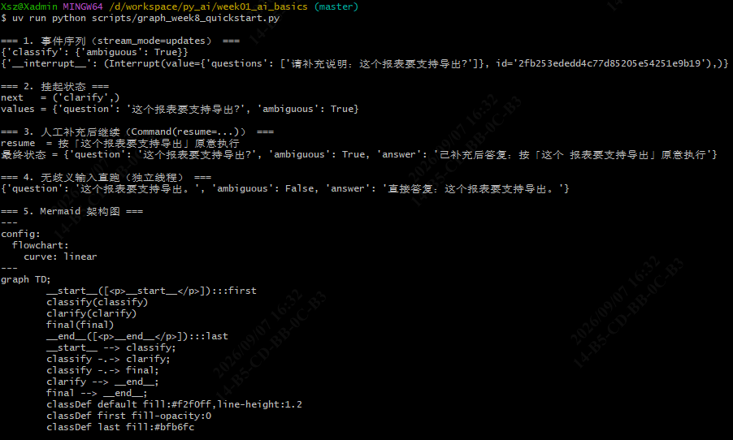

指定问题并携带 `--resume` 续跑：

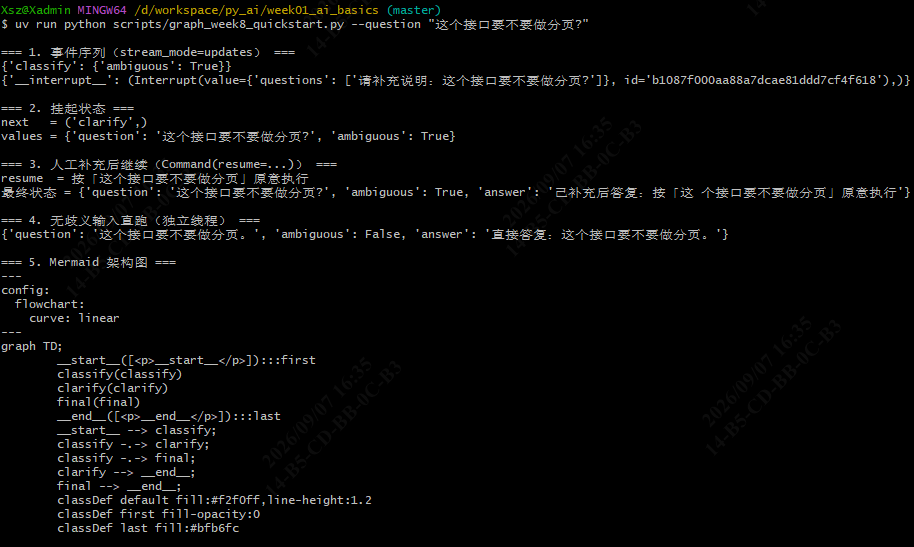

### 2. 工作流两条主路径

```bash
uv run python scripts/graph_week8_workflow.py
uv run python scripts/graph_week8_workflow.py --clarify "我想做个东西" --resume "面向零售商的智能推荐系统"
```

正常路径与歧义路径：

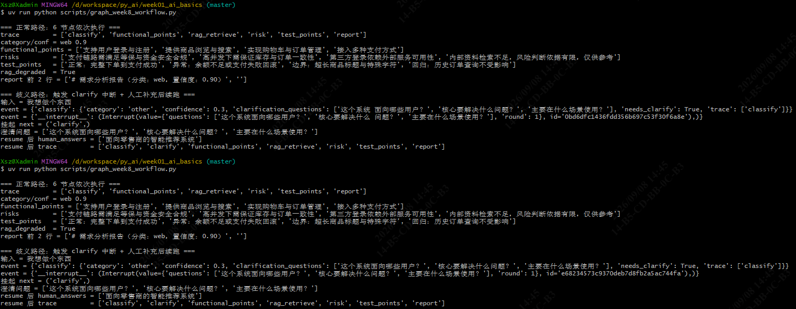

### 3. 韧性演示（重试 / 降级 / Checkpoint）

```bash
uv run python scripts/graph_week8_resilience.py
```

重试、降级、Checkpoint 三段：

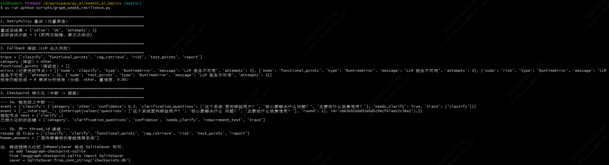

### 4. 业务串联四场景（默认 Fake）

```bash
uv run python scripts/graph_week8_demo.py
uv run python scripts/graph_week8_demo.py --scenario normal --requirement "我要做一个考勤系统"
uv run python scripts/graph_week8_demo.py --scenario rag_down
uv run python scripts/graph_week8_demo.py --scenario llm_fail
```

四个场景依次输出：

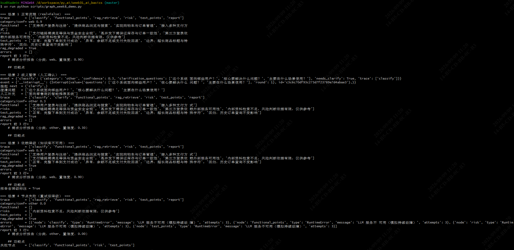

`normal` 场景（`--requirement` 指定需求）：

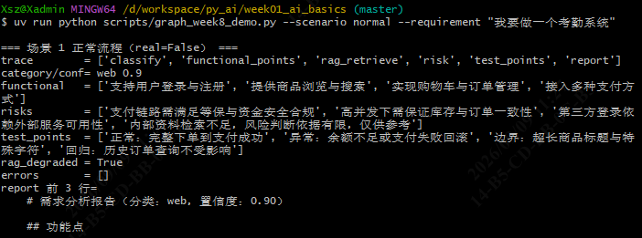

`rag_down` 场景（知识库不可用，报告标注依据不足）：

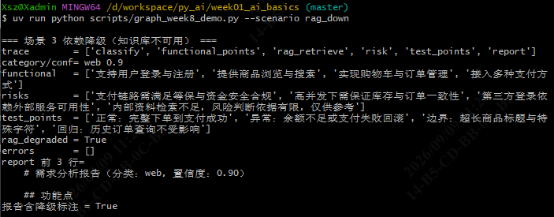

`llm_fail` 场景（重试耗尽后降级，报告仍产出）：

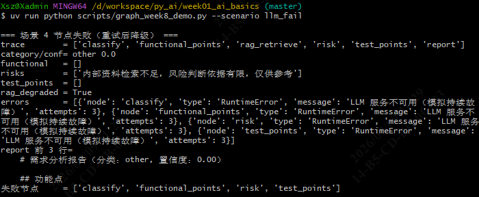

### 5. 真实链路（需先启动 Qdrant 与 Ollama；失败会自动回退 Fake，并在输出首行打印原因）

```bash
docker start qdrant_server                          # 让 RAG 不降级
curl -s -m 5 http://127.0.0.1:11434/api/version     # 应返回 {"version":"..."}；无响应说明 Ollama 没起

# 只跑到分类（快）：真实模型判歧义时会挂起，并列出澄清问题
uv run python scripts/graph_week8_demo.py --scenario normal --real

# 携人工补充从中断点续跑到完整报告（较慢，qwen3 CPU 推理可能超过 5 分钟）
uv run python scripts/graph_week8_demo.py --scenario normal --real --resume "仅 Web 版，不做移动端；支付集成微信支付与支付宝；后台含用户、商品、订单、营销模块"
```

真实模型判需求歧义、在 `clarify` 处中断并列出澄清问题：

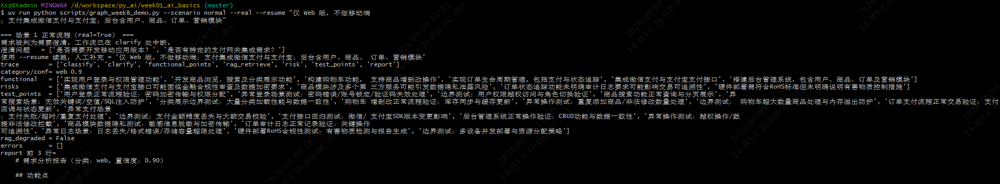

携 `--resume` 续跑后产出的完整报告：

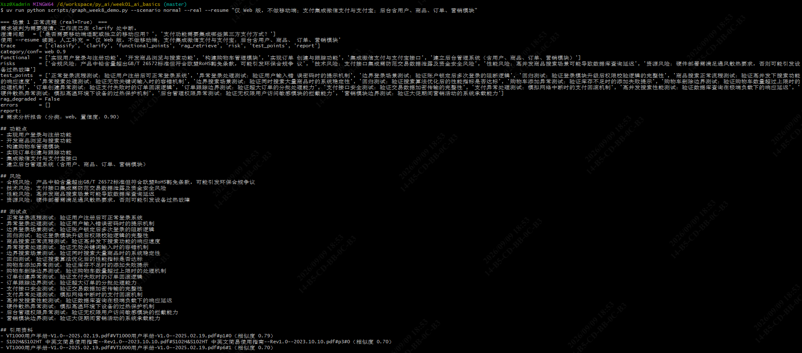

### 6. 架构图导出

```bash
uv run python scripts/graph_week8_demo.py --mermaid
```

Mermaid 架构图（按标准流程图图形绘制）：

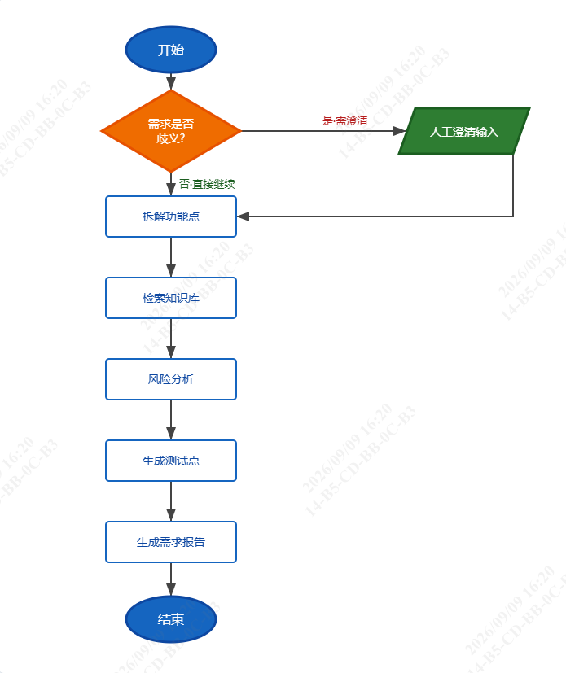

### 7. 门禁

```bash
uv run ruff check .
uv run ruff format --check .
uv run pytest tests/graph -q
uv run pytest -q
```

ruff 检查（周一至周四）：

- 周一：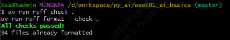
- 周二：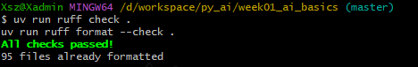
- 周三：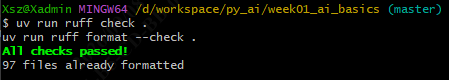
- 周四：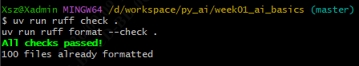

`pytest -q` 全量（周一至周四）：

- 周一：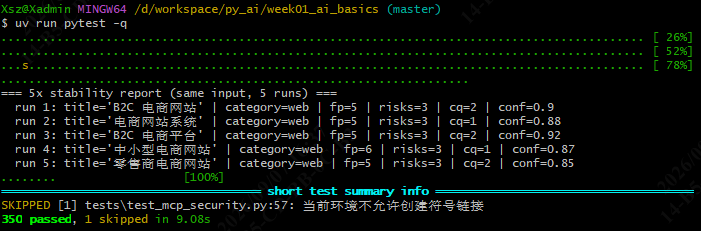
- 周二：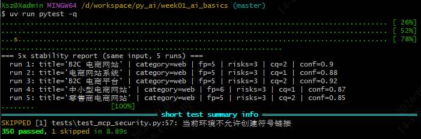
- 周三：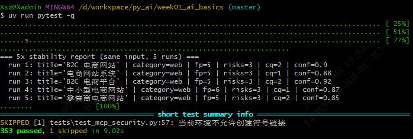
- 周四：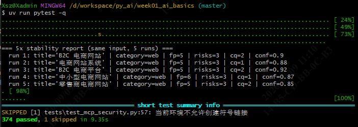

定向测试与工作流冒烟测试：

- 周四 `pytest tests/graph -q`：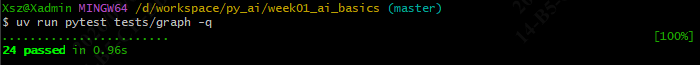
- 周三工作流冒烟测试：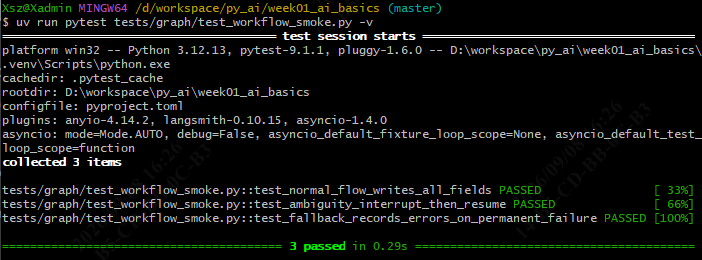
