# Week 09 Summary

> 周期：2026-09-14 ~ 2026-09-18 ｜ 路线：南宁软件组 AI Agent 应用开发 12 周 Roadmap · 第 9 周（Agent 服务工程化与 Docker Compose）  
> 仓库：`D:\workspace\py_ai\week01_ai_basics`  
> 环境：Python 3.12 + uv + Ruff + pytest + FastAPI；容器侧 Docker Compose（`python:3.12-slim` + `qdrant/qdrant`）


---


## 1. 本周目标与完成情况

| 目标（Week09 Roadmap）             | 状态  | 交付物                                                                    |
| ------------------------------ | --- | ---------------------------------------------------------------------- |
| 让「RAG + 工作流 + MCP 工具」以服务形式对外提供 | 已完成 | `src/agent_service/app.py` + `routes/{rag,workflow,tools}.py`          |
| 路由与线协议：一次性返回 + SSE 流式          | 已完成 | `POST /v1/rag/answer{"question": "...", "stream": true}`、`POST /v1/workflow/*`            |
| 会话与幂等：可续跑、可去重                  | 已完成 | `session.py` + `guards.py`（`Idempotency-Key` / `Idempotency-Replayed`） |
| 并发闸门与超时控制                      | 已完成 | `guards.py::request_slot`（排队超时 → 429、总时限 → 504）                        |
| 安全加固：认证 / 限流 / 请求体上限           | 已完成 | `security.py`（三个路由依赖 + 一个 ASGI 中间件）                                    |
| 容器化：镜像 + 编排 + 卷持久化             | 已完成 | `Dockerfile`（多阶段 + 非 root）、`compose.yaml`、`.dockerignore`              |
| 可诊断性：三个探针 + 轻量指标               | 已完成 | `routes/health.py`、`metrics.py`、`/metrics-summary`                     |
| 四类工程测试（并发 / 超时 / 重启 / 持久化）     | 已完成 | `service_week9_load.py`（13 断言）、`service_week9_compose_check.py`（12 断言） |
| 文档与 README 同步                  | 已完成 | `week09_deployment.md`、`week09_test_report.md`、本文、README §7/§8         |

验收三条均满足：四类测试有可复核数字（并发 20 档 18.3 req/s / p95 1104ms；超时 `504 timeout` + `errors_by_code.timeout=1`；重启 3 秒恢复；持久化 `points_count=51` 前后一致）；文档与代码配置一致；`/ready` 在依赖未就绪时给出明确原因而非裸 500。

服务骨架起服与探针跑通：

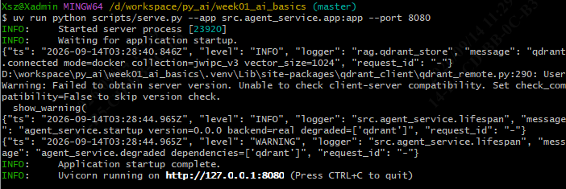

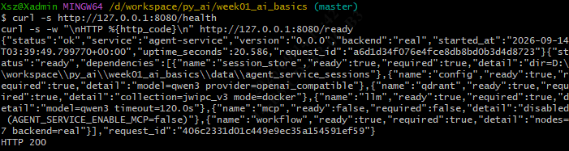

---


## 2. 系统结构与关键数据流

```
调用方（客户端 / scripts/*.py）
   │  HTTP: Authorization / Idempotency-Key / X-Request-ID
   ▼
┌─ ASGI 中间件栈（后加者在外）────────────────────────────────────┐
│  MetricsASGIMiddleware      ← 请求计数、延迟、状态码分布        │
│  RequestIdASGIMiddleware    ← 注入 request_id，回写响应头       │
│  AccessLogASGIMiddleware    ← 结构化访问日志                    │
│  BodySizeLimitMiddleware    ← 先判 content-length，再累计读取    │
└────────────────────────────────────────────────────────────────┘
   ▼
路由依赖（只挂 rag / workflow / tools；探针天然豁免）
   │  require_api_key  → 失败 401
   │  require_rate_limit → 失败 429
   ▼
路由
   ├─ POST /v1/rag/answer            → guards.request_slot → RagGenerator
   ├─ POST /v1/workflow/requirement-analysis → guards.request_slot → LangGraph 图
   ├─ POST /v1/workflow/{thread_id}/resume   → 同上（从 interrupt 续跑）
   ├─ GET  /v1/tools                 → MCP 会话 list_tools
   └─ POST /v1/tools/{name}/call     → MCP 会话 call_tool
   ▼
依赖容器（lifespan 按序组装，失败只降级不崩）
   session_store → config → qdrant/RAG → llm → mcp → workflow
   ▼
外部：Qdrant（向量库）· Ollama（生成 + 嵌入）· MCP Server（子进程 / HTTP）
```

探针路径不走业务路由，也不计入指标：

```
GET /health          → 进程存活（恒 200，依赖全挂只置 degraded）
GET /ready           → 逐依赖判定（必需层未就绪 503，body 仍完整）
GET /metrics-summary → 进程内计数器快照（零外部调用）
```

服务返回与 RAG + Qdrant 检索链路：

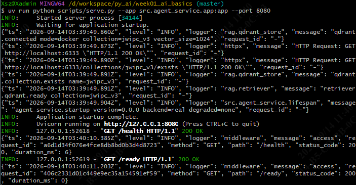

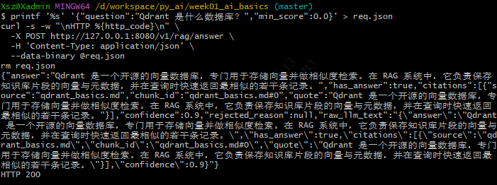

---


## 3. 主要代码模块及职责

| 文件                   | 职责                                          | 关键设计点                                                                                                            |
| -------------------- | ------------------------------------------- | ---------------------------------------------------------------------------------------------------------------- |
| `app.py`             | 应用工厂 `create_agent_service_app` + 模块级 `app` | 挂 4 个中间件；统一异常处理器把 `ServiceError` / 校验失败 / Starlette 异常翻成同一错误信封，并各记一次 `record_error`                              |
| `deps.py`            | 依赖容器 `AgentServiceDeps` + `ServiceDeps`     | `require(field)` 用 `_LAYER_OF` 把容器字段映射到探针层名（`rag→qdrant` / `chat_fn→llm`），否则 503 丢根因                             |
| `lifespan.py`        | 启动时按序组装依赖                                   | 顺序 `config → session → Qdrant/RAG → LLM → MCP → workflow`；任一失败只降级不中断启动，由 `/ready` 暴露                             |
| `settings.py`        | `AGENT_SERVICE_*` 配置                        | 全部有默认值；`auth_enabled` 由 `api_key` 是否为空派生，避免两处判断不一致                                                               |
| `errors.py`          | 错误码与状态码映射                                   | `status_code_to_error_code` 把 `(400,404,405,422)` 统一为 `invalid_argument`；`ServiceError` 支持携带响应头（供 `Retry-After`） |
| `schemas.py`         | 全部请求 / 响应模型                                 | 统一 `extra="forbid"`；`ServiceMetricsSummaryResponse` 与 `metrics.summary()` 的键一一对应                                 |
| `session.py`         | 会话记录与幂等缓存落盘                                 | 叶子模块，不依赖其它服务模块                                                                                                   |
| `guards.py`          | 并发闸门、超时、幂等、流式断连探测                           | `request_slot` 区分「排队超时 → 429」与「总时限 → 504」；幂等命中记 `record_idempotency_replay`                                      |
| `security.py`        | 认证与限流（路由依赖）                                 | 认证排在限流之前：未认证请求不消耗配额；探针不挂依赖故天然豁免                                                                                  |
| `metrics.py`         | 进程内指标计数器 + 采集中间件                            | 自研零新依赖；延迟用固定边界直方图（内存与请求量无关）；路由键归一化避免指标键无限增长；探针路径排除                                                               |
| `routes/health.py`   | 三个探针                                        | `/ready` 顺带刷新 `points_count` 与 `tools=N`，刷新失败不改就绪结论；明细用 `split` 保留基准，反复调用不增长                                     |
| `routes/rag.py`      | RAG 问答（一次性 + SSE）                           | 检索器与对话函数各包一层计数钩子，领域层不感知 HTTP 指标口径                                                                                |
| `routes/workflow.py` | 需求分析 + 澄清续跑                                 | 续跑端点是独立路径 `/{thread_id}/resume`，不嵌在 `requirement-analysis` 之下                                                    |
| `routes/tools.py`    | MCP 工具列表与调用                                 | 协议层异常统一翻成 `dependency_unavailable` 503                                                                           |
| `middleware.py`      | 请求 ID / 访问日志 / 请求体上限                        | 纯 ASGI 实现，不用 `BaseHTTPMiddleware`（它会缓存响应体，与 SSE 不兼容）                                                             |

冒烟与路由测试跑通：

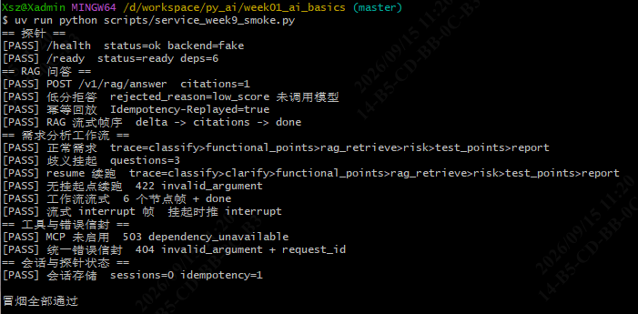

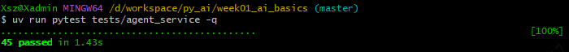

幂等重放与中断续跑：

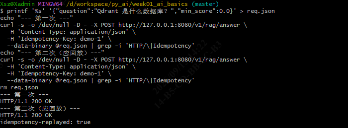

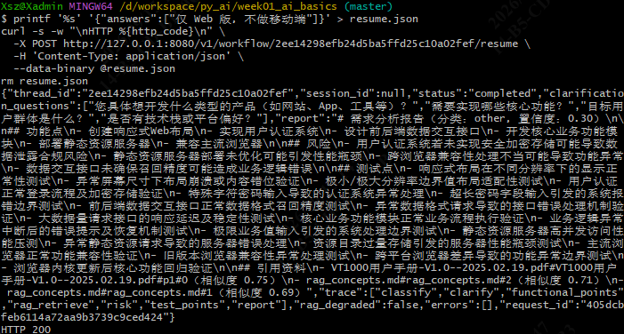

需求分析工作流跑通：

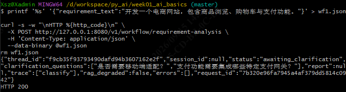

---


## 4. 主要 Git Commit

| commit | 完整提交信息 |
| --- | --- |
| `e215f02` | `func: app: Add agent service skeleton with health and ready probes ...` |
| `2e2a7e7` | `conf: app: Ignore agent service session directory` |
| `6b89a5c` | `func: app: Add agent service route tests` |
| `7a9cb3c` | `func: app: Add session store, concurrency guards and idempotency cache` |
| `ca64a67` | `func: app: Add rag, workflow and tools routes with SSE streaming` |
| `6cfa78a` | `func: app: Add agent service test fixtures and fakes` |
| `ab6cefc` | `func: app: Add service smoke and acceptance scripts` |
| `ec80e59` | `docs: app: Add week 9 service test command reference` |
| `0d454e0` | `conf: app: Ignore service smoke corpus directory` |
| `a35d7b1` | `conf: app: Relax lint rules for service scripts` |
| `eb4baf1` | `func: app: Implement security features including Bearer authentication, rate limiting, and request body size restrictions and update the test scripts` |
| `fbbf51d` | `func: app: Add agent service security tests` |
| `ed071a3` | `conf: app: Add Dockerfile and compose for agent service` |
| `5db86ae` | `docs: app: Update week09_test_commands.md to organize testing commands by service startup method and clarify usage instructions` |
| `ca9b5ad` | `func: app: Add metrics counters and summary endpoints to enhance service observability` |
| `aa30a0d` | `conf: app: Update .gitignore to include temporary directory for load testing scripts` |
| `50f3ef0` | `func: app: Add comprehensive metrics tests for agent service observability` |
| `09e1521` | `style: app: fix ruff formatting` |
| `7808876` | `docs: app: Add bearer auth header to test command examples` |
| `2115d03` | `func: app: Add compose restart persistence and concurrency load test scripts` |
| `e7dd457` | `func: app: Add port conflict pre-check and target config probe to acceptance script` |
| `2ce17ae` | `func: app: Add week 9 deployment guide and test report` |
| `9399db9` | `docs: app: Update Week 9 task content` |


容器多阶段构建与配置校验：

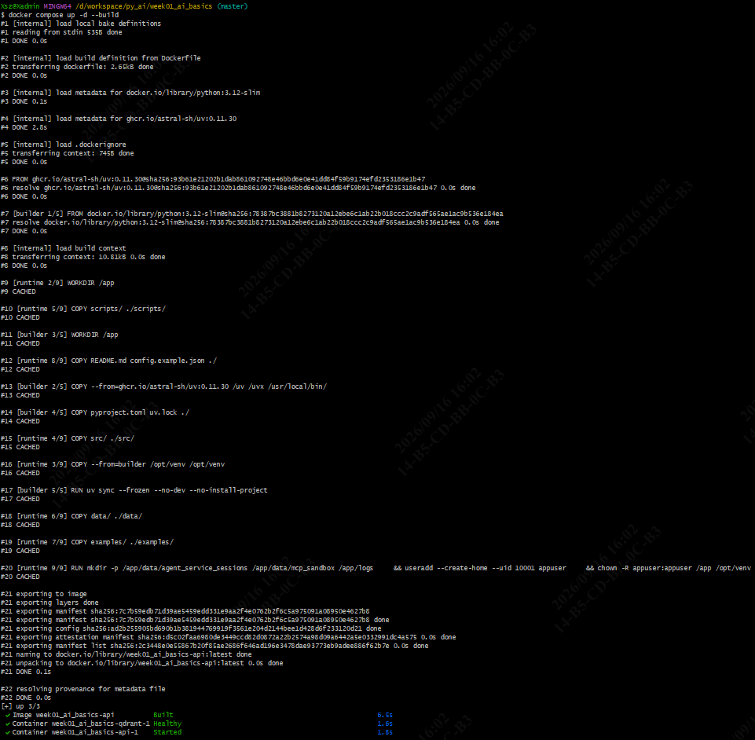

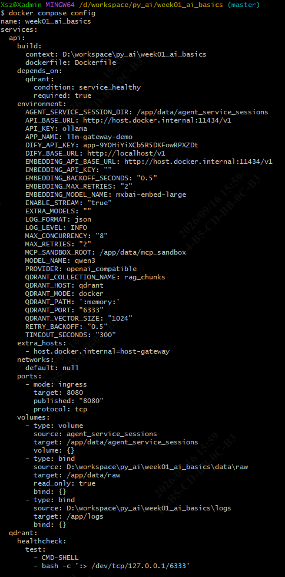

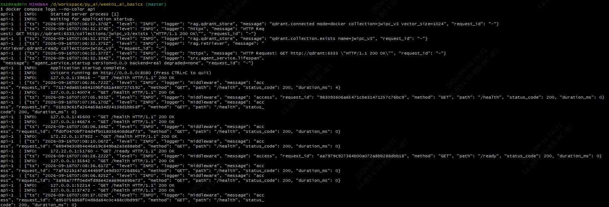

容器内探针与编排校验：

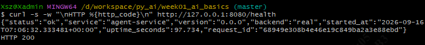

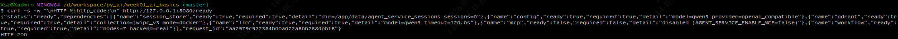

---

## 5. 测试范围与结果

按测试类型统计：

| 测试类型 | 范围 | 结果 |
| --- | --- | --- |
| 单元 / 集成 | `tests/agent_service/` 7 个测试文件 | 88 passed（约 24 秒） |
| 全量回归 | 仓库全部测试 | **462 passed, 1 skipped** |
| 接口验收 | `service_week9_acceptance.py` 8 分组 | 通过（workflow 三项为已知模型超时） |
| 工程测试 | 并发 + 超时 13 断言、重启 + 持久化 12 断言 | 全部通过 |

「测试类型」与「架构分层」是两个不同的维度：上表分的是**怎么测**，后续有**测到哪一层**的划分。两者的对应关系见 5.2。

### 5.1 按测试文件明细

| 测试文件 | 用例数 | 主要覆盖 |
| --- | --- | --- |
| `test_service_metrics.py` | 25 | 指标契约（`route_key` 折叠、直方图桶对齐、p95 取桶上界）与 `/metrics-summary`、`/ready` 明细 |
| `test_service_security.py` | 18 | Bearer 认证、令牌桶限流、请求体上限（含 chunked 与 `content-length` 的判定次序） |
| `test_service_health.py` | 12 | 三探针对存活与就绪的判定、统一错误信封、配置校验、依赖组装与降级 |
| `test_service_workflow.py` | 11 | 工作流启动、挂起、续跑、SSE 节点帧、会话绑定 |
| `test_service_guards.py` | 10 | 并发闸门与排队超时、幂等回放、请求超时、流式断开 |
| `test_service_rag.py` | 7 | RAG 答问、低分拒答不调模型、SSE 帧序、依赖缺失降级 |
| `test_service_tools.py` | 5 | 工具目录、调用信封、工具级错误与 HTTP 错误的区分 |
| 合计 | 88 | |


### 5.2 与计划分层的对应关系

规划时把服务分作接口层 / 应用层 / 领域层 / 基础设施层。测试文件是**按路由与子系统**组织的，
不是按分层组织的，个别用例本身跨层（`settings` 与 `deps` 的用例落在 `test_service_health.py`、 `test_service_rag.py` 里），所以下表按「用例归属」而非「文件归属」对齐：

| 架构分层 | 落点 | 对应测试 |
| --- | --- | --- |
| 接口层 | `routes/` | `test_service_health.py`、`test_service_rag.py`、`test_service_workflow.py`、`test_service_tools.py`、`test_service_security.py` 中的路由用例，经 ASGITransport 打真实路由，验状态码、响应体与统一错误信封 |
| 应用层 | `deps.py`、`lifespan.py`、`guards.py`、`session.py`、`metrics.py` | `test_service_guards.py` 全部；`test_service_metrics.py` 的模块内部契约用例；各文件中的配置、依赖组装与降级用例 |
| 领域层 | `src/rag/`、`src/graph/`、`src/jwipc_dev_mcp_server/` | 本周零改动，未新增测试；服务侧一律用 `service_fakes.py` 替身隔离，真实能力由第 5 至第 8 周的既有测试把关 |
| 基础设施层 | Qdrant / Ollama / MCP / Docker Volume | 单元测试全部走替身、不接真实设施；真实设施由 `service_week9_acceptance.py`（真实 HTTP 与 Qdrant）、`service_week9_compose_check.py`（重启与卷持久化）、`service_week9_load.py`（并发与超时）覆盖 |

这条分工是有意为之：单测不碰真实设施才能快而稳，代价是**只在真实设施上才暴露的缺陷单测抓不到**，必须靠三组工程脚本补位。本周暴露的两个问题正属于这一类 —— 容器跑的是旧镜像、具名卷属主错误导致写不进会话目录，都只在容器实测中出现，单测全绿也照样漏掉。

`test_service_metrics.py` 覆盖点分两组：

- **模块内部契约**：`route_key` 折叠工具路径参数、直方图桶数与边界对齐、p95 返回桶上界、溢出桶不丢样本、并发计数不为负、无检索时命中率为 0。
- **HTTP 接口**：摘要字段齐全、探针不计入请求量、业务请求按归一化路由累计、命中率把低分拒答算作未命中且不消耗模型调用、404 与 422 都归 `invalid_argument`、幂等命中单独计数、工具路由折叠成单个指标键、`/ready` 带出 `points_count` 与 `tools=N` 且反复调用不增长明细、容器未注册时中间件跳过统计。

接口验收与压测、重启持久化跑通：

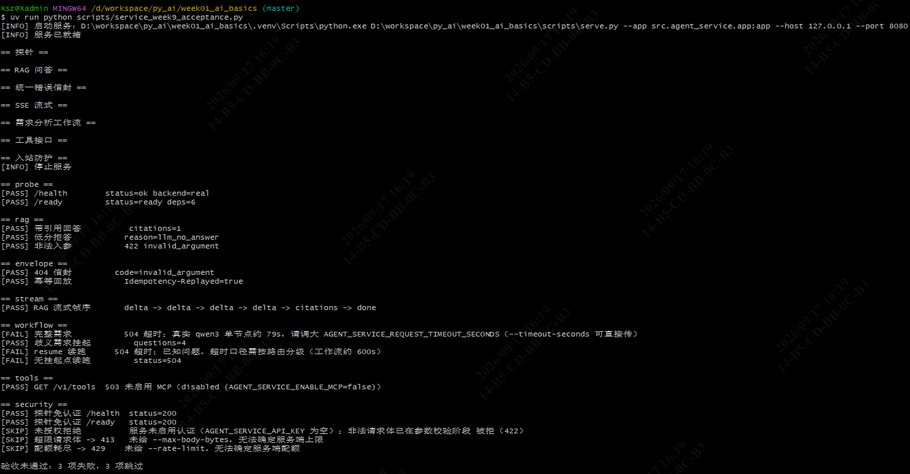

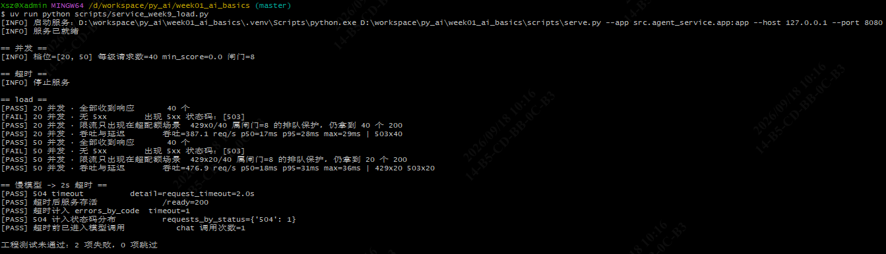

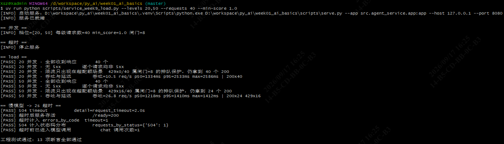

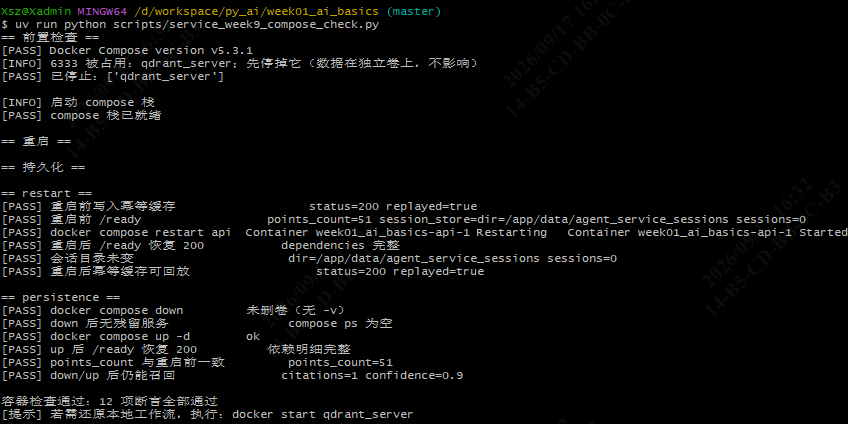

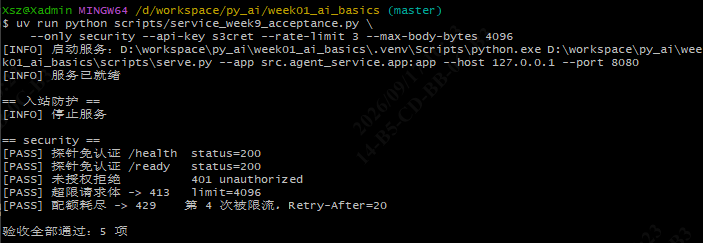


### 5.3 主要运行命令（Git Bash，工作目录 `/d/workspace/py_ai/week01_ai_basics`）

```bash
# 静态门禁
uv run ruff check . && uv run ruff format --check . && uv run pytest -q

# 本机直跑
uv run python scripts/serve.py --app src.agent_service.app:app --host 127.0.0.1 --port 8080
curl -s http://127.0.0.1:8080/health          --noproxy '*'
curl -s http://127.0.0.1:8080/ready           --noproxy '*' | python -m json.tool
curl -s http://127.0.0.1:8080/metrics-summary --noproxy '*' | python -m json.tool

# 接口验收（自建子进程，端口被占用则退出码 2）
uv run python scripts/service_week9_acceptance.py
uv run python scripts/service_week9_acceptance.py --only security --api-key s3cret --rate-limit 3 --max-body-bytes 4096

# 并发 + 超时（--min-score 1.0 强制低分拒答绕开 CPU 推理）
uv run python scripts/service_week9_load.py --levels 20,50 --requests 40 --min-score 1.0

# 容器：重启 + 持久化（先 docker stop qdrant_server 让出 6333）
docker stop qdrant_server
docker compose up -d --build
uv run python scripts/service_week9_compose_check.py --skip-up
docker compose down && docker start qdrant_server
```

脚本退出码：`0` 全部通过、`1` 有失败项、`2` 前置条件不满足。

---

## 6. 失败案例与定位过程

### 6.1 高并发 502 与连接重置（伪装成服务崩溃）

50 并发档出现 502 与 `WinError 10054`。先排除服务侧（端口有监听、`/health` 正常），再查环境变量，发现本机 `HTTP_PROXY/HTTPS_PROXY` 指向本地代理，`httpx` 默认 `trust_env=True` 把发往 `127.0.0.1` 的请求交给了代理——请求根本没到服务。三个脚本统一加 `trust_env=False` 后，50 并发全 200、无 5xx。

### 6.2 容器行为与代码不一致

新增 `metrics.py` 与新的 `/ready` 逻辑后，容器里读不到 `points_count`。进入容器确认 `metrics.py` 不存在——容器跑的是周三构建的镜像快照。`docker compose build api` 后恢复。这条 FAIL 恰好证明脚本断言有效：没被"服务在跑"的表象骗过去。

### 6.3 测试脚本停掉了被测服务自己的依赖

`--skip-up` 模式下重启组稳定失败：写入幂等缓存 500 `code=internal`，之后重启后 `/ready` 一直 503 `未就绪=['qdrant']`，而持久化组却全部通过。根因是端口冲突处理「停掉任何发布 6333 的容器」把 compose 自己的 `qdrant` 也停了；持久化组因随后 `docker compose up -d` 顺手拉起 qdrant 而「意外自愈」掩盖问题。修复：给 `wait_until_ready` 加诊断输出最后一次依赖明细；新增 `_external_container_names()` 按 compose 项目名与容器名前缀双重判断，只停非本项目容器。

### 6.4 其他

- `/tmp` 在 Windows 映射到 `D:\tmp`，写临时校验脚本失败 → 改用项目内临时目录并事后清理。
- `Report.failed()` 是三段式 `(group, label, detail)`，初版两段式调用报 `TypeError` → 统一调用约定。
- `ModuleNotFoundError: No module named 'service_fakes'`：`sys.path` 需同时含 `tests/` 与 `tests/agent_service/`。
- 「限流只出现在超配额场景」断言初版无条件 PASS，会静默吞掉 429 分布 → 改为按闸门容量分支判定，并实测验证能在配置不一致时告警。

超时与 MCP 错误相关截图：

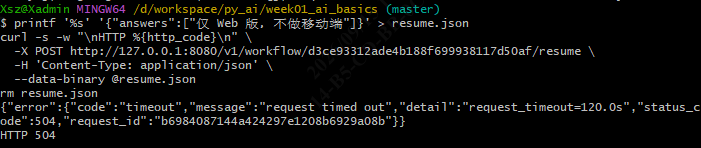

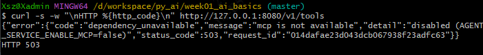

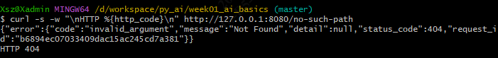

### 6.5 容器「跑着」但端口从未建立（伪装成服务起不来）

联调本机 `serve.py` 时，`/ready` 报 `qdrant` 未就绪，`detail` 是
`ResponseHandlingException: [WinError 10061] 由于目标计算机积极拒绝，无法连接。`；
而同一条命令看 `docker ps`，`qdrant_server` 明明是 `Up`、Docker Desktop 里也是绿点，
很容易误判成「服务起不来」。

关键在于区分两处端口配置：`HostConfig.PortBindings` 是**创建容器时要求的映射**（意图），
`NetworkSettings.Ports` 是 Docker **实际建立的映射**（事实），而 `docker ps` 的 `PORTS` 列读的是后者。
实测对比：

| 容器 | `HostConfig.PortBindings` | `NetworkSettings.Ports` |
| --- | --- | --- |
| 出问题的旧容器 | `6333`、`6334` | `{}`（空，从未建立） |
| 重建后的容器 | `6333`、`6334` | `0.0.0.0:6333`、`[::]:6333` |

根因是一次**失败的端口绑定被永久保留**：早先 compose 的 qdrant 占着 6333 时执行
`docker start qdrant_server`，Docker 建立映射失败（报
`Bind for 0.0.0.0:6333 failed: port is already allocated`），但**容器仍然被启动了，只是端口没建立**；
此后 `docker start` 对「已在运行」的容器是空操作，不会重试绑定，于是长期停在「跑着却连不上」。
处置是重建容器强制重新绑定，并复用原卷 `qdrant_data` 保住数据。

第二个易误判点：**`/ready` 的依赖判定是启动时定下并缓存的**。端口修好后 `/ready` 仍返回同一条旧错误，
看起来像修复无效 —— 因为 `lifespan._build_knowledge_rag()` 只在启动时写入一次结论，
`_refresh_qdrant_detail()` 只刷新 `points_count` 文字、不翻转就绪结论。重启服务进程后 `/ready` 立即转为 200。

三步诊断：查 `NetworkSettings.Ports` 是否为空、`netstat -ano` 看宿主机有无监听、
`curl -sS … :6333/collections; echo " exit=$?"`（`exit=7` 即连接被拒）。
完整命令见 `docs/week09_deployment.md` 第 8.7 与 8.8 节。

---

## 7. 使用 AI 辅助的内容及人工验证

| 环节 | AI 辅助产出 | 人工验证动作 |
| --- | --- | --- |
| 服务骨架与路由 | 模块划分、错误信封、SSE 帧协议 | 逐接口手工 curl 对照响应体；核对续跑端点路径不在 `requirement-analysis` 之下 |
| 安全加固 | 认证 / 限流 / 请求体上限的实现 | 核对响应头大小写（Starlette 会小写化，须用 `headers.get()` 取 `Retry-After`）；确认探针豁免 |
| 指标采集 | `metrics.py` 与埋点位置 | 核对中间件栈实际顺序为 `RequestId → AccessLog → 大小限制 → 路由`，确保 413 带得上 `request_id` |
| 容器化 | Dockerfile 多阶段、compose 编排 | 实跑 `up` 验证两服务 healthy；进容器验证连宿主机 Ollama 返回 200；确认具名卷属主正确（否则 `/ready` 503） |
| 工程测试 | 三个脚本的断言与参数 | 逐条核对断言口径（尤其是 429 与探针状态码）；用故意错配参数验证断言会真的失败 |
| 文档 | 三份文档与README更新 | 配置表逐键与 `settings.py` / `compose.yaml` 对照；数字与脚本实跑输出对照 |

---

## 8. 当前未解决问题

1. **真实模型下工作流超时**：`qwen3` CPU 单节点约 79 秒，7 节点串联在 120 秒总时限下必然 504。超时按路由分级（RAG 120s / 工作流约 600s，拆两个配置键）的口径已定，尚未实现。
2. **真实模型需求分类跑偏**：`"开发一个电商网站…"` 曾判 `other`（0.30），而更模糊的 `"帮我做个东西"` 反而跑完 7 节点；假模型对前者给 `category=web` / `conf≈0.9`。重测前需先确认是否仍存在（本轮实跑显示真实模型对该需求给出 `category=web`、`conf=0.85~0.92`）。
3. **50 并发档吞吐数字不可对外引用**：该档 62.5% 请求被限流，吞吐与延迟被「快速拒绝」扭曲。需真容量数字时应调高 `MAX_CONCURRENCY` 后重测。
4. **VT1000 手册多机型规格导致 RAG 答案漂移**（Week 5 遗留）。

---

## 9. 下周计划

- 对接 Langfuse，把本周自研的进程内指标升级为可跨实例、可回溯的 Trace 维度观测。
- 实现超时按路由分级（RAG 120s / 工作流 600s，拆两个配置键），解决真实模型下工作流必然 504 的问题。
- 排查真实模型对电商需求的分类跑偏（提示词或 JSON 解析），重测前先确认问题是否仍存在。
