# Week 10 Summary

> 周期：2026-09-20 ~ 2026-09-23 ｜ 路线：南宁软件组 AI Agent 应用开发 12 周 Roadmap · 第 10 周（Langfuse Trace、数据集与 Ragas 评测）  
> 仓库：`D:\workspace\py_ai\week01_ai_basics`  
> 环境：Python 3.12 + uv + Ruff + pytest + FastAPI；观测侧自托管 Langfuse v4（Docker Compose）；检索 Qdrant + Ollama（`mxbai-embed-large` / `qwen3`）

---

## 1. 本周目标与完成情况

| 目标（Week10 Roadmap） | 状态 | 交付物 |
| --- | --- | --- |
| 追踪抽象层与可切换后端 | 已完成 | `src/observability/`（config / models / tracer / context / instrument / callbacks）<br>`src/observability/backends/`（langfuse → jsonl → memory 降级链） |
| 全链路埋点与 `X-Trace-Id` 回写 | 已完成 | `routes/{rag,workflow,tools}.py`、`lifespan.py` 埋点<br>`last_trace_id_var`（错误响应也带标识） |
| trace 本地视图与截图 | 已完成 | `scripts/trace_week10_view.py`<br>`docs/poho/week10/d47_trace_*.png` |
| 自托管 Langfuse 接入 | 已完成 | `deploy/langfuse/`（compose 编排）<br>`OBS_BACKEND` 切换 |
| Golden Dataset（52 条）与冻结自检 | 已完成 | `data/golden/week10_golden.jsonl`<br>`scripts/eval_week10_build.py` |
| 评测引擎（指标 / 报告 / Rubric） | 已完成 | `src/evaluation/{dataset,metrics,outcomes,report,rubric}.py`<br>`scripts/eval_week10_run.py` |
| 参数对比实验（三组） | 已完成 | `scripts/eval_week10_compare.py`<br>`logs/eval/week10_eval_{baseline,retrieval,prompt}.json` |
| 文档与截图交付 | 已完成 | `docs/week10_{observability,evaluation,eval_report,summary}.md`<br>`docs/poho/week10/d48_*.png` |

验收均满足：数据集 52 条自检通过；三组对比有可复核数字、变差用例逐条列出（检索组变差 9 项、生成组变差 6 项）；`docs/poho/week10/` 下有 3 张 trace 截图；全量 **734 passed, 1 skipped**；三份文档与代码、配置一致。
口径说明：`retrieval` 组只换检索策略（`vector` → `hybrid`）；`prompt` 组按计划一次动了生成侧两处（加严提示词与拒答阈值 `0.7`），因此只能得出「生成侧这套加严是负收益」，无法分辨是提示词还是阈值造成，已记入评测报告已知问题第 7 条。

---

## 2. 系统结构与关键数据流

```
请求 ──► 路由 / 工作流 / 工具
          │
          ├─ observability.Tracer（门面）
          │     ├─ context：contextvars 承载当前 trace / span
          │     └─ backends：降级链  langfuse → jsonl → memory（一次只启用一个）
          │
          └─ 埋点包装：traced_chat / traced_retriever / traced_tool
                + ObservabilityCallbackHandler（LangChain 回调 → chain / generation span）

数据集 ──► eval_week10_run.py ──► EvalReport（JSON + Markdown，含 trace_id）
                                    │
                                    └─► eval_week10_compare.py ──► 三组对比表 + 变差清单
```

关键连线：**span 与评测结果靠 `trace_id` 对齐**。报告里每条用例都带自己的 `trace_id`，失败清单里能直接复制这条 id 去渲染 trace，「哪条用例错了、错在检索还是错在生成」是一条可走通的链路。

三类动作的 trace 渲染（均能看到模型名、span 类型、节点名与各自耗时）：

知识问答（5 个 span，真实模型 `qwen3`）：

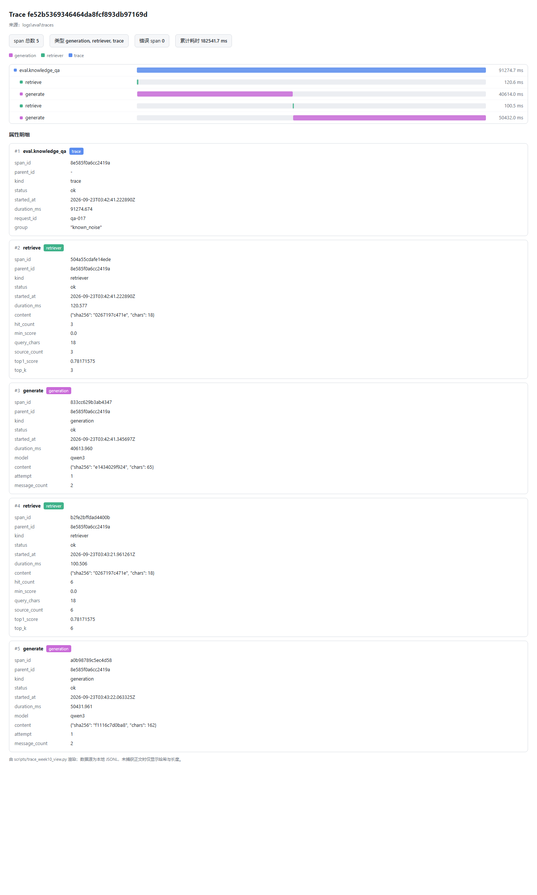

`retriever` span 带 `hit_count=3`、`source_count=3`、`top1_score=0.781`；`retriever` 与 `generation` 各有两段，因为模型第一次判 `has_answer=false` 触发了重召重问（`top_k × no_answer_retry`），这正是单条问答要 100 秒上下的原因。**span 上只记命中数量与分数，不记文件名**（内容捕获默认关闭），具体来源落在报告里每条用例的 `retrieval_hit@3` 详情中。

需求拆解走完六个节点（12 个 span）：

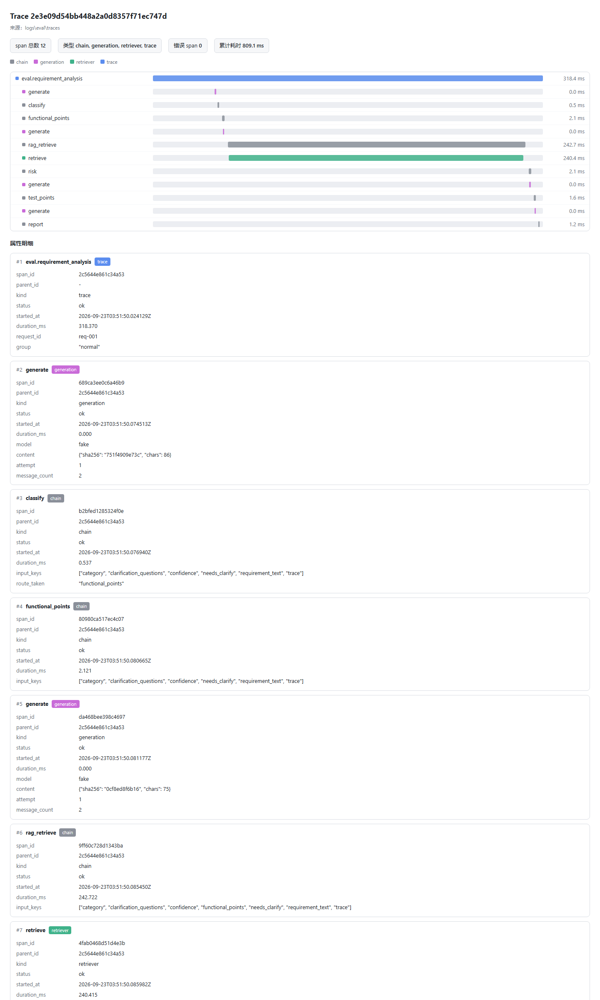

根 span 下挂 `chain` 六节点（`classify` / `functional_points` / `rag_retrieve` / `risk` / `test_points` / `report`），`retriever` span 嵌在 `rag_retrieve` 之下。该组节点走确定性替身，模型名记为 `fake`，属设计如此。

越权调用被拦住（2 个 span）：

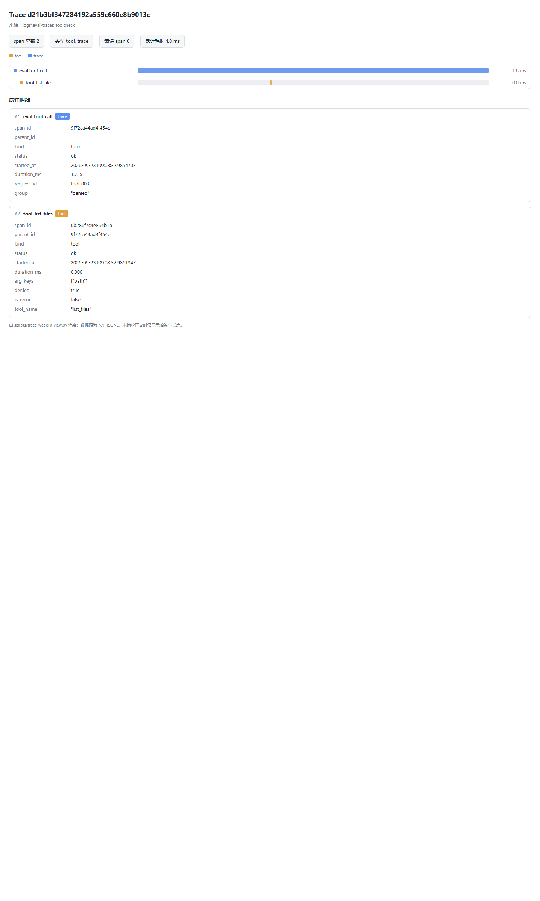

`tool` span 上 `group=denied`、`denied=true`、`is_error=false`、`arg_keys=["path"]`——被策略拒绝与真正执行失败分开记录，安全拦截率不会混进失败率。

---

## 3. 主要代码模块及职责

| 模块 | 职责 |
| --- | --- |
| `src/observability/config.py` | `ObservabilityConfig`：`OBS_` 前缀；解析失败静默回退，不阻断启动 |
| `src/observability/models.py` | `SpanRecord`、`SPAN_KINDS`（六种 span 类型）、token 与成本计算 |
| `src/observability/tracer.py` | `Tracer` 门面、`build_tracer()` |
| `src/observability/context.py` | `contextvars` 承载的当前 trace / span 上下文 |
| `src/observability/instrument.py` | `traced_chat` / `traced_retriever` / `traced_tool` 三个包装器 |
| `src/observability/callbacks.py` | `ObservabilityCallbackHandler`：LangChain 回调事件翻成 chain / generation span |
| `src/observability/backends/` | JSONL、Langfuse、内存三个后端；`build_backend()` 降级链 |
| `src/evaluation/dataset.py` | 数据模型、加载、自检（`SCENARIO_QUOTAS` / id 唯一 / 检查项合法） |
| `src/evaluation/metrics.py` | 纯函数指标库，无副作用、不联网 |
| `src/evaluation/outcomes.py` | 产出与结局契约：工作流状态与工具返回值各一套判据 |
| `src/evaluation/report.py` | `to_json()` / `to_markdown()` 两种报告 |
| `src/evaluation/rubric.py` | LLM-as-a-Judge 打分与一致率 |
| `scripts/trace_week10_view.py` | JSONL → 自包含 HTML，可用本机 Edge 无头截图 |
| `scripts/eval_week10_build.py` | 生成并自检 52 条数据集 |
| `scripts/eval_week10_run.py` | 跑数据集、算指标、出报告；`--strategy` / `--prompt` / `--min-score` 三个旋钮 |
| `scripts/eval_week10_compare.py` | 多组并排对比、逐条列出变差用例 |
| `deploy/langfuse/` | 自托管 Langfuse 的 compose 编排与部署说明 |

---

## 4. 主要 Git Commit

本周共 23 个提交（09-20 起，不含本总结所在的一批）：

| 日期 | 提交 | commit内容 | 中文说明 |
| --- | --- | --- | --- |
| 09-20 | `22bcf2c` | func: Wire observability tracer into agent service and update dependency probes | 将追踪器接入 Agent 服务，并补充依赖探针 |
| 09-20 | `afc74be` | func: Add self-hosted Langfuse compose stack for local tracing | 新增自托管 Langfuse 的 compose 编排栈 |
| 09-20 | `782764f` | conf: Update code structure to improve readability and maintainability | 调整代码结构，提升可读性 |
| 09-21 | `a123046` | func: Add observability tracing layer with swappable backends | 新增可切换后端的观测追踪层 |
| 09-21 | `e05fe9b` | func: Add tracing layer tests covering config, backends and context | 追踪层单测：配置、后端、上下文 |
| 09-21 | `00c3745` | func: Implement observability backends including Langfuse and JSONL | 实现 Langfuse 与 JSONL 两个后端 |
| 09-21 | `5027729` | func: Add observability smoke test script for trace validation | 新增追踪校验冒烟脚本 |
| 09-21 | `8271196` | docs: Add week 10 observability guide and tracing test commands | 新增第 10 周观测指南与追踪命令文档 |
| 09-21 | `986b7e9` | docs: Update deployment docs to include observability dependency in readiness checks | 部署文档补充就绪检查中的观测依赖 |
| 09-21 | `b89796a` | docs: Clarify health check requirements and command usage in README | 修订 README 中的健康检查要求与命令用法 |
| 09-22 | `3236389` | func: Enhance observability with trace IDs in error responses and tool calls | 错误响应与工具调用补充 trace id |
| 09-22 | `68c3310` | func: Add trace header tests for successful workflow and RAG responses | 成功响应写入 trace 头的单测 |
| 09-22 | `e67d0e0` | func: Add observability features with tracing wrappers and callback handlers | 新增追踪包装器与回调处理器 |
| 09-22 | `eded53b` | func: Add tests for observability callback and instrument wrappers | 观测回调与埋点包装器单测 |
| 09-22 | `47151c8` | docs: Update week10 test commands for clarity and trace validation | 修订第 10 周测试命令文档 |
| 09-22 | `1932b95` | func: Add trace rendering script and associated images | 新增 trace 渲染脚本与截图 |
| 09-23 | `748629c` | func: Ensure retriever is wrapped with TracedRetriever in workflow | 把检索器挂到 TracedRetriever 生效层 |
| 09-23 | `8661adc` | func: Add scenario outcomes, report generation and rubric scoring | 新增场景化结局、报告生成与 Rubric 打分模块 |
| 09-23 | `754694f` | func: Add case tests for dataset, metrics and report generation | 评测数据集、指标、报告生成单测 |
| 09-23 | `d77ec69` | func: Add golden dataset builder with 52 cases and evaluation script | 新增含 52 条用例的 Golden Dataset 构建与评测脚本 |
| 09-23 | `08de481` | docs: Add week 10 evaluation documentation for dataset and engine | 新增第 10 周评测文档（数据集与评测引擎） |
| 09-23 | `04a414d` | docs: Update week 10 evaluation documentation with trace command usage | 更新第 10 周评测文档（trace 命令用法） |
| 09-23 | `3fbfbf0` | fix: Run ruff format on the file | 对相关文件执行 ruff 格式化 |

---

## 5. 测试范围与结果

第十周新增两组单测：

| 目录 | 用例数 | 覆盖 |
| --- | --- | --- |
| `tests/observability/` | 114 | 配置解析与非法值回退、后端降级链<br>JSONL 落盘与坏行容忍、Langfuse 类型映射与栈深上限<br>三个包装器（含工具返回形状规约与拒绝词表）、回调处理器 |
| `tests/evaluation/` | 148 | 数据集配额与校验规则、指标纯函数（阈值 / 跳过语义 / 分位数取桶上界）<br>报告渲染与轨迹提示、对比脚本的翻转判定、分场景延迟与生成块替换 |
| 小计 | 262 |  |

全量：`735 collected`，结果 **734 passed, 1 skipped**，`ruff check` 与 `ruff format --check` 零问题。跳过项是 `tests/test_mcp_security.py` 里一条符号链接用例（受限环境建不出符号链接，既有跳过项）。本周相对上周基线 693 新增 41 条（工具返回形状规约 8 + 对比脚本 33）。

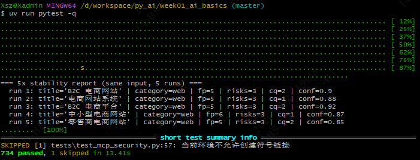

单测全部离线可跑：不连 Qdrant、不调模型、不写仓库内临时文件；数据集自检用临时目录，`--check` 不在 `data/golden/` 留中间产物。

---

## 6. 失败案例与定位过程

按「现象 → 根因 → 处理」记，均为本周实际遇到：

**1. 响应头写不进去，还污染了 trace。** 现象是错误响应里没有 `X-Trace-Id`。根因是写头方式错：在路由里对返回的 Pydantic 模型实例挂 `result.headers = {...}`，Pydantic v2 禁止给实例设未声明字段，抛的是 `ValueError: object has no field "headers"` 而非 `AttributeError`，原来的 `except AttributeError` 兜不住，异常穿出 `tracer.trace()`，每个本该成功的请求都被标成 `status=error`。处理：路由签名加 `response: Response`，在 `with tracer.trace(...)` 块外写 `response.headers[...]`。连带问题：`Tracer._close_span` 在根 span 收尾时清空当前 trace 标识，而 FastAPI 异常处理器跑在其后，恒取不到值；补一个只增不清的 `last_trace_id_var` 才让错误响应也带上标识。

**2. 检索埋点从不生效。** 现象是评测 trace 里没有 `retriever` span，`retrieval_hit` 一失败就分不清「没召回」还是「召回了没答对」。根因是方法名错配：四个检索器统一只提供 `search()`，而 `traced_retriever` 包装的是 `retrieve()`，其余属性经 `__getattr__` 透传；包在检索器内层时知识库取的是 `search`，正好绕过包装。服务路由看着正常，是因为 `routes/rag.py` 在知识库外层又包了一层，掩盖了内层失效。处理：统一挂到 `retrieve()` 存在的那一层，并把「`deps.rag` 自身不带埋点、新增调用方必须自己包一层」写进 docstring 与文档。修正后同一条 trace 从 11 个 span 变成 12 个。

**3. 工具 span 上的「被拒」标记一直是假的。** 现象是要给「越权调用被拦住」留截图，翻出的 `tool` span 却写着 `denied=false`，而报告里那条用例是 `denied`。根因是取值层级错：`TracedTool` 直接从被包调用的返回值取 `denied` / `isError`，但评测脚本包的是进程内 `FastMCP.call_tool`，返回值是 `(content, structured)` 二元组，业务字段在第二个元素里，`getattr` 在元组上永远取不到，属性静默默认成 `false`。服务路由正常是因为它包的是 MCP 客户端会话，返回带 `isError` 的对象，形状恰好对得上。另有半条：沙箱表达拒绝用的是 `ok=false` 配类别词，本就没有 `denied` 字段，词表也得一起认。处理：观测层先把返回规约到带业务字段的那一层再判，补上类别词表，并定下「拒绝优先于失败」（`is_error = False if denied else ...`），否则拒绝率被失败率吃掉。修正后同一条 trace 的 `tool` span 变成 `denied=true, is_error=false, status=ok`。

**4. `read_file` 读 README 被判失败。** 现象是一条期望成功的用例实际返回 `failed`。根因不是缺陷：README 有 58,189 字节，超过 50,000 字节上限，被确认门合法拦下。处理：不删用例，给结局枚举补 `needs_confirmation` 一类，让「被拦住」与「出错了」分开统计。

**5. 报告把 `--chat` 口径写反。** 现象是报告注释称知识问答的生成环节受 `--chat fake` 影响。按单条约 100 秒的耗时即可判定那是真实模型。根因是写注释时沿用了工作流那套说法。处理：订正为「`--chat` 只影响工作流节点」，否则 20% 的 `answer_point_coverage` 会被当成链路没跑通而忽略。

定位链路：失败用例靠两处证据合起来定位——报告的失败清单（每条带 `trace_id`，并列出失败检查项明细，含实际召回的 Top-3 来源与实际引用列表）与 trace 视图 / 截图（模型名、节点名、耗时、每次检索的 `top1_score` 与来源个数、失败 span 的错误信息）。取舍说明：**span 上不落具体来源文件名**（`source_count` 与 `top1_score` 足够定位到召回质量层），具体来源落在报告的检查项明细里；因此「截图里必须能看到检索来源」一条，实际由「截图 + 报告明细」共同满足。

---

## 7. 使用 AI 辅助的内容及人工验证

- **AI 辅助**：追踪抽象层与三后端降级链（`src/observability/`）；全链路埋点与 `X-Trace-Id` 回写；trace 本地视图脚本与三张截图；自托管 Langfuse 编排与接入文档；Golden Dataset 构建脚本与 52 条数据；评测引擎与三组对比脚本；四份周文档初稿与 10 张运行截图。
**人工验证**：
- 1.语料归属：grep 确认服务读 `AgentServiceSettings.collection_name`（默认 `jwipc_v3`，`settings.py`），`.env` 的 `QDRANT_COLLECTION_NAME` 属另一条链路（`config.py`），`curl :6333/collections` 与 `eval_week10_build.py --check` 证实硬件手册在 `jwipc_v3` 内，原结论建立在错集合上、数据集整批重做；
- 2.命令文档：`--trace-id <workflow_trace_id>` 原样复制复现 `bash: workflow_trace_id: No such file or directory`（尖括号被当重定向），此后所有命令均实跑核对后再落文档。
- 3.按第 10 节命令起 FastAPI 服务并跑通 `/v1/rag/answer` 的「起服务 → 检索 → 生成带引用答案」全链路，并由此定位三处问题。一是 503 `rag is not available`：根因是上游 Qdrant 未监听；`qdrant_store.connect` 打出的 `qdrant.connected` 是乐观日志（构造不握手），真正发包在紧接着的 `ensure_collection`，httpx 连接错误穿透成依赖降级（`degraded=['qdrant']`）。二是 504 `request timed out`：真实模型 `qwen3` 在 CPU 上单次生成约 76 秒，模型判 `has_answer=false` 后按 `top_k × no_answer_retry` 重召重问使耗时翻倍，超过 `AGENT_SERVICE_REQUEST_TIMEOUT_SECONDS`（默认 120 秒）。三是活服务默认检索策略是纯向量（`vector`），规格类问题召不回含具体参数的片段、模型判无答案。人工验证：把 `QDRANT_RETRIEVAL_STRATEGY` 切到 `hybrid`（向量 + BM25 关键词，字面含「19V / DC IN」的规格片段被提权进 Top-3）后，`S102H 的电源输入是多少伏？` 返回「19V DC IN 供电，2.5*5.2 DC_IN 接口」、`has_answer=true`、引用命中 S102H 用户指南、`confidence=0.95`，截图见第 10 节。


---

## 8. 当前未解决问题

1. **token 用量采集不到。** `generation` span 的 `usage` 恒为 `None`，`total_tokens` 与 `cost_usd` 因此都是 0。探测只认被包对象上的 `usage` / `last_usage`，当前模型客户端的返回值不暴露这两个名字。不影响判定性指标，但成本维度暂时为空。
2. **拒答阈值在本语料上不可行。** 有答案题与无答案题的 Top-1 相似度区间完全重叠（0.683~0.859 与 0.702~0.757），是语料构成决定的，非实现问题。
3. **需求分析场景的绝对数字不代表模型质量。** 缺省走确定性替身（固定四个功能点、按关键词硬判分类），该场景的价值在于“同一替身下改动是否改变行为”。
4. **一次运行内的随机性。** 生成侧是真实模型，同一份数据集连跑两次通过条数会差一两条。判断回归要看同一场景的同一批次，不能拿两次总数相减。延迟同理：单次采样，只作趋势参考。
5. **两组对比运行的工具 trace 早于一次埋点修正。** 那两批 trace 的 `tool` span `denied` 仍是 `false`（报告判定走评测层另一条路径，数字不受影响）。要看「被拒」的留痕证据，补跑一次工具场景即可复现，命令见评测报告第 6 节。
6. **生成侧那一组改了两处，退化无法归因到单个旋钮。** `prompt` 组同时改了加严提示词与阈值 `0.7`，结果变差 6 项、变好 0 项，说不清是提示词还是阈值造成。要分辨需补跑一组只改提示词、阈值维持用例自带值（单组约 46 分钟，本轮未跑），命令见评测报告第 3.4 节。

---

## 9. 下周计划

1. **补齐 token 用量采集，让成本维度可用。**
- 现状：评测里成本维度是空的——生成这一步的 token 用量一直取不到，总费用恒为 0。根因是埋点层只认一种字段命名（被包对象的 `usage` / `last_usage` 属性），而真实模型走 Ollama，它把用量放在另一套字段（`prompt_eval_count` / `eval_count`）里，命名对不上，探测永远落空。
- 思路：先确认模型客户端实际把用量放在返回结构的哪一层，再把 Ollama 这套字段接进用量解析——归一成「输入 / 输出 token」的统一结构回填给埋点。这是"多源字段归一"的小适配，不碰生成逻辑本身。
- 规划与验证：单跑一条问答，确认 trace 里生成 span 有用量、总费用按定价落值；补一个单测覆盖"Ollama 风格字段能解析"，把原来的空分支填上。

2. **把本周对比脚本固化为回归工具。**
- 现状：本周三组对比已跑完并冻结，逐条 diff（变差 / 变好用例清单）能力已具备，其中一组作为永久基线保留。
- 思路：后续每次改动只跑单组（约 46 分钟，不必三组全跑），把产出与冻结基线自动对比。判定不靠"总数相减"——生成有随机性，同份数据连跑通过数会浮动一两；正确做法是看同场景同批次的通过数 + 逐条变差清单。
- 规划：基线固定、回归命令固化；新跑必须把本次改动的配置原样记下来（本周基线漏记配置，导致"改了哪些旋钮"无法识别）；坚持单变量——一次只动一个旋钮，否则退化说不清是谁造成的（本周已吃过这个亏，见第 8 节问题 6）。最终交付一份回归说明：基线在哪、怎么跑、什么阈值算退化（变差用例超 N 即标红）。

3. **第十一周：评测与追踪接进持续集成。**
- 现状：本周全靠手工——本地 lint / 测试是门禁，评测、冒烟、依赖编排全人工起。下周进入生产化 / CI 阶段。
- 思路：分层接入。轻量门禁（lint、单测、观测冒烟、数据集自检）每次提交即跑，秒级到分钟级、不需重设施；重型评测（52 条真实问答）放到定时或手动触发的流水线，自动拉起整套依赖（向量库 + 模型 + 观测后端），跑完和冻结基线比、退化项标红。追踪在 CI 内也切到可落盘的观测后端，保证 trace 不只在本地可见。
- 规划：新增 CI 工作流 + 一份"CI 怎么跑、失败怎么看"的简短说明。注意真实模型 CPU 推理慢、单条易超时（联调时已确认），重型评测要在 CI 里放宽超时或用进程内直调方式，避免把流水线跑挂。

---

## 10. 本周任务的主要测试命令

以下命令均在 Git Bash、项目根 `D:\workspace\py_ai\week01_ai_basics` 下实跑过；先执行 `export PATH="/c/Users/Xsz/.local/bin:$PATH"` 保证 `uv` 可用。

静态检查与全量测试（门禁）：

```bash
uv run ruff check . && uv run ruff format --check .
uv run pytest -q
```

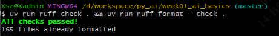

pytest 全量结果（734 passed, 1 skipped）的截图见第 5 节。

观测后端冒烟（验证 Langfuse / JSONL 接线，秒级）：

```bash
uv run python scripts/observability_week10_smoke.py --verify-wait 60
```

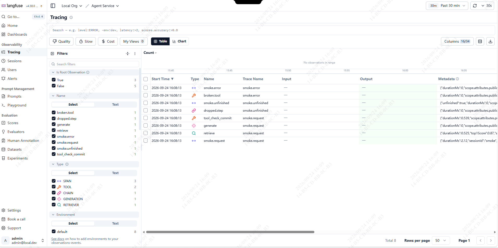

数据集生成与冻结自检（52 条；`--check` 只自检不写文件）：
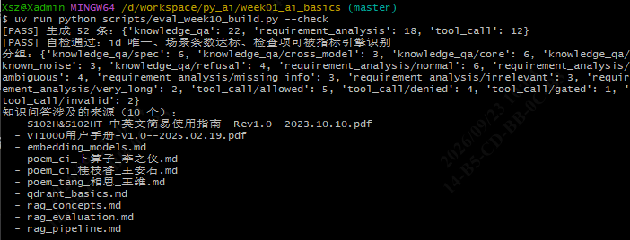

```bash
uv run python scripts/eval_week10_build.py --check
```

评测跑组（完整 52 条约 46 分钟，串行执行；工具场景可单跑，秒级）：

```bash
uv run python scripts/eval_week10_run.py --tag baseline --judge off
uv run python scripts/eval_week10_run.py --scenario tool_call --tag tools
```

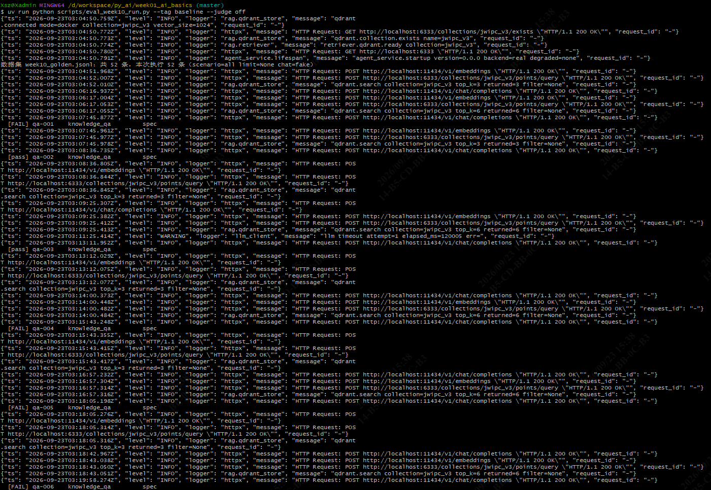

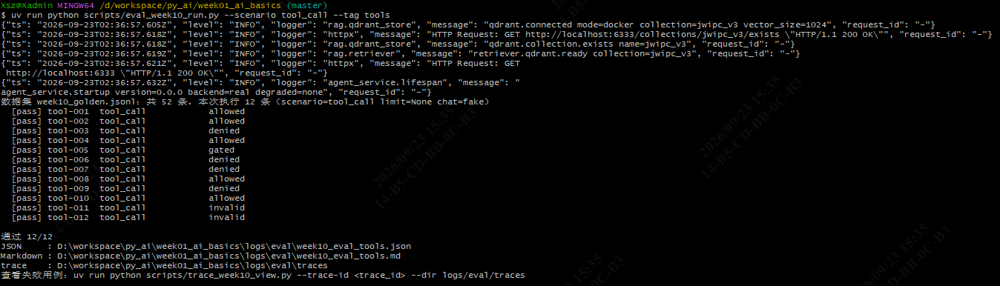

三组并排对比（输出写进评测报告的生成块）：
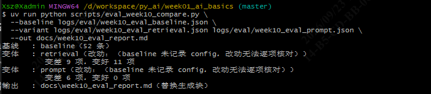

```bash
uv run python scripts/eval_week10_compare.py --baseline logs/eval/week10_eval_baseline.json --variant logs/eval/week10_eval_retrieval.json logs/eval/week10_eval_prompt.json --out docs/week10_eval_report.md
```

trace 列表与单条渲染（`TRACE_ID` 取 `--list` 输出里的值）：

```bash
uv run python scripts/trace_week10_view.py --list --dir logs/eval/traces
export TRACE_ID=364525400d1c482093907137d3ce4c91
uv run python scripts/trace_week10_view.py --trace-id "$TRACE_ID" --dir logs/eval/traces --out logs/eval/view.html
```

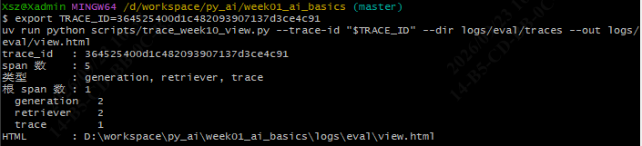

本地 FastAPI 服务端到端联调（`/v1/rag/answer`；需 Qdrant 与 Ollama 已就绪）。

先在 `.env` 指定检索策略——纯向量 `vector` 对规格类问题会判无答案，改用 `hybrid`（向量 + BM25 关键词）：

```
QDRANT_RETRIEVAL_STRATEGY=hybrid
```

再启动服务（`--app` 与 `--port` 都不能省：默认 `src.main:app` 是 Week02 极简网关、没有 `/v1/rag/*` 路由；`serve.py` 默认端口 8000，而 curl 走 8080）。服务保持前台运行：

```bash
uv run python scripts/serve.py --app src.agent_service.app:app --port 8080
```

另开一个终端发起请求：

```bash
printf '{"question":"S102H 的电源输入是多少伏？"}' > /tmp/rag_req.json
curl -s --noproxy '*' -X POST http://localhost:8080/v1/rag/answer -H "Content-Type: application/json" --data-binary @/tmp/rag_req.json
```

预期输出（实跑取数；hybrid 召回 30 条候选 + 两次生成，单条约 226 秒）：

```json
{"answer":"S102H的电源输入为19V DC IN供电，采用2.5*5.2 DC_IN接口。","has_answer":true,"citations":[{"source":"S102H&S102HT 中英文简易使用指南--Rev1.0--2023.10.10.pdf","chunk_id":"S102H&S102HT 中英文简易使用指南--Rev1.0--2023.10.10.pdf#p1#0","quote":"电源输入 - 19V DC IN 供电，2.5*5.2 DC_IN 接口"}],"confidence":0.95,"rejected_reason":null}
```

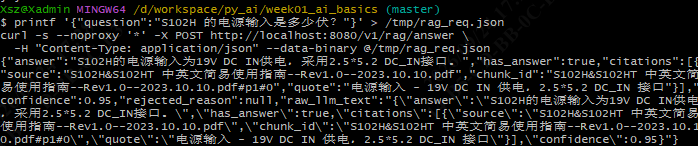
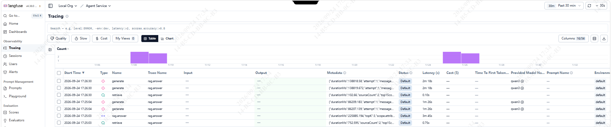
---
